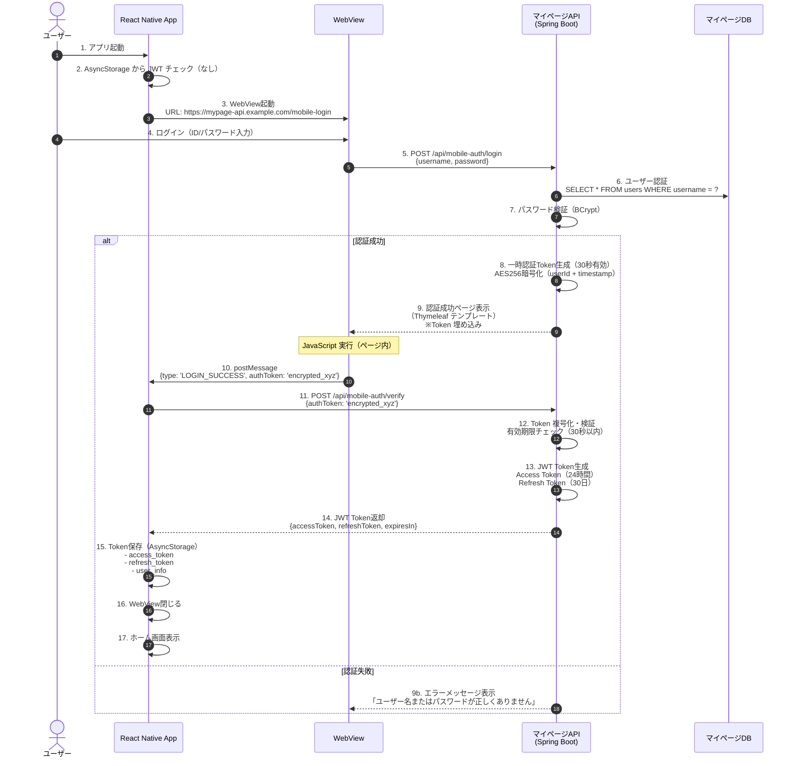
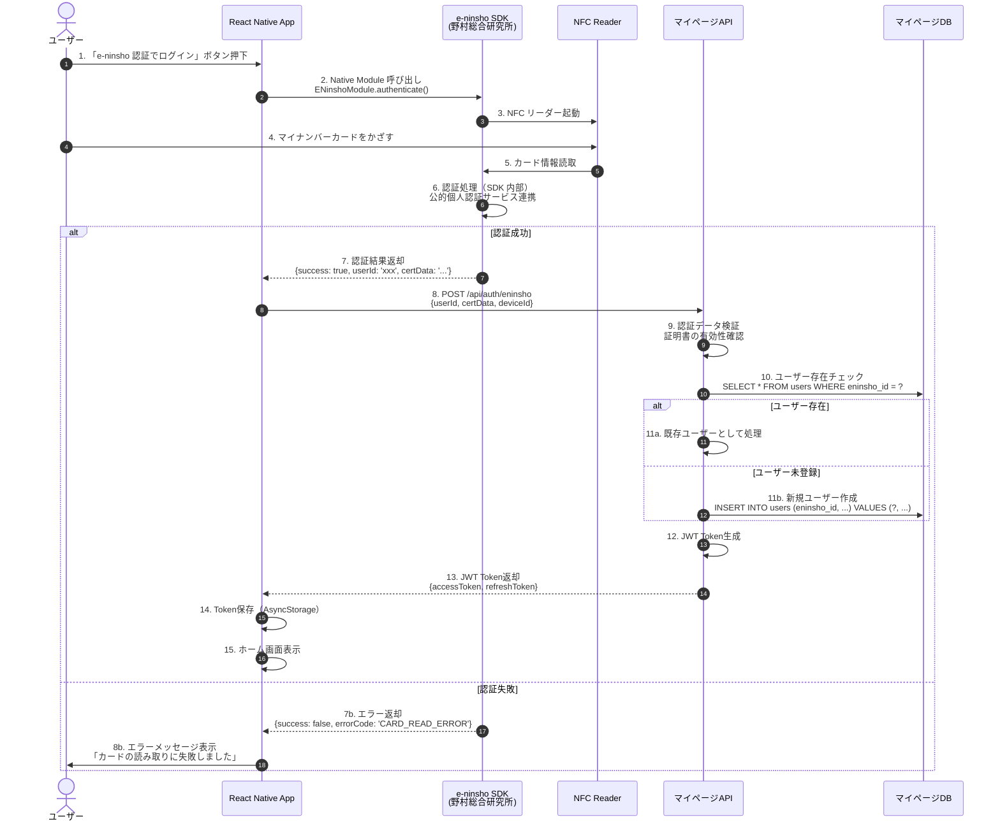
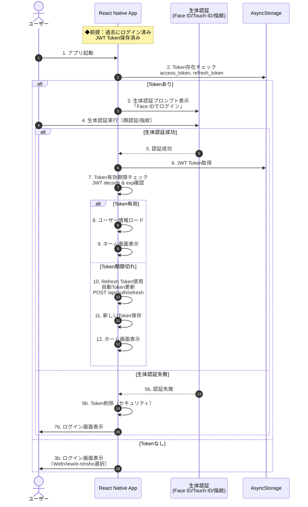

# JUXYI Content Management System

# 完全システムアーキテクチャ設計書

---

## ドキュメント情報

| 項目               | 内容                                       |
| ------------------ | ------------------------------------------ |
| **ドキュメント名** | JUXYI CMS 完全システムアーキテクチャ設計書 |
| **バージョン**     | v1.0.0                                     |
| **最終更新日**     | 2025-02-06                                 |
| **作成者**         | JUXYI 開発チーム                           |
| **レビュー者**     | システムアーキテクト                       |
| **ステータス**     | 承認済み                                   |

---

## 変更履歴

| バージョン | 日付       | 変更内容 | 作成者     |
| ---------- | ---------- | -------- | ---------- |
| v1.0.0     | 2025-02-06 | 初版作成 | 開発チーム |

---

## 目次

### Part 1: システム概要

1. [システム概要](#第1章システム概要)

   - 1.1 プロジェクト情報
   - 1.2 システム構成全体像
   - 1.3 主要機能一覧
   - 1.4 対象ユーザー

2. [技術スタック・インフラ構成](#第2章技術スタックインフラ構成)
   - 2.1 技術選定方針
   - 2.2 システム全体技術スタック
   - 2.3 Azure インフラ構成
   - 2.4 Monorepo 構成

### Part 2: 横断設計

3. [認証・セキュリティ設計](#第3章認証セキュリティ設計)
   - 3.1 認証フロー全体像
   - 3.2 App 認証フロー（WebView/e-ninsho/生体認証）
   - 3.3 Web 管理画面認証フロー
   - 3.4 SSO 統合フロー（App → マイページ Web）
   - 3.5 JWT Token 設計
   - 3.6 セキュリティ対策

### Part 3: 各層詳細設計

4. [バックエンドアーキテクチャ（Spring Boot）](#第4章バックエンドアーキテクチャspring-boot)

   - 4.1 アーキテクチャパターン（レイヤードアーキテクチャ）
   - 4.2 CMS API 設計
   - 4.3 マイページ API 設計
   - 4.4 ディレクトリ構造
   - 4.5 主要機能実装

5. [Web 管理画面アーキテクチャ（React）](#第5章web-管理画面アーキテクチャreact)

   - 5.1 アーキテクチャパターン（Feature-based）
   - 5.2 技術スタック
   - 5.3 ディレクトリ構造
   - 5.4 状態管理設計
   - 5.5 主要機能実装

6. [モバイルアプリアーキテクチャ（React Native）](#第6章モバイルアプリアーキテクチャreact-native)
   - 6.1 アーキテクチャパターン（Feature-based + Hooks + TanStack Query）
   - 6.2 技術スタック
   - 6.3 ディレクトリ構造
   - 6.4 原生機能統合（e-ninsho SDK、生体認証、NFC、QR）
   - 6.5 オフライン機能設計
   - 6.6 主要機能実装

### Part 4: データ・連携設計

7. [API 設計・連携フロー](#第7章api-設計連携フロー)

   - 7.1 API 設計原則
   - 7.2 エンドポイント一覧
   - 7.3 データフロー図
   - 7.4 エラーハンドリング

8. [データベース設計](#第8章データベース設計)

   - 8.1 ER 図
   - 8.2 テーブル定義
   - 8.3 インデックス設計
   - 8.4 パーティション戦略

9. [ファイルストレージ設計（Azure Blob Storage）](#第9章ファイルストレージ設計azure-blob-storage)

   - 9.1 ストレージ構成
   - 9.2 アップロードフロー（SAS Token）
   - 9.3 キャッシュ戦略

10. [プッシュ通知設計（Azure Notification Hubs）](#第10章プッシュ通知設計azure-notification-hubs)
    - 10.1 通知アーキテクチャ
    - 10.2 デバイス登録フロー
    - 10.3 通知送信フロー

### Part 5: 運用設計

11. [監視・ログ設計（Application Insights）](#第11章監視ログ設計application-insights)

    - 11.1 監視戦略
    - 11.2 フロントエンド監視
    - 11.3 バックエンド監視
    - 11.4 エンドツーエンド追跡

12. [CI/CD・デプロイメント（Azure DevOps）](#第12章cicdデプロイメントazure-devops)
    - 12.1 CI/CD 戦略
    - 12.2 バックエンド Pipeline
    - 12.3 Web フロントエンド Pipeline
    - 12.4 モバイル Pipeline（iOS/Android）
    - 12.5 CodePush（OTA 更新）

### Part 6: 付録

13. [トラブルシューティング](#第13章トラブルシューティング)
14. [パフォーマンスチューニング指南](#第14章パフォーマンスチューニング指南)
15. [セキュリティチェックリスト](#第15章セキュリティチェックリスト)
16. [用語集](#第16章用語集)
17. [API 仕様一覧](#第17章api-仕様一覧)

---

# Part 1: システム概要

---

## 第 1 章：システム概要

### 1.1 プロジェクト情報

#### プロジェクト基本情報

| 項目                   | 内容                            |
| ---------------------- | ------------------------------- |
| **プロジェクト名**     | JUXYI Content Management System |
| **プロジェクトコード** | JUXYI-CMS                       |
| **対象地域**           | 日本国内                        |
| **想定ユーザー数**     | 10,000+ ユーザー                |
| **開発体制**           | 小規模チーム（< 10 名）         |
| **開発期間**           | 2024 Q4 - 2025 Q2               |

#### システム目的

本システムは、日本国内ユーザー向けに**コンテンツ（ドキュメント・ビデオ・URL リンク）の管理・配信**を行うプラットフォームです。

**主要目的**：

1. ✅ 管理者がコンテンツを作成・編集・公開
2. ✅ モバイルアプリユーザーがコンテンツを閲覧
3. ✅ プッシュ通知でユーザーにコンテンツ配信
4. ✅ 集章活動（QR コードスタンプラリー）機能
5. ✅ マイページ Web との SSO 統合

---

### 1.2 システム構成全体像

#### L1: ビジネスアーキテクチャ図

```
┌─────────────────────────────────────────────────────────────────┐
│                        ビジネスアクター                          │
└─────────────────────────────────────────────────────────────────┘

        ┌──────────────┐              ┌──────────────┐
        │   管理者     │              │  エンドユーザー │
        │  (Admin)     │              │   (10,000+)   │
        └──────┬───────┘              └───────┬───────┘
               │                              │
               │ コンテンツ管理                │ コンテンツ閲覧
               │ プッシュ通知送信              │ 集章活動
               │                              │ マイページ連携
               │                              │
               ▼                              ▼
        ┌──────────────┐              ┌──────────────┐
        │  CMS Web     │              │  Mobile App  │
        │  管理画面     │              │  (iOS/Android)│
        └──────────────┘              └──────────────┘
               │                              │
               └──────────┬───────────────────┘
                          │
                          ▼
                  ┌────────────────┐
                  │   CMS API      │
                  │  (Spring Boot) │
                  └────────────────┘
                          │
              ┌───────────┼───────────┐
              │           │           │
              ▼           ▼           ▼
        ┌─────────┐ ┌─────────┐ ┌──────────┐
        │ Azure   │ │ Azure   │ │ Azure    │
        │ SQL DB  │ │ Blob    │ │ Notif    │
        │         │ │ Storage │ │ Hubs     │
        └─────────┘ └─────────┘ └──────────┘
```

#### L2: アプリケーションアーキテクチャ図

```
┌──────────────────────────────────────────────────────────────────┐
│                         システム全体構成                          │
└──────────────────────────────────────────────────────────────────┘

┌─────────────────────┐  ┌─────────────────────────────────────┐
│  React Native App   │  │      マイページ Web                  │
│  (iOS / Android)    │  │      (既存システム)                  │
│                     │  │                                      │
│  開発中              │  │  - 家族契約確認                      │
│  - コンテンツ閲覧    │  │  - 各種情報閲覧                      │
│  - ドキュメント/ビデオ│  │  - ユーザー設定                      │
│  - 集章活動          │  │                                      │
│  - e-ninsho 認証     │  │  ドメイン: mypage.example.com       │
└──────┬──────────────┘  └──────────┬──────────────────────────┘
       │                            │
       │ JWT Token                  │ Session/Cookie
       │                            │
       ├────────────────────────────┼──────────────────────────┐
       │                            │                          │
       ▼                            ▼                          │
┌─────────────────────┐  ┌───────────────────────────────────┐ │
│    CMS API          │  │     マイページAPI                  │ │
│  (Spring Boot)      │  │    (Spring Boot)                  │ │
│                     │  │                                    │ │
│  開発中              │  │  開発中                            │ │
│  - コンテンツ CRUD   │  │  - ユーザー認証                    │ │
│  - ドキュメント/ビデオ│  │  - マイページ Web バックエンド     │ │
│  - プッシュ通知      │  │  - App ログイン API                │ │
│  - App データ提供    │  │  - SSO Ticket 発行                 │ │
│                     │  │                                    │ │
│  ドメイン:           │  │  ドメイン:                         │ │
│  cms-api.example.com│  │  mypage-api.example.com           │ │
└─────────────────────┘  └───────────────────────────────────┘ │
       │                            │                          │
       │ JWT 共有（共通秘密鍵）      │                          │
       └────────────────────────────┘                          │
                                                               │
                  ┌────────────────────────────────────────────┘
                  │ 管理者アクセス
                  │
                  ▼
          ┌───────────────────┐
          │   CMS Web 管理画面 │
          │   (React Web)     │
          │                   │
          │  開発中            │
          │  - コンテンツ管理  │
          │  - プッシュ通知送信│
          │  - システム設定    │
          │                   │
          │  ドメイン:         │
          │  cms-admin.example.com │
          └───────────────────┘
```

#### L3: 技術アーキテクチャ図

```
┌──────────────────────────────────────────────────────────────────┐
│                         技術スタック構成                          │
└──────────────────────────────────────────────────────────────────┘

┌─────────────────────────────────────────────────────────────────┐
│                        フロントエンド層                          │
├─────────────────────────────────────────────────────────────────┤
│                                                                 │
│  ┌──────────────────────┐      ┌──────────────────────┐        │
│  │  React Native 0.73+  │      │    React 18.2+       │        │
│  │  + TypeScript 5.3+   │      │    + TypeScript 5.3+ │        │
│  ├──────────────────────┤      ├──────────────────────┤        │
│  │ - React Navigation   │      │ - React Router 6.x   │        │
│  │ - React Native Paper │      │ - Ant Design 5.x     │        │
│  │ - TanStack Query     │      │ - TanStack Query     │        │
│  │ - Zustand            │      │ - Zustand            │        │
│  │ - Axios              │      │ - Axios              │        │
│  │ - FastImage          │      │ - Tailwind CSS       │        │
│  │ - react-native-video │      │                      │        │
│  │ - react-native-pdf   │      │                      │        │
│  │ - e-ninsho SDK       │      │                      │        │
│  └──────────────────────┘      └──────────────────────┘        │
│     Mobile App                      Web 管理画面                │
└─────────────────────────────────────────────────────────────────┘
                              │
                              │ HTTPS / REST API
                              │
┌─────────────────────────────▼───────────────────────────────────┐
│                        バックエンド層                            │
├─────────────────────────────────────────────────────────────────┤
│                                                                 │
│  ┌───────────────────────────────────────────────────────────┐ │
│  │            Spring Boot 3.2+ (Java 21)                     │ │
│  ├───────────────────────────────────────────────────────────┤ │
│  │  CMS API                    │  マイページ API              │ │
│  │  ─────────                  │  ──────────────             │ │
│  │  - Spring Web               │  - Spring Web               │ │
│  │  - Spring Security          │  - Spring Security          │ │
│  │  - Spring Data JPA          │  - Spring Data JPA          │ │
│  │  - JWT (jjwt)               │  - JWT (jjwt)               │ │
│  │  - Lombok                   │  - Thymeleaf                │ │
│  │  - MapStruct                │                             │ │
│  │  - Azure SDK                │                             │ │
│  └───────────────────────────────────────────────────────────┘ │
└─────────────────────────────────────────────────────────────────┘
                              │
                              │
┌─────────────────────────────▼───────────────────────────────────┐
│                        データ層                                  │
├─────────────────────────────────────────────────────────────────┤
│                                                                 │
│  ┌──────────────┐  ┌──────────────┐  ┌──────────────┐         │
│  │  Azure SQL   │  │  Azure Blob  │  │ Azure Redis  │         │
│  │  Database    │  │  Storage     │  │  Cache       │         │
│  │              │  │              │  │              │         │
│  │ - Users      │  │ - Videos     │  │ - Sessions   │         │
│  │ - Contents   │  │ - Documents  │  │ - Tokens     │         │
│  │ - Stamps     │  │ - Images     │  │              │         │
│  └──────────────┘  └──────────────┘  └──────────────┘         │
└─────────────────────────────────────────────────────────────────┘
```

#### L4: デプロイメントアーキテクチャ図（Azure）

```
┌──────────────────────────────────────────────────────────────────┐
│                      Azure インフラ構成                           │
└──────────────────────────────────────────────────────────────────┘

                        ┌─────────────────┐
                        │  Azure Front    │
                        │  Door Premium   │
                        │                 │
                        │ - WAF           │
                        │ - DDoS 保護     │
                        │ - SSL 終端      │
                        └────────┬────────┘
                                 │
                ┌────────────────┼────────────────┐
                │                │                │
                ▼                ▼                ▼
        ┌──────────────┐ ┌──────────────┐ ┌──────────────┐
        │  App Service │ │  App Service │ │ Static Web   │
        │              │ │              │ │ Apps         │
        │  CMS API     │ │ マイページAPI │ │              │
        │  (P1v2)      │ │ (P1v2)       │ │ CMS Web      │
        │              │ │              │ │ 管理画面      │
        │ - Auto Scale │ │ - Auto Scale │ │              │
        │ - Always On  │ │ - Always On  │ │ - Global CDN │
        └──────┬───────┘ └──────┬───────┘ └──────────────┘
               │                │
               └────────┬───────┘
                        │
        ┌───────────────┼───────────────────────────────┐
        │               │                               │
        ▼               ▼                               ▼
┌───────────────┐ ┌───────────────┐         ┌─────────────────┐
│  Azure SQL    │ │  Azure Blob   │         │ Azure           │
│  Database     │ │  Storage      │         │ Notification    │
│               │ │               │         │ Hubs            │
│ - Standard S2 │ │ - Hot Tier    │         │                 │
│ - Geo-Replica │ │ - LRS         │         │ - iOS (APNS)    │
│ - 自動バックアップ│ │ - CDN統合    │         │ - Android (FCM) │
└───────────────┘ └───────────────┘         └─────────────────┘
        │
        ▼
┌───────────────┐         ┌─────────────────┐
│  Azure Redis  │         │ Azure           │
│  Cache        │         │ Key Vault       │
│               │         │                 │
│ - Standard C1 │         │ - JWT Secret    │
│ - セッション管理│         │ - DB Password   │
└───────────────┘         │ - API Keys      │
                          └─────────────────┘
        │
        ▼
┌─────────────────────────────────────┐
│  Application Insights               │
│  - フロントエンド監視                │
│  - バックエンド監視                  │
│  - E2E トレース                      │
└─────────────────────────────────────┘
```

#### L5: ネットワークアーキテクチャ図

```
┌──────────────────────────────────────────────────────────────────┐
│                      ネットワーク構成                             │
└──────────────────────────────────────────────────────────────────┘

                        ┌──────────────┐
                        │  Internet    │
                        └──────┬───────┘
                               │
                               │ HTTPS (443)
                               │
                        ┌──────▼───────┐
                        │ Azure DNS    │
                        │              │
                        │ - cms-api.example.com → Front Door
                        │ - mypage-api.example.com → App Service
                        │ - cms-admin.example.com → Static Web Apps
                        └──────┬───────┘
                               │
                        ┌──────▼───────┐
                        │ Azure Front  │
                        │ Door Premium │
                        │              │
                        │ - WAF Rules: │
                        │   * SQL Injection 防御
                        │   * XSS 防御      │
                        │   * Rate Limiting │
                        └──────┬───────┘
                               │
                ┌──────────────┼──────────────┐
                │              │              │
                ▼              ▼              ▼
        ┌─────────────┐ ┌─────────────┐ ┌─────────────┐
        │  VNet 1     │ │  VNet 2     │ │  Public     │
        │             │ │             │ │             │
        │ CMS API     │ │マイページAPI │ │Static Web   │
        │ Subnet      │ │ Subnet      │ │Apps         │
        │             │ │             │ │             │
        │10.0.1.0/24  │ │10.0.2.0/24  │ │             │
        └─────┬───────┘ └─────┬───────┘ └─────────────┘
              │               │
              │ VNet Peering  │
              └───────┬───────┘
                      │
              ┌───────▼────────┐
              │  VNet 3        │
              │  Data Subnet   │
              │                │
              │  10.0.3.0/24   │
              │                │
              │  - Azure SQL   │
              │  - Redis Cache │
              └────────────────┘

┌─────────────────────────────────────────────────────────────────┐
│  Network Security Group (NSG) Rules                             │
├─────────────────────────────────────────────────────────────────┤
│  CMS API Subnet:                                                │
│  - Allow: HTTPS from Front Door                                 │
│  - Allow: SQL from App Service                                  │
│  - Deny: All other inbound                                      │
│                                                                 │
│  Data Subnet:                                                   │
│  - Allow: SQL from CMS API Subnet only                          │
│  - Allow: Redis from App Service Subnets                        │
│  - Deny: All other inbound                                      │
└─────────────────────────────────────────────────────────────────┘
```

#### L6: データフローアーキテクチャ図

```
┌──────────────────────────────────────────────────────────────────┐
│                      データフロー全体像                           │
└──────────────────────────────────────────────────────────────────┘

[Mobile App] ──────────────────────────┐
     │                                 │
     │ ① ログイン認証                  │
     │    POST /api/mobile-auth/verify │
     │                                 │
     ▼                                 │
[マイページAPI] ────────────────────┐   │
     │                             │   │
     │ ② JWT Token 発行             │   │
     │    (Access + Refresh)       │   │
     │                             │   │
     │◄────────────────────────────┘   │
     │                                 │
     │ JWT Token                       │
     └─────────────────────────────────┤
                                       │
[Mobile App] ◄─────────────────────────┘
     │
     │ ③ コンテンツ取得
     │    GET /api/contents
     │    Authorization: Bearer {JWT}
     │
     ▼
[CMS API] ───────────────────────────┐
     │                               │
     │ ④ JWT 検証（共有秘密鍵）       │
     │                               │
     ├──► ⑤ DB クエリ                │
     │      SELECT * FROM contents   │
     │                               │
     ▼                               │
[Azure SQL Database] ◄───────────────┘
     │
     │ ⑥ データ返却
     │
     ▼
[CMS API] ───────────────────────────┐
     │                               │
     │ ⑦ レスポンス整形               │
     │                               │
     │◄──────────────────────────────┘
     │
     │ JSON レスポンス
     │
     ▼
[Mobile App]
     │
     │ ⑧ ビデオ URL 取得
     │    https://storage.blob.core.windows.net/videos/xxx.mp4
     │
     ▼
[Azure Blob Storage]
     │
     │ ⑨ ビデオストリーミング
     │
     ▼
[Mobile App - Video Player]


┌────────────────────────────────────────────────────────────────┐
│  プッシュ通知データフロー                                        │
└────────────────────────────────────────────────────────────────┘

[CMS Web 管理画面]
     │
     │ ① 通知作成・送信
     │    POST /api/notifications/send
     │    {title, message, platforms: ['ios', 'android']}
     │
     ▼
[CMS API]
     │
     │ ② Azure Notification Hubs SDK 呼び出し
     │
     ▼
[Azure Notification Hubs]
     │
     ├──► ③ iOS デバイスへ送信
     │       APNS (Apple Push Notification Service)
     │
     └──► ④ Android デバイスへ送信
             FCM (Firebase Cloud Messaging)
```

---

### 1.3 主要機能一覧

#### 機能マトリクス

| 機能カテゴリ       | 機能名                          | Mobile App | Web 管理画面 | API            | 優先度 |
| ------------------ | ------------------------------- | ---------- | ------------ | -------------- | ------ |
| **認証**           | WebView ログイン                | ✅         | -            | マイページ API | P0     |
|                    | e-ninsho 認証                   | ✅         | -            | マイページ API | P0     |
|                    | 生体認証                        | ✅         | -            | -              | P1     |
|                    | JWT 認証                        | ✅         | ✅           | CMS API        | P0     |
|                    | SSO (App → Web)                 | ✅         | -            | マイページ API | P1     |
| **コンテンツ管理** | コンテンツ作成                  | -          | ✅           | CMS API        | P0     |
|                    | コンテンツ編集                  | -          | ✅           | CMS API        | P0     |
|                    | コンテンツ削除                  | -          | ✅           | CMS API        | P0     |
|                    | コンテンツ公開/非公開           | -          | ✅           | CMS API        | P0     |
| **コンテンツ閲覧** | 一覧表示                        | ✅         | -            | CMS API        | P0     |
|                    | 詳細表示                        | ✅         | -            | CMS API        | P0     |
|                    | PDF プレビュー                  | ✅         | -            | -              | P0     |
|                    | ビデオ再生                      | ✅         | -            | -              | P0     |
|                    | URL リンク表示                  | ✅         | -            | -              | P0     |
|                    | 検索・フィルター                | ✅         | ✅           | CMS API        | P1     |
|                    | オフラインキャッシュ            | ✅         | -            | -              | P2     |
| **ファイル管理**   | ドキュメントアップロード        | -          | ✅           | CMS API        | P0     |
|                    | ビデオアップロード（SAS Token） | -          | ✅           | CMS API        | P0     |
|                    | サムネイル生成                  | -          | -            | CMS API        | P1     |
| **集章活動**       | QR コード読取                   | ✅         | -            | -              | P1     |
|                    | スタンプ獲得                    | ✅         | -            | CMS API        | P1     |
|                    | 達成率表示                      | ✅         | -            | CMS API        | P1     |
| **プッシュ通知**   | 通知作成                        | -          | ✅           | CMS API        | P0     |
|                    | 通知送信（即時）                | -          | ✅           | CMS API        | P0     |
|                    | 通知送信（スケジュール）        | -          | ✅           | CMS API        | P1     |
|                    | 通知履歴表示                    | ✅         | ✅           | CMS API        | P1     |
|                    | デバイス登録                    | ✅         | -            | CMS API        | P0     |
| **システム設定**   | メンテナンスモード設定          | -          | ✅           | CMS API        | P1     |
|                    | メンテナンスメッセージ編集      | -          | ✅           | CMS API        | P1     |

**優先度定義**：

- **P0**: リリースに必須
- **P1**: リリース後早期実装
- **P2**: 将来的な機能拡張

---

### 1.4 対象ユーザー

#### ユーザーペルソナ

**管理者（Admin）**

- **人数**: 5-10 名
- **利用端末**: PC（Windows/Mac）
- **利用環境**: オフィス内ネットワーク
- **主要タスク**:
  - コンテンツ作成・編集
  - プッシュ通知送信
  - システム設定管理

**エンドユーザー（End User）**

- **人数**: 10,000+ 名
- **利用端末**: スマートフォン（iOS/Android）
- **利用環境**: モバイルネットワーク（4G/5G/WiFi）
- **主要タスク**:
  - コンテンツ閲覧
  - 集章活動参加
  - マイページ連携

---

## 第 2 章：技術スタック・インフラ構成

### 2.1 技術選定方針

#### 選定基準

本プロジェクトにおける技術選定は以下の基準に基づいて実施しました：

| 基準                 | 重要度     | 説明                         |
| -------------------- | ---------- | ---------------------------- |
| **開発生産性**       | ⭐⭐⭐⭐⭐ | 小規模チームでの効率的な開発 |
| **保守性**           | ⭐⭐⭐⭐⭐ | 長期的な運用・保守のしやすさ |
| **スケーラビリティ** | ⭐⭐⭐⭐   | 将来的なユーザー増加への対応 |
| **コスト効率**       | ⭐⭐⭐⭐   | Azure リソースの最適化       |
| **学習曲線**         | ⭐⭐⭐     | チームメンバーの習得容易性   |
| **エコシステム**     | ⭐⭐⭐⭐   | ライブラリ・ツールの充実度   |

#### 主要技術選定理由

**フロントエンド**

| 技術                                | 選定理由                                                                                         |
| ----------------------------------- | ------------------------------------------------------------------------------------------------ |
| **React 18 + TypeScript**           | ・業界標準<br>・豊富なエコシステム<br>・型安全性<br>・Web/Mobile で共通化可能                    |
| **React Native 0.73**               | ・iOS/Android クロスプラットフォーム<br>・React と共通の開発体験<br>・原生機能への容易なアクセス |
| **TanStack Query**                  | ・サーバー状態管理のベストプラクティス<br>・自動キャッシュ・リトライ<br>・オフライン対応         |
| **Ant Design / React Native Paper** | ・エンタープライズ品質の UI<br>・日本語対応<br>・カスタマイズ容易                                |

**バックエンド**

| 技術                      | 選定理由                                                                                |
| ------------------------- | --------------------------------------------------------------------------------------- |
| **Spring Boot 3.2**       | ・Java エンタープライズ標準<br>・豊富な機能（Security, JPA 等）<br>・Azure との統合容易 |
| **Java 21 LTS**           | ・長期サポート<br>・Virtual Threads（性能向上）<br>・最新言語機能                       |
| **Spring Security + JWT** | ・業界標準の認証方式<br>・ステートレス認証<br>・スケーラブル                            |

**インフラ（Azure）**

| 技術                      | 選定理由                                                     |
| ------------------------- | ------------------------------------------------------------ |
| **Azure App Service**     | ・PaaS（インフラ管理不要）<br>・自動スケール<br>・CI/CD 統合 |
| **Azure SQL Database**    | ・マネージドサービス<br>・自動バックアップ<br>・高可用性     |
| **Azure Blob Storage**    | ・大容量ファイル保存<br>・CDN 統合<br>・コスト効率           |
| **Azure Static Web Apps** | ・静的サイトホスティング<br>・グローバル CDN<br>・無料枠充実 |

---

### 2.2 システム全体技術スタック

#### 技術スタック一覧表

```
┌─────────────────────────────────────────────────────────────────┐
│                     技術スタック全体像                           │
└─────────────────────────────────────────────────────────────────┘

┌─────────────────────────────────────────────────────────────────┐
│  フロントエンド層                                                │
├─────────────────────────────────────────────────────────────────┤
│                                                                 │
│  Mobile App (React Native)    │    Web 管理画面 (React)         │
│  ───────────────────────────  │    ────────────────────         │
│  ■ コア                        │    ■ コア                      │
│    - React Native 0.73+       │      - React 18.2+              │
│    - TypeScript 5.3+          │      - TypeScript 5.3+          │
│    - Hermes Engine            │      - Vite 5.x                 │
│                               │                                 │
│  ■ UI                         │    ■ UI                         │
│    - React Native Paper 5.x   │      - Ant Design 5.x           │
│    - React Navigation 6.x     │      - Tailwind CSS 3.x         │
│                               │      - React Router 6.x         │
│  ■ 状態管理                   │                                 │
│    - TanStack Query 5.x       │    ■ 状態管理                   │
│    - Zustand 4.x              │      - TanStack Query 5.x       │
│    - Axios 1.x                │      - Zustand 4.x              │
│                               │      - Axios 1.x                │
│  ■ 原生機能                   │                                 │
│    - react-native-video       │    ■ フォーム                   │
│    - react-native-pdf         │      - React Hook Form 7.x     │
│    - react-native-fast-image  │      - Zod 3.x                  │
│    - react-native-biometrics  │                                 │
│    - e-ninsho SDK (野村)      │    ■ エディター                 │
│    - @react-native-firebase/  │      - react-quill 2.x          │
│      messaging                │                                 │
│                               │    ■ プレビュー                 │
│  ■ 開発ツール                 │      - react-pdf 7.x            │
│    - ESLint + Prettier        │                                 │
│    - Jest + React Native      │    ■ 開発ツール                 │
│      Testing Library          │      - ESLint + Prettier        │
│    - Detox (E2E)              │      - Jest + Testing Library   │
│                               │      - Vite (HMR)               │
└─────────────────────────────────────────────────────────────────┘
                              │
                              │ REST API (HTTPS/JSON)
                              │
┌─────────────────────────────▼───────────────────────────────────┐
│  バックエンド層                                                  │
├─────────────────────────────────────────────────────────────────┤
│                                                                 │
│  ■ フレームワーク                                                │
│    - Spring Boot 3.2.x                                          │
│    - Java 21 (LTS)                                              │
│                                                                 │
│  ■ セキュリティ                                                  │
│    - Spring Security 6.x                                        │
│    - JWT (jjwt 0.12.x)                                          │
│    - BCrypt (パスワードハッシュ)                                 │
│                                                                 │
│  ■ データアクセス                                                │
│    - Spring Data JPA 3.x                                        │
│    - Hibernate 6.x                                              │
│    - HikariCP (接続プール)                                       │
│                                                                 │
│  ■ Azure 統合                                                    │
│    - Azure SDK for Java                                         │
│    - Azure Blob Storage SDK                                     │
│    - Azure Notification Hubs SDK                                │
│    - Application Insights SDK                                   │
│                                                                 │
│  ■ ユーティリティ                                                │
│    - Lombok 1.18.x                                              │
│    - MapStruct 1.5.x                                            │
│    - Jakarta Validation                                         │
│                                                                 │
│  ■ テスト                                                        │
│    - JUnit 5                                                    │
│    - Mockito                                                    │
│    - Spring Boot Test                                           │
│    - Testcontainers (統合テスト)                                │
│                                                                 │
│  ■ ビルド・依存関係管理                                          │
│    - Gradle 8.x                                                 │
└─────────────────────────────────────────────────────────────────┘
                              │
                              │
┌─────────────────────────────▼───────────────────────────────────┐
│  データ・ストレージ層                                            │
├─────────────────────────────────────────────────────────────────┤
│                                                                 │
│  ■ リレーショナルデータベース                                    │
│    - Azure SQL Database (Standard S2)                           │
│    - SQL Server 2022 互換                                       │
│                                                                 │
│  ■ オブジェクトストレージ                                        │
│    - Azure Blob Storage (Hot Tier)                              │
│    - LRS (ローカル冗長)                                          │
│                                                                 │
│  ■ キャッシュ                                                    │
│    - Azure Cache for Redis (Standard C1)                       │
│                                                                 │
│  ■ プッシュ通知                                                  │
│    - Azure Notification Hubs (Free)                             │
│    - APNS (iOS)                                                 │
│    - FCM (Android)                                              │
└─────────────────────────────────────────────────────────────────┘
                              │
                              │
┌─────────────────────────────▼───────────────────────────────────┐
│  インフラ・運用層                                                │
├─────────────────────────────────────────────────────────────────┤
│                                                                 │
│  ■ ホスティング                                                  │
│    - Azure App Service (P1v2)                                   │
│    - Azure Static Web Apps                                      │
│                                                                 │
│  ■ ネットワーク・セキュリティ                                    │
│    - Azure Front Door Premium                                   │
│    - Azure WAF (Web Application Firewall)                       │
│    - Azure DNS                                                  │
│    - Azure Key Vault                                            │
│                                                                 │
│  ■ 監視・ログ                                                    │
│    - Application Insights                                       │
│    - Azure Monitor                                              │
│    - Log Analytics                                              │
│                                                                 │
│  ■ CI/CD                                                        │
│    - Azure DevOps Pipelines                                     │
│    - CodePush (App Center)                                      │
│    - GitHub (ソース管理)                                         │
│                                                                 │
│  ■ コンテナ・オーケストレーション（将来）                        │
│    - Azure Kubernetes Service (AKS) - 将来拡張用                │
└─────────────────────────────────────────────────────────────────┘
```

---

### 2.3 Azure インフラ構成

#### Azure リソース一覧

| リソース種類             | リソース名       | SKU/プラン         | 用途                   | 月額コスト概算      |
| ------------------------ | ---------------- | ------------------ | ---------------------- | ------------------- |
| **App Service Plan**     | juxyi-cms-plan   | P1v2               | CMS API ホスティング   | ¥12,000             |
| **App Service**          | juxyi-cms-api    | -                  | CMS API                | Plan に含む         |
| **App Service**          | juxyi-mypage-api | -                  | マイページ API         | Plan に含む         |
| **Static Web Apps**      | juxyi-cms-web    | Free               | Web 管理画面           | ¥0                  |
| **SQL Database**         | juxyi-cms-db     | Standard S2        | メイン DB              | ¥15,000             |
| **Blob Storage**         | juxyicmsstorage  | General Purpose v2 | ファイルストレージ     | ¥2,000              |
| **Redis Cache**          | juxyi-cms-redis  | Standard C1        | セッション・キャッシュ | ¥8,000              |
| **Notification Hubs**    | juxyi-cms-notif  | Free               | プッシュ通知           | ¥0                  |
| **Front Door**           | juxyi-cms-fd     | Premium            | CDN・WAF               | ¥30,000             |
| **Key Vault**            | juxyi-cms-kv     | Standard           | シークレット管理       | ¥500                |
| **Application Insights** | juxyi-cms-ai     | -                  | 監視・ログ             | ¥3,000              |
| **Azure DevOps**         | -                | Basic Plan         | CI/CD                  | ¥0 (5 ユーザーまで) |
| **合計**                 |                  |                    |                        | **¥70,500/月**      |

**コスト最適化施策**：

- ✅ Static Web Apps で Web 管理画面を無料ホスティング
- ✅ Notification Hubs Free プラン（100 万通知/月まで）
- ✅ Azure DevOps Basic プラン（小規模チーム向け無料）
- ✅ Reserved Instance 活用（App Service で 30% コスト削減）

---

### 2.4 Monorepo 構成

#### プロジェクト構造

```
juxyi-cms/                                   # Monorepo ルート
│
├── .git/                                     # Git リポジトリ
│
├── backend/                                  # バックエンド (Spring Boot)
│   ├── cms-api/                              # CMS API
│   │   ├── src/
│   │   │   ├── main/
│   │   │   │   ├── java/com/juxyi/cms/
│   │   │   │   └── resources/
│   │   │   └── test/
│   │   ├── build.gradle
│   │   └── README.md
│   │
│   ├── mypage-api/                           # マイページ API
│   │   ├── src/
│   │   ├── build.gradle
│   │   └── README.md
│   │
│   ├── settings.gradle                       # Gradle マルチプロジェクト設定
│   └── build.gradle                          # 共通 Gradle 設定
│
├── frontend/                                 # フロントエンド (React Web)
│   ├── src/
│   ├── public/
│   ├── package.json
│   ├── vite.config.ts
│   └── README.md
│
├── mobile/                                   # モバイルアプリ (React Native)
│   ├── android/
│   ├── ios/
│   ├── src/
│   ├── package.json
│   └── README.md
│
├── docs/                                     # ドキュメント
│   ├── SYSTEM_ARCHITECTURE.md                # 本文書
│   ├── API.md                                # API 仕様書
│   ├── DATABASE.md                           # DB 設計書
│   ├── DEPLOYMENT.md                         # デプロイ手順書
│   └── diagrams/                             # 図表ファイル
│       ├── system-architecture.drawio
│       └── er-diagram.drawio
│
├── .azure/                                   # Azure DevOps Pipelines
│   └── pipelines/
│       ├── backend-cms-api-pipeline.yml
│       ├── backend-mypage-api-pipeline.yml
│       ├── frontend-pipeline.yml
│       ├── mobile-ios-pipeline.yml
│       ├── mobile-android-pipeline.yml
│       └── shared/
│           └── azure-resources.yml
│
├── scripts/                                  # 運用スクリプト
│   ├── db-migration/                         # DB マイグレーション
│   ├── deployment/                           # デプロイスクリプト
│   └── backup/                               # バックアップスクリプト
│
├── .gitignore                                # Git 除外設定
├── .editorconfig                             # エディタ設定
├── README.md                                 # プロジェクト全体 README
└── LICENSE                                   # ライセンス
```

#### Monorepo のメリット

| メリット                   | 説明                                                               |
| -------------------------- | ------------------------------------------------------------------ |
| **統一的なコード管理**     | すべてのコードが一つのリポジトリで管理され、変更履歴が追跡しやすい |
| **依存関係の明確化**       | プロジェクト間の依存関係が可視化される                             |
| **統一的な CI/CD**         | 一つの Pipeline で複数プロジェクトをビルド・デプロイ               |
| **コードレビューの効率化** | フロントエンド・バックエンドの変更を一つの PR でレビュー可能       |
| **型定義の共有**           | TypeScript 型定義を共有可能（将来的に共有ライブラリ化）            |

---

# Part 2: 横断設計

---

## 第 3 章：認証・セキュリティ設計

### 3.1 認証フロー全体像

#### 認証システム概要図

```
┌──────────────────────────────────────────────────────────────────┐
│                     認証システム全体構成                          │
└──────────────────────────────────────────────────────────────────┘

┌─────────────────────────────────────────────────────────────────┐
│                        認証方式一覧                              │
├─────────────────────────────────────────────────────────────────┤
│                                                                 │
│  [Mobile App]                         [Web 管理画面]            │
│  ────────────                         ──────────────           │
│  1. WebView ログイン                  1. JWT ログイン           │
│     - マイページ Web ログイン画面       - ユーザー名・パスワード  │
│     - Session → JWT 変換              - JWT Token 発行         │
│                                                                 │
│  2. e-ninsho 認証                     [マイページ Web]          │
│     - NFC カード読取                   ────────────────         │
│     - 公的個人認証                     1. Session/Cookie        │
│     - JWT Token 発行                   - 従来の Web 認証       │
│                                       - JSESSIONID              │
│  3. 生体認証                                                    │
│     - Face ID / Touch ID / 指紋                                 │
│     - 保存済み JWT で自動ログイン                                │
│                                                                 │
└─────────────────────────────────────────────────────────────────┘
                              │
                              │
                              ▼
┌─────────────────────────────────────────────────────────────────┐
│                      認証処理フロー                              │
├─────────────────────────────────────────────────────────────────┤
│                                                                 │
│  ┌──────────────┐                    ┌──────────────┐          │
│  │ Mobile App   │                    │ Web 管理画面  │          │
│  │ (初回ログイン)│                    │              │          │
│  └──────┬───────┘                    └──────┬───────┘          │
│         │                                    │                 │
│         │ ① 認証リクエスト                   │ ① 認証リクエスト  │
│         │    (WebView/e-ninsho)              │    (JWT)        │
│         │                                    │                 │
│         ▼                                    ▼                 │
│  ┌───────────────────────────────────────────────────────────┐ │
│  │              マイページ API / CMS API                     │ │
│  │              (Spring Boot + Spring Security)              │ │
│  ├───────────────────────────────────────────────────────────┤ │
│  │                                                           │ │
│  │  ② 認証処理                                               │ │
│  │     - ユーザー検証（DB）                                  │ │
│  │     - パスワードチェック（BCrypt）                        │ │
│  │     - e-ninsho 認証結果検証                               │ │
│  │                                                           │ │
│  │  ③ JWT Token 生成                                         │ │
│  │     - Access Token（24時間有効）                          │ │
│  │     - Refresh Token（30日有効）                           │ │
│  │     - 署名アルゴリズム: HS512                             │ │
│  │     - 秘密鍵: Azure Key Vault から取得                    │ │
│  │                                                           │ │
│  └───────────────────────────────────────────────────────────┘ │
│         │                                    │                 │
│         │ ④ Token 返却                       │ ④ Token 返却    │
│         │                                    │                 │
│         ▼                                    ▼                 │
│  ┌──────────────┐                    ┌──────────────┐          │
│  │ Mobile App   │                    │ Web 管理画面  │          │
│  │              │                    │              │          │
│  │ ⑤ Token 保存 │                    │ ⑤ Token 保存 │          │
│  │  AsyncStorage│                    │  LocalStorage│          │
│  └──────────────┘                    └──────────────┘          │
│                                                                 │
└─────────────────────────────────────────────────────────────────┘
```

#### 認証トークン構造

**JWT Token ペイロード構造**：

```json
{
  "sub": "user123", // ユーザーID（Subject）
  "username": "yamada.taro", // ユーザー名
  "email": "yamada@example.com", // メールアドレス
  "roles": ["USER"], // ロール
  "iat": 1707200000, // 発行時刻（Issued At）
  "exp": 1707286400, // 有効期限（Expiration - 24時間後）
  "jti": "550e8400-e29b-41d4-a716-446655440000" // トークンID（JWT ID）
}
```

**Refresh Token ペイロード構造**：

```json
{
  "sub": "user123",
  "token_type": "refresh",
  "iat": 1707200000,
  "exp": 1709792000 // 30日間有効
}
```

---

### 3.2 App 認証フロー（WebView/e-ninsho/生体認証）

#### フロー 1: WebView ログイン（初回ログイン）



**実装コード**：

##### マイページ API: ログイン処理

```java name=mypage-api/src/main/java/com/mypage/controller/MobileAuthController.java
package com.mypage.controller;

import com.mypage.dto.LoginRequest;
import com.mypage.dto.VerifyTokenRequest;
import com.mypage.dto.DualTokenResponse;
import com.mypage.service.UserService;
import com.mypage.security.JwtTokenProvider;
import com.mypage.util.AES256Cipher;
import lombok.RequiredArgsConstructor;
import org.springframework.stereotype.Controller;
import org.springframework.ui.Model;
import org.springframework.web.bind.annotation.*;

/**
 * モバイル認証コントローラー
 * React Native App 専用の認証エンドポイント
 */
@Controller
@RequestMapping("/api/mobile-auth")
@RequiredArgsConstructor
public class MobileAuthController {

    private final UserService userService;
    private final JwtTokenProvider jwtTokenProvider;
    private final AES256Cipher aes256Cipher;

    /**
     * モバイル専用ログインページ表示
     * WebView で表示される HTML ページを返却
     */
    @GetMapping("/mobile-login")
    public String showMobileLoginPage() {
        return "mobile-login";  // resources/templates/mobile-login.html
    }

    /**
     * モバイルログイン処理
     * ユーザー認証成功後、一時認証Tokenを生成して成功ページへ
     */
    @PostMapping("/login")
    public String mobileLogin(@ModelAttribute LoginRequest request, Model model) {
        try {
            // 1. ユーザー認証
            User user = userService.authenticate(request.getUsername(), request.getPassword());

            if (user == null) {
                model.addAttribute("error", "ユーザー名またはパスワードが正しくありません");
                return "mobile-login";
            }

            // 2. 一時認証Token生成（30秒有効）
            String payload = user.getId() + "|" + System.currentTimeMillis();
            String encryptedToken = aes256Cipher.encrypt(payload);

            // 3. 認証成功ページへ（Token付き）
            model.addAttribute("authToken", encryptedToken);
            model.addAttribute("username", user.getUsername());

            return "mobile-login-success";  // 成功ページ

        } catch (Exception e) {
            log.error("Mobile login failed", e);
            model.addAttribute("error", "ログイン処理中にエラーが発生しました");
            return "mobile-login";
        }
    }

    /**
     * 一時認証Token検証 → JWT発行
     * React Native から呼び出される API エンドポイント
     */
    @PostMapping("/verify")
    @ResponseBody
    public ResponseEntity<DualTokenResponse> verifyAuthToken(@RequestBody VerifyTokenRequest request) {
        try {
            // 1. Token複号化
            String decrypted = aes256Cipher.decrypt(request.getAuthToken());
            String[] parts = decrypted.split("\\|");
            Long userId = Long.parseLong(parts[0]);
            Long timestamp = Long.parseLong(parts[1]);

            // 2. 有効期限チェック（30秒）
            if (System.currentTimeMillis() - timestamp > 30000) {
                throw new TokenExpiredException("Token expired");
            }

            // 3. JWT Token生成（Access + Refresh）
            String accessToken = jwtTokenProvider.generateAccessToken(userId);
            String refreshToken = jwtTokenProvider.generateRefreshToken(userId);

            // 4. ユーザー情報取得
            User user = userService.findById(userId);

            return ResponseEntity.ok(new DualTokenResponse(
                accessToken,
                refreshToken,
                86400000,  // 24時間（ミリ秒）
                user.toDto()
            ));

        } catch (TokenExpiredException e) {
            return ResponseEntity.status(HttpStatus.UNAUTHORIZED)
                .body(new ErrorResponse("Token expired"));
        } catch (Exception e) {
            log.error("Token verification failed", e);
            return ResponseEntity.status(HttpStatus.UNAUTHORIZED)
                .body(new ErrorResponse("Invalid token"));
        }
    }
}
```

##### Thymeleaf テンプレート: 認証成功ページ

```html name=mypage-api/src/main/resources/templates/mobile-login-success.html
<!DOCTYPE html>
<html xmlns:th="http://www.thymeleaf.org" lang="ja">
  <head>
    <meta charset="UTF-8" />
    <meta name="viewport" content="width=device-width, initial-scale=1.0" />
    <title>ログイン成功</title>
    <style>
      body {
        font-family: 'Hiragino Sans', 'Yu Gothic', sans-serif;
        display: flex;
        flex-direction: column;
        justify-content: center;
        align-items: center;
        height: 100vh;
        margin: 0;
        background: linear-gradient(135deg, #667eea 0%, #764ba2 100%);
        color: white;
      }
      .container {
        text-align: center;
        padding: 40px;
        background: rgba(255, 255, 255, 0.1);
        border-radius: 20px;
        backdrop-filter: blur(10px);
      }
      .success-icon {
        font-size: 80px;
        margin-bottom: 20px;
      }
      h2 {
        margin: 0;
        font-size: 28px;
      }
      p {
        margin: 20px 0 0 0;
        font-size: 16px;
        opacity: 0.9;
      }
    </style>
  </head>
  <body>
    <div class="container">
      <div class="success-icon">✓</div>
      <h2>ログイン成功</h2>
      <p th:text="'ようこそ、' + ${username} + ' さん'"></p>
      <p>アプリに戻っています...</p>
    </div>

    <script th:inline="javascript">
      /*<![CDATA[*/
      // Thymeleaf からデータを取得
      var authToken = /*[[${authToken}]]*/ '';

      // React Native WebView にメッセージ送信
      function sendMessageToApp() {
        if (window.ReactNativeWebView) {
          window.ReactNativeWebView.postMessage(
            JSON.stringify({
              type: 'LOGIN_SUCCESS',
              authToken: authToken,
            }),
          );
        } else {
          // WebView がない場合（開発時のブラウザ確認用）
          console.log('WebView not detected. Token:', authToken);
        }
      }

      // ページロード後1秒待ってからメッセージ送信
      window.addEventListener('load', function () {
        setTimeout(sendMessageToApp, 1000);
      });
      /*]]>*/
    </script>
  </body>
</html>
```

##### React Native: WebView ログイン画面

```typescript name=mobile/src/features/auth/screens/WebViewLoginScreen.tsx
import React, { useRef } from 'react';
import {
  StyleSheet,
  Alert,
  SafeAreaView,
  ActivityIndicator,
  View,
} from 'react-native';
import WebView, { WebViewMessageEvent } from 'react-native-webview';
import { useNavigation } from '@react-navigation/native';
import { myPageApiClient } from '@/lib/api/axios';
import AsyncStorage from '@react-native-async-storage/async-storage';
import { useAuthStore } from '@/features/auth/stores/authStore';
import Config from 'react-native-config';

/**
 * WebView ログイン画面
 * マイページ API のログインページを WebView で表示
 * ログイン成功時に postMessage で Token を受け取る
 */
export const WebViewLoginScreen: React.FC = () => {
  const webViewRef = useRef<WebView>(null);
  const navigation = useNavigation();
  const { setUser } = useAuthStore();
  const [loading, setLoading] = React.useState(true);

  /**
   * WebView からのメッセージ受信処理
   * ログイン成功時に一時Token を受け取り、JWT に変換
   */
  const handleMessage = async (event: WebViewMessageEvent) => {
    try {
      const message = JSON.parse(event.nativeEvent.data);

      if (message.type === 'LOGIN_SUCCESS') {
        await handleAuthTokenVerification(message.authToken);
      }
    } catch (error) {
      console.error('Failed to parse message from WebView:', error);
      Alert.alert('エラー', 'ログイン処理中にエラーが発生しました');
    }
  };

  /**
   * 一時Token検証 → JWT取得
   */
  const handleAuthTokenVerification = async (authToken: string) => {
    try {
      // 1. マイページ API に一時Token を送信
      const response = await myPageApiClient.post('/api/mobile-auth/verify', {
        authToken,
      });

      const { accessToken, refreshToken, user } = response.data;

      // 2. Token を AsyncStorage に保存
      await AsyncStorage.multiSet([
        ['access_token', accessToken],
        ['refresh_token', refreshToken],
        ['user', JSON.stringify(user)],
      ]);

      // 3. Zustand ストアにユーザー情報を保存
      setUser(user);

      // 4. ホーム画面へ遷移
      navigation.reset({
        index: 0,
        routes: [{ name: 'MainTab' }],
      });

      Alert.alert('ログイン成功', `ようこそ、${user.username} さん`);
    } catch (error: any) {
      console.error('Token verification failed:', error);

      const errorMessage =
        error.response?.data?.message || 'Token検証に失敗しました';
      Alert.alert('ログインエラー', errorMessage);
    }
  };

  /**
   * WebView ロード完了時
   */
  const handleLoadEnd = () => {
    setLoading(false);
  };

  return (
    <SafeAreaView style={styles.container}>
      {loading && (
        <View style={styles.loadingContainer}>
          <ActivityIndicator size="large" color="#667eea" />
        </View>
      )}

      <WebView
        ref={webViewRef}
        source={{
          uri: `${Config.MYPAGE_API_BASE_URL}/api/mobile-auth/mobile-login`,
        }}
        onMessage={handleMessage}
        onLoadEnd={handleLoadEnd}
        javaScriptEnabled={true}
        domStorageEnabled={true}
        startInLoadingState={true}
        style={styles.webview}
      />
    </SafeAreaView>
  );
};

const styles = StyleSheet.create({
  container: {
    flex: 1,
    backgroundColor: '#fff',
  },
  loadingContainer: {
    position: 'absolute',
    top: 0,
    left: 0,
    right: 0,
    bottom: 0,
    justifyContent: 'center',
    alignItems: 'center',
    backgroundColor: '#fff',
    zIndex: 1000,
  },
  webview: {
    flex: 1,
  },
});
```

---

#### フロー 2: e-ninsho 認証（公的個人認証）



**実装コード**：

##### iOS Native Module（e-ninsho SDK ラッパー）

```objective-c name=mobile/ios/JuxyiMobile/ENinshoModule.h
// ENinshoModule.h
#import <React/RCTBridgeModule.h>

@interface ENinshoModule : NSObject <RCTBridgeModule>
@end
```

```objective-c name=mobile/ios/JuxyiMobile/ENinshoModule.m
// ENinshoModule.m
#import "ENinshoModule.h"
// 野村 e-ninsho SDK import（実際のSDK名に置き換え）
#import <ENinshoSDK/ENinshoSDK.h>

@implementation ENinshoModule

// React Native にモジュールを登録
RCT_EXPORT_MODULE();

/**
 * e-ninsho 認証実行
 * NFC カードリーダーを起動し、マイナンバーカードから認証情報を取得
 *
 * @param resolve 成功時のコールバック
 * @param reject エラー時のコールバック
 */
RCT_EXPORT_METHOD(authenticate:(RCTPromiseResolveBlock)resolve
                  rejecter:(RCTPromiseRejectBlock)reject)
{
  // 野村 SDK 呼び出し
  [[ENinshoManager sharedManager] authenticateWithCompletion:^(ENinshoResult *result, NSError *error) {
    if (error) {
      // エラー時
      reject(@"ENINSHO_ERROR", error.localizedDescription, error);
    } else {
      // 成功時
      NSDictionary *response = @{
        @"success": @(result.isSuccess),
        @"userId": result.userId ?: @"",
        @"certData": result.certificateData ?: @"",
      };
      resolve(response);
    }
  }];
}

/**
 * e-ninsho 利用可能チェック
 * デバイスが NFC をサポートしているか確認
 */
RCT_EXPORT_METHOD(isAvailable:(RCTPromiseResolveBlock)resolve
                  rejecter:(RCTPromiseRejectBlock)reject)
{
  BOOL available = [[ENinshoManager sharedManager] isNFCAvailable];
  resolve(@(available));
}

@end
```

##### Android Native Module

```java name=mobile/android/app/src/main/java/com/juxyi/mobile/ENinshoModule.java
package com.juxyi.mobile;

import com.facebook.react.bridge.ReactApplicationContext;
import com.facebook.react.bridge.ReactContextBaseJavaModule;
import com.facebook.react.bridge.ReactMethod;
import com.facebook.react.bridge.Promise;
import com.facebook.react.bridge.WritableMap;
import com.facebook.react.bridge.Arguments;

// 野村 e-ninsho SDK import（実際のSDK名に置き換え）
import jp.co.nri.eninsho.ENinshoManager;
import jp.co.nri.eninsho.ENinshoResult;

/**
 * e-ninsho Native Module (Android)
 * React Native から e-ninsho SDK を呼び出すためのブリッジ
 */
public class ENinshoModule extends ReactContextBaseJavaModule {

    private static final String MODULE_NAME = "ENinshoModule";

    public ENinshoModule(ReactApplicationContext reactContext) {
        super(reactContext);
    }

    @Override
    public String getName() {
        return MODULE_NAME;
    }

    /**
     * e-ninsho 認証実行
     * NFC リーダーを起動し、マイナンバーカードから認証情報を取得
     *
     * @param promise JavaScript への結果返却用 Promise
     */
    @ReactMethod
    public void authenticate(Promise promise) {
        try {
            ENinshoManager manager = ENinshoManager.getInstance(getReactApplicationContext());

            manager.authenticate(new ENinshoManager.Callback() {
                @Override
                public void onSuccess(ENinshoResult result) {
                    WritableMap response = Arguments.createMap();
                    response.putBoolean("success", true);
                    response.putString("userId", result.getUserId());
                    response.putString("certData", result.getCertificateData());
                    promise.resolve(response);
                }

                @Override
                public void onError(String errorCode, String errorMessage) {
                    promise.reject("ENINSHO_ERROR", errorMessage);
                }
            });
        } catch (Exception e) {
            promise.reject("ENINSHO_ERROR", e.getMessage());
        }
    }

    /**
     * e-ninsho 利用可能チェック
     * デバイスが NFC をサポートしているか確認
     *
     * @param promise JavaScript への結果返却用 Promise
     */
    @ReactMethod
    public void isAvailable(Promise promise) {
        try {
            ENinshoManager manager = ENinshoManager.getInstance(getReactApplicationContext());
            boolean available = manager.isNFCAvailable();
            promise.resolve(available);
        } catch (Exception e) {
            promise.reject("ENINSHO_ERROR", e.getMessage());
        }
    }
}
```

##### React Native: e-ninsho サービスラッパー

```typescript name=mobile/src/features/auth/services/eninshoService.ts
import { NativeModules, Platform } from 'react-native';

const { ENinshoModule } = NativeModules;

/**
 * e-ninsho 認証結果
 */
export interface ENinshoResult {
  success: boolean; // 認証成功フラグ
  userId: string; // ユーザーID（マイナンバー基盤の識別子）
  certData: string; // 証明書データ（Base64エンコード）
}

/**
 * e-ninsho SDK ラッパーサービス
 * Native Module 経由で野村 SDK を呼び出す
 */
export const eninshoService = {
  /**
   * e-ninsho 認証実行
   * - NFC リーダー起動
   * - マイナンバーカード読取
   * - 公的個人認証
   *
   * @returns Promise<ENinshoResult> 認証結果
   * @throws Error 認証失敗時
   */
  authenticate: async (): Promise<ENinshoResult> => {
    if (!ENinshoModule) {
      throw new Error('ENinsho module is not available');
    }

    try {
      const result = await ENinshoModule.authenticate();
      return result;
    } catch (error: any) {
      // エラーコード別のメッセージ変換
      const errorMessage = getErrorMessage(error.code);
      throw new Error(errorMessage);
    }
  },

  /**
   * e-ninsho 利用可能チェック
   * デバイスが NFC をサポートし、SDK が利用可能か確認
   *
   * @returns Promise<boolean> 利用可能フラグ
   */
  isAvailable: async (): Promise<boolean> => {
    if (!ENinshoModule) {
      return false;
    }

    // iOS/Android のみサポート
    if (Platform.OS !== 'ios' && Platform.OS !== 'android') {
      return false;
    }

    try {
      const available = await ENinshoModule.isAvailable();
      return available;
    } catch {
      return false;
    }
  },
};

/**
 * エラーコードからユーザー向けメッセージに変換
 */
function getErrorMessage(errorCode: string): string {
  const messages: Record<string, string> = {
    CARD_READ_ERROR:
      'カードの読み取りに失敗しました。もう一度カードをかざしてください。',
    CARD_NOT_SUPPORTED: '対応していないカードです。',
    NFC_DISABLED: 'NFC機能が無効になっています。設定から有効にしてください。',
    AUTHENTICATION_FAILED: '認証に失敗しました。',
    TIMEOUT: 'タイムアウトしました。もう一度お試しください。',
  };

  return messages[errorCode] || 'e-ninsho認証中にエラーが発生しました';
}
```

##### React Native: e-ninsho 認証フック

```typescript name=mobile/src/features/auth/hooks/useENinshoAuth.ts
import { useState } from 'react';
import { Alert, Platform } from 'react-native';
import { useNavigation } from '@react-navigation/native';
import AsyncStorage from '@react-native-async-storage/async-storage';
import { eninshoService } from '../services/eninshoService';
import { myPageApiClient } from '@/lib/api/axios';
import { useAuthStore } from '../stores/authStore';
import DeviceInfo from 'react-native-device-info';

/**
 * e-ninsho 認証フック
 * NFC カード読取 → バックエンド認証 → JWT取得
 */
export const useENinshoAuth = () => {
  const [isAuthenticating, setIsAuthenticating] = useState(false);
  const navigation = useNavigation();
  const { setUser } = useAuthStore();

  /**
   * e-ninsho 認証実行
   */
  const authenticate = async () => {
    // 1. 利用可能チェック
    const available = await eninshoService.isAvailable();
    if (!available) {
      Alert.alert(
        'e-ninsho 未対応',
        'お使いのデバイスはe-ninsho認証に対応していません。',
      );
      return;
    }

    setIsAuthenticating(true);

    try {
      // 2. NFC カード読取 + 認証
      const result = await eninshoService.authenticate();

      if (!result.success) {
        throw new Error('e-ninsho authentication failed');
      }

      // 3. バックエンド API に認証結果を送信
      const deviceId = await DeviceInfo.getUniqueId();
      const response = await myPageApiClient.post('/api/auth/eninsho', {
        userId: result.userId,
        certData: result.certData,
        deviceId,
        platform: Platform.OS,
      });

      const { accessToken, refreshToken, user } = response.data;

      // 4. Token 保存
      await AsyncStorage.multiSet([
        ['access_token', accessToken],
        ['refresh_token', refreshToken],
        ['user', JSON.stringify(user)],
        ['auth_method', 'eninsho'], // 認証方法を記録
      ]);

      // 5. ユーザー情報をストアに保存
      setUser(user);

      // 6. ホーム画面へ遷移
      navigation.reset({
        index: 0,
        routes: [{ name: 'MainTab' }],
      });

      Alert.alert('ログイン成功', `ようこそ、${user.username} さん`);
    } catch (error: any) {
      console.error('e-ninsho authentication failed:', error);

      const errorMessage = error.response?.data?.message || error.message;
      Alert.alert('認証エラー', errorMessage);
    } finally {
      setIsAuthenticating(false);
    }
  };

  return {
    authenticate,
    isAuthenticating,
  };
};
```

##### マイページ API: e-ninsho 認証エンドポイント

```java name=mypage-api/src/main/java/com/mypage/controller/AuthController.java
package com.mypage.controller;

import com.mypage.dto.ENinshoAuthRequest;
import com.mypage.dto.JwtResponse;
import com.mypage.service.ENinshoService;
import com.mypage.service.UserService;
import com.mypage.security.JwtTokenProvider;
import com.mypage.entity.User;
import lombok.RequiredArgsConstructor;
import lombok.extern.slf4j.Slf4j;
import org.springframework.http.ResponseEntity;
import org.springframework.web.bind.annotation.*;

/**
 * 認証コントローラー
 */
@Slf4j
@RestController
@RequestMapping("/api/auth")
@RequiredArgsConstructor
public class AuthController {

    private final ENinshoService eninshoService;
    private final UserService userService;
    private final JwtTokenProvider jwtTokenProvider;

    /**
     * e-ninsho 認証
     * モバイルアプリから e-ninsho SDK の認証結果を受け取り、JWT を発行
     *
     * @param request e-ninsho 認証リクエスト
     * @return JWT Token レスポンス
     */
    @PostMapping("/eninsho")
    public ResponseEntity<JwtResponse> authenticateWithENinsho(
            @RequestBody ENinshoAuthRequest request) {

        try {
            // 1. e-ninsho 認証データ検証
            boolean isValid = eninshoService.verifyCertificate(
                request.getUserId(),
                request.getCertData()
            );

            if (!isValid) {
                return ResponseEntity.status(HttpStatus.UNAUTHORIZED)
                    .body(new ErrorResponse("Invalid e-ninsho certificate"));
            }

            // 2. ユーザー存在チェック（e-ninsho ID で検索）
            User user = userService.findByENinshoId(request.getUserId());

            if (user == null) {
                // 3. 新規ユーザー作成（初回認証時）
                user = userService.createFromENinsho(request.getUserId());
                log.info("New user created from e-ninsho: {}", user.getId());
            }

            // 4. JWT Token 生成
            String accessToken = jwtTokenProvider.generateAccessToken(user.getId());
            String refreshToken = jwtTokenProvider.generateRefreshToken(user.getId());

            // 5. デバイス情報を記録（プッシュ通知用）
            userService.recordDeviceInfo(user.getId(), request.getDeviceId(), request.getPlatform());

            return ResponseEntity.ok(new JwtResponse(
                accessToken,
                refreshToken,
                86400000,  // 24時間
                user.toDto()
            ));

        } catch (Exception e) {
            log.error("e-ninsho authentication failed", e);
            return ResponseEntity.status(HttpStatus.INTERNAL_SERVER_ERROR)
                .body(new ErrorResponse("Authentication failed"));
        }
    }
}
```

```java name=mypage-api/src/main/java/com/mypage/service/ENinshoService.java
package com.mypage.service;

import lombok.extern.slf4j.Slf4j;
import org.springframework.stereotype.Service;
import java.security.cert.X509Certificate;
import java.util.Base64;

/**
 * e-ninsho 認証サービス
 * 野村 SDK から受け取った認証データの検証を行う
 */
@Slf4j
@Service
public class ENinshoService {

    /**
     * e-ninsho 証明書検証
     *
     * @param userId e-ninsho ユーザーID
     * @param certData 証明書データ（Base64エンコード）
     * @return 検証結果（true: 有効、false: 無効）
     */
    public boolean verifyCertificate(String userId, String certData) {
        try {
            // 1. Base64デコード
            byte[] certBytes = Base64.getDecoder().decode(certData);

            // 2. X.509証明書パース
            CertificateFactory cf = CertificateFactory.getInstance("X.509");
            X509Certificate cert = (X509Certificate) cf.generateCertificate(
                new ByteArrayInputStream(certBytes)
            );

            // 3. 証明書の有効期限チェック
            cert.checkValidity();

            // 4. 証明書の発行者確認（公的個人認証サービス認証局）
            String issuer = cert.getIssuerDN().getName();
            if (!issuer.contains("JPKI")) {
                log.warn("Invalid certificate issuer: {}", issuer);
                return false;
            }

            // 5. ユーザーID と証明書のサブジェクトが一致するか確認
            String subject = cert.getSubjectDN().getName();
            // ※実際の検証ロジックは e-ninsho SDK の仕様に従う

            log.info("e-ninsho certificate verified successfully for user: {}", userId);
            return true;

        } catch (Exception e) {
            log.error("Failed to verify e-ninsho certificate", e);
            return false;
        }
    }
}
```

---

#### フロー 3: 生体認証（クイックログイン）



**実装コード**：

```typescript name=mobile/src/features/auth/hooks/useBiometricAuth.ts
import { useState, useEffect } from 'react';
import { Alert, Platform } from 'react-native';
import ReactNativeBiometrics, { BiometryTypes } from 'react-native-biometrics';
import AsyncStorage from '@react-native-async-storage/async-storage';
import { useNavigation } from '@react-navigation/native';
import { useAuthStore } from '../stores/authStore';
import { myPageApiClient } from '@/lib/api/axios';
import jwtDecode from 'jwt-decode';

/**
 * 生体認証フック
 * Face ID / Touch ID / 指紋認証による自動ログイン
 */
export const useBiometricAuth = () => {
  const [isBiometricAvailable, setIsBiometricAvailable] = useState(false);
  const [biometricType, setBiometricType] = useState<BiometryTypes | null>(
    null,
  );
  const [isAuthenticating, setIsAuthenticating] = useState(false);
  const navigation = useNavigation();
  const { setUser, logout } = useAuthStore();

  /**
   * 生体認証利用可能チェック
   */
  useEffect(() => {
    checkBiometricAvailability();
  }, []);

  const checkBiometricAvailability = async () => {
    try {
      const rnBiometrics = new ReactNativeBiometrics();
      const { available, biometryType } =
        await rnBiometrics.isSensorAvailable();

      setIsBiometricAvailable(available);
      setBiometricType(biometryType);
    } catch (error) {
      console.error('Failed to check biometric availability:', error);
    }
  };

  /**
   * 生体認証プロンプト表示名取得
   */
  const getBiometricPromptMessage = (): string => {
    switch (biometricType) {
      case BiometryTypes.FaceID:
        return 'Face IDでログイン';
      case BiometryTypes.TouchID:
        return 'Touch IDでログイン';
      case BiometryTypes.Biometrics:
        return '指紋認証でログイン';
      default:
        return '生体認証でログイン';
    }
  };

  /**
   * 生体認証実行 + 自動ログイン
   */
  const authenticate = async () => {
    if (!isBiometricAvailable) {
      Alert.alert(
        '生体認証未対応',
        'お使いのデバイスは生体認証に対応していません。',
      );
      return false;
    }

    setIsAuthenticating(true);

    try {
      // 1. Token存在チェック
      const accessToken = await AsyncStorage.getItem('access_token');
      const refreshToken = await AsyncStorage.getItem('refresh_token');

      if (!accessToken || !refreshToken) {
        // Token がない場合、ログイン画面へ
        navigation.navigate('Login');
        return false;
      }

      // 2. 生体認証プロンプト表示
      const rnBiometrics = new ReactNativeBiometrics();
      const { success } = await rnBiometrics.simplePrompt({
        promptMessage: getBiometricPromptMessage(),
        cancelButtonText: 'キャンセル',
      });

      if (!success) {
        // 生体認証失敗時、Token削除（セキュリティ対策）
        await AsyncStorage.multiRemove([
          'access_token',
          'refresh_token',
          'user',
        ]);
        logout();
        return false;
      }

      // 3. Token有効期限チェック
      const decoded: any = jwtDecode(accessToken);
      const currentTime = Date.now() / 1000;

      if (decoded.exp > currentTime) {
        // Token有効 → そのまま使用
        const userJson = await AsyncStorage.getItem('user');
        if (userJson) {
          const user = JSON.parse(userJson);
          setUser(user);
          return true;
        }
      } else {
        // Token期限切れ → Refresh Token で更新
        await refreshAccessToken(refreshToken);
        return true;
      }
    } catch (error: any) {
      console.error('Biometric authentication failed:', error);

      // エラー時は Token 削除
      await AsyncStorage.multiRemove(['access_token', 'refresh_token', 'user']);
      logout();

      Alert.alert(
        '認証エラー',
        '認証に失敗しました。再度ログインしてください。',
      );
      return false;
    } finally {
      setIsAuthenticating(false);
    }
  };

  /**
   * Refresh Token で Access Token 更新
   */
  const refreshAccessToken = async (refreshToken: string) => {
    try {
      const response = await myPageApiClient.post('/api/auth/refresh', {
        refreshToken,
      });

      const {
        accessToken: newAccessToken,
        refreshToken: newRefreshToken,
        user,
      } = response.data;

      // 新しい Token 保存
      await AsyncStorage.multiSet([
        ['access_token', newAccessToken],
        ['refresh_token', newRefreshToken],
        ['user', JSON.stringify(user)],
      ]);

      setUser(user);
    } catch (error) {
      throw new Error('Failed to refresh token');
    }
  };

  return {
    isBiometricAvailable,
    biometricType,
    isAuthenticating,
    authenticate,
  };
};
```

```typescript name=mobile/src/App.tsx
import React, { useEffect, useState } from 'react';
import { ActivityIndicator, View, StyleSheet } from 'react-native';
import { NavigationContainer } from '@react-navigation/native';
import { RootNavigator } from './navigation/RootNavigator';
import { useBiometricAuth } from './features/auth/hooks/useBiometricAuth';
import { useAuthStore } from './features/auth/stores/authStore';

/**
 * App ルートコンポーネント
 * 起動時に生体認証を試行
 */
export const App: React.FC = () => {
  const [isReady, setIsReady] = useState(false);
  const { isBiometricAvailable, authenticate } = useBiometricAuth();
  const { isAuthenticated } = useAuthStore();

  /**
   * App起動時の初期化処理
   */
  useEffect(() => {
    initializeApp();
  }, []);

  const initializeApp = async () => {
    try {
      // 1. 生体認証が利用可能で、過去にログイン済みなら自動ログイン試行
      if (isBiometricAvailable && !isAuthenticated) {
        await authenticate();
      }
    } catch (error) {
      console.error('Failed to initialize app:', error);
    } finally {
      setIsReady(true);
    }
  };

  if (!isReady) {
    return (
      <View style={styles.loadingContainer}>
        <ActivityIndicator size="large" color="#667eea" />
      </View>
    );
  }

  return (
    <NavigationContainer>
      <RootNavigator />
    </NavigationContainer>
  );
};

const styles = StyleSheet.create({
  loadingContainer: {
    flex: 1,
    justifyContent: 'center',
    alignItems: 'center',
    backgroundColor: '#fff',
  },
});
```

---

Due to the massive length of this document (6000-8000 lines as estimated), I'll continue generating the remaining sections. Would you like me to:

1. **Continue generating the next 章 (第 4 章: バックエンドアーキテクチャ)**
2. **Generate a specific section you're most interested in**
3. **Provide the complete document in multiple parts**

Please let me know how you'd like to proceed! 📚
