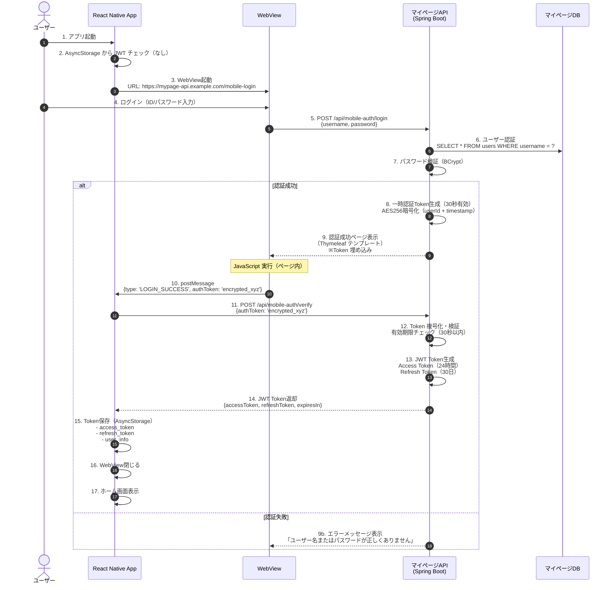
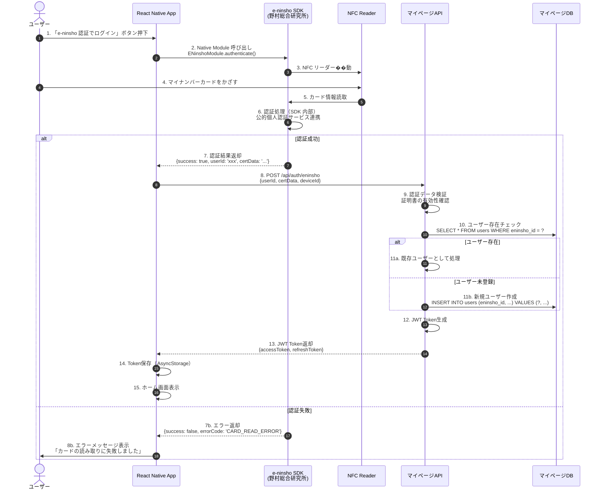
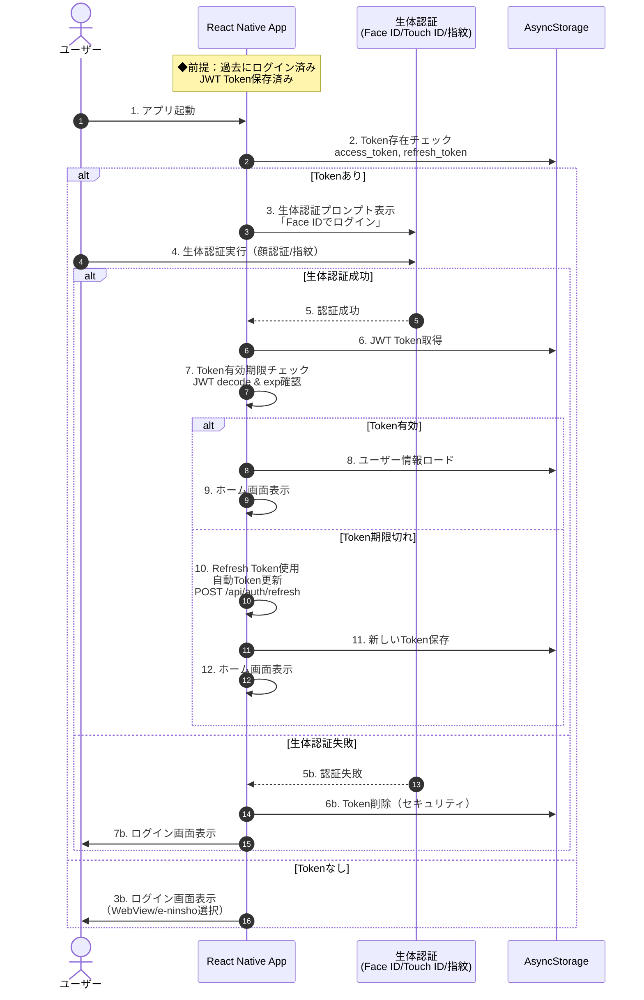
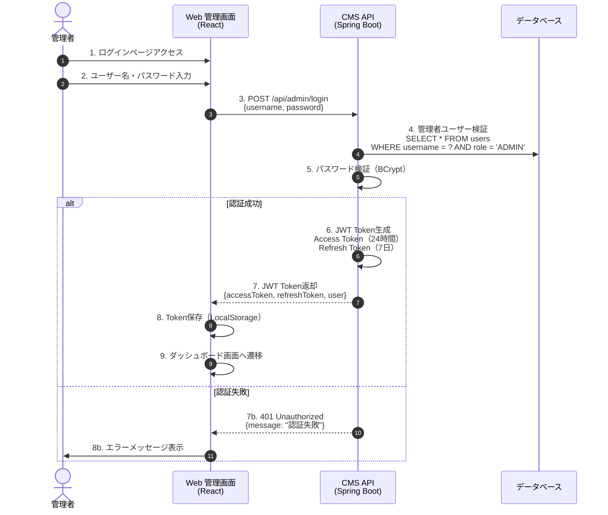
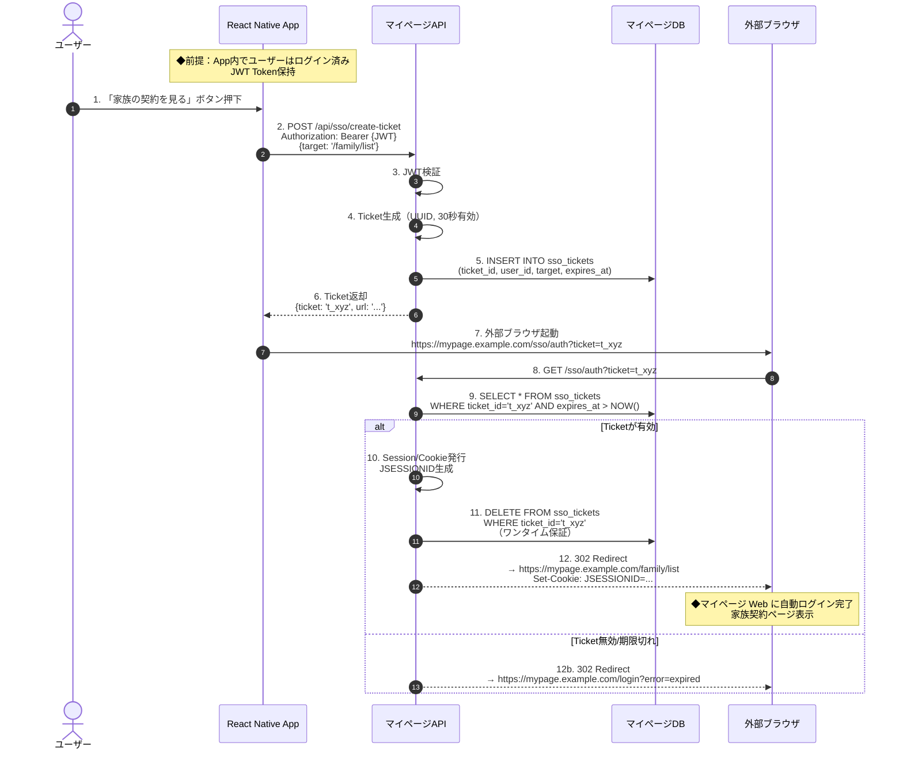

# 第 3 章：認証・セキュリティ設計

**前のファイル**: [01-system-overview.md](./01-system-overview.md)  
**次のファイル**: [03-backend-architecture.md](./03-backend-architecture.md) →

---

## 目次

- [3.1 認証フロー全体像](#31-認証フロー全体像)
- [3.2 App 認証フロー（WebView/e-ninsho/生体認証）](#32-app-認証フローwebviewe-ninsho生体認証)
- [3.3 Web 管理画面認証フロー](#33-web-管理画面認証フロー)
- [3.4 SSO 統合フロー（App → マイページ Web）](#34-sso-統合フローapp--マイページ-web)
- [3.5 JWT Token 設計](#35-jwt-token-設計)
- [3.6 セキュリティ対策](#36-セキュリティ対策)

---

## 3.1 認証フロー全体像

### 認証システム概要図

```
┌──────────────────────────────────────────────────────────────────┐
│                     認証システム全体構成                          │
└──────────────────────────────────────────────────────────────────┘

┌─────────────────────────────────────────────────────────────────┐
│                        認証方式一覧                              │
├─────────────────────────────────────────────────────────────────┤
│                                                                 │
│  [Mobile App]                         [Web 管理画面]            │
│  ────────────                         ──────────────           │
│  1. WebView ログイン                  1. JWT ログイン           │
│     - マイページ Web ログイン画面       - ユーザー名・パスワード  │
│     - Session → JWT 変換              - JWT Token 発行         │
│                                                                 │
│  2. e-ninsho 認証                     [マイページ Web]          │
│     - NFC カード読取                   ────────────────         │
│     - 公的個人認証                     1. Session/Cookie        │
│     - JWT Token 発行                   - 従来の Web 認証       │
│                                       - JSESSIONID              │
│  3. 生体認証                                                    │
│     - Face ID / Touch ID / 指紋                                 │
│     - 保存済み JWT で自動ログイン                                │
│                                                                 │
└─────────────────────────────────────────────────────────────────┘
                              │
                              │
                              ▼
┌─────────────────────────────────────────────────────────────────┐
│                      認証処理フロー                              │
├─────────────────────────────────────────────────────────────────┤
│                                                                 │
│  ┌──────────────┐                    ┌──────────────┐          │
│  │ Mobile App   │                    │ Web 管理画面  │          │
│  │ (初回ログイン)│                    │              │          │
│  └──────┬───────┘                    └──────┬───────┘          │
│         │                                    │                 │
│         │ ① 認証リクエスト                   │ ① 認証リクエスト  │
│         │    (WebView/e-ninsho)              │    (JWT)        │
│         │                                    │                 │
│         ▼                                    ▼                 │
│  ┌───────────────────────────────────────────────────────────┐ │
│  │              マイページ API / CMS API                     │ │
│  │              (Spring Boot + Spring Security)              │ │
│  ├───────────────────────────────────────────────────────────┤ │
│  │                                                           │ │
│  │  ② 認証処理                                               │ │
│  │     - ユーザー検証（DB）                                  │ │
│  │     - パスワードチェック（BCrypt）                        │ │
│  │     - e-ninsho 認証結果検証                               │ │
│  │                                                           │ │
│  │  ③ JWT Token 生成                                         │ │
│  │     - Access Token（24時間有効）                          │ │
│  │     - Refresh Token（30日有効）                           │ │
│  │     - 署名アルゴリズム: HS512                             │ │
│  │     - 秘密鍵: 環境変数から取得                            │ │
│  │                                                           │ │
│  └───────────────────────────────────────────────────────────┘ │
│         │                                    │                 │
│         │ ④ Token 返却                       │ ④ Token 返却    │
│         │                                    │                 │
│         ▼                                    ▼                 │
│  ┌──────────────┐                    ┌──────────────┐          │
│  │ Mobile App   │                    │ Web 管理画面  │          │
│  │              │                    │              │          │
│  │ ⑤ Token 保存 │                    │ ⑤ Token 保存 │          │
│  │  AsyncStorage│                    │  LocalStorage│          │
│  └──────────────┘                    └──────────────┘          │
│                                                                 │
└─────────────────────────────────────────────────────────────────┘
```

### 認証トークン構造

#### JWT Token ペイロード構造（Access Token）

```json
{
  "sub": "user123", // ユーザーID（Subject）
  "username": "yamada.taro", // ユーザー名
  "email": "yamada@example.com", // メールアドレス
  "roles": ["USER"], // ロール（["USER"] or ["ADMIN"]）
  "iat": 1707200000, // 発行時刻（Issued At - Unix Timestamp）
  "exp": 1707286400, // 有効期限（Expiration - 24時間後）
  "jti": "550e8400-e29b-41d4-a716-446655440000" // トークンID（JWT ID - UUID）
}
```

**フィールド説明**：

| フィールド | 説明                      | 必須 | 例                        |
| ---------- | ------------------------- | ---- | ------------------------- |
| `sub`      | ユーザー識別子（Subject） | ✅   | `"user123"`               |
| `username` | ユーザー名                | ✅   | `"yamada.taro"`           |
| `email`    | メールアドレス            | ❌   | `"yamada@example.com"`    |
| `roles`    | ロール配列                | ✅   | `["USER"]` or `["ADMIN"]` |
| `iat`      | 発行時刻（Issued At）     | ✅   | `1707200000`              |
| `exp`      | 有効期限（Expiration）    | ✅   | `1707286400`（24 時間後） |
| `jti`      | トークン ID（JWT ID）     | ✅   | `"550e8400-..."`          |

#### Refresh Token ペイロード構造

```json
{
  "sub": "user123", // ユーザーID
  "token_type": "refresh", // トークンタイプ識別子
  "iat": 1707200000, // 発行時刻
  "exp": 1709792000, // 有効期限（30日後）
  "jti": "660e8400-e29b-41d4-a716-446655440001" // Refresh Token ID
}
```

**Refresh Token の特徴**：

- ✅ **長期有効**（30 日間）
- ✅ **最小限の情報**（セキュリティのため）
- ✅ **一度使用したら無効化**（Token Rotation）
- ✅ **Redis に保存**（即座に無効化可能）

---

## 3.2 App 認証フロー（WebView/e-ninsho/生体認証）

### フロー 1: WebView ログイン（初回ログイン）



#### 実装コード

**マイページ API: コントローラー**

```java name=mypage-api/src/main/java/com/mypage/controller/MobileAuthController.java
package com.mypage.controller;

import com.mypage.dto.*;
import com.mypage.entity.User;
import com.mypage.service.UserService;
import com.mypage.security.JwtTokenProvider;
import com.mypage.util.AES256Cipher;
import lombok.RequiredArgsConstructor;
import lombok.extern.slf4j.Slf4j;
import org.springframework.stereotype.Controller;
import org.springframework.ui.Model;
import org.springframework.web.bind.annotation.*;
import org.springframework.http.ResponseEntity;
import org.springframework.http.HttpStatus;

/**
 * モバイル認証コントローラー
 * React Native App 専用の認証エンドポイント
 */
@Slf4j
@Controller
@RequestMapping("/api/mobile-auth")
@RequiredArgsConstructor
public class MobileAuthController {

    private final UserService userService;
    private final JwtTokenProvider jwtTokenProvider;
    private final AES256Cipher aes256Cipher;

    /**
     * モバイル専用ログインページ表示
     * WebView で表示される HTML ページを返却
     *
     * @return Thymeleaf テンプレート名
     */
    @GetMapping("/mobile-login")
    public String showMobileLoginPage() {
        return "mobile-login";  // resources/templates/mobile-login.html
    }

    /**
     * モバイルログイン処理
     * ユーザー認証成功後、一時認証Tokenを生成して成功ページへ
     *
     * @param request ログインリクエスト
     * @param model Thymeleaf モデル
     * @return テンプレート名
     */
    @PostMapping("/login")
    public String mobileLogin(@ModelAttribute LoginRequest request, Model model) {
        try {
            // 1. ユーザー認証
            User user = userService.authenticate(request.getUsername(), request.getPassword());

            if (user == null) {
                model.addAttribute("error", "ユーザー名またはパスワードが正しくありません");
                return "mobile-login";
            }

            // 2. 一時認証Token生成（30秒有効）
            String payload = user.getId() + "|" + System.currentTimeMillis();
            String encryptedToken = aes256Cipher.encrypt(payload);

            // 3. 認証成功ページへ（Token付き）
            model.addAttribute("authToken", encryptedToken);
            model.addAttribute("username", user.getUsername());

            log.info("Mobile login successful for user: {}", user.getUsername());

            return "mobile-login-success";  // 成功ページ

        } catch (Exception e) {
            log.error("Mobile login failed", e);
            model.addAttribute("error", "ログイ���処理中にエラーが発生しました");
            return "mobile-login";
        }
    }

    /**
     * 一時認証Token検証 → JWT発行
     * React Native から呼び出される API エンドポイント
     *
     * @param request Token検証リクエスト
     * @return JWT Token レスポンス
     */
    @PostMapping("/verify")
    @ResponseBody
    public ResponseEntity<?> verifyAuthToken(@RequestBody VerifyTokenRequest request) {
        try {
            // 1. Token複号化
            String decrypted = aes256Cipher.decrypt(request.getAuthToken());
            String[] parts = decrypted.split("\\|");

            if (parts.length != 2) {
                throw new IllegalArgumentException("Invalid token format");
            }

            Long userId = Long.parseLong(parts[0]);
            Long timestamp = Long.parseLong(parts[1]);

            // 2. 有効期限チェック（30秒）
            long currentTime = System.currentTimeMillis();
            if (currentTime - timestamp > 30000) {
                log.warn("Token expired for user: {}", userId);
                return ResponseEntity.status(HttpStatus.UNAUTHORIZED)
                    .body(new ErrorResponse("Token expired", "TOKEN_EXPIRED"));
            }

            // 3. ユーザー情報取得
            User user = userService.findById(userId);
            if (user == null) {
                log.error("User not found: {}", userId);
                return ResponseEntity.status(HttpStatus.UNAUTHORIZED)
                    .body(new ErrorResponse("User not found", "USER_NOT_FOUND"));
            }

            // 4. JWT Token生成（Access + Refresh）
            String accessToken = jwtTokenProvider.generateAccessToken(user.getId());
            String refreshToken = jwtTokenProvider.generateRefreshToken(user.getId());

            log.info("JWT tokens generated for user: {}", user.getUsername());

            // 5. レスポンス返却
            return ResponseEntity.ok(new JwtResponse(
                accessToken,
                refreshToken,
                86400000L,  // 24時間（ミリ秒）
                user.toDto()
            ));

        } catch (IllegalArgumentException e) {
            log.error("Invalid token format", e);
            return ResponseEntity.status(HttpStatus.BAD_REQUEST)
                .body(new ErrorResponse("Invalid token format", "INVALID_TOKEN_FORMAT"));

        } catch (Exception e) {
            log.error("Token verification failed", e);
            return ResponseEntity.status(HttpStatus.UNAUTHORIZED)
                .body(new ErrorResponse("Token verification failed", "VERIFICATION_FAILED"));
        }
    }
}
```

**DTO クラス**

```java name=mypage-api/src/main/java/com/mypage/dto/LoginRequest.java
package com.mypage.dto;

import lombok.Data;
import jakarta.validation.constraints.NotBlank;

/**
 * ログインリクエスト DTO
 */
@Data
public class LoginRequest {

    @NotBlank(message = "ユーザー名は必須です")
    private String username;

    @NotBlank(message = "パスワードは必須です")
    private String password;
}
```

```java name=mypage-api/src/main/java/com/mypage/dto/VerifyTokenRequest.java
package com.mypage.dto;

import lombok.Data;
import jakarta.validation.constraints.NotBlank;

/**
 * Token検証リクエスト DTO
 */
@Data
public class VerifyTokenRequest {

    @NotBlank(message = "認証Tokenは必須です")
    private String authToken;
}
```

```java name=mypage-api/src/main/java/com/mypage/dto/JwtResponse.java
package com.mypage.dto;

import lombok.AllArgsConstructor;
import lombok.Data;

/**
 * JWT Token レスポンス DTO
 */
@Data
@AllArgsConstructor
public class JwtResponse {

    private String accessToken;      // Access Token
    private String refreshToken;     // Refresh Token
    private Long expiresIn;          // 有効期限（ミリ秒）
    private UserDto user;            // ユーザー情報
}
```

```java name=mypage-api/src/main/java/com/mypage/dto/ErrorResponse.java
package com.mypage.dto;

import lombok.AllArgsConstructor;
import lombok.Data;

/**
 * エラーレスポンス DTO
 */
@Data
@AllArgsConstructor
public class ErrorResponse {

    private String message;          // エラーメッセージ
    private String errorCode;        // エラーコード
}
```

**AES256 暗号化 �� ーティリティ**

```java name=mypage-api/src/main/java/com/mypage/util/AES256Cipher.java
package com.mypage.util;

import org.springframework.beans.factory.annotation.Value;
import org.springframework.stereotype.Component;
import javax.crypto.Cipher;
import javax.crypto.spec.SecretKeySpec;
import java.util.Base64;
import java.nio.charset.StandardCharsets;

/**
 * AES256 暗号化・複号化ユーティリティ
 * 一時認証Tokenの暗号化に使用
 */
@Component
public class AES256Cipher {

    private static final String ALGORITHM = "AES";

    @Value("${auth.encryption.key}")
    private String encryptionKey;  // 環境変数から取得（32バイト）

    /**
     * 暗号化
     *
     * @param plainText 平文
     * @return Base64エンコードされた暗号文
     * @throws Exception 暗号化エラー
     */
    public String encrypt(String plainText) throws Exception {
        SecretKeySpec secretKey = new SecretKeySpec(
            encryptionKey.getBytes(StandardCharsets.UTF_8),
            ALGORITHM
        );

        Cipher cipher = Cipher.getInstance(ALGORITHM);
        cipher.init(Cipher.ENCRYPT_MODE, secretKey);

        byte[] encrypted = cipher.doFinal(plainText.getBytes(StandardCharsets.UTF_8));
        return Base64.getEncoder().encodeToString(encrypted);
    }

    /**
     * 複号化
     *
     * @param encryptedText Base64エンコードされた暗号文
     * @return 平文
     * @throws Exception 複号化エラー
     */
    public String decrypt(String encryptedText) throws Exception {
        SecretKeySpec secretKey = new SecretKeySpec(
            encryptionKey.getBytes(StandardCharsets.UTF_8),
            ALGORITHM
        );

        Cipher cipher = Cipher.getInstance(ALGORITHM);
        cipher.init(Cipher.DECRYPT_MODE, secretKey);

        byte[] decrypted = cipher.doFinal(Base64.getDecoder().decode(encryptedText));
        return new String(decrypted, StandardCharsets.UTF_8);
    }
}
```

**Thymeleaf テンプレート: ログイン画面**

```html name=mypage-api/src/main/resources/templates/mobile-login.html
<!DOCTYPE html>
<html xmlns:th="http://www.thymeleaf.org" lang="ja">
  <head>
    <meta charset="UTF-8" />
    <meta name="viewport" content="width=device-width, initial-scale=1.0" />
    <title>ログイン</title>
    <style>
      * {
        margin: 0;
        padding: 0;
        box-sizing: border-box;
      }

      body {
        font-family: 'Hiragino Sans', 'Yu Gothic', sans-serif;
        background: linear-gradient(135deg, #667eea 0%, #764ba2 100%);
        display: flex;
        justify-content: center;
        align-items: center;
        min-height: 100vh;
        padding: 20px;
      }

      .login-container {
        background: white;
        border-radius: 20px;
        padding: 40px;
        width: 100%;
        max-width: 400px;
        box-shadow: 0 20px 60px rgba(0, 0, 0, 0.3);
      }

      h2 {
        color: #333;
        margin-bottom: 30px;
        text-align: center;
        font-size: 28px;
      }

      .form-group {
        margin-bottom: 20px;
      }

      label {
        display: block;
        margin-bottom: 8px;
        color: #555;
        font-weight: 600;
      }

      input {
        width: 100%;
        padding: 12px 16px;
        border: 2px solid #e0e0e0;
        border-radius: 8px;
        font-size: 16px;
        transition: border-color 0.3s;
      }

      input:focus {
        outline: none;
        border-color: #667eea;
      }

      button {
        width: 100%;
        padding: 14px;
        background: linear-gradient(135deg, #667eea 0%, #764ba2 100%);
        color: white;
        border: none;
        border-radius: 8px;
        font-size: 16px;
        font-weight: 600;
        cursor: pointer;
        transition: transform 0.2s, box-shadow 0.2s;
      }

      button:hover {
        transform: translateY(-2px);
        box-shadow: 0 10px 20px rgba(102, 126, 234, 0.4);
      }

      button:active {
        transform: translateY(0);
      }

      .error-message {
        background: #fee;
        color: #c33;
        padding: 12px;
        border-radius: 8px;
        margin-bottom: 20px;
        text-align: center;
        font-size: 14px;
      }

      .footer {
        margin-top: 20px;
        text-align: center;
        color: #999;
        font-size: 12px;
      }
    </style>
  </head>
  <body>
    <div class="login-container">
      <h2>ログイン</h2>

      <!-- エラーメッセージ表示 -->
      <div th:if="${error}" class="error-message" th:text="${error}"></div>

      <form method="post" action="/api/mobile-auth/login">
        <div class="form-group">
          <label for="username">ユーザー名</label>
          <input
            type="text"
            id="username"
            name="username"
            required
            autofocus
            placeholder="ユーザー名を入力"
          />
        </div>

        <div class="form-group">
          <label for="password">パスワード</label>
          <input
            type="password"
            id="password"
            name="password"
            required
            placeholder="パスワードを入力"
          />
        </div>

        <button type="submit">ログイン</button>
      </form>

      <div class="footer">© 2025 JUXYI CMS</div>
    </div>
  </body>
</html>
```

**Thymeleaf テンプレート: 認証成功ページ**

```html name=mypage-api/src/main/resources/templates/mobile-login-success.html
<!DOCTYPE html>
<html xmlns:th="http://www.thymeleaf.org" lang="ja">
  <head>
    <meta charset="UTF-8" />
    <meta name="viewport" content="width=device-width, initial-scale=1.0" />
    <title>ログイン成功</title>
    <style>
      body {
        font-family: 'Hiragino Sans', 'Yu Gothic', sans-serif;
        display: flex;
        flex-direction: column;
        justify-content: center;
        align-items: center;
        height: 100vh;
        margin: 0;
        background: linear-gradient(135deg, #667eea 0%, #764ba2 100%);
        color: white;
      }

      .container {
        text-align: center;
        padding: 40px;
        background: rgba(255, 255, 255, 0.1);
        border-radius: 20px;
        backdrop-filter: blur(10px);
      }

      .success-icon {
        font-size: 80px;
        margin-bottom: 20px;
        animation: scaleIn 0.5s ease-out;
      }

      @keyframes scaleIn {
        from {
          transform: scale(0);
          opacity: 0;
        }
        to {
          transform: scale(1);
          opacity: 1;
        }
      }

      h2 {
        margin: 0;
        font-size: 28px;
        animation: fadeIn 0.5s ease-out 0.2s both;
      }

      p {
        margin: 20px 0 0 0;
        font-size: 16px;
        opacity: 0.9;
        animation: fadeIn 0.5s ease-out 0.4s both;
      }

      @keyframes fadeIn {
        from {
          opacity: 0;
          transform: translateY(10px);
        }
        to {
          opacity: 1;
          transform: translateY(0);
        }
      }

      .loading {
        margin-top: 30px;
        display: flex;
        justify-content: center;
        gap: 8px;
      }

      .loading span {
        width: 12px;
        height: 12px;
        background: white;
        border-radius: 50%;
        animation: bounce 1.4s infinite ease-in-out both;
      }

      .loading span:nth-child(1) {
        animation-delay: -0.32s;
      }
      .loading span:nth-child(2) {
        animation-delay: -0.16s;
      }

      @keyframes bounce {
        0%,
        80%,
        100% {
          transform: scale(0);
        }
        40% {
          transform: scale(1);
        }
      }
    </style>
  </head>
  <body>
    <div class="container">
      <div class="success-icon">✓</div>
      <h2>ログイン成功</h2>
      <p th:text="'ようこそ、' + ${username} + ' さん'"></p>
      <p>アプリに戻っています...</p>
      <div class="loading">
        <span></span>
        <span></span>
        <span></span>
      </div>
    </div>

    <script th:inline="javascript">
      /*<![CDATA[*/
      // Thymeleaf からデータを取得
      var authToken = /*[[${authToken}]]*/ '';

      // React Native WebView にメッセージ送信
      function sendMessageToApp() {
        if (window.ReactNativeWebView) {
          window.ReactNativeWebView.postMessage(
            JSON.stringify({
              type: 'LOGIN_SUCCESS',
              authToken: authToken,
            }),
          );

          console.log('Message sent to React Native');
        } else {
          // WebView がない場合（開発時のブラウザ確認用）
          console.warn('WebView not detected. Token:', authToken);
        }
      }

      // ページロード後1秒待ってからメッセージ送信
      window.addEventListener('load', function () {
        setTimeout(sendMessageToApp, 1000);
      });
      /*]]>*/
    </script>
  </body>
</html>
```

**React Native: WebView ログイン画面**

```typescript name=mobile/src/features/auth/screens/WebViewLoginScreen.tsx
import React, { useRef, useState } from 'react';
import {
  StyleSheet,
  Alert,
  SafeAreaView,
  ActivityIndicator,
  View,
} from 'react-native';
import WebView, { WebViewMessageEvent } from 'react-native-webview';
import { useNavigation } from '@react-navigation/native';
import { myPageApiClient } from '@/lib/api/axios';
import AsyncStorage from '@react-native-async-storage/async-storage';
import { useAuthStore } from '@/features/auth/stores/authStore';
import Config from 'react-native-config';

/**
 * WebView ログイン画面
 * マイページ API のログインページを WebView で表示
 * ログイン成功時に postMessage で Token を受け取る
 */
export const WebViewLoginScreen: React.FC = () => {
  const webViewRef = useRef<WebView>(null);
  const navigation = useNavigation();
  const { setUser } = useAuthStore();
  const [loading, setLoading] = useState(true);

  /**
   * WebView からのメッセージ受信処理
   * ログイン成功時に一時Token を受け取り、JWT に変換
   */
  const handleMessage = async (event: WebViewMessageEvent) => {
    try {
      const message = JSON.parse(event.nativeEvent.data);

      if (message.type === 'LOGIN_SUCCESS') {
        await handleAuthTokenVerification(message.authToken);
      }
    } catch (error) {
      console.error('Failed to parse message from WebView:', error);
      Alert.alert('エラー', 'ログイン処理中にエラーが発生しました');
    }
  };

  /**
   * 一時Token検証 → JWT取得
   */
  const handleAuthTokenVerification = async (authToken: string) => {
    try {
      // ローディング表示
      setLoading(true);

      // 1. マイページ API に一時Token を送信
      const response = await myPageApiClient.post('/api/mobile-auth/verify', {
        authToken,
      });

      const { accessToken, refreshToken, user } = response.data;

      // 2. Token を AsyncStorage に保存
      await AsyncStorage.multiSet([
        ['access_token', accessToken],
        ['refresh_token', refreshToken],
        ['user', JSON.stringify(user)],
        ['auth_method', 'webview'], // 認証方法を記録
      ]);

      // 3. Zustand ストアにユーザー情報を保存
      setUser(user);

      // 4. ホーム画面へ遷移
      navigation.reset({
        index: 0,
        routes: [{ name: 'MainTab' }],
      });

      Alert.alert('ログイン成功', `ようこそ、${user.username} さん`);
    } catch (error: any) {
      console.error('Token verification failed:', error);

      const errorMessage =
        error.response?.data?.message || 'Token検証に失敗しました';
      const errorCode = error.response?.data?.errorCode;

      // エラーコード別の処理
      switch (errorCode) {
        case 'TOKEN_EXPIRED':
          Alert.alert(
            'エラー',
            'ログインの有効期限が切れました。もう一度ログインしてください。',
          );
          break;
        case 'USER_NOT_FOUND':
          Alert.alert('エラー', 'ユーザーが見つかりません。');
          break;
        default:
          Alert.alert('ログインエラー', errorMessage);
      }
    } finally {
      setLoading(false);
    }
  };

  /**
   * WebView ロード完了時
   */
  const handleLoadEnd = () => {
    setLoading(false);
  };

  /**
   * WebView ロードエラー時
   */
  const handleError = (error: any) => {
    console.error('WebView load error:', error);
    setLoading(false);
    Alert.alert(
      'エラー',
      'ページの読み込みに失敗しました。ネットワーク接続を確認してください。',
    );
  };

  return (
    <SafeAreaView style={styles.container}>
      {loading && (
        <View style={styles.loadingContainer}>
          <ActivityIndicator size="large" color="#667eea" />
        </View>
      )}

      <WebView
        ref={webViewRef}
        source={{
          uri: `${Config.MYPAGE_API_BASE_URL}/api/mobile-auth/mobile-login`,
        }}
        onMessage={handleMessage}
        onLoadEnd={handleLoadEnd}
        onError={handleError}
        javaScriptEnabled={true}
        domStorageEnabled={true}
        startInLoadingState={true}
        style={styles.webview}
        // iOS でのバウンス効果を無効化
        bounces={false}
        // ズームを無効化
        scalesPageToFit={false}
      />
    </SafeAreaView>
  );
};

const styles = StyleSheet.create({
  container: {
    flex: 1,
    backgroundColor: '#fff',
  },
  loadingContainer: {
    position: 'absolute',
    top: 0,
    left: 0,
    right: 0,
    bottom: 0,
    justifyContent: 'center',
    alignItems: 'center',
    backgroundColor: '#fff',
    zIndex: 1000,
  },
  webview: {
    flex: 1,
  },
});
```

---

### フロー 2: e-ninsho 認証（公的個人認証）



#### e-ninsho Native Module 実装（iOS）

```objective-c name=mobile/ios/JuxyiMobile/ENinshoModule.h
// ENinshoModule.h
#import <React/RCTBridgeModule.h>

@interface ENinshoModule : NSObject <RCTBridgeModule>
@end
```

```objective-c name=mobile/ios/JuxyiMobile/ENinshoModule.m
// ENinshoModule.m
#import "ENinshoModule.h"
// 野村 e-ninsho SDK import（実際のSDK名に置き換え）
#import <ENinshoSDK/ENinshoSDK.h>

@implementation ENinshoModule

// React Native にモジュールを登録
RCT_EXPORT_MODULE();

/**
 * e-ninsho 認証実行
 * NFC カードリーダーを起動し、マイナンバーカードから認証情報を取得
 *
 * @param resolve 成功時のコールバック
 * @param reject エラー時のコールバック
 */
RCT_EXPORT_METHOD(authenticate:(RCTPromiseResolveBlock)resolve
                  rejecter:(RCTPromiseRejectBlock)reject)
{
  // メインスレッドで実行（UI操作のため）
  dispatch_async(dispatch_get_main_queue(), ^{
    // 野村 SDK 呼び出し
    [[ENinshoManager sharedManager] authenticateWithCompletion:^(ENinshoResult *result, NSError *error) {
      if (error) {
        // エラー時
        NSString *errorCode = [self getErrorCode:error];
        reject(errorCode, error.localizedDescription, error);
      } else {
        // 成功時
        NSDictionary *response = @{
          @"success": @(result.isSuccess),
          @"userId": result.userId ?: @"",
          @"certData": result.certificateData ?: @"",
          @"timestamp": @([[NSDate date] timeIntervalSince1970])
        };
        resolve(response);
      }
    }];
  });
}

/**
 * e-ninsho 利用可能チェック
 * デバイスが NFC をサポートしているか確認
 *
 * @param resolve 成功時のコールバック
 * @param reject エラー時のコールバック
 */
RCT_EXPORT_METHOD(isAvailable:(RCTPromiseResolveBlock)resolve
                  rejecter:(RCTPromiseRejectBlock)reject)
{
  BOOL available = [[ENinshoManager sharedManager] isNFCAvailable];
  resolve(@(available));
}

/**
 * エラーコード取得
 * NSError からエラーコードを抽出
 */
- (NSString *)getErrorCode:(NSError *)error {
  switch (error.code) {
    case ENinshoErrorCodeCardReadError:
      return @"CARD_READ_ERROR";
    case ENinshoErrorCodeCardNotSupported:
      return @"CARD_NOT_SUPPORTED";
    case ENinshoErrorCodeNFCDisabled:
      return @"NFC_DISABLED";
    case ENinshoErrorCodeAuthenticationFailed:
      return @"AUTHENTICATION_FAILED";
    case ENinshoErrorCodeTimeout:
      return @"TIMEOUT";
    default:
      return @"UNKNOWN_ERROR";
  }
}

@end
```

#### e-ninsho Native Module 実装（Android）

```java name=mobile/android/app/src/main/java/com/juxyi/mobile/ENinshoModule.java
package com.juxyi.mobile;

import android.app.Activity;
import com.facebook.react.bridge.ReactApplicationContext;
import com.facebook.react.bridge.ReactContextBaseJavaModule;
import com.facebook.react.bridge.ReactMethod;
import com.facebook.react.bridge.Promise;
import com.facebook.react.bridge.WritableMap;
import com.facebook.react.bridge.Arguments;

// 野村 e-ninsho SDK import（実際のSDK名に置き換え）
import jp.co.nri.eninsho.ENinshoManager;
import jp.co.nri.eninsho.ENinshoResult;
import jp.co.nri.eninsho.ENinshoError;

/**
 * e-ninsho Native Module (Android)
 * React Native から e-ninsho SDK を呼び出すためのブリッジ
 */
public class ENinshoModule extends ReactContextBaseJavaModule {

    private static final String MODULE_NAME = "ENinshoModule";
    private final ReactApplicationContext reactContext;

    public ENinshoModule(ReactApplicationContext reactContext) {
        super(reactContext);
        this.reactContext = reactContext;
    }

    @Override
    public String getName() {
        return MODULE_NAME;
    }

    /**
     * e-ninsho 認証実行
     * NFC リーダーを起動し、マイナンバーカードから認証情報を取得
     *
     * @param promise JavaScript への結果返却用 Promise
     */
    @ReactMethod
    public void authenticate(Promise promise) {
        Activity currentActivity = getCurrentActivity();

        if (currentActivity == null) {
            promise.reject("NO_ACTIVITY", "Activity not available");
            return;
        }

        try {
            ENinshoManager manager = ENinshoManager.getInstance(reactContext);

            // SDK 認証実行
            manager.authenticate(currentActivity, new ENinshoManager.Callback() {
                @Override
                public void onSuccess(ENinshoResult result) {
                    WritableMap response = Arguments.createMap();
                    response.putBoolean("success", true);
                    response.putString("userId", result.getUserId());
                    response.putString("certData", result.getCertificateData());
                    response.putDouble("timestamp", System.currentTimeMillis() / 1000.0);
                    promise.resolve(response);
                }

                @Override
                public void onError(ENinshoError error) {
                    String errorCode = getErrorCode(error);
                    promise.reject(errorCode, error.getMessage());
                }
            });
        } catch (Exception e) {
            promise.reject("ENINSHO_ERROR", e.getMessage());
        }
    }

    /**
     * e-ninsho 利用可能チェック
     * デバイスが NFC をサポートしているか確認
     *
     * @param promise JavaScript への結果返却用 Promise
     */
    @ReactMethod
    public void isAvailable(Promise promise) {
        try {
            ENinshoManager manager = ENinshoManager.getInstance(reactContext);
            boolean available = manager.isNFCAvailable();
            promise.resolve(available);
        } catch (Exception e) {
            promise.reject("ENINSHO_ERROR", e.getMessage());
        }
    }

    /**
     * エラーコード取得
     * ENinshoError からエラーコードを抽出
     */
    private String getErrorCode(ENinshoError error) {
        switch (error.getErrorCode()) {
            case ENinshoError.CARD_READ_ERROR:
                return "CARD_READ_ERROR";
            case ENinshoError.CARD_NOT_SUPPORTED:
                return "CARD_NOT_SUPPORTED";
            case ENinshoError.NFC_DISABLED:
                return "NFC_DISABLED";
            case ENinshoError.AUTHENTICATION_FAILED:
                return "AUTHENTICATION_FAILED";
            case ENinshoError.TIMEOUT:
                return "TIMEOUT";
            default:
                return "UNKNOWN_ERROR";
        }
    }
}
```

**React Native Package 登録（Android）**

```java name=mobile/android/app/src/main/java/com/juxyi/mobile/ENinshoPackage.java
package com.juxyi.mobile;

import com.facebook.react.ReactPackage;
import com.facebook.react.bridge.NativeModule;
import com.facebook.react.bridge.ReactApplicationContext;
import com.facebook.react.uimanager.ViewManager;

import java.util.ArrayList;
import java.util.Collections;
import java.util.List;

/**
 * e-ninsho Package
 * Native Module を React Native に登録
 */
public class ENinshoPackage implements ReactPackage {

    @Override
    public List<ViewManager> createViewManagers(ReactApplicationContext reactContext) {
        return Collections.emptyList();
    }

    @Override
    public List<NativeModule> createNativeModules(ReactApplicationContext reactContext) {
        List<NativeModule> modules = new ArrayList<>();
        modules.add(new ENinshoModule(reactContext));
        return modules;
    }
}
```

```java name=mobile/android/app/src/main/java/com/juxyi/mobile/MainApplication.java
package com.juxyi.mobile;

import android.app.Application;
import com.facebook.react.PackageList;
import com.facebook.react.ReactApplication;
import com.facebook.react.ReactNativeHost;
import com.facebook.react.ReactPackage;
import com.facebook.react.defaults.DefaultNewArchitectureEntryPoint;
import com.facebook.react.defaults.DefaultReactNativeHost;
import com.facebook.soloader.SoLoader;
import java.util.List;

public class MainApplication extends Application implements ReactApplication {

  private final ReactNativeHost mReactNativeHost =
      new DefaultReactNativeHost(this) {
        @Override
        public boolean getUseDeveloperSupport() {
          return BuildConfig.DEBUG;
        }

        @Override
        protected List<ReactPackage> getPackages() {
          @SuppressWarnings("UnnecessaryLocalVariable")
          List<ReactPackage> packages = new PackageList(this).getPackages();
          // ★ e-ninsho Package を追加
          packages.add(new ENinshoPackage());
          return packages;
        }

        @Override
        protected String getJSMainModuleName() {
          return "index";
        }

        @Override
        protected boolean isNewArchEnabled() {
          return BuildConfig.IS_NEW_ARCHITECTURE_ENABLED;
        }

        @Override
        protected Boolean isHermesEnabled() {
          return BuildConfig.IS_HERMES_ENABLED;
        }
      };

  @Override
  public ReactNativeHost getReactNativeHost() {
    return mReactNativeHost;
  }

  @Override
  public void onCreate() {
    super.onCreate();
    SoLoader.init(this, /* native exopackage */ false);
    if (BuildConfig.IS_NEW_ARCHITECTURE_ENABLED) {
      DefaultNewArchitectureEntryPoint.load();
    }
  }
}
```

（前の内容に続く...）

#### React Native: e-ninsho サービスラッパー

```typescript name=mobile/src/features/auth/services/eninshoService.ts
import { NativeModules, Platform } from 'react-native';

const { ENinshoModule } = NativeModules;

/**
 * e-ninsho 認証結果
 */
export interface ENinshoResult {
  success: boolean; // 認証成功フラグ
  userId: string; // ユーザーID（マイナンバー基盤の識別子）
  certData: string; // 証明書データ（Base64エンコード）
  timestamp: number; // タイムスタンプ（Unix時刻）
}

/**
 * e-ninsho SDK ラッパーサービス
 * Native Module 経由で野村 SDK を呼び出す
 */
export const eninshoService = {
  /**
   * e-ninsho 認証実行
   * - NFC リーダー起動
   * - マイナンバーカード読取
   * - 公的個人認証
   *
   * @returns Promise<ENinshoResult> 認証結果
   * @throws Error 認証失敗時
   */
  authenticate: async (): Promise<ENinshoResult> => {
    if (!ENinshoModule) {
      throw new Error('ENinsho module is not available');
    }

    try {
      const result = await ENinshoModule.authenticate();
      return result;
    } catch (error: any) {
      // エラーコード別のメッセージ変換
      const errorMessage = getErrorMessage(error.code || 'UNKNOWN_ERROR');
      throw new Error(errorMessage);
    }
  },

  /**
   * e-ninsho 利用可能チェック
   * デバイスが NFC をサポートし、SDK が利用可能か確認
   *
   * @returns Promise<boolean> 利用可能フラグ
   */
  isAvailable: async (): Promise<boolean> => {
    if (!ENinshoModule) {
      return false;
    }

    // iOS/Android のみサポート
    if (Platform.OS !== 'ios' && Platform.OS !== 'android') {
      return false;
    }

    try {
      const available = await ENinshoModule.isAvailable();
      return available;
    } catch {
      return false;
    }
  },
};

/**
 * エラーコードからユーザー向けメッセージに変換
 */
function getErrorMessage(errorCode: string): string {
  const messages: Record<string, string> = {
    CARD_READ_ERROR:
      'カードの読み取りに失敗しました。もう一度カードをかざしてください。',
    CARD_NOT_SUPPORTED:
      '対応していないカードです。マイナンバーカードを使用してください。',
    NFC_DISABLED: 'NFC機能が無効になっています。設定から有効にしてください。',
    AUTHENTICATION_FAILED:
      '認証に失敗しました。カードの暗証番号を確認してください。',
    TIMEOUT: 'タイムアウトしました。もう一度お試しください。',
    NO_ACTIVITY: 'アプリの起動に失敗しました。もう一度お試しください。',
    UNKNOWN_ERROR: 'e-ninsho認証中にエラーが発生しました。',
  };

  return messages[errorCode] || messages['UNKNOWN_ERROR'];
}
```

#### React Native: e-ninsho 認証フック

```typescript name=mobile/src/features/auth/hooks/useENinshoAuth.ts
import { useState } from 'react';
import { Alert, Platform } from 'react-native';
import { useNavigation } from '@react-navigation/native';
import AsyncStorage from '@react-native-async-storage/async-storage';
import { eninshoService } from '../services/eninshoService';
import { myPageApiClient } from '@/lib/api/axios';
import { useAuthStore } from '../stores/authStore';
import DeviceInfo from 'react-native-device-info';

/**
 * e-ninsho 認証フック
 * NFC カード読取 → バックエンド認証 → JWT取得
 */
export const useENinshoAuth = () => {
  const [isAuthenticating, setIsAuthenticating] = useState(false);
  const navigation = useNavigation();
  const { setUser } = useAuthStore();

  /**
   * e-ninsho 認証実行
   */
  const authenticate = async () => {
    // 1. 利用可能チェック
    const available = await eninshoService.isAvailable();
    if (!available) {
      Alert.alert(
        'e-ninsho 未対応',
        'お使いのデバイスはe-ninsho認証に対応していません。\n\n対応条件：\n- iOS 13以降またはAndroid 8.0以降\n- NFC機能搭載',
      );
      return;
    }

    setIsAuthenticating(true);

    try {
      // 2. NFC カード読取 + 認証
      Alert.alert(
        'カード読取',
        'マイナンバーカードを端末の背面にかざしてください。',
        [{ text: 'OK' }],
      );

      const result = await eninshoService.authenticate();

      if (!result.success) {
        throw new Error('e-ninsho authentication failed');
      }

      // 3. バックエンド API に認証結果を送信
      const deviceId = await DeviceInfo.getUniqueId();
      const response = await myPageApiClient.post('/api/auth/eninsho', {
        userId: result.userId,
        certData: result.certData,
        deviceId,
        platform: Platform.OS,
        timestamp: result.timestamp,
      });

      const { accessToken, refreshToken, user } = response.data;

      // 4. Token 保存
      await AsyncStorage.multiSet([
        ['access_token', accessToken],
        ['refresh_token', refreshToken],
        ['user', JSON.stringify(user)],
        ['auth_method', 'eninsho'], // 認証方法を記録
      ]);

      // 5. ユーザー情報をストアに保存
      setUser(user);

      // 6. ホーム画��へ遷移
      navigation.reset({
        index: 0,
        routes: [{ name: 'MainTab' }],
      });

      Alert.alert('ログイン成功', `ようこそ、${user.username} さん`);
    } catch (error: any) {
      console.error('e-ninsho authentication failed:', error);

      const errorMessage = error.response?.data?.message || error.message;
      Alert.alert('認証エラー', errorMessage);
    } finally {
      setIsAuthenticating(false);
    }
  };

  return {
    authenticate,
    isAuthenticating,
  };
};
```

#### マイページ API: e-ninsho 認証エンドポイント

```java name=mypage-api/src/main/java/com/mypage/controller/AuthController.java
package com.mypage.controller;

import com.mypage.dto.ENinshoAuthRequest;
import com.mypage.dto.JwtResponse;
import com.mypage.service.ENinshoService;
import com.mypage.service.UserService;
import com.mypage.security.JwtTokenProvider;
import com.mypage.entity.User;
import lombok.RequiredArgsConstructor;
import lombok.extern.slf4j.Slf4j;
import org.springframework.http.ResponseEntity;
import org.springframework.http.HttpStatus;
import org.springframework.web.bind.annotation.*;

/**
 * 認証コントローラー
 */
@Slf4j
@RestController
@RequestMapping("/api/auth")
@RequiredArgsConstructor
public class AuthController {

    private final ENinshoService eninshoService;
    private final UserService userService;
    private final JwtTokenProvider jwtTokenProvider;

    /**
     * e-ninsho 認証
     * モバイルアプリから e-ninsho SDK の認証結果を受け取り、JWT を発行
     *
     * @param request e-ninsho 認証リクエスト
     * @return JWT Token レスポンス
     */
    @PostMapping("/eninsho")
    public ResponseEntity<?> authenticateWithENinsho(@RequestBody ENinshoAuthRequest request) {

        try {
            // 1. e-ninsho 認証データ検証
            boolean isValid = eninshoService.verifyCertificate(
                request.getUserId(),
                request.getCertData(),
                request.getTimestamp()
            );

            if (!isValid) {
                log.warn("Invalid e-ninsho certificate for user: {}", request.getUserId());
                return ResponseEntity.status(HttpStatus.UNAUTHORIZED)
                    .body(new ErrorResponse("Invalid e-ninsho certificate", "INVALID_CERTIFICATE"));
            }

            // 2. ユーザー存在チェック（e-ninsho ID で検索）
            User user = userService.findByENinshoId(request.getUserId());

            if (user == null) {
                // 3. 新規ユーザー作成（初回認証時）
                user = userService.createFromENinsho(request.getUserId());
                log.info("New user created from e-ninsho: {}, userId: {}", request.getUserId(), user.getId());
            } else {
                log.info("Existing user authenticated via e-ninsho: {}", user.getUsername());
            }

            // 4. JWT Token 生成
            String accessToken = jwtTokenProvider.generateAccessToken(user.getId());
            String refreshToken = jwtTokenProvider.generateRefreshToken(user.getId());

            // 5. デバイス情報を記録（プッシュ通知用）
            if (request.getDeviceId() != null) {
                userService.recordDeviceInfo(
                    user.getId(),
                    request.getDeviceId(),
                    request.getPlatform()
                );
            }

            return ResponseEntity.ok(new JwtResponse(
                accessToken,
                refreshToken,
                86400000L,  // 24時間
                user.toDto()
            ));

        } catch (Exception e) {
            log.error("e-ninsho authentication failed", e);
            return ResponseEntity.status(HttpStatus.INTERNAL_SERVER_ERROR)
                .body(new ErrorResponse("Authentication failed", "AUTHENTICATION_FAILED"));
        }
    }
}
```

```java name=mypage-api/src/main/java/com/mypage/dto/ENinshoAuthRequest.java
package com.mypage.dto;

import lombok.Data;
import jakarta.validation.constraints.NotBlank;
import jakarta.validation.constraints.NotNull;

/**
 * e-ninsho 認証リクエスト DTO
 */
@Data
public class ENinshoAuthRequest {

    @NotBlank(message = "ユーザーIDは必須です")
    private String userId;           // e-ninsho ユーザーID

    @NotBlank(message = "証明書データは必須です")
    private String certData;         // 証明書データ（Base64）

    @NotNull(message = "タイムスタンプは必須です")
    private Long timestamp;          // 認証時刻（Unix Timestamp）

    private String deviceId;         // デバイスID（オプション）
    private String platform;         // プラットフォーム（ios/android）
}
```

```java name=mypage-api/src/main/java/com/mypage/service/ENinshoService.java
package com.mypage.service;

import lombok.extern.slf4j.Slf4j;
import org.springframework.stereotype.Service;
import java.security.cert.X509Certificate;
import java.security.cert.CertificateFactory;
import java.io.ByteArrayInputStream;
import java.util.Base64;
import java.util.Date;

/**
 * e-ninsho 認証サービス
 * 野村 SDK から受け取った認証データの検証を行う
 */
@Slf4j
@Service
public class ENinshoService {

    // タイムスタンプの許容誤差（5分）
    private static final long TIMESTAMP_TOLERANCE = 5 * 60 * 1000;

    /**
     * e-ninsho 証明書検証
     *
     * @param userId e-ninsho ユーザーID
     * @param certData 証明書データ（Base64エンコード）
     * @param timestamp 認証時刻（Unix Timestamp - ミリ秒）
     * @return 検証結果（true: 有効、false: 無効）
     */
    public boolean verifyCertificate(String userId, String certData, Long timestamp) {
        try {
            // 1. タイムスタンプ検証（リプレイ攻撃防止）
            long currentTime = System.currentTimeMillis();
            long timeDiff = Math.abs(currentTime - timestamp);

            if (timeDiff > TIMESTAMP_TOLERANCE) {
                log.warn("Timestamp out of tolerance: {} ms, userId: {}", timeDiff, userId);
                return false;
            }

            // 2. Base64デコード
            byte[] certBytes = Base64.getDecoder().decode(certData);

            // 3. X.509証明書パース
            CertificateFactory cf = CertificateFactory.getInstance("X.509");
            X509Certificate cert = (X509Certificate) cf.generateCertificate(
                new ByteArrayInputStream(certBytes)
            );

            // 4. 証明書の有効期限チェック
            cert.checkValidity(new Date());

            // 5. 証明書の発行者確認（公的個人認証サービス認証局）
            String issuer = cert.getIssuerDN().getName();
            if (!issuer.contains("JPKI")) {
                log.warn("Invalid certificate issuer: {}, userId: {}", issuer, userId);
                return false;
            }

            // 6. ユーザーID と証明書のサブジェクトが一致するか確認
            String subject = cert.getSubjectDN().getName();
            // ※実際の検証ロジックは e-ninsho SDK の仕様に従う
            // 例: CN=<userId> の形式でユーザーIDが含まれているか確認

            log.info("e-ninsho certificate verified successfully for user: {}", userId);
            return true;

        } catch (Exception e) {
            log.error("Failed to verify e-ninsho certificate for user: {}", userId, e);
            return false;
        }
    }
}
```

---

### フロー 3: 生体認証（クイックログイン）



#### React Native: 生体認証フック

```typescript name=mobile/src/features/auth/hooks/useBiometricAuth.ts
import { useState, useEffect } from 'react';
import { Alert, Platform } from 'react-native';
import ReactNativeBiometrics, { BiometryTypes } from 'react-native-biometrics';
import AsyncStorage from '@react-native-async-storage/async-storage';
import { useNavigation } from '@react-navigation/native';
import { useAuthStore } from '../stores/authStore';
import { myPageApiClient } from '@/lib/api/axios';
import jwtDecode from 'jwt-decode';

/**
 * 生体認証フック
 * Face ID / Touch ID / 指紋認証による自動ログイン
 */
export const useBiometricAuth = () => {
  const [isBiometricAvailable, setIsBiometricAvailable] = useState(false);
  const [biometricType, setBiometricType] = useState<BiometryTypes | null>(
    null,
  );
  const [isAuthenticating, setIsAuthenticating] = useState(false);
  const navigation = useNavigation();
  const { setUser, logout } = useAuthStore();

  /**
   * 生体認証利用可能チェック
   */
  useEffect(() => {
    checkBiometricAvailability();
  }, []);

  const checkBiometricAvailability = async () => {
    try {
      const rnBiometrics = new ReactNativeBiometrics();
      const { available, biometryType } =
        await rnBiometrics.isSensorAvailable();

      setIsBiometricAvailable(available);
      setBiometricType(biometryType);

      console.log('Biometric availability:', { available, biometryType });
    } catch (error) {
      console.error('Failed to check biometric availability:', error);
    }
  };

  /**
   * 生体認証プロンプト表示名取得
   */
  const getBiometricPromptMessage = (): string => {
    switch (biometricType) {
      case BiometryTypes.FaceID:
        return 'Face IDでログイン';
      case BiometryTypes.TouchID:
        return 'Touch IDでログイン';
      case BiometryTypes.Biometrics:
        return '指紋認証でログイン';
      default:
        return '生体認証でログイン';
    }
  };

  /**
   * 生体認証実行 + 自動ログイン
   */
  const authenticate = async (): Promise<boolean> => {
    if (!isBiometricAvailable) {
      Alert.alert(
        '生体認証未対応',
        'お使いのデバイスは生体認証に対応していません。',
      );
      return false;
    }

    setIsAuthenticating(true);

    try {
      // 1. Token存在チェック
      const accessToken = await AsyncStorage.getItem('access_token');
      const refreshToken = await AsyncStorage.getItem('refresh_token');

      if (!accessToken || !refreshToken) {
        // Token がない場合、ログイン画面へ
        console.log('No tokens found, redirecting to login');
        navigation.navigate('Login');
        return false;
      }

      // 2. 生体認証プロンプト表示
      const rnBiometrics = new ReactNativeBiometrics();
      const { success } = await rnBiometrics.simplePrompt({
        promptMessage: getBiometricPromptMessage(),
        cancelButtonText: 'キャンセル',
      });

      if (!success) {
        console.log('Biometric authentication cancelled or failed');

        // 生体認証失敗時、Token削除（セキュリティ対策）
        await AsyncStorage.multiRemove([
          'access_token',
          'refresh_token',
          'user',
        ]);
        logout();

        Alert.alert(
          '認証失敗',
          '生体認証に失敗しました。もう一度ログインしてください。',
        );
        return false;
      }

      // 3. Token有効期限チェック
      const decoded: any = jwtDecode(accessToken);
      const currentTime = Date.now() / 1000;

      if (decoded.exp > currentTime) {
        // Token有効 → そのまま使用
        const userJson = await AsyncStorage.getItem('user');
        if (userJson) {
          const user = JSON.parse(userJson);
          setUser(user);
          console.log('Biometric login successful with valid token');
          return true;
        }
      } else {
        // Token期限切れ → Refresh Token で更新
        console.log('Access token expired, refreshing...');
        await refreshAccessToken(refreshToken);
        return true;
      }
    } catch (error: any) {
      console.error('Biometric authentication failed:', error);

      // エラー時は Token 削除
      await AsyncStorage.multiRemove(['access_token', 'refresh_token', 'user']);
      logout();

      Alert.alert(
        '認証エラー',
        '認証に失敗しました。再度ログインしてください。',
      );
      return false;
    } finally {
      setIsAuthenticating(false);
    }
  };

  /**
   * Refresh Token で Access Token 更新
   */
  const refreshAccessToken = async (refreshToken: string) => {
    try {
      const response = await myPageApiClient.post('/api/auth/refresh', {
        refreshToken,
      });

      const {
        accessToken: newAccessToken,
        refreshToken: newRefreshToken,
        user,
      } = response.data;

      // 新しい Token 保存
      await AsyncStorage.multiSet([
        ['access_token', newAccessToken],
        ['refresh_token', newRefreshToken],
        ['user', JSON.stringify(user)],
      ]);

      setUser(user);
      console.log('Token refreshed successfully');
    } catch (error) {
      console.error('Failed to refresh token:', error);
      throw new Error('Failed to refresh token');
    }
  };

  return {
    isBiometricAvailable,
    biometricType,
    isAuthenticating,
    authenticate,
  };
};
```

#### React Native: App 起動時の処理

```typescript name=mobile/src/App.tsx
import React, { useEffect, useState } from 'react';
import { ActivityIndicator, View, StyleSheet, Text } from 'react-native';
import { NavigationContainer } from '@react-navigation/native';
import { QueryClientProvider } from '@tanstack/react-query';
import { PaperProvider } from 'react-native-paper';
import { RootNavigator } from './navigation/RootNavigator';
import { useBiometricAuth } from './features/auth/hooks/useBiometricAuth';
import { useAuthStore } from './features/auth/stores/authStore';
import { queryClient } from './lib/api/queryClient';
import { theme } from './theme';

/**
 * App ルートコンポーネント
 * 起動時に生体認証を試行
 */
export const App: React.FC = () => {
  const [isReady, setIsReady] = useState(false);
  const { isBiometricAvailable, authenticate } = useBiometricAuth();
  const { isAuthenticated } = useAuthStore();

  /**
   * App起動時の初期化処理
   */
  useEffect(() => {
    initializeApp();
  }, []);

  const initializeApp = async () => {
    try {
      console.log('Initializing app...');

      // 1. 生体認証が利用可能で、過去にログイン済みなら自動ログイン試行
      if (isBiometricAvailable && !isAuthenticated) {
        console.log('Attempting biometric authentication...');
        await authenticate();
      }
    } catch (error) {
      console.error('Failed to initialize app:', error);
    } finally {
      setIsReady(true);
    }
  };

  if (!isReady) {
    return (
      <View style={styles.loadingContainer}>
        <ActivityIndicator size="large" color="#667eea" />
        <Text style={styles.loadingText}>読み込み中...</Text>
      </View>
    );
  }

  return (
    <QueryClientProvider client={queryClient}>
      <PaperProvider theme={theme}>
        <NavigationContainer>
          <RootNavigator />
        </NavigationContainer>
      </PaperProvider>
    </QueryClientProvider>
  );
};

const styles = StyleSheet.create({
  loadingContainer: {
    flex: 1,
    justifyContent: 'center',
    alignItems: 'center',
    backgroundColor: '#fff',
  },
  loadingText: {
    marginTop: 16,
    fontSize: 16,
    color: '#666',
  },
});
```

---

## 3.3 Web 管理画面認証フロー

### Web 管理画面ログイン



#### React Web: ログイン画面

```typescript name=frontend/src/features/auth/pages/LoginPage.tsx
import React from 'react';
import { Form, Input, Button, Card, Alert, Typography } from 'antd';
import { UserOutlined, LockOutlined } from '@ant-design/icons';
import { useNavigate } from 'react-router-dom';
import { useLogin } from '../hooks/useLogin';
import styles from './LoginPage.module.css';

const { Title } = Typography;

interface LoginForm {
  username: string;
  password: string;
}

/**
 * ログインページ
 * 管理者向けログイン画面
 */
export const LoginPage: React.FC = () => {
  const navigate = useNavigate();
  const { mutate: login, isPending, error } = useLogin();

  const handleSubmit = (values: LoginForm) => {
    login(values, {
      onSuccess: () => {
        navigate('/dashboard');
      },
    });
  };

  return (
    <div className={styles.container}>
      <Card className={styles.loginCard}>
        <div className={styles.header}>
          <Title level={2}>CMS 管理画面</Title>
          <p>管理者ログイン</p>
        </div>

        {error && (
          <Alert
            message="ログインエラー"
            description={
              error.message || 'ユーザー名またはパスワードが正しくありません'
            }
            type="error"
            showIcon
            closable
            style={{ marginBottom: 24 }}
          />
        )}

        <Form
          name="login"
          onFinish={handleSubmit}
          autoComplete="off"
          layout="vertical"
          size="large"
        >
          <Form.Item
            name="username"
            rules={[
              { required: true, message: 'ユーザー名を入力してください' },
            ]}
          >
            <Input
              prefix={<UserOutlined />}
              placeholder="ユーザー名"
              autoFocus
            />
          </Form.Item>

          <Form.Item
            name="password"
            rules={[
              { required: true, message: 'パスワードを入力してください' },
            ]}
          >
            <Input.Password
              prefix={<LockOutlined />}
              placeholder="パスワード"
            />
          </Form.Item>

          <Form.Item>
            <Button type="primary" htmlType="submit" loading={isPending} block>
              ログイン
            </Button>
          </Form.Item>
        </Form>

        <div className={styles.footer}>© 2025 JUXYI CMS</div>
      </Card>
    </div>
  );
};
```

```css name=frontend/src/features/auth/pages/LoginPage.module.css
.container {
  display: flex;
  justify-content: center;
  align-items: center;
  min-height: 100vh;
  background: linear-gradient(135deg, #667eea 0%, #764ba2 100%);
}

.loginCard {
  width: 100%;
  max-width: 400px;
  box-shadow: 0 20px 60px rgba(0, 0, 0, 0.3);
  border-radius: 16px;
}

.header {
  text-align: center;
  margin-bottom: 32px;
}

.header h2 {
  margin-bottom: 8px;
  color: #333;
}

.header p {
  color: #666;
  font-size: 14px;
}

.footer {
  margin-top: 24px;
  text-align: center;
  color: #999;
  font-size: 12px;
}
```

#### React Web: ログインフック

```typescript name=frontend/src/features/auth/hooks/useLogin.ts
import { useMutation } from '@tanstack/react-query';
import { useNavigate } from 'react-router-dom';
import { authService } from '../services/authService';
import { useAuthStore } from '../stores/authStore';

interface LoginRequest {
  username: string;
  password: string;
}

/**
 * ログインフック
 * TanStack Query を使用した認証処理
 */
export const useLogin = () => {
  const { setUser } = useAuthStore();

  return useMutation({
    mutationFn: (data: LoginRequest) => authService.login(data),
    onSuccess: response => {
      // 1. Token を LocalStorage に保存
      localStorage.setItem('access_token', response.accessToken);
      localStorage.setItem('refresh_token', response.refreshToken);

      // 2. ユーザー情報を��トアに保存
      setUser(response.user);

      console.log('Login successful:', response.user.username);
    },
    onError: (error: any) => {
      console.error('Login failed:', error);
    },
  });
};
```

#### React Web: 認証サービス

```typescript name=frontend/src/features/auth/services/authService.ts
import { apiClient } from '@/lib/api/axios';

interface LoginRequest {
  username: string;
  password: string;
}

interface LoginResponse {
  accessToken: string;
  refreshToken: string;
  expiresIn: number;
  user: {
    id: number;
    username: string;
    email: string;
    role: string;
  };
}

/**
 * 認証 API サービス
 * CMS API とのすべての認証通信を担当
 */
export const authService = {
  /**
   * ログイン
   */
  login: async (data: LoginRequest): Promise<LoginResponse> => {
    const response = await apiClient.post('/api/admin/login', data);
    return response.data;
  },

  /**
   * ログアウト
   */
  logout: async (): Promise<void> => {
    // Token をローカルから削除
    localStorage.removeItem('access_token');
    localStorage.removeItem('refresh_token');
  },

  /**
   * Token リフレッシュ
   */
  refresh: async (refreshToken: string): Promise<LoginResponse> => {
    const response = await apiClient.post('/api/auth/refresh', {
      refreshToken,
    });
    return response.data;
  },
};
```

#### CMS API: 管理者ログインエンドポイント

```java name=backend/cms-api/src/main/java/com/juxyi/cms/controller/AdminAuthController.java
package com.juxyi.cms.controller;

import com.juxyi.cms.dto.LoginRequest;
import com.juxyi.cms.dto.JwtResponse;
import com.juxyi.cms.dto.ErrorResponse;
import com.juxyi.cms.entity.User;
import com.juxyi.cms.service.UserService;
import com.juxyi.cms.security.JwtTokenProvider;
import lombok.RequiredArgsConstructor;
import lombok.extern.slf4j.Slf4j;
import org.springframework.http.ResponseEntity;
import org.springframework.http.HttpStatus;
import org.springframework.security.crypto.password.PasswordEncoder;
import org.springframework.web.bind.annotation.*;
import jakarta.validation.Valid;

/**
 * 管理者認証コントローラー
 * Web 管理画面からのログイン処理
 */
@Slf4j
@RestController
@RequestMapping("/api/admin")
@RequiredArgsConstructor
public class AdminAuthController {

    private final UserService userService;
    private final JwtTokenProvider jwtTokenProvider;
    private final PasswordEncoder passwordEncoder;

    /**
     * 管理者ログイン
     *
     * @param request ログインリクエスト
     * @return JWT Token レスポンス
     */
    @PostMapping("/login")
    public ResponseEntity<?> login(@Valid @RequestBody LoginRequest request) {
        try {
            // 1. ユーザー検索（管理者権限チェック）
            User user = userService.findByUsername(request.getUsername());

            if (user == null) {
                log.warn("Login attempt with non-existent username: {}", request.getUsername());
                return ResponseEntity.status(HttpStatus.UNAUTHORIZED)
                    .body(new ErrorResponse("ユーザー名またはパスワードが正しくありません", "INVALID_CREDENTIALS"));
            }

            // 2. 管理者権限チェック
            if (!"ADMIN".equals(user.getRole())) {
                log.warn("Login attempt by non-admin user: {}", request.getUsername());
                return ResponseEntity.status(HttpStatus.FORBIDDEN)
                    .body(new ErrorResponse("管理者権限がありません", "INSUFFICIENT_PERMISSIONS"));
            }

            // 3. パスワード検証
            if (!passwordEncoder.matches(request.getPassword(), user.getPassword())) {
                log.warn("Failed login attempt for user: {}", request.getUsername());
                return ResponseEntity.status(HttpStatus.UNAUTHORIZED)
                    .body(new ErrorResponse("ユーザー名またはパスワードが正しくありません", "INVALID_CREDENTIALS"));
            }

            // 4. JWT Token 生成（Web 管理画面用は7日間）
            String accessToken = jwtTokenProvider.generateAccessToken(user.getId());
            String refreshToken = jwtTokenProvider.generateRefreshToken(user.getId(), 7); // 7日間

            log.info("Admin login successful: {}", user.getUsername());

            return ResponseEntity.ok(new JwtResponse(
                accessToken,
                refreshToken,
                86400000L,  // 24時間（Access Token）
                user.toDto()
            ));

        } catch (Exception e) {
            log.error("Login failed", e);
            return ResponseEntity.status(HttpStatus.INTERNAL_SERVER_ERROR)
                .body(new ErrorResponse("ログイン処理中にエラーが発生しました", "INTERNAL_ERROR"));
        }
    }
}
```

---

## 3.4 SSO 統合フロー（App → マイページ Web）

### SSO フロー



#### マイページ API: SSO チケット生成

```java name=mypage-api/src/main/java/com/mypage/controller/SsoController.java
package com.mypage.controller;

import com.mypage.dto.SsoTicketRequest;
import com.mypage.dto.SsoTicketResponse;
import com.mypage.dto.ErrorResponse;
import com.mypage.entity.SsoTicket;
import com.mypage.service.SsoTicketService;
import com.mypage.security.JwtTokenProvider;
import lombok.RequiredArgsConstructor;
import lombok.extern.slf4j.Slf4j;
import org.springframework.http.ResponseEntity;
import org.springframework.http.HttpStatus;
import org.springframework.security.core.Authentication;
import org.springframework.web.bind.annotation.*;
import org.springframework.beans.factory.annotation.Value;
import jakarta.servlet.http.HttpServletResponse;
import jakarta.servlet.http.HttpSession;
import java.io.IOException;
import java.util.UUID;

/**
 * SSO コントローラー
 * モバイルアプリからマイページWebへのシングルサインオン
 */
@Slf4j
@RestController
@RequestMapping("/api/sso")
@RequiredArgsConstructor
public class SsoController {

    private final SsoTicketService ssoTicketService;
    private final JwtTokenProvider jwtTokenProvider;

    @Value("${mypage.web.base-url}")
    private String mypageWebBaseUrl;

    /**
     * SSO Ticket 生成
     * モバイルアプリから呼び出され、ワンタイムTicketを生成
     *
     * @param request Ticket生成リクエスト
     * @param authentication 認証情報（JWT から取得）
     * @return Ticket レスポンス
     */
    @PostMapping("/create-ticket")
    public ResponseEntity<?> createTicket(
            @RequestBody SsoTicketRequest request,
            Authentication authentication) {

        try {
            // 1. ユーザーID取得（JWT から）
            Long userId = Long.parseLong(authentication.getName());

            // 2. Ticket生成（UUID）
            String ticketId = UUID.randomUUID().toString();

            // 3. Ticketをデータベースに保存（30秒有効）
            SsoTicket ticket = ssoTicketService.createTicket(
                ticketId,
                userId,
                request.getTarget()
            );

            // 4. SSO URL生成
            String ssoUrl = String.format(
                "%s/sso/auth?ticket=%s",
                mypageWebBaseUrl,
                ticketId
            );

            log.info("SSO ticket created for user: {}, ticket: {}", userId, ticketId);

            return ResponseEntity.ok(new SsoTicketResponse(
                ticketId,
                ssoUrl,
                ticket.getExpiresAt()
            ));

        } catch (Exception e) {
            log.error("Failed to create SSO ticket", e);
            return ResponseEntity.status(HttpStatus.INTERNAL_SERVER_ERROR)
                .body(new ErrorResponse("Ticket生成に失敗しました", "TICKET_CREATION_FAILED"));
        }
    }

    /**
     * SSO 認証エンドポイント
     * 外部ブラウザから呼び出され、Ticketを検証してSessionを発行
     *
     * @param ticketId Ticket ID
     * @param session HTTP Session
     * @param response HTTP Response
     * @throws IOException リダイレクトエラー
     */
    @GetMapping("/auth")
    public void authenticateWithTicket(
            @RequestParam("ticket") String ticketId,
            HttpSession session,
            HttpServletResponse response) throws IOException {

        try {
            // 1. Ticket検証・取得
            SsoTicket ticket = ssoTicketService.validateAndConsumeTicket(ticketId);

            if (ticket == null) {
                log.warn("Invalid or expired SSO ticket: {}", ticketId);
                response.sendRedirect(mypageWebBaseUrl + "/login?error=invalid_ticket");
                return;
            }

            // 2. Session発行
            session.setAttribute("userId", ticket.getUserId());
            session.setAttribute("authenticated", true);
            session.setMaxInactiveInterval(3600);  // 1時間

            log.info("SSO authentication successful for user: {}, ticket: {}",
                ticket.getUserId(), ticketId);

            // 3. 目標ページへリダイレクト
            String redirectUrl = mypageWebBaseUrl + ticket.getTarget();
            response.sendRedirect(redirectUrl);

        } catch (Exception e) {
            log.error("SSO authentication failed for ticket: {}", ticketId, e);
            response.sendRedirect(mypageWebBaseUrl + "/login?error=auth_failed");
        }
    }
}
```

```java name=mypage-api/src/main/java/com/mypage/dto/SsoTicketRequest.java
package com.mypage.dto;

import lombok.Data;
import jakarta.validation.constraints.NotBlank;

/**
 * SSO Ticket リクエスト DTO
 */
@Data
public class SsoTicketRequest {

    @NotBlank(message = "ターゲットURLは必須です")
    private String target;  // リダイレクト先（例: /family/list）
}
```

```java name=mypage-api/src/main/java/com/mypage/dto/SsoTicketResponse.java
package com.mypage.dto;

import lombok.AllArgsConstructor;
import lombok.Data;
import java.time.LocalDateTime;

/**
 * SSO Ticket レスポンス DTO
 */
@Data
@AllArgsConstructor
public class SsoTicketResponse {

    private String ticket;          // Ticket ID
    private String ssoUrl;          // SSO 認証 URL
    private LocalDateTime expiresAt; // 有効期限
}
```

```java name=mypage-api/src/main/java/com/mypage/entity/SsoTicket.java
package com.mypage.entity;

import jakarta.persistence.*;
import lombok.Data;
import java.time.LocalDateTime;

/**
 * SSO Ticket エンティティ
 */
@Entity
@Table(name = "sso_tickets")
@Data
public class SsoTicket {

    @Id
    private String ticketId;      // Ticket ID（UUID）

    @Column(nullable = false)
    private Long userId;          // ユーザーID

    @Column(nullable = false)
    private String target;        // リダイレクト先

    @Column(nullable = false)
    private LocalDateTime createdAt;   // 作成日時

    @Column(nullable = false)
    private LocalDateTime expiresAt;   // 有効期限（30秒後）
}
```

```java name=mypage-api/src/main/java/com/mypage/service/SsoTicketService.java
package com.mypage.service;

import com.mypage.entity.SsoTicket;
import com.mypage.repository.SsoTicketRepository;
import lombok.RequiredArgsConstructor;
import lombok.extern.slf4j.Slf4j;
import org.springframework.stereotype.Service;
import org.springframework.transaction.annotation.Transactional;
import java.time.LocalDateTime;

/**
 * SSO Ticket サービス
 */
@Slf4j
@Service
@RequiredArgsConstructor
public class SsoTicketService {

    private final SsoTicketRepository ssoTicketRepository;

    /**
     * Ticket 生成
     *
     * @param ticketId Ticket ID
     * @param userId ユーザーID
     * @param target リダイレクト先
     * @return 生成された Ticket
     */
    @Transactional
    public SsoTicket createTicket(String ticketId, Long userId, String target) {
        SsoTicket ticket = new SsoTicket();
        ticket.setTicketId(ticketId);
        ticket.setUserId(userId);
        ticket.setTarget(target);
        ticket.setCreatedAt(LocalDateTime.now());
        ticket.setExpiresAt(LocalDateTime.now().plusSeconds(30));  // 30秒有効

        return ssoTicketRepository.save(ticket);
    }

    /**
     * Ticket 検証・消費
     * Ticketが有効であれば取得し、同時に削除（ワンタイム）
     *
     * @param ticketId Ticket ID
     * @return Ticket（有効な場合）、null（無効な場合）
     */
    @Transactional
    public SsoTicket validateAndConsumeTicket(String ticketId) {
        // 1. Ticket取得
        SsoTicket ticket = ssoTicketRepository.findById(ticketId).orElse(null);

        if (ticket == null) {
            log.warn("Ticket not found: {}", ticketId);
            return null;
        }

        // 2. 有効期限チェック
        if (ticket.getExpiresAt().isBefore(LocalDateTime.now())) {
            log.warn("Ticket expired: {}", ticketId);
            ssoTicketRepository.delete(ticket);  // 期限切れTicketを削除
            return null;
        }

        // 3. Ticket削除（ワンタイム保証）
        ssoTicketRepository.delete(ticket);

        return ticket;
    }

    /**
     * 期限切れTicket削除（定期実行）
     */
    @Transactional
    public void deleteExpiredTickets() {
        int deleted = ssoTicketRepository.deleteByExpiresAtBefore(LocalDateTime.now());
        if (deleted > 0) {
            log.info("Deleted {} expired SSO tickets", deleted);
        }
    }
}
```

```java name=mypage-api/src/main/java/com/mypage/repository/SsoTicketRepository.java
package com.mypage.repository;

import com.mypage.entity.SsoTicket;
import org.springframework.data.jpa.repository.JpaRepository;
import org.springframework.stereotype.Repository;
import java.time.LocalDateTime;

/**
 * SSO Ticket リポジトリ
 */
@Repository
public interface SsoTicketRepository extends JpaRepository<SsoTicket, String> {

    /**
     * 期限切れTicket削除
     *
     * @param now 現在時刻
     * @return 削除件数
     */
    int deleteByExpiresAtBefore(LocalDateTime now);
}
```

**定期実行設定（期限切れ Ticket 削除）**

```java name=mypage-api/src/main/java/com/mypage/scheduler/SsoTicketCleanupScheduler.java
package com.mypage.scheduler;

import com.mypage.service.SsoTicketService;
import lombok.RequiredArgsConstructor;
import lombok.extern.slf4j.Slf4j;
import org.springframework.scheduling.annotation.Scheduled;
import org.springframework.stereotype.Component;

/**
 * SSO Ticket クリーンアップスケジューラー
 * 期限切れTicketを定期削除
 */
@Slf4j
@Component
@RequiredArgsConstructor
public class SsoTicketCleanupScheduler {

    private final SsoTicketService ssoTicketService;

    /**
     * 期限切れTicket削除
     * 1分ごとに実行
     */
    @Scheduled(fixedRate = 60000)  // 60秒
    public void cleanupExpiredTickets() {
        ssoTicketService.deleteExpiredTickets();
    }
}
```

#### React Native: SSO フック

```typescript name=mobile/src/features/sso/hooks/useSso.ts
import { Linking, Alert } from 'react-native';
import { useMutation } from '@tanstack/react-query';
import { myPageApiClient } from '@/lib/api/axios';
import AsyncStorage from '@react-native-async-storage/async-storage';

interface SsoTicketRequest {
  target: string;
}

interface SsoTicketResponse {
  ticket: string;
  ssoUrl: string;
  expiresAt: string;
}

/**
 * SSO 機能フック
 * マイページWebへのシングルサインオン
 */
export const useSso = () => {
  /**
   * SSO Ticket生成ミューテーション
   */
  const createTicketMutation = useMutation({
    mutationFn: async (target: string): Promise<SsoTicketResponse> => {
      const accessToken = await AsyncStorage.getItem('access_token');

      if (!accessToken) {
        throw new Error('Not authenticated');
      }

      const response = await myPageApiClient.post(
        '/api/sso/create-ticket',
        { target },
        {
          headers: { Authorization: `Bearer ${accessToken}` },
        },
      );

      return response.data;
    },
  });

  /**
   * 外部システムへSSO
   *
   * @param target リダイレクト先パス（例: /family/list）
   */
  const openExternalSystemWithSso = async (target: string) => {
    try {
      // 1. SSO Ticket生成
      const ticketData = await createTicketMutation.mutateAsync(target);

      // 2. 外部ブラウザで開く
      const canOpen = await Linking.canOpenURL(ticketData.ssoUrl);

      if (canOpen) {
        await Linking.openURL(ticketData.ssoUrl);
      } else {
        throw new Error('Cannot open URL');
      }
    } catch (error: any) {
      console.error('SSO failed:', error);

      const errorMessage =
        error.response?.data?.message || 'ページを開けませんでした';
      Alert.alert('エラー', errorMessage);
    }
  };

  return {
    openExternalSystemWithSso,
    isCreatingTicket: createTicketMutation.isPending,
  };
};
```

#### React Native: SSO 使用例

```typescript name=mobile/src/screens/HomeScreen.tsx
import React from 'react';
import { View, StyleSheet } from 'react-native';
import { Button, Card, Title } from 'react-native-paper';
import { useSso } from '@/features/sso/hooks/useSso';

/**
 * ホー��画面
 * マイページへのSSO連携ボタンを含む
 */
export const HomeScreen: React.FC = () => {
  const { openExternalSystemWithSso, isCreatingTicket } = useSso();

  return (
    <View style={styles.container}>
      <Card style={styles.card}>
        <Card.Content>
          <Title>マイページ連携</Title>

          <Button
            mode="contained"
            onPress={() => openExternalSystemWithSso('/family/list')}
            loading={isCreatingTicket}
            style={styles.button}
          >
            家族の契約を見る
          </Button>

          <Button
            mode="outlined"
            onPress={() => openExternalSystemWithSso('/settings')}
            loading={isCreatingTicket}
            style={styles.button}
          >
            設定画面を開く
          </Button>
        </Card.Content>
      </Card>
    </View>
  );
};

const styles = StyleSheet.create({
  container: {
    flex: 1,
    padding: 16,
  },
  card: {
    marginBottom: 16,
  },
  button: {
    marginTop: 12,
  },
});
```

---

## 3.5 JWT Token 設計

### JWT Token 構造

#### Token 生成実装

```java name=mypage-api/src/main/java/com/mypage/security/JwtTokenProvider.java
@Component
public class JwtTokenProvider {

    @Value("${jwt.secret}")
    private String secret;

    private static final long ACCESS_TOKEN_VALIDITY = 24 * 60 * 60 * 1000;  // 24時間
    private static final long REFRESH_TOKEN_VALIDITY = 30 * 24 * 60 * 60 * 1000;  // 30日

    /**
     * Access Token 生成
     */
    public String generateAccessToken(Long userId) {
        Date now = new Date();
        Date expiryDate = new Date(now.getTime() + ACCESS_TOKEN_VALIDITY);

        return Jwts.builder()
            .setSubject(userId.toString())
            .claim("type", "access")
            .setIssuedAt(now)
            .setExpiration(expiryDate)
            .setId(UUID.randomUUID().toString())
            .signWith(SignatureAlgorithm.HS512, secret)
            .compact();
    }

    /**
     * Refresh Token 生成
     */
    public String generateRefreshToken(Long userId) {
        Date now = new Date();
        Date expiryDate = new Date(now.getTime() + REFRESH_TOKEN_VALIDITY);

        return Jwts.builder()
            .setSubject(userId.toString())
            .claim("type", "refresh")
            .setIssuedAt(now)
            .setExpiration(expiryDate)
            .setId(UUID.randomUUID().toString())
            .signWith(SignatureAlgorithm.HS512, secret)
            .compact();
    }

    /**
     * Token 検証
     */
    public boolean validateToken(String token) {
        try {
            Jwts.parser().setSigningKey(secret).parseClaimsJws(token);
            return true;
        } catch (JwtException | IllegalArgumentException e) {
            return false;
        }
    }

    /**
     * ユーザーID取得
     */
    public Long getUserIdFromToken(String token) {
        Claims claims = Jwts.parser()
            .setSigningKey(secret)
            .parseClaimsJws(token)
            .getBody();
        return Long.parseLong(claims.getSubject());
    }
}
```

### Token Refresh フロー

```java name=mypage-api/src/main/java/com/mypage/controller/AuthController.java
@PostMapping("/api/auth/refresh")
public ResponseEntity<?> refreshToken(@RequestBody RefreshTokenRequest request) {
    try {
        // 1. Refresh Token検証
        if (!jwtTokenProvider.validateToken(request.getRefreshToken())) {
            return ResponseEntity.status(HttpStatus.UNAUTHORIZED)
                .body(new ErrorResponse("Invalid refresh token"));
        }

        // 2. ユーザーID取得
        Long userId = jwtTokenProvider.getUserIdFromToken(request.getRefreshToken());

        // 3. 新しいToken生成
        String newAccessToken = jwtTokenProvider.generateAccessToken(userId);
        String newRefreshToken = jwtTokenProvider.generateRefreshToken(userId);

        // 4. ユーザー情報取得
        User user = userService.findById(userId);

        return ResponseEntity.ok(new JwtResponse(
            newAccessToken,
            newRefreshToken,
            86400000L,
            user.toDto()
        ));

    } catch (Exception e) {
        return ResponseEntity.status(HttpStatus.UNAUTHORIZED)
            .body(new ErrorResponse("Token refresh failed"));
    }
}
```

### Spring Security 設定

```java name=backend/cms-api/src/main/java/com/juxyi/cms/config/SecurityConfig.java
@Configuration
@EnableWebSecurity
public class SecurityConfig {

    @Bean
    public SecurityFilterChain securityFilterChain(HttpSecurity http) throws Exception {
        http
            .csrf(csrf -> csrf.disable())
            .sessionManagement(session ->
                session.sessionCreationPolicy(SessionCreationPolicy.STATELESS))
            .authorizeHttpRequests(auth -> auth
                .requestMatchers("/api/auth/**", "/api/mobile-auth/**").permitAll()
                .requestMatchers("/api/admin/**").hasRole("ADMIN")
                .anyRequest().authenticated()
            )
            .addFilterBefore(jwtAuthenticationFilter(), UsernamePasswordAuthenticationFilter.class);

        return http.build();
    }

    @Bean
    public JwtAuthenticationFilter jwtAuthenticationFilter() {
        return new JwtAuthenticationFilter(jwtTokenProvider, userDetailsService);
    }
}
```

```java name=backend/cms-api/src/main/java/com/juxyi/cms/security/JwtAuthenticationFilter.java
public class JwtAuthenticationFilter extends OncePerRequestFilter {

    @Override
    protected void doFilterInternal(HttpServletRequest request,
                                    HttpServletResponse response,
                                    FilterChain filterChain) throws ServletException, IOException {
        try {
            String jwt = getJwtFromRequest(request);

            if (StringUtils.hasText(jwt) && jwtTokenProvider.validateToken(jwt)) {
                Long userId = jwtTokenProvider.getUserIdFromToken(jwt);
                UserDetails userDetails = userDetailsService.loadUserById(userId);

                UsernamePasswordAuthenticationToken authentication =
                    new UsernamePasswordAuthenticationToken(userDetails, null, userDetails.getAuthorities());

                SecurityContextHolder.getContext().setAuthentication(authentication);
            }
        } catch (Exception e) {
            logger.error("Could not set user authentication in security context", e);
        }

        filterChain.doFilter(request, response);
    }

    private String getJwtFromRequest(HttpServletRequest request) {
        String bearerToken = request.getHeader("Authorization");
        if (StringUtils.hasText(bearerToken) && bearerToken.startsWith("Bearer ")) {
            return bearerToken.substring(7);
        }
        return null;
    }
}
```

---

## 3.6 セキュリティ対策

### セキュリティ対策一覧

| 脅威                       | 対策                                     | 実装箇所         | 優先度 |
| -------------------------- | ---------------------------------------- | ---------------- | ------ |
| **SQL インジェクション**   | JPA Prepared Statement                   | すべての DB 操作 | P0     |
| **XSS**                    | CSP Header、入力サニタイズ               | すべての API     | P0     |
| **CSRF**                   | CSRF Token（Web）、JWT（App）            | Web 管理画面     | P0     |
| **中間者攻撃**             | HTTPS 強制、Certificate Pinning          | すべての通信     | P0     |
| **認証情報漏洩**           | BCrypt（パスワード）、環境変数（秘密鍵） | 認証処理         | P0     |
| **セッションハイジャック** | JWT（ステートレス）、短い有効期限        | 認証システム     | P0     |
| **DDoS 攻撃**              | Azure Front Door、Rate Limiting          | インフラ層       | P1     |
| **リプレイ攻撃**           | タイムスタンプ検証、Nonce                | e-ninsho 認証    | P0     |
| **ブルートフォース攻撃**   | ログイン試行回数制限                     | ログイン API     | P1     |

### パスワードハッシュ化（BCrypt）

```java name=mypage-api/src/main/java/com/mypage/config/PasswordEncoderConfig.java
@Configuration
public class PasswordEncoderConfig {

    @Bean
    public PasswordEncoder passwordEncoder() {
        // BCrypt（強度12）
        return new BCryptPasswordEncoder(12);
    }
}
```

```java
// パスワード登録時
String hashedPassword = passwordEncoder.encode(plainPassword);
user.setPassword(hashedPassword);

// パスワード検証時
boolean matches = passwordEncoder.matches(inputPassword, user.getPassword());
```

### HTTPS 強制・セキュリティヘッダー

```java name=backend/cms-api/src/main/java/com/juxyi/cms/config/WebSecurityConfig.java
@Configuration
public class WebSecurityConfig {

    @Bean
    public SecurityFilterChain securityFilterChain(HttpSecurity http) throws Exception {
        http
            .requiresChannel(channel -> channel.anyRequest().requiresSecure())  // HTTPS強制
            .headers(headers -> headers
                .contentSecurityPolicy(csp -> csp.policyDirectives(
                    "default-src 'self'; " +
                    "script-src 'self' 'unsafe-inline'; " +
                    "style-src 'self' 'unsafe-inline'; " +
                    "img-src 'self' data: https:; " +
                    "font-src 'self' data:; " +
                    "connect-src 'self' https://cms-api.example.com;"
                ))
                .xssProtection(xss -> xss.headerValue("1; mode=block"))
                .frameOptions(frame -> frame.deny())
                .httpStrictTransportSecurity(hsts -> hsts
                    .maxAgeInSeconds(31536000)
                    .includeSubDomains(true)
                    .preload(true)
                )
            );

        return http.build();
    }
}
```

### Rate Limiting（ログイン試行回数制限）

```java name=mypage-api/src/main/java/com/mypage/service/LoginAttemptService.java
@Service
public class LoginAttemptService {

    private static final int MAX_ATTEMPTS = 5;
    private static final long LOCK_TIME_DURATION = 15 * 60 * 1000; // 15分

    private final LoadingCache<String, Integer> attemptsCache;

    public LoginAttemptService() {
        attemptsCache = CacheBuilder.newBuilder()
            .expireAfterWrite(LOCK_TIME_DURATION, TimeUnit.MILLISECONDS)
            .build(new CacheLoader<String, Integer>() {
                @Override
                public Integer load(String key) {
                    return 0;
                }
            });
    }

    public void loginSucceeded(String key) {
        attemptsCache.invalidate(key);
    }

    public void loginFailed(String key) {
        int attempts = attemptsCache.getUnchecked(key);
        attempts++;
        attemptsCache.put(key, attempts);
    }

    public boolean isBlocked(String key) {
        return attemptsCache.getUnchecked(key) >= MAX_ATTEMPTS;
    }
}
```

```java
// コントローラーでの使用
@PostMapping("/login")
public ResponseEntity<?> login(@RequestBody LoginRequest request, HttpServletRequest httpRequest) {
    String ipAddress = getClientIP(httpRequest);

    // ブロックチェック
    if (loginAttemptService.isBlocked(ipAddress)) {
        return ResponseEntity.status(HttpStatus.TOO_MANY_REQUESTS)
            .body(new ErrorResponse("ログイン試行回数が上限を超えました。15分後に再試行してください。"));
    }

    User user = userService.authenticate(request.getUsername(), request.getPassword());

    if (user == null) {
        loginAttemptService.loginFailed(ipAddress);
        return ResponseEntity.status(HttpStatus.UNAUTHORIZED)
            .body(new ErrorResponse("認証失敗"));
    }

    loginAttemptService.loginSucceeded(ipAddress);

    // JWT発行...
}
```

### 環境変数・シークレット管理

```yaml name=backend/cms-api/src/main/resources/application.yml
# application.yml（開発環境）
jwt:
  secret: ${JWT_SECRET:dev-secret-key-change-in-production}

auth:
  encryption:
    key: ${ENCRYPTION_KEY:dev-encryption-key-32-bytes!!}

azure:
  storage:
    connection-string: ${AZURE_STORAGE_CONNECTION_STRING}

spring:
  datasource:
    url: ${DB_URL:jdbc:sqlserver://localhost:1433;databaseName=juxyi_cms}
    username: ${DB_USERNAME:sa}
    password: ${DB_PASSWORD:password}
```

**本番環境（Azure Key Vault 統合）**：

```java name=backend/cms-api/src/main/java/com/juxyi/cms/config/AzureKeyVaultConfig.java
@Configuration
public class AzureKeyVaultConfig {

    @Bean
    public SecretClient secretClient() {
        String keyVaultUrl = "https://juxyi-cms-kv.vault.azure.net";
        return new SecretClientBuilder()
            .vaultUrl(keyVaultUrl)
            .credential(new DefaultAzureCredentialBuilder().build())
            .buildClient();
    }

    @Bean
    public String jwtSecret(SecretClient secretClient) {
        return secretClient.getSecret("jwt-secret").getValue();
    }
}
```

### Certificate Pinning（React Native）

```typescript name=mobile/src/lib/api/axios.ts
import axios from 'axios';
import { Platform } from 'react-native';

// iOS/Android用のCertificate Pinning設定
const axiosInstance = axios.create({
  baseURL: Config.API_BASE_URL,
  timeout: 30000,
  // Certificate Pinning（react-native-ssl-pinning使用）
  sslPinning: {
    certs: Platform.select({
      ios: ['mypage-api-cert'], // .cer ファイル名
      android: ['mypage-api-cert'], // .cer ファイル名
    }),
  },
});
```

### 監査ログ

```java name=backend/cms-api/src/main/java/com/juxyi/cms/aspect/AuditLogAspect.java
@Aspect
@Component
public class AuditLogAspect {

    @Autowired
    private AuditLogRepository auditLogRepository;

    @Around("@annotation(com.juxyi.cms.annotation.AuditLog)")
    public Object logAudit(ProceedingJoinPoint joinPoint) throws Throwable {
        String username = SecurityContextHolder.getContext().getAuthentication().getName();
        String action = joinPoint.getSignature().getName();
        String details = Arrays.toString(joinPoint.getArgs());

        AuditLog log = new AuditLog();
        log.setUsername(username);
        log.setAction(action);
        log.setDetails(details);
        log.setTimestamp(LocalDateTime.now());
        log.setIpAddress(getClientIP());

        try {
            Object result = joinPoint.proceed();
            log.setStatus("SUCCESS");
            return result;
        } catch (Exception e) {
            log.setStatus("FAILED");
            log.setErrorMessage(e.getMessage());
            throw e;
        } finally {
            auditLogRepository.save(log);
        }
    }
}
```

```java
// 使用例
@AuditLog
@PostMapping("/api/contents")
public ResponseEntity<?> createContent(@RequestBody ContentDto dto) {
    // コンテンツ作成処理
}
```

### セキュリティチェックリスト

#### 開発時チェックリスト

- [ ] すべての API 通信は HTTPS で暗号化
- [ ] JWT 秘密鍵は環境変数で管理（Git 除外）
- [ ] パスワードは BCrypt でハッシュ化（平文保存禁止）
- [ ] SQL クエリは Prepared Statement 使用
- [ ] ユーザー入力は必ずバリデーション
- [ ] エラーメッセージに機密情報を含めない
- [ ] CORS 設定は必要最小限
- [ ] セキュリティヘッダー設定（CSP, HSTS 等）

#### デプロイ前チェックリスト

- [ ] 本番環境の秘密鍵を変更済み
- [ ] Azure Key Vault に秘密情報を保存
- [ ] データベース接続は Private Link 経由
- [ ] Front Door で rate limiting 設 ��
- [ ] Application Insights で Security イベント監視
- [ ] 脆弱性スキャン実施（Dependabot）
- [ ] ペネトレーションテスト実施

#### 運用時チェックリスト

- [ ] 定期的なセキュリティパッチ適用
- [ ] 監査ログの定期レビュー
- [ ] 不正アクセス検知アラート設定
- [ ] JWT 秘密鍵の定期ローテーション（年 1 回）
- [ ] アクセスログの長期保存（1 年）

---

**次のファイル**: [03-backend-architecture.md](./03-backend-architecture.md) →
