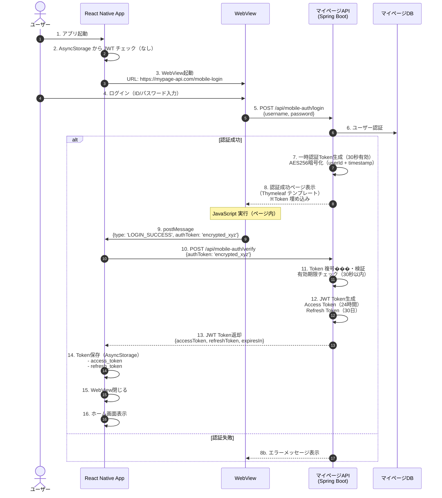
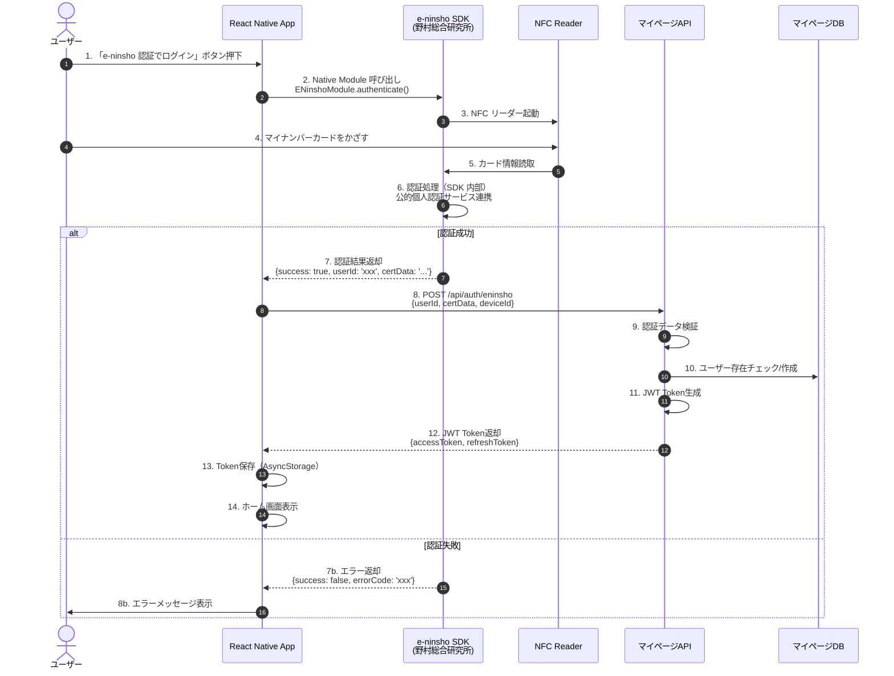
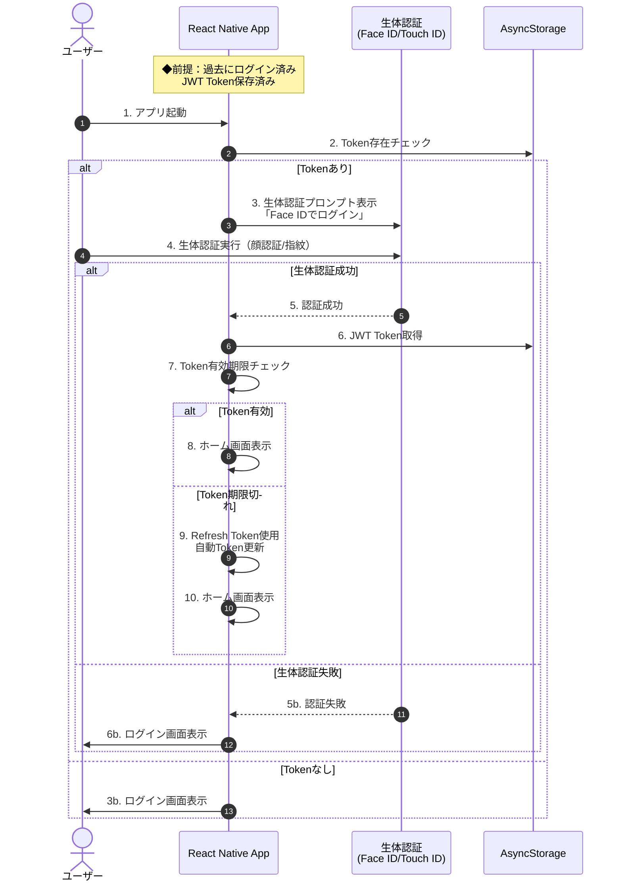
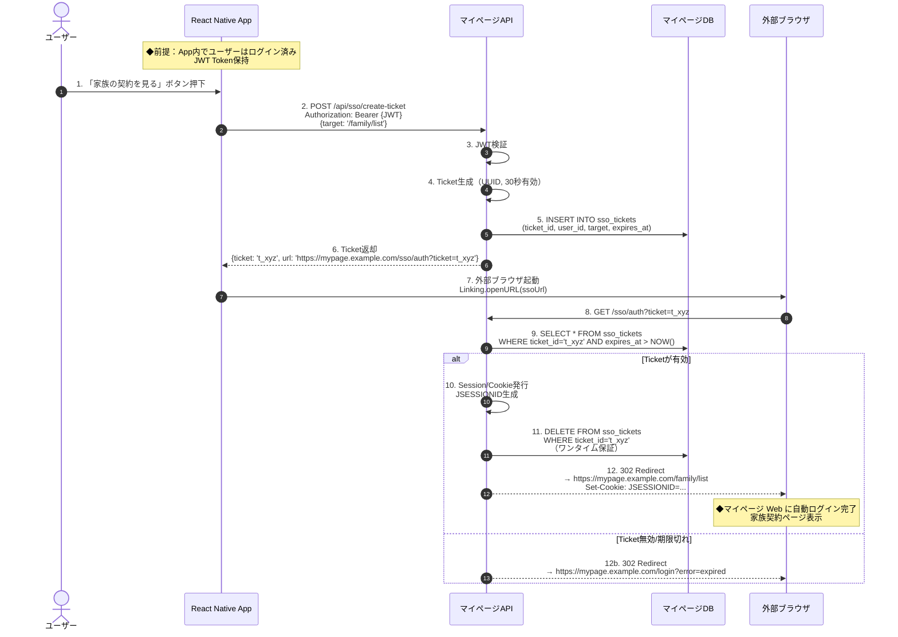
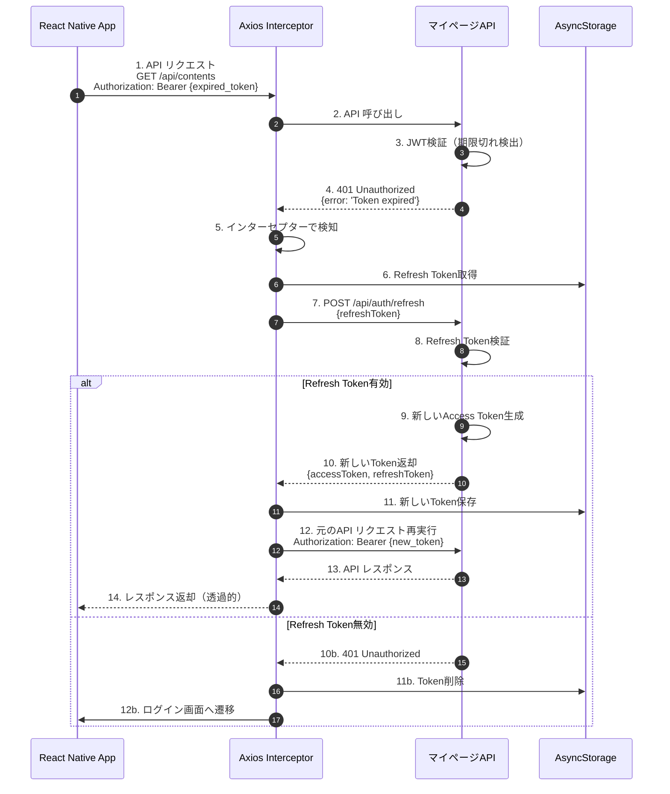

# React Native App - アーキテクチャ設計書

## 目次

1. [システム概要](#システム概要)
2. [全体システム構成](#全体システム構成)
3. [技術スタック](#技術スタック)
4. [プロジェクト構造（Monorepo）](#プロジェクト構造monorepo)
5. [ディレクトリ構造](#ディレクトリ構造)
6. [認証フロー設計](#認証フロー設計)
7. [API 統合設計](#api-統合設計)
8. [機能モジュール設計](#機能モジュール設計)
9. [原生機能統合](#原生機能統合)
10. [状態管理設計](#状態管理設計)
11. [オフライン機能設計](#オフライン機能設計)
12. [プッシュ通知設計](#プッシュ通知設計)
13. [WebView 統合設計](#webview-統合設計)
14. [セキュリティ設計](#セキュリティ設計)
15. [パフォーマンス最適化](#パフォーマンス最適化)
16. [デプロイメント設計](#デプロイメント設計)

---

## システム概要

### プロジェクト情報

- **プロジェクト名**: JUXYI Content Viewer Mobile App
- **プラットフォーム**: iOS + Android
- **フレームワーク**: React Native 0.73+
- **言語**: TypeScript 5.3+
- **対象ユーザー**: 日本国内ユーザー（10,000+ ユーザー想定）
- **目的**: コンテンツ（ドキュメント・ビデオ）閲覧、集章活動、マイページ連携

### 主要機能

1. **認証機能**

   - WebView 経由マイページログイン（初回）
   - e-ninsho SDK 認証（公的個人認証）
   - 生体認証（Face ID / Touch ID / 指 ���）
   - 自動ログイン維持（Refresh Token）

2. **コンテンツ閲覧**

   - ドキュメント閲覧（PDF プレビュー）
   - ビデオ視聴（オンライン再生）
   - URL リンク表示（WebView / 外部ブラウザ）
   - キャッシュ対応（最近閲覧した 10 件）

3. **原生機能**

   - QR コード読取（集章活動）
   - NFC 読取（e-ninsho 認証）
   - プッシュ通知受信
   - 外部ブラウザ起動（SSO）

4. **WebView 機能**
   - 富文本表示
   - 外部 Web ページ埋め込み
   - マイページ Web 連携
   - RN ⇔ WebView 双方向通信

---

## 全体システム構成

### システム関係図

```
┌──────────────────────────────────────────────────────────────────┐
│                         ユーザー                                  │
└────────┬────────────────────���──┬─────────────────────────────────┘
         │                       │
         │ モバイルアプリ         │ Web ブラウザ
         │                       │
         ▼                       ▼
┌─────────────────────┐  ┌─────────────────────────────────────┐
│  React Native App   │  │      マイページ Web                  │
│  (iOS / Android)    │  │      (既存システム)                  │
│                     │  │                                      │
│  開発中              │  │  - 家族契約確認                      │
│  - コンテンツ閲覧    │  │  - 各種情報閲覧                      │
│  - ドキュメント/ビデオ│  │  - ユーザー設定                      │
│  - 集章活動          │  │                                      │
│  - e-ninsho 認証     │  │  ドメイン: mypage.example.com       │
└──────┬──────────────┘  └──────────┬──────────────────────────┘
       │                            │
       │ JWT Token                  │ Session/Cookie
       │                            │
       ├────────────────────────────┼──────────────────────────┐
       │                            │                          │
       ▼                            ▼                          │
┌─────────────────────┐  ┌───────────────────────────────────┐ │
│    CMS API          │  │     マイページAPI                  │ │
│  (Spring Boot)      │  │    (Spring Boot)                  │ │
│                     │  │                                    │ │
│  開発中              │  │  開発中                            │ │
│  - コンテンツ CRUD   │  │  - ユーザー認証                    │ │
│  - ドキュメント/ビデオ│  │  - マイページ Web バックエンド     │ │
│  - プッシュ通知      │  │  - App ログイン API                │ │
│  - App データ提供    │  │  - SSO Ticket 発行                 │ │
│                     │  │                                    │ │
│  ドメイン:           │  │  ドメイン:                         │ │
│  cms-api.example.com│  ���  mypage-api.example.com           │ │
└─────────────────────┘  └───────────────────────────────────┘ │
       │                            │                          │
       │ JWT 共有（共通秘密鍵）      │                          │
       └────────────────────────────┘                          │
                                                               │
                  ┌────────────────────────────────────────────┘
                  │ 管理者アクセス
                  │
                  ▼
          ┌───────────────────┐
          │   CMS Web 管理画面 │
          │   (React Web)     │
          │                   │
          │  開発中            │
          │  - コンテンツ管理  │
          │  - プッシュ通知送信│
          └───────────────────┘
```

### 認証・通信フロー概要

| シナリオ               | 使用システム                      | 認証方式           | Token タイプ    |
| ---------------------- | --------------------------------- | ------------------ | --------------- |
| **App ログイン**       | React Native App → マイページ API | WebView / e-ninsho | JWT（24h 有効） |
| **App コンテンツ取得** | React Native App → CMS API        | JWT Token          | 共有 JWT        |
| **App → Web SSO**      | React Native App → マイページ Web | Ticket（30 秒）    | UUID Ticket     |
| **マイページ Web**     | ブラウザ → マイページ API         | Session/Cookie     | JSESSIONID      |
| **CMS 管理画面**       | CMS Web → CMS API                 | JWT Token          | JWT（24h 有効） |

---

## 技術スタック

### コア技術

| カテゴリ                | 技術               | バージョン | 用途                             |
| ----------------------- | ------------------ | ---------- | -------------------------------- |
| **言語**                | TypeScript         | 5.3+       | 型安全な開発                     |
| **フレームワーク**      | React Native       | 0.73+      | クロスプラットフォーム開発       |
| **ビルドツール**        | React Native CLI   | -          | Pure React Native（Expo 不使用） |
| **JavaScript エンジン** | Hermes             | -          | 高速起動・パフォーマンス向上     |
| **ナビゲーション**      | React Navigation   | 6.x        | 画面遷移管理                     |
| **UI ライブラリ**       | React Native Paper | 5.x        | Material Design コンポーネント   |

### 状態管理・データ取得

| カテゴリ               | 技術                         | 用途                                       |
| ---------------------- | ---------------------------- | ------------------------------------------ |
| **サーバー状態**       | TanStack Query (React Query) | API データキャッシュ・同期                 |
| **クライアント状態**   | Zustand                      | 軽量グローバル状態管理（認証状態等）       |
| **HTTP クライアント**  | Axios                        | API 通信                                   |
| **ローカルストレージ** | AsyncStorage                 | 小容量データ保存（< 6MB）                  |
| **ファイルストレージ** | react-native-fs              | 大容量ファイル保存（PDF/ビデオキャッシュ） |

### 原生機能

| カテゴリ           | ライブラリ                                                 | 用途                               |
| ------------------ | ---------------------------------------------------------- | ---------------------------------- |
| **QR コード読取**  | react-native-vision-camera + vision-camera-code-scanner    | 高性能カメラ・QR 読取              |
| **NFC**            | e-ninsho SDK（野村総合研究所）                             | 公的個人認証（マイナンバーカード） |
| **生体認証**       | react-native-biometrics                                    | Face ID / Touch ID / 指紋認証      |
| **プッシュ通知**   | @react-native-firebase/messaging + Azure Notification Hubs | プッシュ通知受信                   |
| **ディープリンク** | @react-navigation/native                                   | アプリ内画面遷移                   |
| **外部ブラウザ**   | react-native-inappbrowser-reborn                           | In-App Browser / 外部ブラウザ起動  |

### メディア処理

| カテゴリ       | ライブラリ              | 用途                           |
| -------------- | ----------------------- | ------------------------------ |
| **PDF 表示**   | react-native-pdf        | PDF ドキュメント表示           |
| **ビデオ再生** | react-native-video      | ビデオプレイヤー               |
| **画像表示**   | react-native-fast-image | 高性能画像読み込み・キャッシュ |
| **WebView**    | react-native-webview    | Web ページ埋め込み             |

### 開発ツール

| カテゴリ           | 技術                                        | 用途                           |
| ------------------ | ------------------------------------------- | ------------------------------ |
| **リンター**       | ESLint                                      | コード品質チェック             |
| **フォーマッター** | Prettier                                    | コードフォーマット統一         |
| **テスト**         | Jest + React Native Testing Library + Detox | 単元・E2E テスト               |
| **エラー監視**     | Application Insights                        | エラー追跡・パフォーマンス監視 |
| **CI/CD**          | Azure DevOps Pipelines                      | 自動ビルド・デプロイ           |
| **コード更新**     | CodePush (App Center)                       | OTA 更新                       |

---

## プロジェクト構造（Monorepo）

### リポジトリ全体構造

```
juxyi-cms/                                   # Monorepo ルート
│
├── backend/                                  # CMS API (Spring Boot)
│   ├── src/
│   ├── build.gradle
│   └── README.md
│
├── frontend/                                 # CMS Web 管理画面 (React)
│   ├── src/
│   ├── package.json
│   └── README.md
│
├── mobile/                                   # React Native App（本プロジェクト）
│   ├── android/                              # Android 原生コード
│   ├── ios/                                  # iOS 原生コード
│   ├── src/                                  # React Native ソースコード
│   ├── package.json
│   ├── tsconfig.json
│   └── README.md
│
├── mypage-api/                               # マイページAPI (Spring Boot)
│   ├── src/
│   ├── build.gradle
│   └── README.md
│
├── docs/                                     # 共有ドキュメント
│   ├── ARCHITECTURE.md                       # バックエンドアーキテクチャ
│   ├── FRONTEND_ARCHITECTURE.md              # フロントエンドアーキテクチャ
│   ├── MOBILE_ARCHITECTURE.md                # モバイルアーキテクチャ（本文書）
│   ├── API.md                                # API 仕様書
│   └── DEPLOYMENT.md                         # デプロイ手順書
│
├── .azure/                                   # Azure DevOps Pipelines
│   └── pipelines/
│       ├── backend-pipeline.yml
│       ├── frontend-pipeline.yml
│       ├── mobile-ios-pipeline.yml           # iOS ビルド
│       ├── mobile-android-pipeline.yml       # Android ビルド
│       └── shared/
│           └── azure-resources.yml
│
├── .gitignore
└── README.md
```

---

## ディレクトリ構造

### React Native App 完全ディレクトリ構造

```
mobile/
│
├── android/                                   # Android 原生コード
│   ├── app/
│   │   ├── src/main/
│   │   │   ├── java/com/juxyi/mobile/
│   │   │   │   └── MainActivity.java          # メインアクティビティ
│   │   │   ├── res/                           # Android リソース
│   │   │   └── AndroidManifest.xml            # マニフェスト設定
│   │   └── build.gradle                       # アプリビルド設定
│   ├── build.gradle                           # プロジェクトビルド設定
│   └── gradle.properties                      # Gradle プロパティ
│
├── ios/                                       # iOS 原生コード
│   ├── JuxyiMobile/
│   │   ├── AppDelegate.mm                     # アプリデリゲート
│   │   ├── Info.plist                         # アプリ設定
│   │   └── Images.xcassets/                   # iOS アセット
│   ├── JuxyiMobile.xcodeproj/                 # Xcode プロジェクト
│   ├── JuxyiMobile.xcworkspace/               # Xcode ワークスペース
│   └── Podfile                                # CocoaPods 依存関係
│
├── src/                                       # React Native ソースコード
│   │
│   ├── App.tsx                                # ルートコンポーネント
│   │                                          # - ナビゲーション設定
│   │                                          # - グローバルプロバイダー統合
│   │                                          # - Application Insights 初期化
│   │
│   ├── index.ts                               # アプリケーションエントリーポイント
│   │                                          # - App コンポーネント登録
│   │                                          # - AppRegistry 登録
│   │
│   ├── assets/                                # 静的アセット
│   │   ├── images/                            # 画像ファイル
│   │   │   ├── logo.png                       # アプリロゴ
│   │   │   ├── splash-screen.png              # スプラッシュ画面
│   │   │   ├── empty-state.svg                # 空状態イラスト
│   │   │   └── placeholder.png                # プレースホルダー
│   │   │
│   │   ├── fonts/                             # カスタムフォント（オプション）
│   │   │   └── NotoSansJP-Regular.ttf         # 日本語フォント
│   │   │
│   │   └── videos/                            # サンプルビデオ（開発用）
│   │
│   ├── components/                            # 共通コンポーネント
│   │   │
│   │   ├── layout/                            # レイアウトコンポーネント
│   │   │   ├── AppContainer.tsx               # アプリコンテナ（SafeAreaView ラッパー）
│   │   │   ├── Header.tsx                     # 共通ヘッダー
│   │   │   ├── TabBar.tsx                     # タブバーナビゲーション
│   │   │   └── BottomNavigation.tsx           # ボトムナビゲーション
│   │   │
│   │   ├── common/                            # 汎用コンポーネント
│   │   │   ├── Button.tsx                     # カスタムボタン（Paper Button ラッパー）
│   │   │   ├── Card.tsx                       # カードコンポーネント
│   │   │   ├── LoadingSpinner.tsx             # ローディングインジケーター
│   │   │   ├── ErrorView.tsx                  # エラー表示ビュー
│   │   │   ├── EmptyState.tsx                 # 空状態表示
│   │   │   ├── ConfirmDialog.tsx              # 確認ダイアログ
│   │   │   └── Toast.tsx                      # トースト通知
│   │   │
│   │   ├── media/                             # メディアコンポーネント
│   │   │   ├── PdfViewer.tsx                  # PDF プレビューコンポーネント
│   │   │   │                                  # - react-native-pdf 使用
│   │   │   │                                  # - ページナビゲーション
│   │   │   │                                  # - ズーム機能
│   │   │   │
│   │   │   ├── VideoPlayer.tsx                # ビデオプレイヤーコンポーネント
│   │   │   │                                  # - react-native-video 使用
│   │   │   │                                  # - 再生・一時停止・シーク
│   │   │   │                                  # - フルスクリーン対応
│   │   │   │
│   │   │   ├── ImageViewer.tsx                # 画像ビューアー
│   │   │   │                                  # - FastImage 使用
│   │   │   │                                  # - ピンチズーム対応
│   │   │   │
│   │   │   └── WebViewContainer.tsx           # WebView コンテナ
│   │   │                                      # - react-native-webview 使用
│   │   │                                      # - JavaScript インジェクション
│   │   │                                      # - postMessage 通信
│   │   │
│   │   ├── list/                              # リストコンポーネント
│   │   │   ├── ContentList.tsx                # コンテンツ一覧
│   │   │   │                                  # - FlatList 使用
│   │   │   │                                  # - プルトゥリフレッシュ
│   │   │   │                                  # - 無限スクロール
│   │   │   │
│   │   │   ├── ContentCard.tsx                # コンテンツカード
│   │   │   │                                  # - サムネイル表示
│   │   │   │                                  # - タイトル・説明表示
│   │   │   │                                  # - タップ時詳細画面へ遷移
│   │   │   │
│   │   │   └── SectionList.tsx                # セクション付きリスト
│   │   │                                      # - カテゴリ別表示
│   │   │
│   │   └── form/                              # フォームコンポーネント
│   │       ├── TextInput.tsx                  # テキスト入力（Paper TextInput ラッパー）
│   │       ├── SearchBar.tsx                  # 検索バー
│   │       └── FilterChips.tsx                # フィルターチップ（タイプ・ステータス選択）
│   │
│   ├── features/                              # 機能別モジュール（Feature-based Architecture）
│   │   │
│   │   ├── auth/                              # 認証機能モジュール
│   │   │   │
│   │   │   ├── screens/                       # 認証画面
│   │   │   │   ├── LoginScreen.tsx            # ログイン画面
│   │   │   │   │                              # - WebView / e-ninsho 選択
│   │   │   │   │                              # - 生体認証ボタン
│   │   │   │   │
│   │   │   │   ├── WebViewLoginScreen.tsx     # WebView ログイン画面
│   │   │   │   │                              # - マイページAPI ログインページ読み込み
│   │   │   │   │                              # - postMessage 受信処理
│   │   │   │   │
│   │   │   │   └── BiometricLoginScreen.tsx   # 生体認証画面
│   │   │   │                                  # - Face ID / Touch ID / 指紋
│   │   │   │                                  # - 保存済み JWT Token で自動ログイン
│   │   │   │
│   │   │   ├── components/                    # 認証用コンポーネント
│   │   │   │   ├── LoginMethodSelector.tsx    # ログイン方法選択
│   │   │   │   │                              # - WebView ログイン
│   │   │   │   │                              # - e-ninsho 認証
│   │   │   │   │                              # - 生体認証
│   │   │   │   │
│   │   │   │   ├── ENinshoButton.tsx          # e-ninsho 認証ボタン
│   │   │   │   │                              # - 野村 SDK 呼び出し
│   │   │   │   │                              # - NFC 読取起動
│   │   │   │   │
│   │   │   │   └── BiometricPrompt.tsx        # 生体認証プロンプト
│   │   │   │                                  # - react-native-biometrics 使用
│   │   │   │
│   │   │   ├── hooks/                         # 認証用フック
│   │   │   │   ├── useAuth.ts                 # 認証状態管理フック
│   │   │   │   │                              # - Zustand ストア連携
│   │   │   │   │                              # - ログイン・ログアウト処理
│   │   │   │   │                              # - JWT Token 管理
│   │   │   │   │
│   │   │   │   ├── useWebViewLogin.ts         # WebView ログインフック
│   │   │   │   │                              # - postMessage 受信
│   │   │   │   │                              # - 一時 Token 検証
│   │   │   │   │                              # - JWT Token 取得
│   │   │   │   │
│   │   │   │   ├── useENinshoAuth.ts          # e-ninsho 認証フック
│   │   │   │   │                              # - 野村 SDK 呼び出し
│   │   │   │   │                              # - 認証結果処理
│   │   │   │   │
│   │   │   │   ├── useBiometricAuth.ts        # 生体認証フック
│   │   │   │   │                              # - 生体認証利用可能チェック
│   │   │   │   │                              # - 認証実行
│   │   │   │   │
│   │   │   │   └── useRefreshToken.ts         # Token リフレッシュフック
│   │   │   │                                  # - Access Token 期限切れ時自動更新
│   │   │   │                                  # - Refresh Token 使用
│   │   │   │
│   │   │   ├── services/                      # 認証 API サービス
│   │   │   │   ├── authService.ts             # 認証 API 呼び出し
│   │   │   │   │                              # - POST /api/mobile-auth/verify（マイページAPI）
│   │   │   │   │                              # - POST /api/auth/eninsho（マイページAPI）
│   │   │   │   │                              # - POST /api/auth/refresh（マイページAPI）
│   │   │   │   │
│   │   │   │   └── eninshoService.ts          # e-ninsho SDK ラッパー
│   │   │   │                                  # - 野村 SDK 呼び出し（Native Module）
│   │   │   │
│   │   │   ├── stores/                        # 認証状態ストア
│   │   │   │   └── authStore.ts               # Zustand 認証ストア
│   │   │   │                                  # - user: User | null
│   │   │   │                                  # - isAuthenticated: boolean
│   │   │   │                                  # - accessToken: string | null
│   │   │   │                                  # - refreshToken: string | null
│   │   │   │                                  # - setUser / logout アクション
│   │   │   │
│   │   │   ├── types/                         # 認証型定義
│   │   │   │   └── auth.types.ts              # User, LoginResponse, ENinshoResult 型
│   │   │   │
│   │   │   └── utils/                         # 認証ユーティリティ
│   │   │       ├── tokenStorage.ts            # Token 保存・取得（AsyncStorage）
│   │   │       └── biometricUtils.ts          # 生体認証ヘルパー
│   │   │
│   │   ├── home/                              # ホーム画面モジュール
│   │   │   │
│   │   │   ├── screens/                       # ホーム画面
│   │   │   │   └── HomeScreen.tsx             # ホーム画面
│   │   │   │                                  # - コンテンツカテゴリ表示
│   │   │   │                                  # - 最近閲覧したコンテンツ
│   │   │   │                                  # - 集章活動ボタン
│   │   │   │                                  # - マイページへのSSO ボタン
│   │   │   │
│   │   │   ├── components/                    # ホーム用コンポーネント
│   │   │   │   ├── CategoryGrid.tsx           # カテゴリグリッド
│   │   │   │   │                              # - ドキュメント・ビデオ・URLリンク
│   │   │   │   │
│   │   │   │   ├── RecentContentList.tsx      # 最近閲覧リスト
│   │   │   │   │                              # - 横スクロールリスト
│   │   │   │   │
│   │   │   │   └── QuickActionButtons.tsx     # クイックアクションボタン
│   │   │   │                                  # - QR コード読取
│   │   │   │                                  # - マイページへ遷移
│   │   │   │
│   │   │   └── hooks/                         # ホーム用フック
│   │   │       └── useRecentContents.ts       # 最近閲覧履歴取得
│   │   │
│   │   ├── contents/                          # コンテンツ閲覧モ��ュール
│   │   │   │
│   │   │   ├── screens/                       # コンテンツ画面
│   │   │   │   ├── ContentListScreen.tsx      # コンテンツ一覧画面
│   │   │   │   │                              # - カテゴリ別一覧表示
│   │   │   │   │                              # - 検索・フィルター
│   │   │   │   │                              # - プルトゥリフレッシュ
│   │   │   │   │
│   │   │   │   ├── ContentDetailScreen.tsx    # コンテンツ詳細画面
│   │   │   │   │                              # - タイトル・説明表示
│   │   │   │   │                              # - ドキュメント/ビデオプレビュー
│   │   │   │   │                              # - ダウンロードボタン（オフライン用）
│   │   │   │   │
│   │   │   │   ├── DocumentViewerScreen.tsx   # ドキュメント閲覧画面
│   │   │   │   │                              # - PDF フルスクリーン表示
│   │   │   │   │                              # - ページナビゲーション
│   │   │   │   │                              # - ズーム機能
│   │   │   │   │
│   │   │   │   ├── VideoPlayerScreen.tsx      # ビデオ再生画面
│   │   │   │   │                              # - ビデオフルスクリーン再生
│   │   │   │   │                              # - 再生コントロール
│   │   │   │   │
│   │   │   │   └── WebContentScreen.tsx       # Web コンテンツ画面
│   │   │   │                                  # - WebView で URL 表示
│   │   │   │                                  # - 外部ブラウザで開くボタン
│   │   │   │
│   │   │   ├── components/                    # コンテンツ用コンポーネント
│   │   │   │   ├── ContentFilterBar.tsx       # フィルターバー
│   │   │   │   │                              # - タイプ・ステータス選択
│   │   │   │   │
│   │   │   │   ├── ContentSearchBar.tsx       # 検索バー
│   │   │   │   │                              # - デバウンス検索
│   │   │   │   │
│   │   │   │   └── DownloadButton.tsx         # ダウンロードボタン
│   │   │   │                                  # - オフライン保存機能
│   │   │   │                                  # - 進捗表示
│   │   │   │
│   │   │   ├── hooks/                         # コンテンツ用フック
│   │   │   │   ├── useContents.ts             # コンテンツ���覧取得
│   │   │   │   │                              # - TanStack Query useQuery
│   │   │   │   │                              # - CMS API 呼び出し
│   │   │   │   │
│   │   │   │   ├── useContentDetail.ts        # コンテンツ詳細取得
│   │   │   │   │                              # - キャッシュ対応
│   │   │   │   │
│   │   │   │   ├── useDownload.ts             # ダウンロード処理
│   │   │   │   │                              # - react-native-fs 使用
│   │   │   │   │                              # - 進捗管理
│   │   │   │   │
│   │   │   │   └── useContentSearch.ts        # コンテンツ検索
│   │   │   │                                  # - デバウンス処理
│   │   │   │
│   │   │   ├── services/                      # コンテンツ API サービス
│   │   │   │   └── contentService.ts          # コンテンツ API 呼び出し
│   │   │   │                                  # - GET /api/contents（CMS API）
│   │   │   │                                  # - GET /api/contents/:id
│   │   │   │
│   │   │   └── types/                         # コンテンツ型定義
│   │   │       └── content.types.ts           # Content, ContentType, ContentStatus 型
│   │   │
│   │   ├── stamp-rally/                       # 集章活動モジュール
│   │   │   │
│   │   │   ├── screens/                       # 集章画面
│   │   │   │   ├── StampRallyScreen.tsx       # 集章一覧画面
│   │   │   │   │                              # - 獲得済みスタンプ表示
│   │   │   │   │                              # - 達成率表示
│   │   │   │   │
│   │   │   │   ├── QRScannerScreen.tsx        # QR コード読取画面
│   │   │   │   │                              # - react-native-vision-camera 使用
│   │   │   │   │                              # - QR コード自動検出
│   │   │   │   │                              # - スキャン成功時スタンプ獲得
│   │   │   │   │
│   │   │   │   └── StampDetailScreen.tsx      # スタンプ詳細画面
│   │   │   │                                  # - スタンプ情報表示
│   │   │   │                                  # - 獲得日時表示
│   │   │   │
│   │   │   ├── components/                    # 集章用コンポーネント
│   │   │   │   ├── StampCard.tsx              # スタンプカード
│   │   │   │   │                              # - 獲得済み/未獲得状態表示
│   │   │   │   │
│   │   │   │   ├── QRCamera.tsx               # QR カメラコンポーネント
│   │   │   │   │                              # - カメラビュー
│   │   │   │   │                              # - QR フレーム表示
│   │   │   │   │
│   │   │   │   └── ProgressBar.tsx            # 達成率プログレスバー
│   │   │   │
│   │   │   ├── hooks/                         # 集章用フック
│   │   │   │   ├── useStamps.ts               # スタンプ一覧取得
│   │   │   │   ├── useQRScanner.ts            # QR スキャナー制御
│   │   │   │   └── useStampCollection.ts      # スタンプ獲得処理
│   │   │   │
│   │   │   ├── services/                      # 集章 API サービス
│   │   │   │   └── stampService.ts            # 集章 API 呼び出し
│   │   │   │                                  # - GET /api/stamps（CMS API）
│   │   │   │                                  # - POST /api/stamps/collect
│   │   │   │
│   │   │   └── types/                         # 集章型定義
│   │   │       └── stamp.types.ts             # Stamp, StampCollection 型
│   │   │
│   │   ├── notifications/                     # プッシュ通知モジュール
│   │   │   │
│   │   │   ├── screens/                       # 通知画面
│   │   │   │   ├── NotificationListScreen.tsx # 通知一覧画面
│   │   │   │   │                              # - 受信済み通知表示
│   │   │   │   │                              # - 未読/既読状態
│   │   │   │   │                              # - タップで詳細またはコンテンツへ遷移
│   │   │   │   │
│   │   │   │   └── NotificationDetailScreen.tsx # 通知詳細画面
│   │   │   │                                  # - 通知内容表示
│   │   │   │                                  # - アクションボタン
│   │   │   │
│   │   │   ├── components/                    # 通知用コンポーネント
│   │   │   │   ├── NotificationCard.tsx       # 通知カード
│   │   │   │   │                              # - タイトル・本文表示
│   │   │   │   │                              # - 未読バッジ
│   │   │   │   │
│   │   │   │   └── NotificationBadge.tsx      # 通知バッジ（タブバー用）
│   │   │   │                                  # - 未読数表示
│   │   │   │
│   │   │   ├── hooks/                         # 通知用フック
│   │   │   │   ├── useNotifications.ts        # 通知一覧取得
│   │   │   │   │                              # - CMS API 呼び��し
│   │   │   │   │
│   │   │   │   ├── usePushNotification.ts     # プッシュ通知受信処理
│   │   │   │   │                              # - Firebase Messaging 設定
│   │   │   │   │                              # - 通知受信リスナー
│   │   │   │   │                              # - デバイス Token 登録
│   │   │   │   │
│   │   │   │   └── useNotificationNavigation.ts # 通知タップ時ナビゲーション
│   │   │   │                                  # - Deep Link 処理
│   │   │   │
│   │   │   ├── services/                      # 通知 API サービス
│   │   │   │   ├── notificationService.ts     # 通知 API 呼び出し
│   │   │   │   │                              # - GET /api/notifications（CMS API）
│   │   │   │   │                              # - POST /api/notifications/register-device
│   │   │   │   │
│   │   │   │   └── pushService.ts             # プッシュ通知サービス
│   │   │   │                                  # - Firebase Messaging 初期化
│   │   │   │                                  # - デバイス Token 取得
│   │   │   │
│   │   │   └── types/                         # 通知型定義
│   │   │       └── notification.types.ts      # Notification, PushPayload 型
│   │   │
│   │   ├── sso/                               # SSO 機能モジュール
│   │   │   │
│   │   │   ├── hooks/                         # SSO 用フック
│   │   │   │   └── useSso.ts                  # SSO 処理フック
│   │   │   │                                  # - マイページAPI に Ticket リクエスト
│   │   │   │                                  # - 外部ブラウザ起動
│   │   │   │
│   │   │   ├── services/                      # SSO API サービス
│   │   │   │   └── ssoService.ts              # SSO API 呼び出し
│   │   │   │                                  # - POST /api/sso/create-ticket（マイページAPI）
│   │   │   │
│   │   │   └── types/                         # SSO 型定義
│   │   │       └── sso.types.ts               # SsoTicket, SsoRequest 型
│   │   │
│   │   ├── settings/                          # 設定モジュール
│   │   │   │
│   │   │   ├── screens/                       # 設定画面
│   │   │   │   ├── SettingsScreen.tsx         # 設定一覧画面
│   │   │   │   │                              # - アカウント情報
│   │   │   │   │                              # - 通知設定
│   │   │   │   │                              # - キャッシュクリア
│   │   │   │   │                              # - ログアウト
│   │   │   │   │
│   │   │   │   ├── AccountScreen.tsx          # アカウント情報画面
│   │   │   │   │                              # - ユーザー情報表示
│   │   │   │   │
│   │   │   │   └── NotificationSettingsScreen.tsx # 通知設定画面
│   │   │   │                                  # - プッシュ通知 ON/OFF
│   │   │   │
│   │   │   ├── components/                    # 設定用コンポーネント
│   │   │   │   ├── SettingItem.tsx            # 設定項目
│   │   │   │   └── SwitchSetting.tsx          # スイッチ設定項目
│   │   │   │
│   │   │   └── hooks/                         # 設定用フック
│   │   │       └── useSettings.ts             # 設定管理フック
│   │   │                                      # - AsyncStorage 連携
│   │   │
│   │   └── webview/                           # WebView 機能モジュール
│   │       │
│   │       ├── screens/                       # WebView 画面
│   │       │   └── WebViewScreen.tsx          # 汎用 WebView 画面
│   │       │                                  # - URL パラメータ受け取り
│   │       │                                  # - JavaScript インジェクション
│   │       │                                  # - postMessage 通信
│   │       │
│   │       ├── components/                    # WebView 用コンポーネント
│   │       │   ├── CustomWebView.tsx          # カスタム WebView
│   │       │   │                              # - JWT Token 自動注入
│   │       │   │                              # - 外部ブラウザ起動ハンドリング
│   │       │   │
│   │       │   └── WebViewToolbar.tsx         # WebView ツールバー
│   │       │                                  # - 戻る・進む・リロード・閉じる
│   │       │
│   │       └── hooks/                         # WebView 用フック
│   │           └── useWebViewBridge.ts        # WebView ⇔ RN 通信フック
│   │                                          # - postMessage 送受信
│   │                                          # - JavaScript 実行
│   │
│   ├── navigation/                            # ナビゲーション設定
│   │   ├── RootNavigator.tsx                  # ルートナビゲーター
│   │   │                                      # - 認証状態による画面切り替え
│   │   │                                      # - 未認証: Auth Stack
│   │   │                                      # - 認証済み: Main Stack
│   │   │
│   │   ├── AuthStack.tsx                      # 認証スタック
│   │   │                                      # - Login / WebViewLogin 画面
│   │   │
│   │   ├── MainStack.tsx                      # メインスタック
│   │   │                                      # - Tab Navigator 内包
│   │   │
│   │   ├── TabNavigator.tsx                   # タブナビゲーター
│   │   │                                      # - ホーム・コンテンツ・集章・通知・設定
│   │   │
│   │   ├── linking.ts                         # Deep Link 設定
│   │   │                                      # - juxyi://content/:id
│   │   │                                      # - juxyi://notification/:id
│   │   │
│   │   └── types.ts                           # ナビゲーション型定義
│   │                                          # - RootStackParamList
│   │                                          # - MainTabParamList
│   │
│   ├── lib/                                   # ライブラリ・ユーティリティ
│   │   │
│   │   ├── api/                               # API 関連
│   │   │   ├── axios.ts                       # Axios インスタンス設定
│   │   │   │                                  # - ベース URL 設定（環境変数）
│   │   │   │                                  # - JWT Token 自動付与（インターセプター）
│   │   │   │                                  # - エラーハンドリング
│   │   │   │                                  # - Token リフレッシュ処理
│   │   │   │
│   │   │   ├── queryClient.ts                 # TanStack Query 設定
│   │   │   │                                  # - デフォルトオプション設定
│   │   │   │                                  # - staleTime: 5分
│   │   │   │                                  # - retry: 1回
│   │   │   │
│   │   │   └── endpoints.ts                   # API エンドポイント定義
│   │   │                                      # - マイページAPI エンドポイント
│   │   │                                      # - CMS API エンドポイント
│   │   │
│   │   ├── cache/                             # キャッシュ管理
│   │   │   ├── fileCache.ts                   # ファイルキャッシュ管理
│   │   │   │                                  # - react-native-fs 使用
│   │   │   │                                  # - LRU アルゴリズム
│   │   │   │                                  # - 最大キャッシュサイズ: 500MB
│   │   │   │
│   │   │   ├── metadataCache.ts               # メタデータキャッシュ
│   │   │   │                                  # - AsyncStorage 使用
│   │   │   │                                  # - コンテンツリスト保存
│   │   │   │
│   │   │   └── cacheManager.ts                # キャッシュマネージャー
│   │   │                                      # - キャッシュクリア
│   │   │                                      # - キャッシュサイズ計算
│   │   │
│   │   ├── storage/                           # ストレージユーティリティ
│   │   │   ├── asyncStorage.ts                # AsyncStorage ラッパー
│   │   │   │                                  # - 型安全な保存・取得
│   │   │   │                                  # - JSON シリアライズ対応
│   │   │   │
│   │   │   └── secureStorage.ts               # セキュアストレージ
│   │   │                                      # - 機密情報保存（Keychain / Keystore）
│   │   │                                      # - JWT Token 保存
│   │   │
│   │   ├── utils/                             # ユーティリティ関数
│   │   │   ├── formatters.ts                  # フォーマット関数
│   │   │   │                                  # - 日付フォーマット（dayjs 使用）
│   │   │   │                                  # - ファイルサイズ変換
│   │   │   │                                  # - 再生時間フォーマット
│   │   │   │
│   │   │   ├── validators.ts                  # バリデーション関数
│   │   │   │                                  # - URL バリデーション
│   │   │   │                                  # - ファイルタイプチェック
│   │   │   │
│   │   │   ├── deviceInfo.ts                  # デバイス情報取得
│   │   │   │                                  # - OS バージョン
│   │   │   │                                  # - デバイス ID
│   │   │   │                                  # - アプリバージョン
│   │   │   │
│   │   │   └── permissions.ts                 # パーミッション管理
│   │   │                                      # - カメラ・通知・ストレージ権限チェック
│   │   │
│   │   ├── monitoring/                        # 監視・ログ
│   │   │   └── appInsights.ts                 # Application Insights 統合
│   │   │                                      # - エラー追跡
│   │   │                                      # - カスタムイベント送信
│   │   │                                      # - パフォーマンスメトリクス
│   │   │
│   │   └── constants/                         # 定数
│   │       ├── api.constants.ts               # API 定数
│   │       │                                  # - エンドポイント定数
│   │       │                                  # - タイムアウト設定
│   │       │
│   │       ├── app.constants.ts               # アプリケーション定数
│   │       │                                  # - キャッシュサイズ上限
│   │       │                                  # - 自動キャッシュ件数
│   │       │
│   │       └── storage.constants.ts           # ストレージキー定数
│   │                                          # - AsyncStorage キー名
│   │
│   ├── hooks/                                 # グローバルカスタムフック
│   │   ├── useAppState.ts                     # アプリ状態フック
│   │   │                                      # - フォアグラウンド/バックグラウンド検知
│   │   │
│   │   ├── useNetworkStatus.ts                # ネットワーク状態フック
│   │   │                                      # - オンライン/オフライン検知
│   │   │
│   │   ├── useOrientation.ts                  # 画面向きフック
│   │   │                                      # - ポートレート/ランドスケープ
│   │   │
│   │   └── useTheme.ts                        # テーマフック
│   │                                          # - React Native Paper テーマ取得
│   │
│   ├── types/                                 # グローバル型定義
│   │   ├── api.types.ts                       # API レスポンス共通型
│   │   │                                      # - ApiResponse<T>
│   │   │                                      # - PageResponse<T>
│   │   │
│   │   ├── common.types.ts                    # 共通型定義
│   │   │                                      # - ID, Timestamp 型
│   │   │
│   │   └── env.d.ts                           # 環境変数型定義
│   │                                          # - process.env 型拡張
│   │
│   ├── theme/                                 # テーマ設定
│   │   ├── index.ts                           # React Native Paper テーマ
│   │   │                                      # - カラー定義
│   │   │                                      # - フォント設定
│   │   │
│   │   └── colors.ts                          # カラーパレット
│   │                                          # - プライマリカラー
│   │                                          # - セカンダリカラー
│   │
│   └── config/                                # 設定ファイル
│       ├── env.ts                             # 環境変数管理
│       │                                      # - API URL 取得
│       │                                      # - 環境別設定
│       │
│       └── codepush.ts                        # CodePush 設定
│                                              # - デプロイメントキー設定
│
├── __tests__/                                 # テストコード
│   ├── unit/                                  # 単体テスト
│   │   ├── components/                        # コンポーネントテスト
│   │   ├── hooks/                             # フックテスト
│   │   └── utils/                             # ユーティリティテスト
│   │
│   └── e2e/                                   # E2E テスト（Detox）
│       ├── login.e2e.ts                       # ログインフローテスト
│       ├── content.e2e.ts                     # コンテンツ閲覧テスト
│       └── stamp-rally.e2e.ts                 # 集章活動テスト
│
├── .env                                       # 環境変数（ローカル開発用・Git 除外）
├── .env.development                           # 開発環境変数
├── .env.staging                               # ステージング環境変数
├── .env.production                            # 本番環境変数
│
├── .eslintrc.js                               # ESLint 設定
├── .prettierrc                                # Prettier 設定
├── tsconfig.json                              # TypeScript 設定
├── jest.config.js                             # Jest 設定
├── babel.config.js                            # Babel 設定
├── metro.config.js                            # Metro Bundler 設定
│
├── package.json                               # 依存関係・スクリプト定義
├── yarn.lock                                  # Yarn ロックファイル
└── README.md                                  # プロジェクト説明
```

---

## 認証フロー設計

### フロー 1：WebView ログイン（初回ログイン）



**実装ポイント**：

- ✅ **一時 Token**: AES256 暗号化（userId + timestamp）、30 秒有効
- ✅ **postMessage**: WebView → React Native 通信
- ✅ **JWT Token**: Access Token（24h） + Refresh Token（30 日）

---

### フロー 2：e-ninsho 認証ログイン



**実装ポイント**：

- ✅ **Native Module**: e-ninsho SDK は iOS/Android ネイティブ実装、RN から呼び出し
- ✅ **NFC**: SDK 内部で NFC 処理
- ✅ **公的認証**: マイナンバーカード利用

---

### フロー 3：生体認証（クイックログイン）



**実装ポイント**：

- ✅ **生体認証**: react-native-biometrics 使用
- ✅ **自動ログイン**: Token 保存済みなら生体認証のみで再ログイン
- ✅ **Token 更新**: Refresh Token で自動更新

---

### フロー 4：SSO 単点登録（App → マイページ Web）



**実装ポイント**：

- ✅ **Ticket**: UUID、30 秒有効、ワンタイム
- ✅ **JWT → Session**: App の JWT を Web の Session/Cookie に変換
- ✅ **外部ブラウザ**: react-native-inappbrowser-reborn 使用

---

### フロー 5：Token リフレッシュ（自動更新）



**実装ポイント**：

- ✅ **自動更新**: Axios Interceptor で透過的に処理
- ✅ **ユーザー体験**: ユーザーに気づかれずに Token 更新
- ✅ **Refresh Token**: 30 日有効

---

## API 統合設計

### API エンドポイント一覧

#### マイページ API（認証用）

| メソッド | エンドポイント            | 用途                           | 認証           |
| -------- | ------------------------- | ------------------------------ | -------------- |
| GET      | `/mobile-login`           | WebView ログインページ表示     | 不要           |
| POST     | `/api/mobile-auth/login`  | WebView ログイン処理           | 不要           |
| POST     | `/api/mobile-auth/verify` | 一時 Token 検証 → JWT 発行     | 不要           |
| POST     | `/api/auth/eninsho`       | e-ninsho 認証 → JWT 発行       | 不要           |
| POST     | `/api/auth/refresh`       | Token リフレッシュ             | Refresh Token  |
| POST     | `/api/sso/create-ticket`  | SSO Ticket 生成                | JWT            |
| GET      | `/sso/auth`               | SSO Ticket 検証 → Session 発行 | 不要（Ticket） |

#### CMS API（コンテンツ取得用）

| メソッド | エンドポイント                       | 用途                 | 認証 |
| -------- | ------------------------------------ | -------------------- | ---- |
| GET      | `/api/contents`                      | コンテンツ一覧取得   | JWT  |
| GET      | `/api/contents/:id`                  | コンテンツ詳細取得   | JWT  |
| GET      | `/api/contents/search`               | コンテンツ検索       | JWT  |
| GET      | `/api/stamps`                        | 集章スタンプ一覧取得 | JWT  |
| POST     | `/api/stamps/collect`                | スタンプ獲得         | JWT  |
| GET      | `/api/notifications`                 | プッシュ通知履歴取得 | JWT  |
| POST     | `/api/notifications/register-device` | デバイス Token 登録  | JWT  |

### Axios 設定（JWT 自動付与）

```typescript name=mobile/src/lib/api/axios.ts
import axios, {
  AxiosError,
  InternalAxiosRequestConfig,
  AxiosResponse,
} from 'axios';
import AsyncStorage from '@react-native-async-storage/async-storage';
import { Alert } from 'react-native';
import Config from 'react-native-config';

/**
 * マイページAPI用 Axios インスタンス
 */
export const myPageApiClient = axios.create({
  baseURL: Config.MYPAGE_API_BASE_URL, // 例: https://mypage-api.example.com
  timeout: 30000,
  headers: {
    'Content-Type': 'application/json',
  },
});

/**
 * CMS API用 Axios インスタンス
 */
export const cmsApiClient = axios.create({
  baseURL: Config.CMS_API_BASE_URL, // 例: https://cms-api.example.com
  timeout: 30000,
  headers: {
    'Content-Type': 'application/json',
  },
});

// 共有リフレッシュ処理フラグ（複数リクエストで同時リフレッシュ防止）
let isRefreshing = false;
let failedQueue: Array<{
  resolve: (value: string) => void;
  reject: (reason?: any) => void;
}> = [];

/**
 * 失敗したリクエストを処理
 */
const processQueue = (error: any, token: string | null = null) => {
  failedQueue.forEach(prom => {
    if (error) {
      prom.reject(error);
    } else {
      prom.resolve(token!);
    }
  });

  failedQueue = [];
};

/**
 * リクエストインターセプター（JWT Token 自動付与）
 */
const requestInterceptor = async (config: InternalAxiosRequestConfig) => {
  const token = await AsyncStorage.getItem('access_token');
  if (token) {
    config.headers.Authorization = `Bearer ${token}`;
  }
  return config;
};

/**
 * レスポンスインターセプター（Token リフレッシュ処理）
 */
const responseInterceptor = (response: AxiosResponse) => {
  return response.data; // ApiResponse<T> の data を直接返す
};

const errorInterceptor = async (error: AxiosError) => {
  const originalRequest = error.config as InternalAxiosRequestConfig & {
    _retry?: boolean;
  };

  // 401 Unauthorized（Token 期限切れ）
  if (error.response?.status === 401 && !originalRequest._retry) {
    if (isRefreshing) {
      // 既にリフレッシュ中の場合、キューに追加
      return new Promise((resolve, reject) => {
        failedQueue.push({ resolve, reject });
      })
        .then(token => {
          originalRequest.headers.Authorization = `Bearer ${token}`;
          return axios(originalRequest);
        })
        .catch(err => {
          return Promise.reject(err);
        });
    }

    originalRequest._retry = true;
    isRefreshing = true;

    try {
      const refreshToken = await AsyncStorage.getItem('refresh_token');

      if (!refreshToken) {
        throw new Error('No refresh token');
      }

      // Refresh Token で新しい Access Token 取得
      const response = await myPageApiClient.post('/api/auth/refresh', {
        refreshToken,
      });

      const { accessToken, refreshToken: newRefreshToken } = response.data;

      // 新しい Token 保存
      await AsyncStorage.setItem('access_token', accessToken);
      await AsyncStorage.setItem('refresh_token', newRefreshToken);

      // キュー内のリクエスト処理
      processQueue(null, accessToken);

      // 元のリクエスト再実行
      originalRequest.headers.Authorization = `Bearer ${accessToken}`;
      return axios(originalRequest);
    } catch (refreshError) {
      // Refresh Token も無効な場合、ログアウト
      processQueue(refreshError, null);
      await AsyncStorage.multiRemove(['access_token', 'refresh_token', 'user']);
      Alert.alert('セッション期限切れ', '再度ログインしてください');
      // ログイン画面へ遷移（ナビゲーション処理は別途実装）
      return Promise.reject(refreshError);
    } finally {
      isRefreshing = false;
    }
  }

  // その他のエラー
  const errorMessage = error.response?.data?.message || 'エラーが発生しました';
  Alert.alert('エラー', errorMessage);

  return Promise.reject(error);
};

// インターセプター適用
[myPageApiClient, cmsApiClient].forEach(client => {
  client.interceptors.request.use(requestInterceptor);
  client.interceptors.response.use(responseInterceptor, errorInterceptor);
});
```

---

### TanStack Query 設定

```typescript name=mobile/src/lib/api/queryClient.ts
import { QueryClient } from '@tanstack/react-query';
import NetInfo from '@react-native-community/netinfo';

/**
 * TanStack Query クライアント設定
 * - サーバー状態管理（API データキャッシュ）
 * - オフライン対応
 */
export const queryClient = new QueryClient({
  defaultOptions: {
    queries: {
      retry: (failureCount, error: any) => {
        // ネットワークエラーの場合のみリトライ
        if (error?.message?.includes('Network Error')) {
          return failureCount < 2;
        }
        return false;
      },
      staleTime: 5 * 60 * 1000, // 5分間キャッシュ有効
      gcTime: 10 * 60 * 1000, // 10分間キャッシュ保持
      refetchOnWindowFocus: false,
      refetchOnReconnect: true, // ネットワーク再接続時自動再取得
      networkMode: 'offlineFirst', // オフライン時はキャッシュ返却
    },
    mutations: {
      retry: 0,
      networkMode: 'online', // オンライン時のみミューテーション実行
    },
  },
});

/**
 * ネットワーク状態監視
 * オフライン → オンライン時に自動再取得
 */
NetInfo.addEventListener(state => {
  if (state.isConnected) {
    queryClient.refetchQueries();
  }
});
```

---

## 機能モジュール設計

### コンテンツ閲覧機能の実装例

#### コンテンツ一覧取得フック

```typescript name=mobile/src/features/contents/hooks/useContents.ts
import { useQuery } from '@tanstack/react-query';
import { contentService } from '../services/contentService';
import type {
  Content,
  ContentType,
  ContentStatus,
} from '../types/content.types';

interface UseContentsParams {
  page?: number;
  size?: number;
  contentType?: ContentType;
  status?: ContentStatus;
}

/**
 * コンテンツ一覧取得フック
 * - TanStack Query 使用（自動キャッシュ）
 * - CMS API 呼び出し
 *
 * @param params フィルターパラメータ
 */
export const useContents = (params: UseContentsParams = {}) => {
  const { page = 0, size = 20, contentType, status } = params;

  return useQuery({
    queryKey: ['contents', page, size, contentType, status],
    queryFn: () =>
      contentService.getContents({ page, size, contentType, status }),
    staleTime: 5 * 60 * 1000, // 5分間キャッシュ
  });
};
```

#### コンテンツ API サービス

```typescript name=mobile/src/features/contents/services/contentService.ts
import { cmsApiClient } from '@/lib/api/axios';
import type { Content, PageResponse } from '../types/content.types';

/**
 * コンテンツ API サービス
 * CMS API とのすべての通信を担当
 */
export const contentService = {
  /**
   * コンテンツ一覧取得
   */
  getContents: async (params: {
    page: number;
    size: number;
    contentType?: string;
    status?: string;
  }): Promise<PageResponse<Content>> => {
    const response = await cmsApiClient.get('/api/contents', { params });
    return response.data;
  },

  /**
   * コンテンツ詳細取得
   */
  getContentById: async (id: number): Promise<Content> => {
    const response = await cmsApiClient.get(`/api/contents/${id}`);
    return response.data;
  },

  /**
   * コンテンツ検索
   */
  searchContents: async (params: {
    keyword: string;
    page: number;
    size: number;
  }): Promise<PageResponse<Content>> => {
    const response = await cmsApiClient.get('/api/contents/search', { params });
    return response.data;
  },
};
```

#### コンテンツ一覧画面

```typescript name=mobile/src/features/contents/screens/ContentListScreen.tsx
import React, { useState } from 'react';
import { FlatList, RefreshControl, StyleSheet, View } from 'react-native';
import { Searchbar, ActivityIndicator, Text } from 'react-native-paper';
import { useContents } from '../hooks/useContents';
import { ContentCard } from '../components/ContentCard';
import { ContentFilterBar } from '../components/ContentFilterBar';
import { EmptyState } from '@/components/common/EmptyState';
import { ErrorView } from '@/components/common/ErrorView';
import type { ContentType, ContentStatus } from '../types/content.types';

/**
 * コンテンツ一覧画面
 * - フィルター対応（タイプ・ステータス）
 * - 検索対応
 * - プルトゥリフレッシュ
 */
export const ContentListScreen: React.FC = () => {
  const [searchQuery, setSearchQuery] = useState('');
  const [contentType, setContentType] = useState<ContentType | undefined>();
  const [status, setStatus] = useState<ContentStatus | undefined>();

  const { data, isLoading, isError, error, refetch } = useContents({
    page: 0,
    size: 20,
    contentType,
    status,
  });

  // ローディング表示
  if (isLoading) {
    return (
      <View style={styles.centerContainer}>
        <ActivityIndicator size="large" />
      </View>
    );
  }

  // エラー表示
  if (isError) {
    return <ErrorView message={error.message} onRetry={refetch} />;
  }

  // データなし
  if (!data || data.content.length === 0) {
    return <EmptyState message="コンテンツがありません" />;
  }

  return (
    <View style={styles.container}>
      {/* 検索バー */}
      <Searchbar
        placeholder="コンテンツを検索"
        onChangeText={setSearchQuery}
        value={searchQuery}
        style={styles.searchBar}
      />

      {/* フィルターバー */}
      <ContentFilterBar
        contentType={contentType}
        status={status}
        onContentTypeChange={setContentType}
        onStatusChange={setStatus}
      />

      {/* コンテンツリスト */}
      <FlatList
        data={data.content}
        keyExtractor={item => item.id.toString()}
        renderItem={({ item }) => <ContentCard content={item} />}
        refreshControl={
          <RefreshControl refreshing={isLoading} onRefresh={refetch} />
        }
        contentContainerStyle={styles.listContent}
      />
    </View>
  );
};

const styles = StyleSheet.create({
  container: {
    flex: 1,
    backgroundColor: '#f5f5f5',
  },
  centerContainer: {
    flex: 1,
    justifyContent: 'center',
    alignItems: 'center',
  },
  searchBar: {
    margin: 16,
  },
  listContent: {
    padding: 16,
  },
});
```

---

## 原生機能統合

### e-ninsho SDK 統合（Native Module）

#### iOS Native Module

```objective-c name=mobile/ios/JuxyiMobile/ENinshoModule.h
// ENinshoModule.h
#import <React/RCTBridgeModule.h>

@interface ENinshoModule : NSObject <RCTBridgeModule>
@end
```

```objective-c name=mobile/ios/JuxyiMobile/ENinshoModule.m
// ENinshoModule.m
#import "ENinshoModule.h"
// 野村 e-ninsho SDK import（実際のSDK名に置き換え）
#import <ENinshoSDK/ENinshoSDK.h>

@implementation ENinshoModule

RCT_EXPORT_MODULE();

/**
 * e-ninsho 認証実行
 */
RCT_EXPORT_METHOD(authenticate:(RCTPromiseResolveBlock)resolve
                  rejecter:(RCTPromiseRejectBlock)reject)
{
  // 野村 SDK 呼び出し
  [[ENinshoManager sharedManager] authenticateWithCompletion:^(ENinshoResult *result, NSError *error) {
    if (error) {
      reject(@"ENINSHO_ERROR", error.localizedDescription, error);
    } else {
      NSDictionary *response = @{
        @"success": @(result.isSuccess),
        @"userId": result.userId ?: @"",
        @"certData": result.certificateData ?: @"",
      };
      resolve(response);
    }
  }];
}

@end
```

#### Android Native Module

```java name=mobile/android/app/src/main/java/com/juxyi/mobile/ENinshoModule.java
package com.juxyi.mobile;

import com.facebook.react.bridge.ReactApplicationContext;
import com.facebook.react.bridge.ReactContextBaseJavaModule;
import com.facebook.react.bridge.ReactMethod;
import com.facebook.react.bridge.Promise;
import com.facebook.react.bridge.WritableMap;
import com.facebook.react.bridge.Arguments;

// 野村 e-ninsho SDK import（実際のSDK名に置き換え）
import jp.co.nri.eninsho.ENinshoManager;
import jp.co.nri.eninsho.ENinshoResult;

public class ENinshoModule extends ReactContextBaseJavaModule {

    public ENinshoModule(ReactApplicationContext reactContext) {
        super(reactContext);
    }

    @Override
    public String getName() {
        return "ENinshoModule";
    }

    /**
     * e-ninsho 認証実行
     */
    @ReactMethod
    public void authenticate(Promise promise) {
        try {
            ENinshoManager manager = ENinshoManager.getInstance(getReactApplicationContext());

            manager.authenticate(new ENinshoManager.Callback() {
                @Override
                public void onSuccess(ENinshoResult result) {
                    WritableMap response = Arguments.createMap();
                    response.putBoolean("success", true);
                    response.putString("userId", result.getUserId());
                    response.putString("certData", result.getCertificateData());
                    promise.resolve(response);
                }

                @Override
                public void onError(String errorCode, String errorMessage) {
                    promise.reject("ENINSHO_ERROR", errorMessage);
                }
            });
        } catch (Exception e) {
            promise.reject("ENINSHO_ERROR", e.getMessage());
        }
    }
}
```

#### React Native ラッパー

```typescript name=mobile/src/features/auth/services/eninshoService.ts
import { NativeModules, Platform } from 'react-native';

const { ENinshoModule } = NativeModules;

export interface ENinshoResult {
  success: boolean;
  userId: string;
  certData: string;
}

/**
 * e-ninsho SDK ラッパーサービス
 * Native Module 経由��野村 SDK 呼び出し
 */
export const eninshoService = {
  /**
   * e-ninsho 認証実行
   * - NFC リーダー起動
   * - マイナンバーカード読取
   * - 公的個人認証
   */
  authenticate: async (): Promise<ENinshoResult> => {
    if (!ENinshoModule) {
      throw new Error('ENinsho module is not available');
    }

    try {
      const result = await ENinshoModule.authenticate();
      return result;
    } catch (error) {
      throw new Error(`e-ninsho authentication failed: ${error}`);
    }
  },

  /**
   * e-ninsho 利用可能チェック
   */
  isAvailable: (): boolean => {
    return (
      (!!ENinshoModule && Platform.OS === 'ios') || Platform.OS === 'android'
    );
  },
};
```

---

続きはどうしますか？以下の内容をさらに詳しく展開できます：

1. ✅ **オフライン機能設計**（キャッシュ管理、LRU アルゴリズム）
2. ✅ **プッシュ通知設計**（Firebase Messaging + Azure Notification Hubs）
3. ✅ **WebView 統合設計**（postMessage 双方向通信）
4. ✅ **パフォーマンス最適化**（Hermes、FastImage、コード分割）
5. ✅ **CI/CD Pipeline**（Azure DevOps、CodePush）

必要な部分を教えてください！🚀
