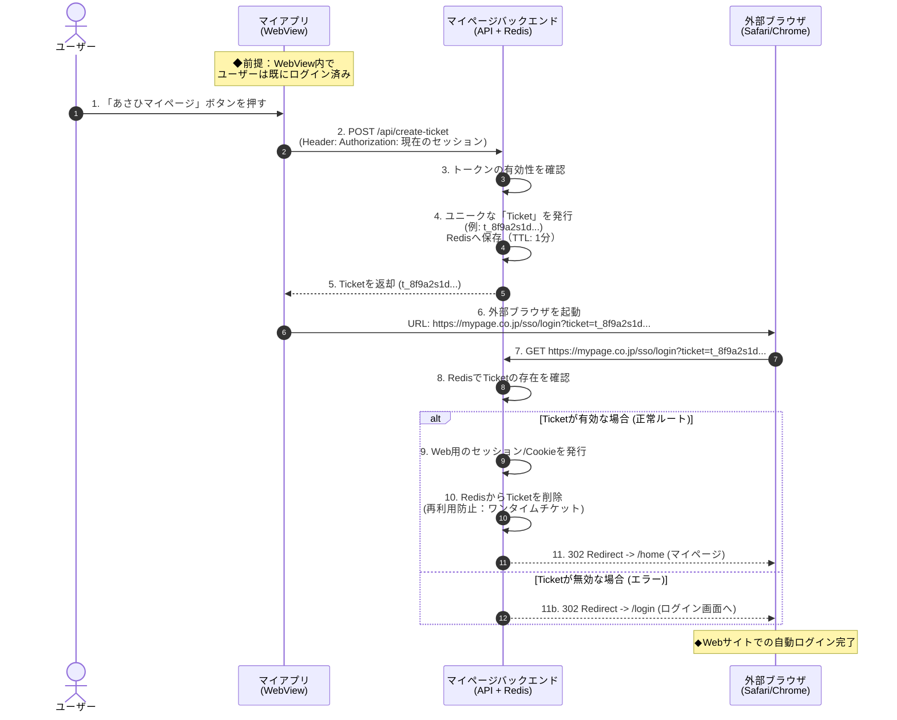
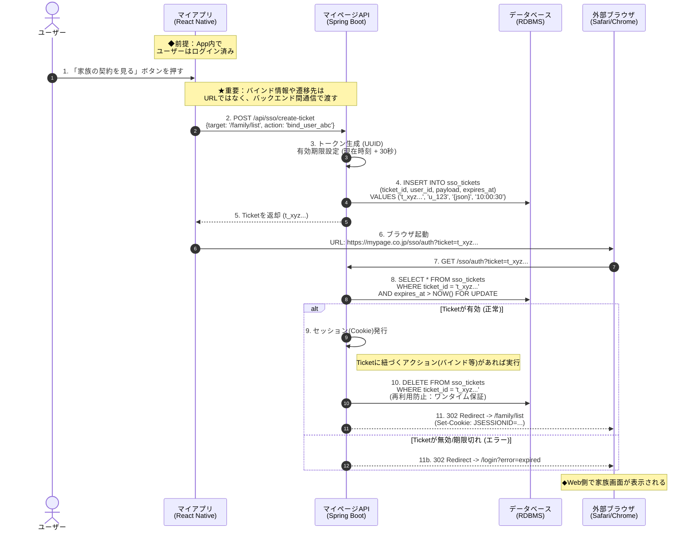
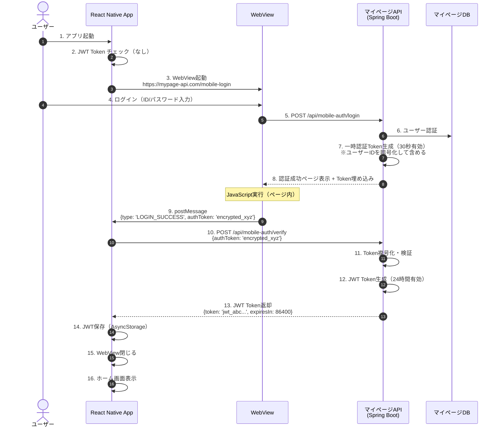
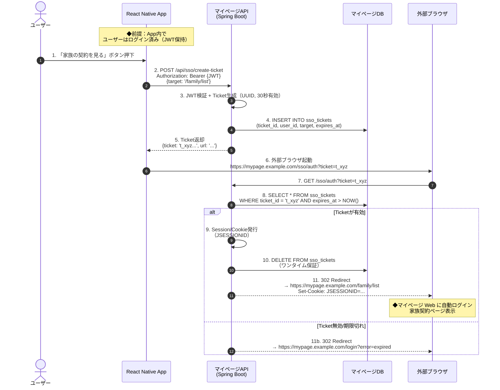
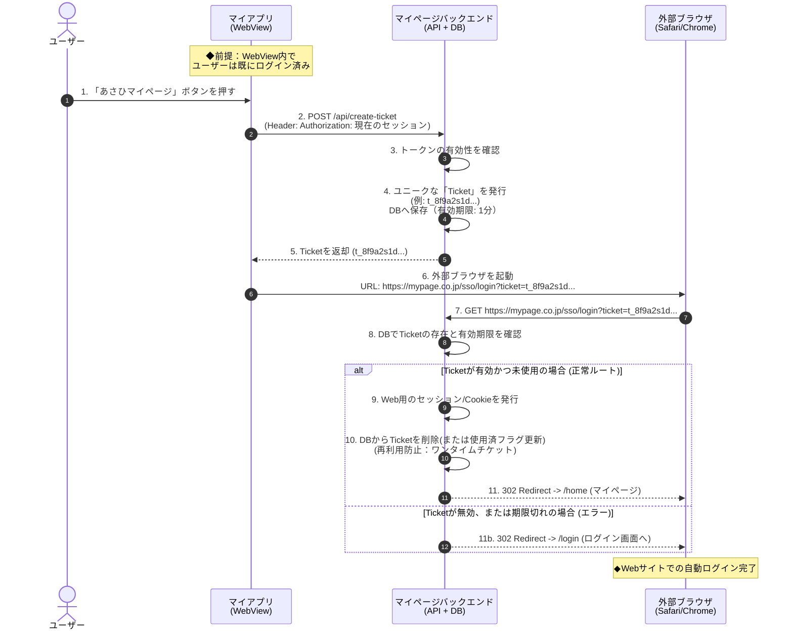

# SSO

```mermaid
sequenceDiagram
    autonumber
    actor User as ユーザー
    participant App as マイアプリ<br/>(WebView)
    participant API as マイページバックエンド<br/>(API + Redis)
    participant Browser as 外部ブラウザ<br/>(Safari/Chrome)

    Note over App: ◆前提：WebView内で<br/>ユーザーは既にログイン済み

    %% Step 1: User Action
    User->>App: 1. 「あさひマイページ」ボタンを押す

    %% Step 2: Request Ticket
    App->>API: 2. POST /api/create-ticket<br/>(Header: Authorization: 現在のセッション)

    %% Step 3: Generate Ticket
    API->>API: 3. トークンの有効性を確認
    API->>API: 4. ユニークな「Ticket」を発行<br/>(例: t_8f9a2s1d...)<br/>Redisへ保存（TTL: 1分）

    %% Step 4: Return Ticket
    API-->>App: 5. Ticketを返却 (t_8f9a2s1d...)

    %% Step 5: Open External Browser
    App->>Browser: 6. 外部ブラウザを起動<br/>URL: https://mypage.co.jp/sso/login?ticket=t_8f9a2s1d...

    %% Step 6: Browser Access
    Browser->>API: 7. GET https://mypage.co.jp/sso/login?ticket=t_8f9a2s1d...

    %% Step 7: Verify Ticket
    API->>API: 8. RedisでTicketの存在を確認

    alt Ticketが有効な場合 (正常ルート)
        API->>API: 9. Web用のセッション/Cookieを発行
        API->>API: 10. RedisからTicketを削除<br/>(再利用防止：ワンタイムチケット)
        API-->>Browser: 11. 302 Redirect -> /home (マイページ)
    else Ticketが無効な場合 (エラー)
        API-->>Browser: 11b. 302 Redirect -> /login (ログイン画面へ)
    end

    Note over Browser: ◆Webサイトでの自動ログイン完了
```

```mermaid
sequenceDiagram
    autonumber
    actor User as ユーザー
    participant App as マイアプリ<br/>(React Native)
    participant API as マイページAPI<br/>(Spring Boot)
    participant DB as データベース<br/>(RDBMS)
    participant Browser as 外部ブラウザ<br/>(Safari/Chrome)

    Note over App: ◆前提：App内で<br/>ユーザーはログイン済み

    %% Step 1: User Action
    User->>App: 1. 「家族の契約を見る」ボタンを押す

    %% Step 2: Request Ticket with Context
    Note over App, API: ★重要：バインド情報や遷移先は<br/>URLではなく、バックエンド間通信で渡す
    App->>API: 2. POST /api/sso/create-ticket<br/>{target: '/family/list', action: 'bind_user_abc'}

    %% Step 3: Generate & Store Ticket
    API->>API: 3. トークン生成 (UUID)<br/>有効期限設定 (現在時刻 + 30秒)
    API->>DB: 4. INSERT INTO sso_tickets<br/>(ticket_id, user_id, payload, expires_at)<br/>VALUES ('t_xyz...', 'u_123', '{json}', '10:00:30')

    %% Step 4: Return Ticket
    API-->>App: 5. Ticketを返却 (t_xyz...)

    %% Step 5: Open External Browser
    App->>Browser: 6. ブラウザ起動<br/>URL: https://mypage.co.jp/sso/auth?ticket=t_xyz...

    %% Step 6: Browser Access
    Browser->>API: 7. GET /sso/auth?ticket=t_xyz...

    %% Step 7: Verify Ticket
    API->>DB: 8. SELECT * FROM sso_tickets<br/>WHERE ticket_id = 't_xyz...'<br/>AND expires_at > NOW() FOR UPDATE

    alt Ticketが有効 (正常)
        API->>API: 9. セッション(Cookie)発行

        Note right of API: Ticketに紐づくアクション(バインド等)があれば実行

        API->>DB: 10. DELETE FROM sso_tickets<br/>WHERE ticket_id = 't_xyz...'<br/>(再利用防止：ワンタイム保証)

        API-->>Browser: 11. 302 Redirect -> /family/list<br/>(Set-Cookie: JSESSIONID=...)
    else Ticketが無効/期限切れ (エラー)
        API-->>Browser: 11b. 302 Redirect -> /login?error=expired
    end

    Note over Browser: ◆Web側で家族画面が表示される
```

```mermaid
sequenceDiagram
    autonumber
    actor User as ユーザー
    participant App as React Native App
    participant WebView as WebView
    participant MyPageAPI as マイページAPI<br/>(Spring Boot)
    participant DB as マイページDB

    User->>App: 1. アプリ起動
    App->>App: 2. JWT Token チェック（なし）

    App->>WebView: 3. WebView起動<br/>https://mypage-api.com/mobile-login

    User->>WebView: 4. ログイン（ID/パスワード入力）
    WebView->>MyPageAPI: 5. POST /api/mobile-auth/login

    MyPageAPI->>DB: 6. ユーザー認証
    MyPageAPI->>MyPageAPI: 7. 一時認証Token生成（30秒有効）<br/>※ユーザーIDを暗号化して含める

    MyPageAPI-->>WebView: 8. 認証成功ページ表示 + Token埋め込み

    Note over WebView: JavaScript実行（ページ内）
    WebView->>App: 9. postMessage<br/>{type: 'LOGIN_SUCCESS', authToken: 'encrypted_xyz'}

    App->>MyPageAPI: 10. POST /api/mobile-auth/verify<br/>{authToken: 'encrypted_xyz'}

    MyPageAPI->>MyPageAPI: 11. Token複号化・検証
    MyPageAPI->>MyPageAPI: 12. JWT Token生成（24時間有効）

    MyPageAPI-->>App: 13. JWT Token返却<br/>{token: 'jwt_abc...', expiresIn: 86400}

    App->>App: 14. JWT保存（AsyncStorage）
    App->>App: 15. WebView閉じる
    App->>App: 16. ホーム画面表示
```

```mermaid
sequenceDiagram
    autonumber
    actor User as ユーザー
    participant App as React Native App
    participant MyPageAPI as マイページAPI<br/>(Spring Boot)
    participant DB as マイページDB
    participant Browser as 外部ブラウザ

    Note over App: ◆前提：App内で<br/>ユーザーはログイン済み（JWT保持）

    User->>App: 1. 「家族の契約を見る」ボタン押下

    App->>MyPageAPI: 2. POST /api/sso/create-ticket<br/>Authorization: Bearer {JWT}<br/>{target: '/family/list'}

    MyPageAPI->>MyPageAPI: 3. JWT検証 + Ticket生成（UUID, 30秒有効）

    MyPageAPI->>DB: 4. INSERT INTO sso_tickets<br/>(ticket_id, user_id, target, expires_at)

    MyPageAPI-->>App: 5. Ticket返却<br/>{ticket: 't_xyz...', url: '...'}

    App->>Browser: 6. 外部ブラウザ起動<br/>https://mypage.example.com/sso/auth?ticket=t_xyz

    Browser->>MyPageAPI: 7. GET /sso/auth?ticket=t_xyz

    MyPageAPI->>DB: 8. SELECT * FROM sso_tickets<br/>WHERE ticket_id = 't_xyz' AND expires_at > NOW()

    alt Ticketが有効
        MyPageAPI->>MyPageAPI: 9. Session/Cookie発行<br/>（JSESSIONID）

        MyPageAPI->>DB: 10. DELETE FROM sso_tickets<br/>（ワンタイム保証）

        MyPageAPI-->>Browser: 11. 302 Redirect<br/>→ https://mypage.example.com/family/list<br/>Set-Cookie: JSESSIONID=...

        Note over Browser: ◆マイページ Web に自動ログイン<br/>家族契約ページ表示

    else Ticket無効/期限切れ
        MyPageAPI-->>Browser: 11b. 302 Redirect<br/>→ https://mypage.example.com/login?error=expired
    end
```

```mermaid
sequenceDiagram
    autonumber
    actor User as ユーザー
    participant App as マイアプリ<br/>(WebView)
    participant API as マイページバックエンド<br/>(API + DB)
    participant Browser as 外部ブラウザ<br/>(Safari/Chrome)

    Note over App: ◆前提：WebView内で<br/>ユーザーは既にログイン済み

    %% Step 1: User Action
    User->>App: 1. 「あさひマイページ」ボタンを押す

    %% Step 2: Request Ticket
    App->>API: 2. POST /api/create-ticket<br/>(Header: Authorization: 現在のセッション)

    %% Step 3: Generate Ticket
    API->>API: 3. トークンの有効性を確認
    API->>API: 4. ユニークな「Ticket」を発行<br/>(例: t_8f9a2s1d...)<br/>DBへ保存（有効期限: 1分）

    %% Step 4: Return Ticket
    API-->>App: 5. Ticketを返却 (t_8f9a2s1d...)

    %% Step 5: Open External Browser
    App->>Browser: 6. 外部ブラウザを起動<br/>URL: https://mypage.co.jp/sso/login?ticket=t_8f9a2s1d...

    %% Step 6: Browser Access
    Browser->>API: 7. GET https://mypage.co.jp/sso/login?ticket=t_8f9a2s1d...

    %% Step 7: Verify Ticket
    API->>API: 8. DBでTicketの存在と有効期限を確認

    alt Ticketが有効かつ未使用の場合 (正常ルート)
        API->>API: 9. Web用のセッション/Cookieを発行
        API->>API: 10. DBからTicketを削除(または使用済フラグ更新)<br/>(再利用防止：ワンタイムチケット)
        API-->>Browser: 11. 302 Redirect -> /home (マイページ)
    else Ticketが無効、または期限切れの場合 (エラー)
        API-->>Browser: 11b. 302 Redirect -> /login (ログイン画面へ)
    end

    Note over Browser: ◆Webサイトでの自動ログイン完了
```
