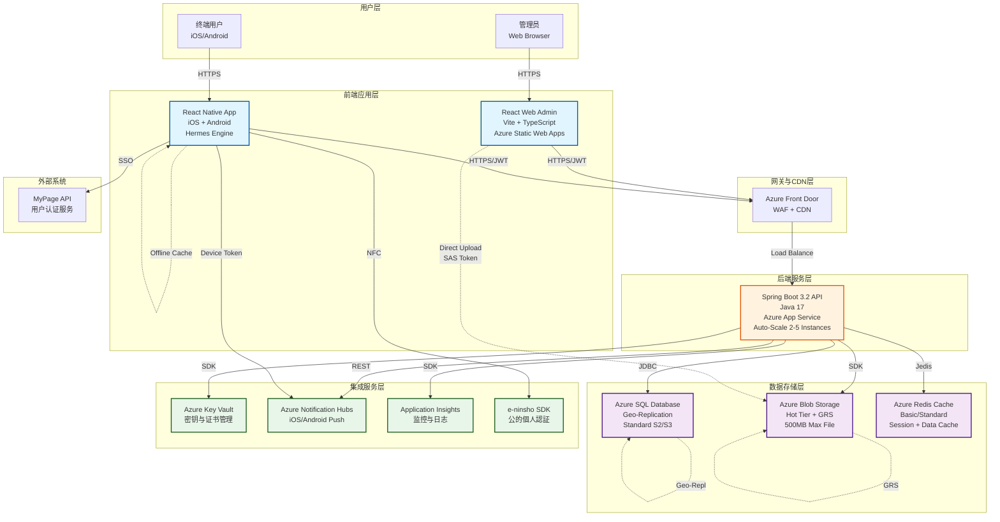
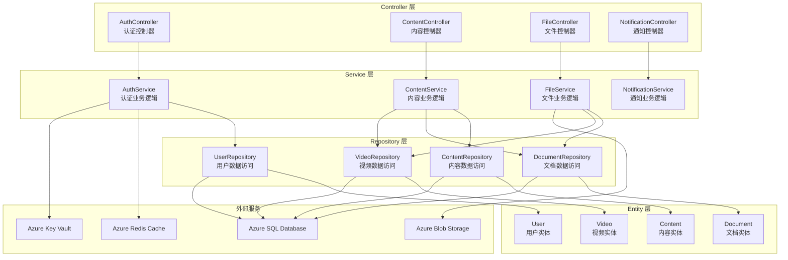
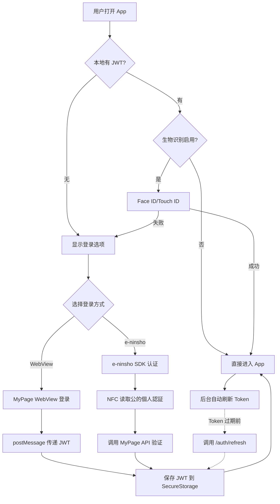
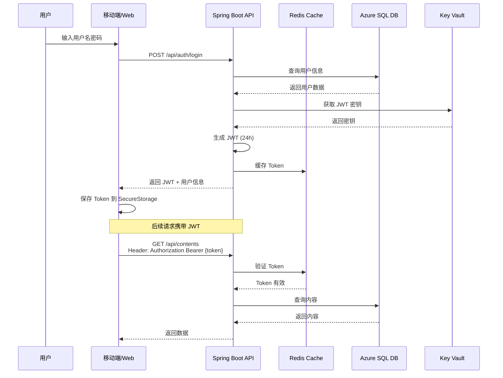
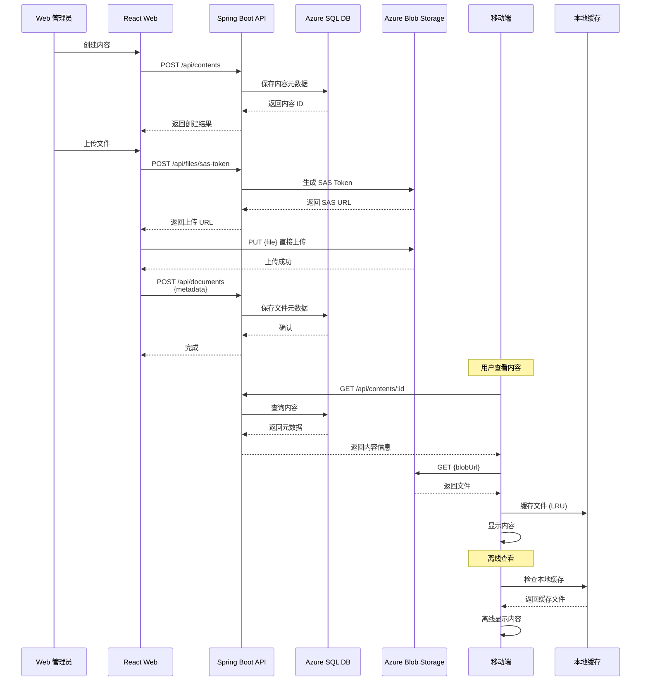
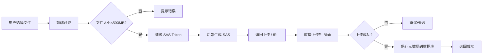
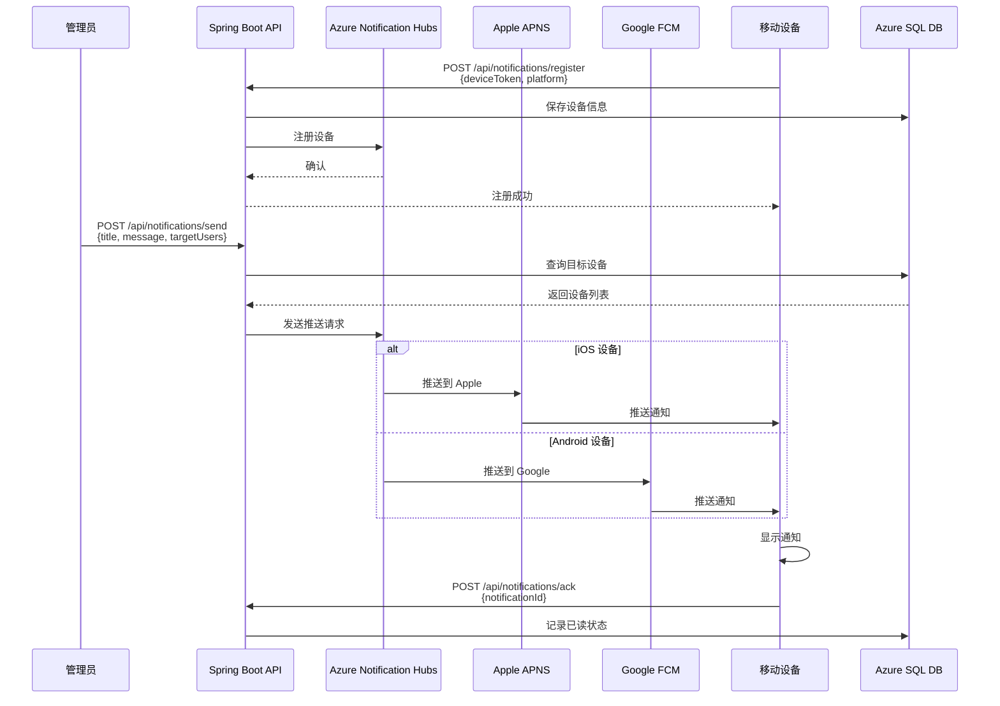
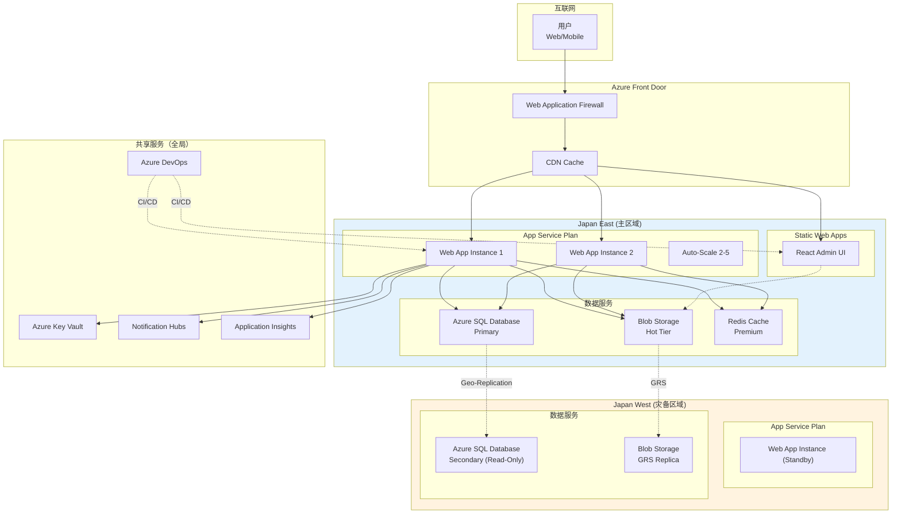
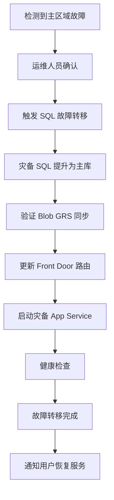
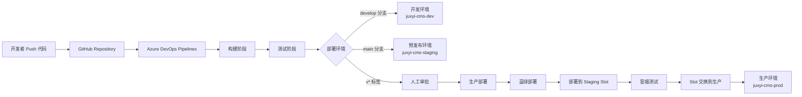

# JUXYI 内容管理系统 - 完整系统架构设计书

**版本：** 1.0.0  
**更新日期：** 2026-02-09  
**文档类型：** 系统架构设计书  
**适用范围：** App、Web、Spring Boot 三端完整架构

---

## 📑 目录

1. [系统概述 - 澄清式问答](#1-系统概述---澄清式问答)
2. [整体架构](#2-整体架构)
   - 2.1 [系统架构图](#21-系统架构图)
   - 2.2 [技术栈总览](#22-技术栈总览)
   - 2.3 [架构设计原则](#23-架构设计原则)
3. [后端架构（Spring Boot）](#3-后端架构spring-boot)
   - 3.1 [技术选型](#31-技术选型)
   - 3.2 [分层架构](#32-分层架构)
   - 3.3 [核心模块](#33-核心模块)
   - 3.4 [数据库设计](#34-数据库设计)
4. [Web 前端架构（React）](#4-web-前端架构react)
   - 4.1 [技术选型](#41-技术选型)
   - 4.2 [架构模式](#42-架构模式)
   - 4.3 [功能模块](#43-功能模块)
   - 4.4 [状态管理](#44-状态管理)
5. [移动端架构（React Native）](#5-移动端架构react-native)
   - 5.1 [技术选型](#51-技术选型)
   - 5.2 [架构模式](#52-架构模式)
   - 5.3 [认证流程](#53-认证流程)
   - 5.4 [离线功能](#54-离线功能)
6. [数据流设计](#6-数据流设计)
   - 6.1 [认证数据流](#61-认证数据流)
   - 6.2 [内容数据流](#62-内容数据流)
   - 6.3 [文件上传流](#63-文件上传流)
   - 6.4 [推送通知流](#64-推送通知流)
7. [模块划分](#7-模块划分)
   - 7.1 [后端模块](#71-后端模块)
   - 7.2 [Web 前端模块](#72-web-前端模块)
   - 7.3 [移动端模块](#73-移动端模块)
8. [接口关系](#8-接口关系)
   - 8.1 [API 端点总览](#81-api-端点总览)
   - 8.2 [认证接口](#82-认证接口)
   - 8.3 [内容管理接口](#83-内容管理接口)
   - 8.4 [文件管理接口](#84-文件管理接口)
   - 8.5 [通知接口](#85-通知接口)
9. [部署架构](#9-部署架构)
   - 9.1 [Azure 基础设施](#91-azure-基础设施)
   - 9.2 [多区域灾备](#92-多区域灾备)
   - 9.3 [CI/CD 流程](#93-cicd-流程)
   - 9.4 [环境配置](#94-环境配置)
10. [安全设计](#10-安全设计)
    - 10.1 [认证与授权](#101-认证与授权)
    - 10.2 [数据加密](#102-数据加密)
    - 10.3 [密钥管理](#103-密钥管理)
    - 10.4 [安全防护](#104-安全防护)
11. [性能优化](#11-性能优化)
    - 11.1 [缓存策略](#111-缓存策略)
    - 11.2 [数据库优化](#112-数据库优化)
    - 11.3 [前端优化](#113-前端优化)
    - 11.4 [移动端优化](#114-移动端优化)
12. [监控与运维](#12-监控与运维)
    - 12.1 [监控体系](#121-监控体系)
    - 12.2 [日志管理](#122-日志管理)
    - 12.3 [告警机制](#123-告警机制)
13. [附录](#13-附录)
    - 13.1 [技术栈版本](#131-技术栈版本)
    - 13.2 [容量规划](#132-容量规划)
    - 13.3 [术语表](#133-术语表)

---

## 1. 系统概述 - 澄清式问答

### Q1: JUXYI 系统的核心功能是什么？
**A:** JUXYI 是一个多端内容管理系统，核心功能包括：
- **内容管理**：支持文档（PDF）、视频、URL 链接的统一管理
- **多端访问**：提供 Web 管理后台和移动端查看应用
- **认证集成**：支持 e-ninsho SDK、生物识别、SSO 等多种认证方式
- **离线查看**：移动端支持内容缓存和离线访问
- **推送通知**：通过 Azure Notification Hubs 推送重要信息

### Q2: 系统采用什么架构模式？
**A:** 系统采用**三层架构 + 微服务化**设计：
- **表现层（前端）**：
  - React 18 Web 管理后台（管理员使用）
  - React Native 移动应用（终端用户使用）
- **业务逻辑层（后端）**：Spring Boot 3.2 RESTful API
- **数据层**：Azure SQL Database + Azure Blob Storage + Azure Redis Cache
- **基础设施层**：Azure PaaS 服务（App Service、Notification Hubs、Key Vault 等）

### Q3: 系统的目标用户规模是多少？
**A:** 
- **后端**：支持 1,000 并发用户
- **移动端**：目标 10,000+ 日本用户
- **Web 后台**：管理员和内容编辑人员（数十人规模）

### Q4: 系统部署在什么环境？
**A:** 完全基于 **Microsoft Azure** 云平台：
- **主区域**：Japan East（日本东部）
- **灾备区域**：Japan West（日本西部）
- **部署方式**：PaaS 服务为主，减少运维成本
- **CI/CD**：Azure DevOps Pipelines

### Q5: 系统如何保证高可用性？
**A:** 通过多层次的高可用设计：
- **多区域灾备**：数据库和 Blob 存储自动地理复制
- **负载均衡**：Azure Front Door + App Service 多实例
- **自动扩展**：基于 CPU/内存自动扩展 2-5 实例
- **蓝绿部署**：使用部署槽实现零停机更新
- **RPO < 5分钟，RTO < 1小时**

### Q6: 系统的安全策略是什么？
**A:** 多层次安全防护：
- **网络层**：Azure Front Door WAF（Web 应用防火墙）
- **应用层**：JWT 令牌认证 + HTTPS/TLS 1.3
- **数据层**：TDE（透明数据加密）+ 存储加密
- **密钥管理**：Azure Key Vault 统一管理
- **访问控制**：RBAC（基于角色的访问控制）

---

## 2. 整体架构

### 2.1 系统架构图




### 2.2 技术栈总览

#### 2.2.1 后端技术栈（Spring Boot）

| 类别 | 技术 | 版本 | 用途 |
|------|------|------|------|
| **框架** | Spring Boot | 3.2.x | 应用框架 |
| **语言** | Java | 17 LTS | 编程语言 |
| **安全** | Spring Security | 6.x | 安全框架 |
| **认证** | jjwt | 0.12.x | JWT 令牌生成/验证 |
| **数据库** | Azure SQL Database | Standard S2/S3 | 关系型数据库 |
| **ORM** | Spring Data JPA | 3.2.x | 数据访问层 |
| **缓存** | Azure Redis Cache | Basic/Standard | 分布式缓存 |
| **存储** | Azure Blob Storage | Hot Tier | 文件存储 |
| **定时任务** | Spring Scheduler | 内置 | 定时任务 |
| **文档** | SpringDoc OpenAPI | 2.x | API 文档 |
| **监控** | Application Insights | 3.x | 应用监控 |

#### 2.2.2 Web 前端技术栈（React）

| 类别 | 技术 | 版本 | 用途 |
|------|------|------|------|
| **框架** | React | 18.x | UI 框架 |
| **语言** | TypeScript | 5.3+ | 类型安全 |
| **构建工具** | Vite | 5.x | 快速构建 |
| **路由** | React Router | 6.x | SPA 路由 |
| **UI 库** | Ant Design | 5.x | 组件库 |
| **样式** | Tailwind CSS | 3.x | 原子化 CSS |
| **状态管理（服务端）** | TanStack Query | 5.x | 服务端状态同步 |
| **状态管理（客户端）** | Zustand | 4.x | 轻量级全局状态 |
| **表单** | React Hook Form | 7.x | 高性能表单 |
| **校验** | Zod | 3.x | Schema 验证 |
| **HTTP 客户端** | Axios | 1.x | API 请求 |
| **文件上传** | react-dropzone | 14.x | 拖拽上传 |
| **PDF 预览** | react-pdf | 7.x | PDF 渲染 |
| **视频播放** | video-react | 0.16.x | 视频播放器 |
| **代码质量** | ESLint + Prettier | 最新 | 代码规范 |

#### 2.2.3 移动端技术栈（React Native）

| 类别 | 技术 | 版本 | 用途 |
|------|------|------|------|
| **框架** | React Native | 0.73+ | 跨平台框架 |
| **语言** | TypeScript | 5.3+ | 类型安全 |
| **JS 引擎** | Hermes | 内置 | 快速启动 |
| **导航** | React Navigation | 6.x | 导航框架 |
| **UI 库** | React Native Paper | 5.x | Material Design |
| **状态管理** | Zustand + TanStack Query | 4.x + 5.x | 状态同步 |
| **HTTP 客户端** | Axios | 1.x | API 请求 |
| **认证** | e-ninsho SDK | 官方 SDK | 公的個人認証 |
| **生物识别** | React Native Biometrics | 3.x | Face ID/Touch ID |
| **PDF 查看** | react-native-pdf | 6.x | PDF 渲染 |
| **视频播放** | react-native-video | 6.x | 视频播放 |
| **WebView** | react-native-webview | 13.x | 内嵌网页 |
| **本地存储** | AsyncStorage | 1.x | 键值存储 |
| **安全存储** | react-native-keychain | 8.x | 加密存储 JWT |
| **文件缓存** | react-native-fs | 2.x | 离线缓存（LRU） |
| **推送通知** | Azure Notification Hubs | React Native SDK | 推送服务 |
| **监控** | Application Insights | React Native SDK | 应用监控 |

### 2.3 架构设计原则

#### 2.3.1 分层原则
- **后端**：Controller → Service → Repository → Entity 四层架构
- **前端**：Feature-based 架构，按功能模块独立组织
- **移动端**：Screen → Hook → Service → API 分层

#### 2.3.2 解耦原则
- RESTful API 统一接口，前后端分离
- 前端状态管理分离：服务端状态（TanStack Query）vs 客户端状态（Zustand）
- 移动端双 API 设计：CMS API + MyPage API

#### 2.3.3 安全原则
- JWT 令牌认证，24 小时过期
- HTTPS/TLS 1.3 全链路加密
- Azure Key Vault 集中式密钥管理
- 多因素认证支持（e-ninsho + 生物识别）

#### 2.3.4 性能原则
- 多级缓存：Redis（服务端）+ TanStack Query（前端）+ 本地缓存（移动端）
- CDN 加速：Azure Front Door
- 懒加载与代码分割
- 数据库索引优化

#### 2.3.5 可扩展原则
- 微服务化：各模块独立部署
- 水平扩展：App Service 自动扩展
- 插件化：功能模块可独立开发

#### 2.3.6 高可用原则
- 多区域部署：Japan East + Japan West
- 自动故障转移：Geo-Replication
- 健康检查：Application Insights
- 蓝绿部署：零停机更新

---

## 3. 后端架构（Spring Boot）

### 3.1 技术选型

#### 3.1.1 Spring Boot 3.2.x
- **选择理由**：
  - 成熟稳定的 Java 企业级框架
  - 内置 Tomcat，简化部署
  - 强大的依赖注入和 AOP 支持
  - 丰富的生态系统
- **核心特性**：
  - Auto-configuration 自动配置
  - Actuator 健康检查端点
  - Spring Data JPA 简化数据访问
  - Spring Security 企业级安全

#### 3.1.2 Azure SQL Database
- **选择理由**：
  - PaaS 服务，无需管理基础设施
  - 自动备份与地理复制
  - 高可用性 SLA 99.99%
  - 透明数据加密（TDE）
- **性能配置**：
  - Standard S2/S3 层级
  - 50-100 DTU（数据库吞吐量单位）
  - 支持 1,000 并发连接

#### 3.1.3 Azure Blob Storage
- **选择理由**：
  - 经济实惠的大文件存储
  - 支持 SAS 令牌临时授权
  - 自动地理冗余（GRS）
  - 与 CDN 集成
- **配置策略**：
  - Hot Tier 热存储层
  - 单文件最大 500MB
  - LRS/GRS 冗余选项

### 3.2 分层架构



### 3.3 核心模块

#### 3.3.1 认证模块（Authentication）


**功能**：
- 用户登录与注册
- JWT 令牌生成与验证
- 令牌刷新机制
- 密码加密（BCrypt）

**关键类**：
```java
@RestController
@RequestMapping("/api/auth")
public class AuthController {
    @PostMapping("/login")
    public ResponseEntity<AuthResponse> login(@RequestBody LoginRequest request);
    
    @PostMapping("/refresh")
    public ResponseEntity<AuthResponse> refresh(@RequestHeader("Authorization") String token);
    
    @PostMapping("/logout")
    public ResponseEntity<Void> logout();
}
```

**JWT 结构**：
```json
{
  "sub": "user123",
  "roles": ["ROLE_USER", "ROLE_ADMIN"],
  "exp": 1707475200,
  "iat": 1707388800
}
```

#### 3.3.2 内容管理模块（Content Management）

**功能**：
- CRUD 操作：文档、视频、URL 链接
- 内容分类与标签
- 内容搜索与过滤
- 内容发布状态管理

**数据模型**：
```java
@Entity
@Table(name = "contents")
public class Content {
    @Id
    @GeneratedValue(strategy = GenerationType.IDENTITY)
    private Long id;
    
    @Enumerated(EnumType.STRING)
    private ContentType type; // DOCUMENT, VIDEO, URL_LINK
    
    private String title;
    private String description;
    private String status; // DRAFT, PUBLISHED, ARCHIVED
    
    @OneToOne(mappedBy = "content", cascade = CascadeType.ALL)
    private Document document;
    
    @OneToOne(mappedBy = "content", cascade = CascadeType.ALL)
    private Video video;
    
    @OneToOne(mappedBy = "content", cascade = CascadeType.ALL)
    private UrlLink urlLink;
}
```

#### 3.3.3 文件管理模块（File Management）

**功能**：
- SAS 令牌生成（临时上传授权）
- 文件上传到 Azure Blob Storage
- 文件元数据管理
- 文件删除与清理

**上传流程**：
```java
@PostMapping("/api/files/sas-token")
public SasTokenResponse generateSasToken(@RequestParam String fileName) {
    // 生成 24 小时有效的 SAS 令牌
    String sasToken = blobService.generateSasToken(fileName, 24);
    String uploadUrl = String.format("%s/%s?%s", blobEndpoint, fileName, sasToken);
    
    return new SasTokenResponse(uploadUrl, sasToken);
}
```

#### 3.3.4 推送通知模块（Push Notification）

**功能**：
- 设备令牌注册
- iOS/Android 推送通知
- 通知模板管理
- 推送历史记录

**发送逻辑**：
```java
@Service
public class NotificationService {
    @Autowired
    private NotificationHubClient hubClient;
    
    public void sendToDevice(String deviceToken, String title, String message) {
        NotificationOutcome outcome = hubClient.sendDirectNotification(
            new AppleNotification(title, message),
            deviceToken
        );
    }
    
    public void sendToAllUsers(String title, String message) {
        hubClient.sendNotification(new AppleNotification(title, message));
    }
}
```

#### 3.3.5 定时任务模块（Scheduled Tasks）

**功能**：
- 过期文件清理（每日凌晨 3 点）
- 缓存同步（每小时）
- 数据库备份触发
- 日志归档

**配置示例**：
```java
@Configuration
@EnableScheduling
public class ScheduledTasks {
    @Scheduled(cron = "0 0 3 * * ?") // 每日 3:00 AM
    public void cleanupExpiredFiles() {
        fileService.deleteExpiredFiles(30); // 删除 30 天前的文件
    }
    
    @Scheduled(fixedRate = 3600000) // 每小时
    public void syncCache() {
        cacheService.syncRedisToDatabase();
    }
}
```

### 3.4 数据库设计

#### 3.4.1 核心表结构

**users 表**：
```sql
CREATE TABLE users (
    id BIGINT PRIMARY KEY IDENTITY(1,1),
    username NVARCHAR(50) UNIQUE NOT NULL,
    email NVARCHAR(100) UNIQUE NOT NULL,
    password_hash NVARCHAR(255) NOT NULL,
    role NVARCHAR(20) NOT NULL, -- ADMIN, USER
    created_at DATETIME2 DEFAULT GETDATE(),
    updated_at DATETIME2 DEFAULT GETDATE(),
    last_login_at DATETIME2,
    is_active BIT DEFAULT 1
);

CREATE INDEX idx_users_email ON users(email);
CREATE INDEX idx_users_username ON users(username);
```

**contents 表**：
```sql
CREATE TABLE contents (
    id BIGINT PRIMARY KEY IDENTITY(1,1),
    type NVARCHAR(20) NOT NULL, -- DOCUMENT, VIDEO, URL_LINK
    title NVARCHAR(200) NOT NULL,
    description NVARCHAR(MAX),
    status NVARCHAR(20) NOT NULL, -- DRAFT, PUBLISHED, ARCHIVED
    created_by BIGINT NOT NULL,
    created_at DATETIME2 DEFAULT GETDATE(),
    updated_at DATETIME2 DEFAULT GETDATE(),
    published_at DATETIME2,
    view_count INT DEFAULT 0,
    
    FOREIGN KEY (created_by) REFERENCES users(id)
);

CREATE INDEX idx_contents_type ON contents(type);
CREATE INDEX idx_contents_status ON contents(status);
CREATE INDEX idx_contents_created_at ON contents(created_at DESC);
```

**documents 表**：
```sql
CREATE TABLE documents (
    id BIGINT PRIMARY KEY IDENTITY(1,1),
    content_id BIGINT UNIQUE NOT NULL,
    file_name NVARCHAR(255) NOT NULL,
    file_size BIGINT NOT NULL, -- bytes
    mime_type NVARCHAR(50) NOT NULL,
    blob_url NVARCHAR(500) NOT NULL, -- Azure Blob URL
    page_count INT,
    thumbnail_url NVARCHAR(500),
    
    FOREIGN KEY (content_id) REFERENCES contents(id) ON DELETE CASCADE
);
```

**videos 表**：
```sql
CREATE TABLE videos (
    id BIGINT PRIMARY KEY IDENTITY(1,1),
    content_id BIGINT UNIQUE NOT NULL,
    file_name NVARCHAR(255) NOT NULL,
    file_size BIGINT NOT NULL,
    duration_seconds INT,
    resolution NVARCHAR(20), -- 1080p, 720p, etc.
    blob_url NVARCHAR(500) NOT NULL,
    thumbnail_url NVARCHAR(500),
    
    FOREIGN KEY (content_id) REFERENCES contents(id) ON DELETE CASCADE
);
```

**url_links 表**：
```sql
CREATE TABLE url_links (
    id BIGINT PRIMARY KEY IDENTITY(1,1),
    content_id BIGINT UNIQUE NOT NULL,
    url NVARCHAR(1000) NOT NULL,
    favicon_url NVARCHAR(500),
    
    FOREIGN KEY (content_id) REFERENCES contents(id) ON DELETE CASCADE
);
```

**notification_devices 表**：
```sql
CREATE TABLE notification_devices (
    id BIGINT PRIMARY KEY IDENTITY(1,1),
    user_id BIGINT NOT NULL,
    device_token NVARCHAR(255) UNIQUE NOT NULL,
    platform NVARCHAR(10) NOT NULL, -- IOS, ANDROID
    created_at DATETIME2 DEFAULT GETDATE(),
    last_active_at DATETIME2 DEFAULT GETDATE(),
    
    FOREIGN KEY (user_id) REFERENCES users(id) ON DELETE CASCADE
);

CREATE INDEX idx_devices_user_id ON notification_devices(user_id);
CREATE INDEX idx_devices_token ON notification_devices(device_token);
```

#### 3.4.2 数据库优化策略

**索引优化**：
- 主键自增索引
- 外键索引自动创建
- 常用查询字段添加索引（type, status, created_at）
- 避免过度索引

**查询优化**：
- 分页查询使用 `OFFSET-FETCH`
- 避免 SELECT *，只查询需要的字段
- 使用存储过程优化复杂查询
- 定期更新统计信息

**连接池配置**：
```yaml
spring:
  datasource:
    hikari:
      maximum-pool-size: 20
      minimum-idle: 5
      connection-timeout: 30000
      idle-timeout: 600000
      max-lifetime: 1800000
```

---

## 4. Web 前端架构（React）

### 4.1 技术选型

#### 4.1.1 React 18 + TypeScript
- **选择理由**：
  - 组件化开发，代码复用性高
  - 虚拟 DOM，性能优秀
  - TypeScript 提供类型安全
  - 丰富的生态系统
- **核心特性**：
  - Hooks API（useState, useEffect, useCallback, useMemo）
  - Concurrent Mode（并发渲染）
  - Suspense（代码分割与懒加载）

#### 4.1.2 Vite 5
- **选择理由**：
  - 极速冷启动（ESM 原生支持）
  - 热模块替换（HMR）速度快
  - 生产构建基于 Rollup
  - 开箱即用的 TypeScript 支持
- **构建优化**：
  - 代码分割（Code Splitting）
  - Tree Shaking
  - 资源压缩（Gzip/Brotli）
  - 懒加载路由

#### 4.1.3 Ant Design 5
- **选择理由**：
  - 企业级 UI 组件库
  - 开箱即用的管理后台组件
  - 可定制主题
  - 无障碍访问（Accessibility）
- **常用组件**：
  - Table（数据表格）
  - Form（表单）
  - Modal（对话框）
  - Upload（文件上传）

### 4.2 架构模式

#### 4.2.1 Feature-based 架构

```
src/
├── features/
│   ├── auth/                    # 认证模块
│   │   ├── components/          # 认证相关组件
│   │   │   ├── LoginForm.tsx
│   │   │   └── PrivateRoute.tsx
│   │   ├── hooks/               # 认证 Hooks
│   │   │   └── useAuth.ts
│   │   ├── services/            # 认证服务
│   │   │   └── authService.ts
│   │   ├── types/               # 类型定义
│   │   │   └── auth.types.ts
│   │   └── index.ts
│   ├── dashboard/               # 仪表盘模块
│   │   ├── components/
│   │   │   ├── StatsCard.tsx
│   │   │   ├── ActivityChart.tsx
│   │   │   └── RecentContent.tsx
│   │   ├── hooks/
│   │   │   └── useDashboard.ts
│   │   └── pages/
│   │       └── DashboardPage.tsx
│   ├── contents/                # 内容管理模块
│   │   ├── components/
│   │   │   ├── ContentList.tsx
│   │   │   ├── ContentForm.tsx
│   │   │   └── ContentDetail.tsx
│   │   ├── hooks/
│   │   │   ├── useContents.ts
│   │   │   └── useContentMutation.ts
│   │   ├── services/
│   │   │   └── contentService.ts
│   │   └── pages/
│   │       ├── ContentsPage.tsx
│   │       └── ContentEditPage.tsx
│   ├── documents/               # 文档管理
│   ├── videos/                  # 视频管理
│   ├── notifications/           # 通知管理
│   └── settings/                # 系统设置
├── shared/
│   ├── components/              # 共享组件
│   │   ├── Layout/
│   │   │   ├── AppLayout.tsx
│   │   │   ├── Header.tsx
│   │   │   └── Sidebar.tsx
│   │   ├── ErrorBoundary.tsx
│   │   └── Loading.tsx
│   ├── hooks/                   # 共享 Hooks
│   │   └── useDebounce.ts
│   ├── utils/                   # 工具函数
│   │   ├── format.ts
│   │   └── validation.ts
│   └── types/                   # 全局类型
│       └── common.types.ts
├── config/
│   ├── axios.config.ts          # Axios 配置
│   └── queryClient.config.ts   # TanStack Query 配置
└── App.tsx
```

#### 4.2.2 状态管理策略

**服务端状态（TanStack Query）**：
- 管理所有 API 请求数据
- 自动缓存与同步
- 后台重新验证（staleTime: 5分钟）
- 乐观更新（Optimistic Updates）

```typescript
// useContents.ts
import { useQuery, useMutation, useQueryClient } from '@tanstack/react-query';

export const useContents = () => {
  return useQuery({
    queryKey: ['contents'],
    queryFn: contentService.getAll,
    staleTime: 5 * 60 * 1000, // 5 minutes
  });
};

export const useCreateContent = () => {
  const queryClient = useQueryClient();
  
  return useMutation({
    mutationFn: contentService.create,
    onSuccess: () => {
      queryClient.invalidateQueries({ queryKey: ['contents'] });
    },
  });
};
```

**客户端状态（Zustand）**：
- 管理 UI 状态（侧边栏展开/折叠、主题、语言等）
- 全局用户信息
- 临时表单数据

```typescript
// authStore.ts
import { create } from 'zustand';
import { persist } from 'zustand/middleware';

interface AuthState {
  user: User | null;
  token: string | null;
  setAuth: (user: User, token: string) => void;
  clearAuth: () => void;
}

export const useAuthStore = create<AuthState>()(
  persist(
    (set) => ({
      user: null,
      token: null,
      setAuth: (user, token) => set({ user, token }),
      clearAuth: () => set({ user: null, token: null }),
    }),
    {
      name: 'auth-storage',
    }
  )
);
```

### 4.3 功能模块

#### 4.3.1 认证模块（Auth）

**登录表单**：
```typescript
import { Form, Input, Button } from 'antd';
import { useNavigate } from 'react-router-dom';
import { useAuthStore } from '../store/authStore';
import { authService } from '../services/authService';

export const LoginForm = () => {
  const navigate = useNavigate();
  const setAuth = useAuthStore(state => state.setAuth);

  const onFinish = async (values: { email: string; password: string }) => {
    const { user, token } = await authService.login(values);
    setAuth(user, token);
    navigate('/dashboard');
  };

  return (
    <Form onFinish={onFinish}>
      <Form.Item name="email" rules={[{ required: true, type: 'email' }]}>
        <Input placeholder="Email" />
      </Form.Item>
      <Form.Item name="password" rules={[{ required: true }]}>
        <Input.Password placeholder="Password" />
      </Form.Item>
      <Button type="primary" htmlType="submit">
        Login
      </Button>
    </Form>
  );
};
```

**私有路由保护**：
```typescript
import { Navigate } from 'react-router-dom';
import { useAuthStore } from '../store/authStore';

export const PrivateRoute = ({ children }: { children: React.ReactNode }) => {
  const token = useAuthStore(state => state.token);
  
  if (!token) {
    return <Navigate to="/login" replace />;
  }
  
  return <>{children}</>;
};
```

#### 4.3.2 内容管理模块（Contents）

**内容列表**：
```typescript
import { Table, Button, Space } from 'antd';
import { useContents, useDeleteContent } from '../hooks/useContents';

export const ContentList = () => {
  const { data: contents, isLoading } = useContents();
  const deleteMutation = useDeleteContent();

  const columns = [
    { title: 'Title', dataIndex: 'title', key: 'title' },
    { title: 'Type', dataIndex: 'type', key: 'type' },
    { title: 'Status', dataIndex: 'status', key: 'status' },
    {
      title: 'Actions',
      key: 'actions',
      render: (_, record) => (
        <Space>
          <Button onClick={() => handleEdit(record.id)}>Edit</Button>
          <Button danger onClick={() => deleteMutation.mutate(record.id)}>
            Delete
          </Button>
        </Space>
      ),
    },
  ];

  return <Table columns={columns} dataSource={contents} loading={isLoading} />;
};
```

#### 4.3.3 文件上传模块（Documents/Videos）

**SAS 令牌上传流程**：
```typescript
import { Upload, message } from 'antd';
import axios from 'axios';

export const DocumentUpload = () => {
  const customRequest = async (options: any) => {
    const { file, onSuccess, onError, onProgress } = options;

    try {
      // Step 1: 获取 SAS 令牌
      const { data } = await axios.post('/api/files/sas-token', {
        fileName: file.name,
      });

      // Step 2: 直接上传到 Azure Blob
      await axios.put(data.uploadUrl, file, {
        headers: { 'x-ms-blob-type': 'BlockBlob' },
        onUploadProgress: (e) => {
          onProgress({ percent: (e.loaded / e.total) * 100 });
        },
      });

      // Step 3: 通知后端保存元数据
      await axios.post('/api/documents', {
        fileName: file.name,
        fileSize: file.size,
        blobUrl: data.blobUrl,
      });

      onSuccess(null, file);
      message.success('Upload successful!');
    } catch (error) {
      onError(error);
      message.error('Upload failed!');
    }
  };

  return (
    <Upload customRequest={customRequest} maxCount={1} accept=".pdf">
      <Button>Upload PDF</Button>
    </Upload>
  );
};
```

### 4.4 状态管理

#### 4.4.1 TanStack Query 配置

```typescript
// queryClient.config.ts
import { QueryClient } from '@tanstack/react-query';

export const queryClient = new QueryClient({
  defaultOptions: {
    queries: {
      staleTime: 5 * 60 * 1000, // 5 minutes
      cacheTime: 10 * 60 * 1000, // 10 minutes
      retry: 1,
      refetchOnWindowFocus: false,
    },
    mutations: {
      retry: 0,
    },
  },
});
```

#### 4.4.2 Axios 拦截器

```typescript
// axios.config.ts
import axios from 'axios';
import { useAuthStore } from '../store/authStore';

const apiClient = axios.create({
  baseURL: import.meta.env.VITE_API_BASE_URL,
  timeout: 30000,
});

// Request interceptor: 自动注入 JWT
apiClient.interceptors.request.use((config) => {
  const token = useAuthStore.getState().token;
  if (token) {
    config.headers.Authorization = `Bearer ${token}`;
  }
  return config;
});

// Response interceptor: 处理 401 错误
apiClient.interceptors.response.use(
  (response) => response,
  (error) => {
    if (error.response?.status === 401) {
      useAuthStore.getState().clearAuth();
      window.location.href = '/login';
    }
    return Promise.reject(error);
  }
);

export default apiClient;
```

---

## 5. 移动端架构（React Native）

### 5.1 技术选型

#### 5.1.1 React Native 0.73+
- **选择理由**：
  - 跨平台开发，代码复用率高（iOS + Android）
  - 原生性能，接近原生应用
  - 热更新支持（CodePush）
  - 丰富的第三方库
- **核心特性**：
  - Hermes 引擎（快速启动）
  - Fabric 新架构（性能提升）
  - TurboModules（高效原生模块）

#### 5.1.2 React Native Paper 5
- **选择理由**：
  - Material Design 3 规范
  - 跨平台 UI 一致性
  - 主题定制简单
  - 组件丰富
- **常用组件**：
  - Card、Button、TextInput
  - FAB（浮动按钮）
  - Snackbar（提示消息）

#### 5.1.3 React Navigation 6
- **选择理由**：
  - React Native 官方推荐
  - 支持多种导航模式（Stack, Tab, Drawer）
  - 深度链接支持
  - 类型安全（TypeScript）

### 5.2 架构模式

#### 5.2.1 目录结构

```
src/
├── screens/                     # 页面组件
│   ├── auth/
│   │   ├── LoginScreen.tsx
│   │   └── WebViewLoginScreen.tsx
│   ├── home/
│   │   └── HomeScreen.tsx
│   ├── content/
│   │   ├── ContentListScreen.tsx
│   │   └── ContentDetailScreen.tsx
│   ├── collection/
│   │   └── QRScanScreen.tsx
│   ├── notification/
│   │   └── NotificationScreen.tsx
│   └── settings/
│       └── SettingsScreen.tsx
├── components/                  # 共享组件
│   ├── ContentCard.tsx
│   ├── PDFViewer.tsx
│   ├── VideoPlayer.tsx
│   └── Loading.tsx
├── hooks/                       # 自定义 Hooks
│   ├── useAuth.ts
│   ├── useContents.ts
│   ├── useBiometric.ts
│   └── useOfflineCache.ts
├── services/                    # 业务服务
│   ├── api/
│   │   ├── cmsApi.ts
│   │   └── myPageApi.ts
│   ├── auth/
│   │   ├── eninshoService.ts
│   │   └── biometricService.ts
│   ├── storage/
│   │   ├── secureStorage.ts
│   │   └── cacheService.ts
│   └── notification/
│       └── notificationService.ts
├── navigation/                  # 导航配置
│   ├── AppNavigator.tsx
│   ├── AuthNavigator.tsx
│   └── MainNavigator.tsx
├── store/                       # Zustand 状态管理
│   ├── authStore.ts
│   ├── contentStore.ts
│   └── settingsStore.ts
├── types/                       # 类型定义
│   ├── content.types.ts
│   └── auth.types.ts
├── utils/                       # 工具函数
│   ├── format.ts
│   └── validation.ts
└── config/
    ├── api.config.ts
    └── cache.config.ts
```

### 5.3 认证流程

#### 5.3.1 多认证方式集成



#### 5.3.2 WebView 登录实现

```typescript
import { WebView } from 'react-native-webview';
import { useAuthStore } from '../store/authStore';

export const WebViewLoginScreen = () => {
  const setAuth = useAuthStore(state => state.setAuth);

  const handleMessage = (event: any) => {
    try {
      const { type, payload } = JSON.parse(event.nativeEvent.data);
      
      if (type === 'LOGIN_SUCCESS') {
        const { token, user } = payload;
        setAuth(user, token);
        navigation.navigate('Home');
      }
    } catch (error) {
      console.error('WebView message error:', error);
    }
  };

  return (
    <WebView
      source={{ uri: 'https://mypage.example.com/login' }}
      onMessage={handleMessage}
      injectedJavaScript={`
        window.addEventListener('message', (event) => {
          if (event.data.type === 'LOGIN_SUCCESS') {
            window.ReactNativeWebView.postMessage(JSON.stringify(event.data));
          }
        });
      `}
    />
  );
};
```

#### 5.3.3 e-ninsho SDK 集成

```typescript
import EninshoSDK from 'react-native-eninsho';
import { myPageApi } from '../services/api/myPageApi';

export const useEninshoAuth = () => {
  const setAuth = useAuthStore(state => state.setAuth);

  const authenticate = async () => {
    try {
      // Step 1: NFC 读取公的個人認証
      const publicId = await EninshoSDK.readCard();
      
      // Step 2: 调用 MyPage API 验证
      const { token, user } = await myPageApi.verifyEninsho(publicId);
      
      // Step 3: 保存 JWT
      await SecureStorage.setItem('auth_token', token);
      setAuth(user, token);
      
      return { success: true };
    } catch (error) {
      return { success: false, error };
    }
  };

  return { authenticate };
};
```

#### 5.3.4 生物识别认证

```typescript
import ReactNativeBiometrics from 'react-native-biometrics';

export const useBiometricAuth = () => {
  const checkAvailability = async () => {
    const { available, biometryType } = await ReactNativeBiometrics.isSensorAvailable();
    return { available, type: biometryType }; // FaceID, TouchID, Fingerprint
  };

  const authenticate = async () => {
    try {
      const { success } = await ReactNativeBiometrics.simplePrompt({
        promptMessage: 'Confirm your identity',
      });
      
      if (success) {
        // 从 SecureStorage 获取 JWT
        const token = await SecureStorage.getItem('auth_token');
        return { success: true, token };
      }
      
      return { success: false };
    } catch (error) {
      return { success: false, error };
    }
  };

  return { checkAvailability, authenticate };
};
```

### 5.4 离线功能

#### 5.4.1 本地缓存策略

**LRU 缓存机制**：
```typescript
import RNFS from 'react-native-fs';

const CACHE_DIR = `${RNFS.DocumentDirectoryPath}/cache`;
const MAX_CACHE_SIZE = 500 * 1024 * 1024; // 500MB

export class CacheService {
  private cacheIndex: Map<string, { size: number; timestamp: number }> = new Map();

  async cacheFile(url: string, data: Blob): Promise<string> {
    const fileName = this.hashUrl(url);
    const filePath = `${CACHE_DIR}/${fileName}`;

    // Check cache size
    await this.ensureCacheSize(data.size);

    // Save file
    await RNFS.writeFile(filePath, data, 'base64');

    // Update index
    this.cacheIndex.set(fileName, {
      size: data.size,
      timestamp: Date.now(),
    });

    return filePath;
  }

  async getCachedFile(url: string): Promise<string | null> {
    const fileName = this.hashUrl(url);
    const filePath = `${CACHE_DIR}/${fileName}`;

    const exists = await RNFS.exists(filePath);
    if (exists) {
      // Update access timestamp
      this.cacheIndex.get(fileName)!.timestamp = Date.now();
      return filePath;
    }

    return null;
  }

  private async ensureCacheSize(newFileSize: number) {
    let currentSize = Array.from(this.cacheIndex.values())
      .reduce((sum, item) => sum + item.size, 0);

    if (currentSize + newFileSize > MAX_CACHE_SIZE) {
      // Sort by timestamp (LRU)
      const sortedEntries = Array.from(this.cacheIndex.entries())
        .sort((a, b) => a[1].timestamp - b[1].timestamp);

      // Remove old files
      for (const [fileName, meta] of sortedEntries) {
        await RNFS.unlink(`${CACHE_DIR}/${fileName}`);
        this.cacheIndex.delete(fileName);
        currentSize -= meta.size;

        if (currentSize + newFileSize <= MAX_CACHE_SIZE) {
          break;
        }
      }
    }
  }

  private hashUrl(url: string): string {
    // Simple hash function
    return url.split('').reduce((hash, char) => {
      return ((hash << 5) - hash) + char.charCodeAt(0);
    }, 0).toString(36);
  }
}
```

#### 5.4.2 离线内容查看

```typescript
import { cacheService } from '../services/storage/cacheService';

export const useOfflineContent = (contentId: string) => {
  const [content, setContent] = useState<Content | null>(null);
  const [loading, setLoading] = useState(true);
  const [isOffline, setIsOffline] = useState(false);

  useEffect(() => {
    const loadContent = async () => {
      try {
        // Try network first
        const data = await contentApi.getById(contentId);
        setContent(data);

        // Cache for offline use
        if (data.fileUrl) {
          await cacheService.cacheFile(data.fileUrl, data);
        }
      } catch (error) {
        // Fallback to cache
        const cached = await cacheService.getCachedFile(contentId);
        if (cached) {
          setContent(cached);
          setIsOffline(true);
        } else {
          throw error;
        }
      } finally {
        setLoading(false);
      }
    };

    loadContent();
  }, [contentId]);

  return { content, loading, isOffline };
};
```

---

## 6. 数据流设计

### 6.1 认证数据流



### 6.2 内容数据流



### 6.3 文件上传流



**关键点**：
- **SAS Token 策略**：避免大文件占用后端带宽
- **直接上传**：前端 → Azure Blob，不经过后端
- **元数据分离**：文件存储在 Blob，元数据在 SQL
- **失败重试**：前端自动重试机制

### 6.4 推送通知流



---

## 7. 模块划分

### 7.1 后端模块

| 模块名称 | 功能描述 | 主要类 | 依赖服务 |
|---------|---------|-------|---------|
| **auth** | 用户认证与授权 | AuthController, AuthService, JwtTokenProvider | Azure Key Vault, Redis |
| **content** | 内容管理（CRUD） | ContentController, ContentService, ContentRepository | Azure SQL DB |
| **document** | 文档管理 | DocumentController, DocumentService | Azure Blob, SQL DB |
| **video** | 视频管理 | VideoController, VideoService | Azure Blob, SQL DB |
| **urllink** | URL 链接管理 | UrlLinkController, UrlLinkService | Azure SQL DB |
| **file** | 文件上传/下载 | FileController, BlobStorageService | Azure Blob Storage |
| **notification** | 推送通知 | NotificationController, NotificationService | Azure Notification Hubs |
| **user** | 用户管理 | UserController, UserService | Azure SQL DB |
| **dashboard** | 数据统计 | DashboardController, DashboardService | Redis, SQL DB |
| **schedule** | 定时任务 | ScheduledTasks | Redis, SQL DB, Blob |

### 7.2 Web 前端模块

| 模块名称 | 路由路径 | 功能描述 | 主要组件 |
|---------|---------|---------|---------|
| **auth** | `/login` | 登录/登出 | LoginForm, PrivateRoute |
| **dashboard** | `/dashboard` | 数据统计仪表盘 | StatsCard, ActivityChart, RecentContent |
| **contents** | `/contents` | 内容列表与管理 | ContentList, ContentForm, ContentDetail |
| **documents** | `/documents` | 文档管理 | DocumentList, DocumentUpload, PDFPreview |
| **videos** | `/videos` | 视频管理 | VideoList, VideoUpload, VideoPlayer |
| **url-links** | `/url-links` | URL 链接管理 | UrlLinkList, UrlLinkForm |
| **notifications** | `/notifications` | 推送通知管理 | NotificationList, NotificationForm |
| **users** | `/users` | 用户管理 | UserList, UserForm |
| **settings** | `/settings` | 系统设置 | GeneralSettings, SecuritySettings |

### 7.3 移动端模块

| 模块名称 | 导航路径 | 功能描述 | 主要屏幕 |
|---------|---------|---------|---------|
| **auth** | `Auth` | 多方式认证 | LoginScreen, WebViewLoginScreen, BiometricScreen |
| **home** | `Home` | 首页与内容动态 | HomeScreen, ContentFeed |
| **content** | `Content` | 内容浏览与查看 | ContentListScreen, ContentDetailScreen, PDFViewer, VideoPlayer |
| **collection** | `Collection` | 活动集章（QR 扫码） | QRScanScreen, CollectionScreen |
| **notification** | `Notification` | 通知中心 | NotificationListScreen, NotificationDetailScreen |
| **settings** | `Settings` | 设置与账户 | SettingsScreen, AccountScreen, NotificationSettingsScreen |
| **webview** | `WebView` | MyPage 网页集成 | MyPageWebViewScreen (SSO 集成) |

---

## 8. 接口关系

### 8.1 API 端点总览

#### 8.1.1 后端 API 端点

| 分类 | 端点 | 方法 | 功能 |
|-----|------|------|------|
| **认证** | `/api/auth/login` | POST | 用户登录 |
| | `/api/auth/refresh` | POST | 刷新 Token |
| | `/api/auth/logout` | POST | 用户登出 |
| **内容** | `/api/contents` | GET | 获取内容列表 |
| | `/api/contents/:id` | GET | 获取内容详情 |
| | `/api/contents` | POST | 创建内容 |
| | `/api/contents/:id` | PUT | 更新内容 |
| | `/api/contents/:id` | DELETE | 删除内容 |
| **文档** | `/api/documents` | GET | 获取文档列表 |
| | `/api/documents/:id` | GET | 获取文档详情 |
| | `/api/documents` | POST | 创建文档记录 |
| **视频** | `/api/videos` | GET | 获取视频列表 |
| | `/api/videos/:id` | GET | 获取视频详情 |
| | `/api/videos` | POST | 创建视频记录 |
| **文件** | `/api/files/sas-token` | POST | 生成 SAS 上传令牌 |
| | `/api/files/download/:id` | GET | 下载文件 |
| **通知** | `/api/notifications/register` | POST | 注册设备 |
| | `/api/notifications/send` | POST | 发送推送 |
| | `/api/notifications` | GET | 获取通知列表 |
| **用户** | `/api/users` | GET | 获取用户列表 |
| | `/api/users/:id` | GET | 获取用户详情 |
| | `/api/users/:id` | PUT | 更新用户信息 |
| **仪表盘** | `/api/dashboard/stats` | GET | 获取统计数据 |

### 8.2 认证接口

#### POST /api/auth/login
**请求**：
```json
{
  "email": "admin@example.com",
  "password": "password123"
}
```

**响应**：
```json
{
  "token": "eyJhbGciOiJIUzI1NiIsInR5cCI6IkpXVCJ9...",
  "refreshToken": "refresh_token_here",
  "user": {
    "id": 1,
    "username": "admin",
    "email": "admin@example.com",
    "role": "ADMIN"
  },
  "expiresIn": 86400
}
```

#### POST /api/auth/refresh
**请求头**：
```
Authorization: Bearer {refresh_token}
```

**响应**：
```json
{
  "token": "new_jwt_token",
  "expiresIn": 86400
}
```

### 8.3 内容管理接口

#### GET /api/contents
**查询参数**：
```
?page=1&size=20&type=DOCUMENT&status=PUBLISHED&sort=createdAt,desc
```

**响应**：
```json
{
  "content": [
    {
      "id": 1,
      "type": "DOCUMENT",
      "title": "Sample Document",
      "description": "Description here",
      "status": "PUBLISHED",
      "createdAt": "2026-02-09T07:00:00Z",
      "viewCount": 125,
      "document": {
        "id": 1,
        "fileName": "sample.pdf",
        "fileSize": 2048000,
        "mimeType": "application/pdf",
        "blobUrl": "https://storage.blob.core.windows.net/files/sample.pdf",
        "pageCount": 10
      }
    }
  ],
  "totalElements": 100,
  "totalPages": 5,
  "currentPage": 1
}
```

#### POST /api/contents
**请求**：
```json
{
  "type": "DOCUMENT",
  "title": "New Document",
  "description": "Document description",
  "status": "DRAFT"
}
```

**响应**：
```json
{
  "id": 2,
  "type": "DOCUMENT",
  "title": "New Document",
  "status": "DRAFT",
  "createdAt": "2026-02-09T07:35:00Z"
}
```

### 8.4 文件管理接口

#### POST /api/files/sas-token
**请求**：
```json
{
  "fileName": "document.pdf",
  "fileSize": 5242880,
  "mimeType": "application/pdf"
}
```

**响应**：
```json
{
  "uploadUrl": "https://storage.blob.core.windows.net/files/document.pdf?sv=2021-06-08&se=2026-02-10T07%3A35%3A00Z&sr=b&sp=w&sig=...",
  "sasToken": "sv=2021-06-08&se=2026-02-10T07%3A35%3A00Z&sr=b&sp=w&sig=...",
  "blobUrl": "https://storage.blob.core.windows.net/files/document.pdf",
  "expiresAt": "2026-02-10T07:35:00Z"
}
```

### 8.5 通知接口

#### POST /api/notifications/register
**请求**：
```json
{
  "deviceToken": "device_token_from_apns_or_fcm",
  "platform": "IOS",
  "userId": 1
}
```

**响应**：
```json
{
  "id": 1,
  "deviceToken": "device_token_from_apns_or_fcm",
  "platform": "IOS",
  "registeredAt": "2026-02-09T07:35:00Z"
}
```

#### POST /api/notifications/send
**请求**：
```json
{
  "title": "新内容发布",
  "message": "查看最新的文档",
  "targetUsers": [1, 2, 3],
  "data": {
    "contentId": 5,
    "type": "DOCUMENT"
  }
}
```

**响应**：
```json
{
  "notificationId": "notif_123",
  "sentCount": 3,
  "failedCount": 0,
  "status": "SENT"
}
```

---

## 9. 部署架构

### 9.1 Azure 基础设施



#### 9.1.1 Azure 服务清单

| 服务名称 | SKU/层级 | 用途 | 成本估算（月） |
|---------|---------|------|--------------|
| **Azure App Service** | Standard S1 (2 核/3.5GB) × 2-5 | 后端 API 托管 | ¥5,000-12,000 |
| **Azure SQL Database** | Standard S2 (50 DTU) | 主数据库 | ¥6,000 |
| **Azure SQL Database** | Standard S2 (50 DTU) | 灾备数据库 | ¥6,000 |
| **Azure Blob Storage** | Hot Tier + GRS (1TB) | 文件存储 | ¥2,500 |
| **Azure Redis Cache** | Basic C1 (1GB) | 分布式缓存 | ¥1,500 |
| **Azure Front Door** | Standard | WAF + CDN | ¥3,000 |
| **Azure Static Web Apps** | Standard | Web 前端托管 | ¥700 |
| **Azure Key Vault** | Standard | 密钥管理 | ¥300 |
| **Azure Notification Hubs** | Basic | 推送通知 | ¥800 |
| **Application Insights** | Pay-as-you-go | 监控日志 | ¥1,000 |
| **Azure DevOps** | Basic Plan | CI/CD | ¥0 (免费) |
| **总计** | | | **¥27,000-34,000/月** |

### 9.2 多区域灾备

#### 9.2.1 灾备策略

**RPO（Recovery Point Objective）**：< 5 分钟
- Azure SQL Database 自动地理复制
- Blob Storage GRS 自动同步

**RTO（Recovery Time Objective）**：< 1 小时
- 手动触发 SQL 故障转移（~10 分钟）
- 更新 DNS 指向灾备区域（~30 分钟）
- 灾备实例启动与验证（~20 分钟）

#### 9.2.2 故障转移流程



### 9.3 CI/CD 流程



#### 9.3.1 Pipeline 配置

**azure-pipelines.yml**（简化版）：
```yaml
trigger:
  branches:
    include:
      - develop
      - main
  tags:
    include:
      - v*

pool:
  vmImage: 'ubuntu-latest'

stages:
  - stage: Build
    jobs:
      - job: BuildBackend
        steps:
          - task: Maven@3
            inputs:
              mavenPomFile: 'pom.xml'
              goals: 'clean package'
              javaHomeOption: 'JDKVersion'
              jdkVersionOption: '17'
          
          - task: PublishBuildArtifacts@1
            inputs:
              artifactName: 'backend'

      - job: BuildFrontend
        steps:
          - task: NodeTool@0
            inputs:
              versionSpec: '20.x'
          
          - script: npm install && npm run build
            displayName: 'Build React App'
          
          - task: PublishBuildArtifacts@1
            inputs:
              artifactName: 'frontend'

  - stage: Test
    jobs:
      - job: UnitTests
        steps:
          - script: mvn test
            displayName: 'Run Backend Tests'
          
          - script: npm test
            displayName: 'Run Frontend Tests'

  - stage: Deploy
    condition: and(succeeded(), or(eq(variables['Build.SourceBranch'], 'refs/heads/develop'), eq(variables['Build.SourceBranch'], 'refs/heads/main'), startsWith(variables['Build.SourceBranch'], 'refs/tags/v')))
    jobs:
      - deployment: DeployBackend
        environment: 'Production'
        strategy:
          runOnce:
            deploy:
              steps:
                - task: AzureWebApp@1
                  inputs:
                    azureSubscription: 'Azure-Subscription'
                    appName: 'juxyi-cms-prod'
                    package: '$(Pipeline.Workspace)/backend/*.jar'
                    deploymentMethod: 'zipDeploy'
                    deployToSlotOrASE: true
                    slotName: 'staging'

                - task: AzureAppServiceManage@0
                  inputs:
                    azureSubscription: 'Azure-Subscription'
                    action: 'Swap Slots'
                    webAppName: 'juxyi-cms-prod'
                    sourceSlot: 'staging'
                    targetSlot: 'production'
```

### 9.4 环境配置

| 环境 | 分支/标签 | URL | 数据库 | 自动部署 |
|------|----------|-----|--------|---------|
| **开发环境** | `develop` | juxyi-cms-dev.azurewebsites.net | dev-db | ✅ 自动 |
| **预发布环境** | `main` | juxyi-cms-staging.azurewebsites.net | staging-db | ✅ 自动 |
| **生产环境** | `v*` | juxyi-cms-prod.azurewebsites.net | prod-db | ⚠️ 需审批 |

**环境变量配置**：
```properties
# application-prod.properties
spring.datasource.url=${AZURE_SQL_URL}
spring.datasource.username=${AZURE_SQL_USERNAME}
spring.datasource.password=${AZURE_SQL_PASSWORD}

azure.storage.connection-string=${AZURE_STORAGE_CONNECTION_STRING}
azure.redis.connection-string=${AZURE_REDIS_CONNECTION_STRING}
azure.keyvault.uri=${AZURE_KEYVAULT_URI}

jwt.secret=${JWT_SECRET}
jwt.expiration=86400000
```

---

## 10. 安全设计

### 10.1 认证与授权

#### 10.1.1 JWT 认证机制

**Token 结构**：
```json
{
  "header": {
    "alg": "HS256",
    "typ": "JWT"
  },
  "payload": {
    "sub": "user@example.com",
    "userId": 123,
    "roles": ["ROLE_USER", "ROLE_ADMIN"],
    "iat": 1707388800,
    "exp": 1707475200
  },
  "signature": "HMACSHA256(base64UrlEncode(header) + '.' + base64UrlEncode(payload), secret)"
}
```

**Token 生命周期**：
- **访问令牌（Access Token）**：24 小时
- **刷新令牌（Refresh Token）**：7 天
- **自动刷新**：移动端后台每 20 小时刷新一次

#### 10.1.2 RBAC 权限控制

| 角色 | 权限 |
|------|------|
| **ADMIN** | 所有权限：内容 CRUD、用户管理、系统设置 |
| **EDITOR** | 内容 CRUD、文件上传 |
| **USER** | 只读：查看内容、接收通知 |

**Spring Security 配置**：
```java
@Configuration
@EnableWebSecurity
public class SecurityConfig {
    @Bean
    public SecurityFilterChain filterChain(HttpSecurity http) throws Exception {
        http
            .csrf().disable()
            .authorizeHttpRequests(auth -> auth
                .requestMatchers("/api/auth/**").permitAll()
                .requestMatchers("/api/admin/**").hasRole("ADMIN")
                .requestMatchers("/api/contents/**").hasAnyRole("USER", "EDITOR", "ADMIN")
                .anyRequest().authenticated()
            )
            .addFilterBefore(jwtAuthFilter, UsernamePasswordAuthenticationFilter.class);
        
        return http.build();
    }
}
```

### 10.2 数据加密

#### 10.2.1 传输加密

- **HTTPS/TLS 1.3**：所有 API 通信强制使用 HTTPS
- **Certificate Pinning**：移动端实施证书锁定，防止中间人攻击

```typescript
// React Native 证书锁定
import { fetch } from 'react-native-ssl-pinning';

const response = await fetch('https://api.juxyi.com', {
  method: 'GET',
  sslPinning: {
    certs: ['certificate-sha256-hash'],
  },
});
```

#### 10.2.2 存储加密

- **数据库加密（TDE）**：Azure SQL Database 透明数据加密
- **Blob Storage 加密**：Azure Storage Service Encryption（SSE）
- **移动端**：SecureStorage/Keychain 加密存储 JWT
- **密码加密**：BCrypt + Salt（强度 12）

```java
@Service
public class PasswordService {
    private final BCryptPasswordEncoder encoder = new BCryptPasswordEncoder(12);
    
    public String hashPassword(String password) {
        return encoder.encode(password);
    }
    
    public boolean matches(String rawPassword, String encodedPassword) {
        return encoder.matches(rawPassword, encodedPassword);
    }
}
```

### 10.3 密钥管理

#### 10.3.1 Azure Key Vault 集成

**存储的密钥**：
- JWT 签名密钥
- 数据库连接字符串
- Azure Storage 连接字符串
- 第三方 API 密钥

**访问流程**：
```java
@Service
public class KeyVaultService {
    private final SecretClient secretClient;
    
    public String getSecret(String secretName) {
        KeyVaultSecret secret = secretClient.getSecret(secretName);
        return secret.getValue();
    }
}
```

### 10.4 安全防护

#### 10.4.1 WAF 规则

**Azure Front Door WAF 配置**：
- **SQL 注入防护**：检测并阻止 SQL 注入攻击
- **XSS 防护**：过滤跨站脚本攻击
- **CSRF 防护**：验证 CSRF Token
- **Rate Limiting**：每 IP 每分钟 100 请求

#### 10.4.2 安全头设置

```java
@Bean
public SecurityFilterChain filterChain(HttpSecurity http) throws Exception {
    http.headers()
        .contentSecurityPolicy("default-src 'self'; script-src 'self' 'unsafe-inline';")
        .and()
        .xssProtection()
        .and()
        .frameOptions().deny()
        .httpStrictTransportSecurity()
            .maxAgeInSeconds(31536000)
            .includeSubDomains(true);
    
    return http.build();
}
```

---

## 11. 性能优化

### 11.1 缓存策略

#### 11.1.1 多级缓存架构

```
请求 → L1: TanStack Query (前端, 5分钟)
     → L2: Redis Cache (后端, 1小时)
     → L3: Azure SQL Database
```

**Redis 缓存策略**：
```java
@Service
public class ContentService {
    @Cacheable(value = "contents", key = "#id", unless = "#result == null")
    public Content getById(Long id) {
        return contentRepository.findById(id).orElse(null);
    }
    
    @CacheEvict(value = "contents", key = "#content.id")
    public Content update(Content content) {
        return contentRepository.save(content);
    }
}
```

**缓存配置**：
```yaml
spring:
  cache:
    type: redis
    redis:
      time-to-live: 3600000 # 1 hour
      cache-null-values: false
```

### 11.2 数据库优化

#### 11.2.1 索引策略

```sql
-- 常用查询索引
CREATE INDEX idx_contents_type_status ON contents(type, status);
CREATE INDEX idx_contents_created_at_desc ON contents(created_at DESC);
CREATE INDEX idx_users_email ON users(email);
CREATE INDEX idx_notification_devices_user_id ON notification_devices(user_id);

-- 全文搜索索引
CREATE FULLTEXT INDEX idx_contents_fulltext ON contents(title, description);
```

#### 11.2.2 查询优化

**分页查询**：
```java
@Repository
public interface ContentRepository extends JpaRepository<Content, Long> {
    @Query("SELECT c FROM Content c WHERE c.status = :status ORDER BY c.createdAt DESC")
    Page<Content> findByStatus(@Param("status") String status, Pageable pageable);
}
```

**N+1 问题解决**：
```java
@Entity
public class Content {
    @OneToOne(fetch = FetchType.LAZY)
    @JoinColumn(name = "document_id")
    private Document document;
}

// 使用 JOIN FETCH
@Query("SELECT c FROM Content c LEFT JOIN FETCH c.document WHERE c.id = :id")
Optional<Content> findByIdWithDocument(@Param("id") Long id);
```

### 11.3 前端优化

#### 11.3.1 代码分割

```typescript
// React 懒加载
import { lazy, Suspense } from 'react';

const DashboardPage = lazy(() => import('./features/dashboard/pages/DashboardPage'));
const ContentsPage = lazy(() => import('./features/contents/pages/ContentsPage'));

function App() {
  return (
    <Suspense fallback={<Loading />}>
      <Routes>
        <Route path="/dashboard" element={<DashboardPage />} />
        <Route path="/contents" element={<ContentsPage />} />
      </Routes>
    </Suspense>
  );
}
```

#### 11.3.2 资源优化

**Vite 构建配置**：
```typescript
// vite.config.ts
export default defineConfig({
  build: {
    rollupOptions: {
      output: {
        manualChunks: {
          'react-vendor': ['react', 'react-dom', 'react-router-dom'],
          'ant-design': ['antd'],
          'tanstack': ['@tanstack/react-query'],
        },
      },
    },
    chunkSizeWarningLimit: 1000,
  },
});
```

### 11.4 移动端优化

#### 11.4.1 Hermes 引擎

**启用 Hermes**（Android）：
```gradle
// android/app/build.gradle
project.ext.react = [
    enableHermes: true,
]
```

**性能提升**：
- 应用启动时间减少 50%
- 内存占用减少 30%
- APK 体积减少 40%

#### 11.4.2 图片优化

```typescript
import FastImage from 'react-native-fast-image';

<FastImage
  source={{
    uri: imageUrl,
    priority: FastImage.priority.high,
    cache: FastImage.cacheControl.immutable,
  }}
  resizeMode={FastImage.resizeMode.cover}
/>
```

---

## 12. 监控与运维

### 12.1 监控体系

#### 12.1.1 Application Insights 集成

**后端监控**：
```yaml
# application.properties
azure.application-insights.instrumentation-key=${APPINSIGHTS_KEY}
azure.application-insights.enabled=true
```

**监控指标**：
- **性能指标**：API 响应时间、吞吐量、CPU/内存使用率
- **可用性指标**：服务健康状态、请求成功率
- **业务指标**：用户活跃度、内容查看次数、文件上传次数

#### 12.1.2 自定义监控

```java
@Service
public class MetricsService {
    private final TelemetryClient telemetryClient;
    
    public void trackContentView(Long contentId, String userId) {
        Map<String, String> properties = new HashMap<>();
        properties.put("contentId", contentId.toString());
        properties.put("userId", userId);
        
        telemetryClient.trackEvent("ContentView", properties, null);
    }
    
    public void trackFileUpload(String fileName, long fileSize, long duration) {
        Map<String, Double> metrics = new HashMap<>();
        metrics.put("fileSize", (double) fileSize);
        metrics.put("uploadDuration", (double) duration);
        
        telemetryClient.trackMetric("FileUpload", metrics.get("uploadDuration"));
    }
}
```

### 12.2 日志管理

#### 12.2.1 日志级别

```yaml
logging:
  level:
    root: INFO
    com.juxyi.cms: DEBUG
    org.springframework.security: DEBUG
    org.hibernate.SQL: DEBUG
```

#### 12.2.2 结构化日志

```java
import org.slf4j.Logger;
import org.slf4j.LoggerFactory;

@Service
public class ContentService {
    private static final Logger logger = LoggerFactory.getLogger(ContentService.class);
    
    public Content create(Content content) {
        logger.info("Creating content: type={}, title={}, userId={}", 
            content.getType(), content.getTitle(), content.getCreatedBy());
        
        try {
            Content saved = contentRepository.save(content);
            logger.info("Content created successfully: id={}", saved.getId());
            return saved;
        } catch (Exception e) {
            logger.error("Failed to create content: type={}, title={}", 
                content.getType(), content.getTitle(), e);
            throw e;
        }
    }
}
```

### 12.3 告警机制

#### 12.3.1 告警规则

| 指标 | 阈值 | 动作 |
|------|------|------|
| API 响应时间 | > 5 秒 | Email + SMS |
| 错误率 | > 5% | Email + Slack |
| CPU 使用率 | > 80% | Email |
| 内存使用率 | > 90% | Email + 自动扩展 |
| 磁盘空间 | < 10% | Email + SMS |
| 数据库连接池 | > 90% | Email |

#### 12.3.2 告警配置

```yaml
# Azure Monitor Alert Rule (JSON 配置)
{
  "name": "HighResponseTimeAlert",
  "condition": {
    "allOf": [
      {
        "metricName": "Http Server Requests",
        "operator": "GreaterThan",
        "threshold": 5000,
        "timeAggregation": "Average",
        "dimensions": []
      }
    ]
  },
  "actions": [
    {
      "actionGroupId": "/subscriptions/.../actionGroups/OpsTeam"
    }
  ]
}
```

---

## 13. 附录

### 13.1 技术栈版本

| 分类 | 技术 | 版本 |
|------|------|------|
| **后端** |
| | Java | 17 LTS |
| | Spring Boot | 3.2.x |
| | Spring Security | 6.x |
| | jjwt | 0.12.x |
| | Hibernate | 6.x |
| **前端** |
| | React | 18.x |
| | TypeScript | 5.3+ |
| | Vite | 5.x |
| | Ant Design | 5.x |
| | TanStack Query | 5.x |
| | Zustand | 4.x |
| **移动端** |
| | React Native | 0.73+ |
| | TypeScript | 5.3+ |
| | React Navigation | 6.x |
| | React Native Paper | 5.x |
| **数据库** |
| | Azure SQL Database | Standard S2/S3 |
| | Azure Redis Cache | Basic/Standard |
| **存储** |
| | Azure Blob Storage | Hot Tier |
| **基础设施** |
| | Azure App Service | Standard S1 |
| | Azure Front Door | Standard |
| | Azure Key Vault | Standard |
| | Application Insights | - |

### 13.2 容量规划

#### 13.2.1 用户规模

| 指标 | 当前 | 1 年后 | 3 年后 |
|------|------|--------|--------|
| 注册用户 | 10,000 | 50,000 | 200,000 |
| 日活用户 (DAU) | 1,000 | 5,000 | 20,000 |
| 峰值并发 | 500 | 2,500 | 10,000 |
| API QPS | 100 | 500 | 2,000 |

#### 13.2.2 存储规划

| 数据类型 | 年增长 | 3 年总量 | 备注 |
|---------|--------|---------|------|
| 数据库 | 10 GB | 50 GB | 内容元数据 |
| Blob Storage | 500 GB | 2 TB | 文档、视频文件 |
| Redis Cache | 2 GB | 5 GB | 热数据缓存 |
| 日志 | 100 GB | 500 GB | Application Insights |

#### 13.2.3 扩展策略

**垂直扩展**：
- App Service: Standard S1 → Premium P1v2 (双核 → 四核)
- SQL Database: Standard S2 → Premium P1 (100 DTU)

**水平扩展**：
- App Service: 2 → 10 实例（自动扩展）
- 数据库读写分离：添加只读副本
- Blob Storage: 自动扩展（PaaS）

### 13.3 术语表

| 术语 | 英文 | 说明 |
|------|------|------|
| **JWT** | JSON Web Token | 一种基于 JSON 的开放标准，用于在各方之间安全地传输信息 |
| **SAS** | Shared Access Signature | Azure Storage 共享访问签名，用于临时授权 |
| **DTU** | Database Transaction Unit | Azure SQL 数据库的性能度量单位 |
| **GRS** | Geo-Redundant Storage | 地理冗余存储，数据跨区域复制 |
| **TDE** | Transparent Data Encryption | 透明数据加密，数据库级别的加密 |
| **WAF** | Web Application Firewall | Web 应用防火墙，保护 Web 应用免受攻击 |
| **RPO** | Recovery Point Objective | 恢复点目标，数据丢失容忍度 |
| **RTO** | Recovery Time Objective | 恢复时间目标，服务中断容忍时间 |
| **SSO** | Single Sign-On | 单点登录，一次认证多处使用 |
| **RBAC** | Role-Based Access Control | 基于角色的访问控制 |
| **LRU** | Least Recently Used | 最近最少使用，缓存淘汰算法 |
| **CDN** | Content Delivery Network | 内容分发网络，加速静态资源访问 |
| **e-ninsho** | 公的個人認証 | 日本的公共个人认证服务 |
| **Hermes** | - | Facebook 开发的轻量级 JavaScript 引擎 |

---

## 总结

本文档整合了 JUXYI 内容管理系统的 **App、Web、Spring Boot 三端完整架构设计**，涵盖：

✅ **系统概述**：澄清式问答，明确系统目标与范围  
✅ **整体架构**：Mermaid 图示展示三端协作关系  
✅ **技术栈**：详细的技术选型与版本说明  
✅ **三端架构**：后端、Web 前端、移动端的详细设计  
✅ **数据流**：认证、内容、文件、通知的完整数据流  
✅ **模块划分**：清晰的功能模块与职责划分  
✅ **接口关系**：RESTful API 端点与数据格式  
✅ **部署架构**：Azure 多区域灾备与 CI/CD 流程  
✅ **安全设计**：认证、加密、密钥管理、防护措施  
✅ **性能优化**：缓存、数据库、前端、移动端优化  
✅ **监控运维**：监控体系、日志管理、告警机制  

本架构设计遵循 **高可用、高性能、高安全** 的原则，为系统的长期稳定运行提供坚实基础。

---

**文档维护**：  
- 版本：1.0.0  
- 更新日期：2026-02-09  
- 负责人：JUXYI 架构团队  
- 下次评审：2026-05-09
