# JUXYI Content Management System - 統合アーキテクチャ設計書

**バージョン**: 1.0.0  
**最終更新日**: 2026 年 2 月 9 日  
**対象読者**: 開発チーム全体（バックエンド、フロントエンド、モバイル）、アーキテクト、プロジェクトマネージャー

---

## 目次

### 第 1 部：システム概要

1. [プロジェクト情報](#1-プロジェクト情報)
2. [システム構成概要](#2-システム構成概要)
3. [技術スタック比較](#3-技術スタック比較)
4. [主要機能一覧](#4-主要機能一覧)

### 第 2 部：共通アーキテクチャ設計

5. [Azure インフラストラクチャ設計](#5-azure-インフラストラクチャ設計)
6. [認証・セキュリティ設計](#6-認証セキュリティ設計)
7. [API 設計](#7-api-設計)
8. [ファイルストレージ設計](#8-ファイルストレージ設計)
9. [データベース設計](#9-データベース設計)
10. [プッシュ通知設計](#10-プッシュ通知設計)
11. [状態管理設計](#11-状態管理設計)
12. [パフォーマンス最適化](#12-パフォーマンス最適化)
13. [エラーハンドリング戦略](#13-エラーハンドリング戦略)
14. [監視・ログ設計](#14-監視ログ設計)
15. [CI/CD とデプロイ戦略](#15-cicd-とデプロイ戦略)

### 第 3 部：バックエンドアーキテクチャ

16. [バックエンド設計概要](#16-バックエンド設計概要)
17. [四層アーキテクチャ](#17-四層アーキテクチャ)
18. [ディレクトリ構造](#18-ディレクトリ構造)
19. [主要コンポーネント実装](#19-主要コンポーネント実装)
20. [高可用性設計](#20-高可用性設計)

### 第 4 部：Web フロントエンドアーキテクチャ

21. [Web フロントエンド設計概要](#21-web-フロントエンド設計概要)
22. [Feature-based Architecture](#22-feature-based-architecture)
23. [ディレクトリ構造](#23-ディレクトリ構造)
24. [主要機能モジュール](#24-主要機能モジュール)
25. [ルーティングとレイアウト](#25-ルーティングとレイアウト)

### 第 5 部：モバイルアプリアーキテクチャ

26. [モバイルアプリ設計概要](#26-モバイルアプリ設計概要)
27. [ナビゲーション設計](#27-ナビゲーション設計)
28. [ディレクトリ構造](#28-ディレクトリ構造)
29. [原生機能統合](#29-原生機能統合)
30. [主要機能モジュール](#30-主要機能モジュール)
31. [オフライン機能設計](#31-オフライン機能設計)

### 第 6 部：システム統合

32. [データフロー設計](#32-データフロー設計)
33. [認証統合フロー](#33-認証統合フロー)
34. [API 統合ポイント](#34-api-統合ポイント)

### 付録

- [付録 A：型定義リファレンス](#付録-a：型定義リファレンス)
- [付録 B：テスト戦略](#付録bテスト戦略)
- [付録 C：開発環境セットアップ](#付録c開発環境セットアップ)
- [付録 D：トラブルシューティング](#付録dトラブルシューティング)
- [付録 E：用語集](#付録e用語集)
- [付録 F：変更履歴](#付録f変更履歴)

---

## 第 1 部：システム概要

### 1. プロジェクト情報

#### 1.1 基本情報

| 項目                   | 内容                            |
| ---------------------- | ------------------------------- |
| **プロジェクト名**     | JUXYI Content Management System |
| **バージョン**         | 1.0.0                           |
| **プロジェクトコード** | JUXYI-CMS                       |
| **開発開始日**         | 2025 年 10 月                   |
| **初回リリース予定**   | 2026 年 3 月                    |
| **開発チーム規模**     | 10 人未満                       |

#### 1.2 システム目的

本システムは、モバイルアプリケーションおよび Web ブラウザを通じて、エンドユーザーに各種コンテンツ（ドキュメント、ビデオ、URL リンク）を配信・管理するための統合プラットフォームです。

**主要な目標**：

- ✅ コンテンツの一元管理（ドキュメント、ビデオ、URL リンク）
- ✅ 10,000+ユーザーへの安定したコンテンツ配信
- ✅ マルチプラットフォーム対応（iOS、Android、Web 管理画面）
- ✅ セキュアな認証機構（JWT、e-ninsho、生体認証）
- ✅ オフライン閲覧対応（モバイル）
- ✅ リアルタイムプッシュ通知配信

#### 1.3 対象ユーザー

| ユーザータイプ     | プラットフォーム              | 想定人数  | 主要ユースケース                                                   |
| ------------------ | ----------------------------- | --------- | ------------------------------------------------------------------ |
| **管理者**         | Web 管理画面                  | 10-20 人  | コンテンツ作成・編集・削除、プッシュ通知送信、システム設定         |
| **エンドユーザー** | モバイルアプリ（iOS/Android） | 10,000+人 | コンテンツ閲覧、ドキュメント・ビデオ視聴、集章活動、マイページ連携 |
| **ゲストユーザー** | マイページ Web                | 10,000+人 | 既存システム（マイページ）との連携、SSO 経由のアクセス             |

---

### 2. システム構成概要

#### 2.1 全体システム構成図

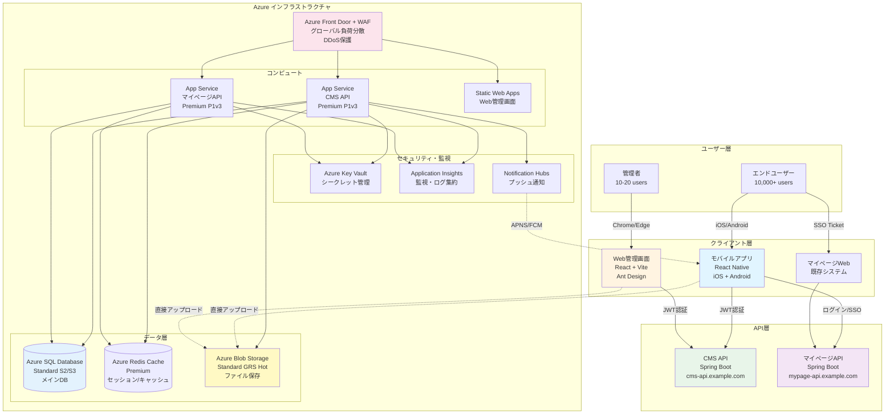

#### 2.2 システム関係一覧

| システム             | タイプ               | 開発状況 | ドメイン               | 主要機能                                                |
| -------------------- | -------------------- | -------- | ---------------------- | ------------------------------------------------------- |
| **React Native App** | モバイルアプリ       | 開発中   | -                      | コンテンツ閲覧、集章活動、e-ninsho 認証、オフライン機能 |
| **CMS Web 管理画面** | Web フロントエンド   | 開発中   | cms-admin.example.com  | コンテンツ CRUD、プッシュ通知管理、システム設定         |
| **CMS API**          | バックエンド API     | 開発中   | cms-api.example.com    | コンテンツ提供、ファイル管理、プッシュ通知送信          |
| **マイページ Web**   | 既存 Web システム    | 既存     | mypage.example.com     | 家族契約確認、ユーザー情報閲覧                          |
| **マイページ API**   | 既存バックエンド API | 開発中   | mypage-api.example.com | ユーザー認証、SSO Ticket 発行、App ログイン API         |

#### 2.3 通信フロー概要

| シナリオ                 | 通信経路                                                         | 認証方式            | Token/Session         |
| ------------------------ | ---------------------------------------------------------------- | ------------------- | --------------------- |
| **App ログイン**         | モバイル → マイページ API                                        | WebView / e-ninsho  | JWT（24h 有効）       |
| **App コンテンツ取得**   | モバイル → CMS API                                               | JWT Token           | 共有 JWT              |
| **App → Web SSO**        | モバイル → マイページ API → マイページ Web                       | Ticket（30 秒有効） | UUID Ticket           |
| **Web 管理画面ログイン** | Web → CMS API                                                    | ID/パスワード       | JWT（24h 有効）       |
| **マイページ Web**       | ブラウザ → マイページ API                                        | Session/Cookie      | JSESSIONID            |
| **ファイルアップロード** | クライアント → CMS API（SAS Token 取得）→ Azure Blob（直接 PUT） | JWT → SAS Token     | 1 時間有効 Write Only |

---

### 3. 技術スタック比較

#### 3.1 技術スタック全体比較表

| カテゴリ              | バックエンド（Spring Boot）      | Web フロントエンド（React）        | モバイルアプリ（React Native）           |
| --------------------- | -------------------------------- | ---------------------------------- | ---------------------------------------- |
| **言語**              | Java 17                          | TypeScript 5.3+                    | TypeScript 5.3+                          |
| **フレームワーク**    | Spring Boot 3.2.x                | React 18.2+                        | React Native 0.73+                       |
| **ビルドツール**      | Gradle 8.x                       | Vite 5.1+                          | Metro Bundler                            |
| **UI ライブラリ**     | -                                | Ant Design 5.14+                   | React Native Paper 5.x                   |
| **ルーティング**      | Spring MVC                       | React Router 6.22+                 | React Navigation 6.x                     |
| **状態管理**          | -                                | TanStack Query + Zustand           | TanStack Query + Zustand                 |
| **HTTP クライアント** | RestTemplate + WebClient         | Axios                              | Axios                                    |
| **認証**              | Spring Security 6.x + JWT        | JWT Token（Axios Interceptor）     | JWT Token + 生体認証 + e-ninsho          |
| **データベース**      | JPA/Hibernate 6.x + Flyway       | -                                  | -                                        |
| **キャッシュ**        | Redis (Spring Cache)             | TanStack Query Cache               | TanStack Query + AsyncStorage            |
| **ファイル処理**      | Azure Blob SDK                   | react-dropzone + Axios             | react-native-fs + react-native-blob-util |
| **テスト**            | JUnit 5 + Mockito                | Jest + React Testing Library       | Jest + Detox                             |
| **CI/CD**             | Azure DevOps Pipelines           | Azure DevOps + Static Web Apps     | Azure DevOps + CodePush                  |
| **監視**              | Application Insights             | Application Insights（オプション） | Application Insights                     |
| **デプロイ先**        | Azure App Service (Premium P1v3) | Azure Static Web Apps              | App Store + Google Play                  |

#### 3.2 共通技術・サービス

| カテゴリ               | 技術/サービス                      | 使用箇所                         |
| ---------------------- | ---------------------------------- | -------------------------------- |
| **認証**               | JWT (HS512)                        | 全端                             |
| **API 通信**           | REST API + JSON                    | 全端                             |
| **ファイルストレージ** | Azure Blob Storage                 | 全端                             |
| **シークレット管理**   | Azure Key Vault                    | バックエンド（CMS + マイページ） |
| **監視**               | Application Insights               | 全端                             |
| **プッシュ通知**       | Azure Notification Hubs + FCM/APNS | バックエンド + モバイル          |
| **負荷分散**           | Azure Front Door Premium + WAF     | 全端                             |
| **データベース**       | Azure SQL Database                 | バックエンド                     |
| **キャッシュ**         | Azure Redis Cache                  | バックエンド                     |
| **CDN（オプション）**  | Azure CDN                          | Static Web Apps + Blob Storage   |

#### 3.3 各端特有技術

**バックエンド特有**：

- Spring Security（フィルターチェーン、JWT 検証）
- JPA/Hibernate（ORM）
- Flyway（DB マイグレーション）
- HikariCP（接続プール）
- Resilience4j（サーキットブレーカー）

**Web フロントエンド特有**：

- Vite（高速ビルド）
- Ant Design（エンタープライズ UI コンポーネント）
- React Hook Form + Zod（フォーム管理）
- react-pdf（PDF プレビュー）
- react-quill（リッチテキストエディター）

**モバイルアプリ特有**：

- React Native CLI（Pure React Native）
- Hermes（JavaScript エンジン）
- e-ninsho SDK（マイナンバーカード認証）
- react-native-vision-camera（QR コード読取）
- react-native-biometrics（生体認証）
- react-native-fs（ファイルキャッシュ）
- CodePush（OTA 更新）
- react-native-inappbrowser-reborn（SSO 用外部ブラウザ）

---

### 4. 主要機能一覧

#### 4.1 機能マトリックス

| 機能カテゴリ             | Web 管理画面                                                        | モバイルアプリ                                                               | バックエンド API                                                  | 詳細                                                     |
| ------------------------ | ------------------------------------------------------------------- | ---------------------------------------------------------------------------- | ----------------------------------------------------------------- | -------------------------------------------------------- |
| **認証機能**             | ✅ ID/パスワード<br/>✅ JWT 認証                                    | ✅ WebView ログイン<br/>✅ e-ninsho 認証<br/>✅ 生体認証<br/>✅ 自動ログイン | ✅ JWT 発行<br/>✅ Token 検証<br/>✅ Refresh Token                | [第 2 部 §6](#6-認証セキュリティ設計)                    |
| **コンテンツ管理**       | ✅ CRUD 操作<br/>✅ ステータス管理<br/>✅ 検索・フィルター          | ✅ 一覧表示<br/>✅ 詳細閲覧<br/>✅ 検索・フィルター                          | ✅ REST API<br/>✅ ページネーション<br/>✅ キャッシュ             | [第 6 部 §32](#32-データフロー設計)                      |
| **ドキュメント管理**     | ✅ PDF アップロード<br/>✅ プレビュー                               | ✅ PDF ビューアー<br/>✅ ズーム・ページ送り<br/>✅ オフライン保存            | ✅ メタデータ管理<br/>✅ Azure Blob 統合                          | [第 2 部 §8](#8-ファイルストレージ設計)                  |
| **ビデオ管理**           | ✅ ビデオアップロード<br/>✅ サムネイル設定<br/>✅ プレビュー       | ✅ ビデオプレイヤー<br/>✅ ストリーミング再生<br/>✅ オフライン保存          | ✅ メタデータ管理<br/>✅ Azure Blob 統合                          | [第 2 部 §8](#8-ファイルストレージ設計)                  |
| **URL リンク管理**       | ✅ URL 登録・編集                                                   | ✅ WebView 表示<br/>✅ 外部ブラウザ起動                                      | ✅ メタデータ管理                                                 | -                                                        |
| **プッシュ通知**         | ✅ 通知作成・送信<br/>✅ プラットフォーム選択<br/>✅ Deep Link 設定 | ✅ 通知受信<br/>✅ Deep Link 処理<br/>✅ フォア/バックグラウンド対応         | ✅ Azure NH 統合<br/>✅ APNS/FCM 送信<br/>✅ デバイストークン管理 | [第 2 部 §10](#10-プッシュ通知設計)                      |
| **集章活動**             | ✅ スタンプ作成・管理<br/>✅ QR コード生成                          | ✅ QR コードスキャン<br/>✅ スタンプコレクション表示<br/>✅ 達成率表示       | ✅ スタンプ検証<br/>✅ 獲得記録管理                               | [第 5 部 §30.3](#303-集章活動モジュール)                 |
| **SSO 機能**             | ❌                                                                  | ✅ マイページへの SSO<br/>✅ Ticket 生成<br/>✅ 外部ブラウザ起動             | ✅ Ticket 生成・検証<br/>✅ Session 発行                          | [第 6 部 §33.3](#333-sso-フローapp--web)                 |
| **システム設定**         | ✅ メンテナンスモード設定<br/>✅ ユーザー管理                       | ❌                                                                           | ✅ 設定 API                                                       | [第 4 部 §24.5](#245-system-システム設定モジュール)      |
| **ダッシュボード**       | ✅ 統計情報表示<br/>✅ 最近のアクティビティ                         | ❌                                                                           | ✅ 統計 API                                                       | [第 4 部 §24.1](#241-dashboard-ダッシュボードモジュール) |
| **オフライン機能**       | ❌                                                                  | ✅ ファイルキャッシュ（LRU）<br/>✅ 最大 500MB<br/>✅ 最近閲覧 10 件         | ❌                                                                | [第 5 部 §31](#31-オフライン機能設計)                    |
| **ファイルアップロード** | ✅ Azure Blob 直接アップロード<br/>✅ 進捗表示                      | ✅ Azure Blob 直接アップロード<br/>✅ 進捗表示                               | ✅ SAS Token 発行<br/>✅ メタデータ保存                           | [第 2 部 §8](#8-ファイルストレージ設計)                  |

#### 4.2 非機能要件

| カテゴリ             | 要件                                                     | 実装方法                                                 |
| -------------------- | -------------------------------------------------------- | -------------------------------------------------------- |
| **パフォーマンス**   | API 応答時間 < 200ms (P95)<br/>ページ読み込み時間 < 2 秒 | DB インデックス最適化、Redis キャッシュ、CDN、コード分割 |
| **スケーラビリティ** | 10,000 並行ユーザー対応                                  | Azure App Service 自動スケーリング、Redis 分散キャッシュ |
| **可用性**           | 99.9% SLA                                                | Azure App Service Premium、Multi-AZ 配置、ヘルスチェック |
| **セキュリティ**     | OWASP Top 10 対策<br/>データ暗号化（保存時・通信時）     | Azure WAF、JWT 認証、HTTPS、TDE、Blob Storage 暗号化     |
| **データ整合性**     | トランザクション保証                                     | JPA @Transactional、Azure SQL Database ACID 保証         |
| **災害復旧（DR）**   | RPO < 1 時間<br/>RTO < 4 時間                            | Azure SQL Geo-Replication、Blob Storage GRS              |
| **監視・アラート**   | リアルタイム監視<br/>異常検知                            | Application Insights、Azure Monitor、カスタムアラート    |

---

## 第 2 部：共通アーキテクチャ設計

### 5. Azure インフラストラクチャ設計

#### 5.1 Azure アーキテクチャ図

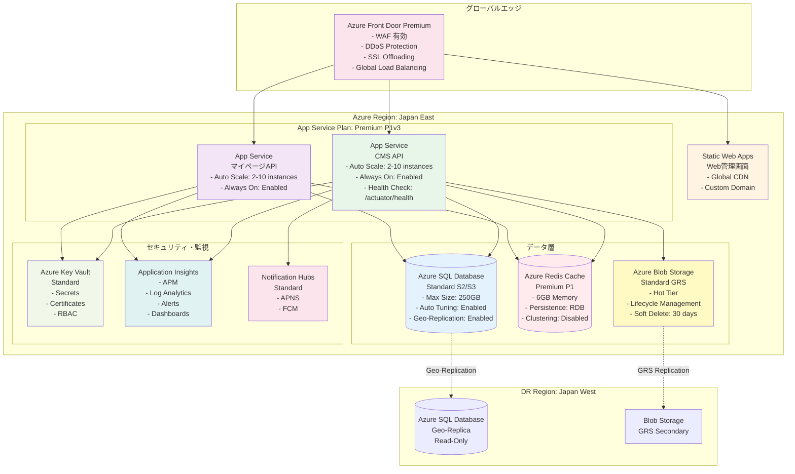

#### 5.2 Azure サービス構成一覧

| サービス名                   | SKU/Tier       | 用途                                                                                 | 主要設定                                                                                     | 月額コスト概算              |
| ---------------------------- | -------------- | ------------------------------------------------------------------------------------ | -------------------------------------------------------------------------------------------- | --------------------------- |
| **Azure Front Door Premium** | Premium        | - グローバル負荷分散<br/>- WAF（DDoS、SQL Injection、XSS 防御）<br/>- SSL Offloading | - ルーティングルール: 3 個<br/>- カスタムドメイン: 有効                                      | $330                        |
| **App Service Plan**         | Premium P1v3   | - CMS API ホスティング<br/>- マイページ API ホスティング                             | - vCPU: 2<br/>- Memory: 8GB<br/>- Auto Scale: 2-10 instances<br/>- Always On: 有効           | $146/instance × 2 = $292    |
| **Static Web Apps**          | Standard       | - Web 管理画面ホスティング<br/>- グローバル CDN 配信                                 | - Custom Domain<br/>- GitHub Actions 統合                                                    | $9                          |
| **Azure SQL Database**       | Standard S2/S3 | - メインデータベース<br/>- トランザクションデータ                                    | - DTU: 50-100<br/>- Max Size: 250GB<br/>- Geo-Replication: 有効<br/>- Auto Tuning: 有効      | $150-$300                   |
| **Azure Redis Cache**        | Premium P1     | - セッション管理<br/>- API キャッシュ<br/>- JWT ブラックリスト                       | - Memory: 6GB<br/>- Persistence: RDB<br/>- Clustering: 無効                                  | $224                        |
| **Azure Blob Storage**       | Standard GRS   | - ドキュメント保存<br/>- ビデオ保存<br/>- サムネイル保存                             | - Hot Tier<br/>- Lifecycle: 30 日後 Cool 移行<br/>- Soft Delete: 30 日<br/>- GRS Replication | $0.0184/GB + Transaction 費 |
| **Azure Key Vault**          | Standard       | - DB パスワード保存<br/>- JWT 秘密鍵保存<br/>- Storage アカウントキー保存            | - RBAC: 有効<br/>- Secrets rotation                                                          | $0.03/10,000 operations     |
| **Application Insights**     | -              | - APM（アプリケーション監視）<br/>- ログ集約<br/>- アラート管理                      | - Sampling: 100%<br/>- Retention: 90 日                                                      | $2.88/GB（最初 5GB 無料）   |
| **Notification Hubs**        | Standard       | - プッシュ通知配信<br/>- APNS/FCM 統合                                               | - Max Registrations: Unlimited<br/>- Telemetry: 有効                                         | $10/million pushes          |

**月額合計概算**: $1,200 - $1,500（スケーリング状況による）

#### 5.3 ネットワーク設計

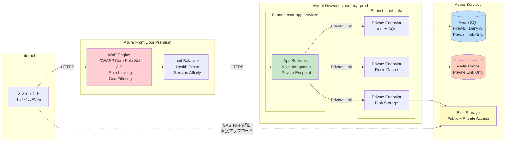

**セキュリティポリシー**：

- ✅ App Service → データ層: **Private Link のみ**（パブリックアクセス拒否）
- ✅ クライアント → App Service: **Azure Front Door 経由のみ**（WAF 保護）
- ✅ クライアント → Blob Storage: **SAS Token 認証**（Write 権限は 1 時間限定）
- ✅ すべての通信: **HTTPS/TLS 1.2+ 必須**

#### 5.4 高可用性・災害復旧（DR）設計

| 項目                   | 設定                                                                                            | 目標                           |
| ---------------------- | ----------------------------------------------------------------------------------------------- | ------------------------------ |
| **App Service**        | - Always On: 有効<br/>- Health Check: /actuator/health（30 秒間隔）<br/>- Auto Healing: 有効    | RTO: 5 分                      |
| **Azure SQL Database** | - Geo-Replication: Japan East → Japan West<br/>- RPO: < 5 秒<br/>- 自動フェイルオーバーグループ | RTO: < 1 時間<br/>RPO: < 5 秒  |
| **Blob Storage**       | - GRS（Geo-Redundant Storage）<br/>- 非同期レプリケーション                                     | RTO: < 1 時間<br/>RPO: < 15 分 |
| **Redis Cache**        | - RDB Persistence（6 時間毎）<br/>- Premium Tier（レプリカ有効）                                | RTO: < 30 分<br/>RPO: < 6 時間 |
| **バックアップ**       | - SQL: 自動バックアップ（7 日間）<br/>- Blob: Soft Delete（30 日間）                            | -                              |

**DR 手順書**: `docs/deployment/DR-RUNBOOK.md`（別途作成）

#### 5.5 コスト最適化戦略

1. **App Service Reserved Instances**（1 年契約）: 30-40% コスト削減
2. **Blob Storage Lifecycle Management**:
   - 作成後 30 日 → Cool Tier（アクセス頻度低下）
   - 作成後 180 日 → Archive Tier（ほぼアクセスなし）
3. **Azure Hybrid Benefit**（Windows ライセンス持ち込み）: 40% コスト削減
4. **Dev/Staging 環境**: 夜間・週末自動停止（Azure Automation）
5. **Application Insights Sampling**: 本番環境で 100%、Dev/Staging で 10%にサンプリング

---

### 6. 認証・セキュリティ設計

#### 6.1 認証方式一覧

| 認証方式                      | 対象ユーザー   | プラットフォーム          | 認証フロー                             | Token タイプ    |
| ----------------------------- | -------------- | ------------------------- | -------------------------------------- | --------------- |
| **JWT 認証（ID/パスワード）** | 管理者         | Web 管理画面              | POST /api/auth/login                   | JWT（24h 有効） |
| **WebView ログイン**          | エンドユーザー | モバイルアプリ            | WebView → 一時 Token → JWT 交換        | JWT（24h 有効） |
| **e-ninsho 認証**             | エンドユーザー | モバイルアプリ            | NFC 読取 → SDK 処理 → JWT 発行         | JWT（24h 有効） |
| **生体認証**                  | エンドユーザー | モバイルアプリ            | Face ID/Touch ID → 保存済み JWT 再利用 | JWT（再利用）   |
| **SSO（Ticket 方式）**        | エンドユーザー | モバイル → マイページ Web | Ticket 生成（30 秒） → Session 発行    | UUID Ticket     |

#### 6.2 JWT 認証フロー（共通）

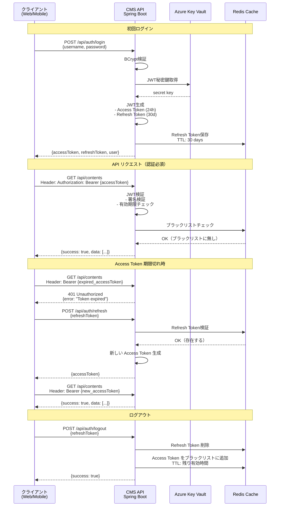

**JWT クレーム構造**:

```json
{
  "sub": "12345", // ユーザーID
  "username": "admin@example.com",
  "roles": ["ROLE_ADMIN"], // ロール
  "iat": 1707465600, // 発行時刻
  "exp": 1707552000 // 有効期限（24時間後）
}
```

**JWT 設定詳細**:

```yaml
# application.yml
jwt:
  secret: ${AZURE_KEYVAULT_SECRET:jwt-secret} # Key Vault から取得
  expiration: 86400000 # 24時間（ミリ秒）
  refresh-expiration: 2592000000 # 30日（ミリ秒）
  algorithm: HS512 # HMAC SHA-512
```

#### 6.3 e-ninsho 認証フロー（モバイル特化）

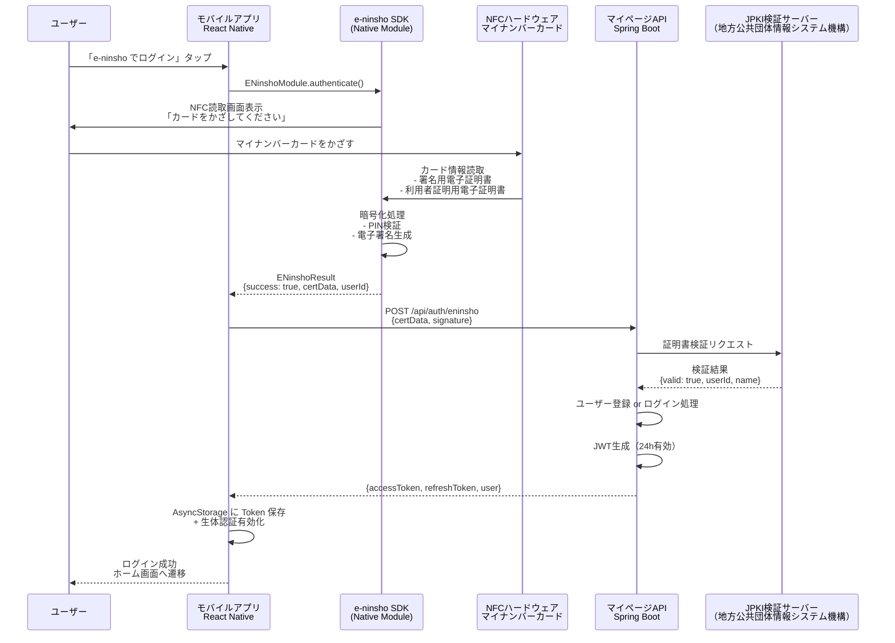

**e-ninsho SDK Native Module 実装**:

<details>
<summary>iOS 実装例（Objective-C）</summary>

```objective-c
// ENinshoModule.m
#import <React/RCTBridgeModule.h>
#import <ENinshoSDK/ENinshoSDK.h>

@interface ENinshoModule : NSObject <RCTBridgeModule>
@end

@implementation ENinshoModule

RCT_EXPORT_MODULE();

RCT_EXPORT_METHOD(authenticate:(RCTPromiseResolveBlock)resolve
                  rejecter:(RCTPromiseRejectBlock)reject)
{
  [[ENinshoManager sharedManager] authenticateWithCompletion:^(ENinshoResult *result, NSError *error) {
    if (error) {
      reject(@"ENINSHO_ERROR", error.localizedDescription, error);
    } else {
      NSDictionary *response = @{
        @"success": @(result.isSuccess),
        @"userId": result.userId ?: @"",
        @"certData": result.certificateData ?: @"",
        @"signature": result.signature ?: @""
      };
      resolve(response);
    }
  }];
}

@end
```

</details>

<details>
<summary>Android 実装例（Java）</summary>

```java
// ENinshoModule.java
package com.juxyi.mobile;

import com.facebook.react.bridge.Promise;
import com.facebook.react.bridge.ReactApplicationContext;
import com.facebook.react.bridge.ReactContextBaseJavaModule;
import com.facebook.react.bridge.ReactMethod;
import com.nri.eninsho.ENinshoManager;
import com.nri.eninsho.ENinshoResult;

public class ENinshoModule extends ReactContextBaseJavaModule {

    public ENinshoModule(ReactApplicationContext reactContext) {
        super(reactContext);
    }

    @Override
    public String getName() {
        return "ENinshoModule";
    }

    @ReactMethod
    public void authenticate(Promise promise) {
        ENinshoManager.getInstance().authenticate(new ENinshoCallback() {
            @Override
            public void onSuccess(ENinshoResult result) {
                WritableMap map = Arguments.createMap();
                map.putBoolean("success", result.isSuccess());
                map.putString("userId", result.getUserId());
                map.putString("certData", result.getCertificateData());
                map.putString("signature", result.getSignature());
                promise.resolve(map);
            }

            @Override
            public void onError(Exception e) {
                promise.reject("ENINSHO_ERROR", e.getMessage(), e);
            }
        });
    }
}
```

</details>

<details>
<summary>React Native ラッパー（TypeScript）</summary>

```typescript
// src/features/auth/services/eninshoService.ts
import { NativeModules } from 'react-native';

interface ENinshoResult {
  success: boolean;
  userId: string;
  certData: string;
  signature: string;
}

const { ENinshoModule } = NativeModules;

export const eninshoService = {
  /**
   * e-ninsho SDK を使用してマイナンバーカード認証を実行
   */
  authenticate: async (): Promise<ENinshoResult> => {
    try {
      const result: ENinshoResult = await ENinshoModule.authenticate();
      return result;
    } catch (error) {
      console.error('[e-ninsho] 認証エラー:', error);
      throw new Error('マイナンバーカードの読取に失敗しました');
    }
  },

  /**
   * e-ninsho 認証が利用可能かチェック
   */
  isAvailable: async (): Promise<boolean> => {
    return ENinshoModule != null;
  },
};
```

</details>

**バックエンド e-ninsho 検証実装**:

```java
// ENinshoAuthService.java
@Service
@RequiredArgsConstructor
public class ENinshoAuthService {

    private final JpkiValidationClient jpkiClient;
    private final UserRepository userRepository;
    private final JwtTokenProvider tokenProvider;

    /**
     * e-ninsho 認証データを検証してJWT発行
     */
    public JwtResponse authenticateWithENinsho(ENinshoAuthRequest request) {
        // 1. JPKI検証サーバーに証明書検証リクエスト
        JpkiValidationResponse jpkiResponse = jpkiClient.validateCertificate(
            request.getCertData(),
            request.getSignature()
        );

        if (!jpkiResponse.isValid()) {
            throw new InvalidCertificateException("証明書検証に失敗しました");
        }

        // 2. ユーザー存在チェック
        String jpkiUserId = jpkiResponse.getUserId();
        User user = userRepository.findByJpkiUserId(jpkiUserId)
            .orElseGet(() -> {
                // 新規ユーザー自動登録
                User newUser = User.builder()
                    .jpkiUserId(jpkiUserId)
                    .name(jpkiResponse.getName())
                    .enabled(true)
                    .build();
                return userRepository.save(newUser);
            });

        // 3. JWT生成
        UserPrincipal userPrincipal = UserPrincipal.create(user);
        String accessToken = tokenProvider.generateToken(userPrincipal);
        String refreshToken = tokenProvider.generateRefreshToken(userPrincipal);

        // 4. Refresh Token を Redis に保存
        redisTemplate.opsForValue().set(
            "refresh_token:" + user.getId(),
            refreshToken,
            30, TimeUnit.DAYS
        );

        return JwtResponse.builder()
            .accessToken(accessToken)
            .refreshToken(refreshToken)
            .tokenType("Bearer")
            .user(UserResponse.fromEntity(user))
            .build();
    }
}
```

#### 6.4 SSO フロー（App → Web）

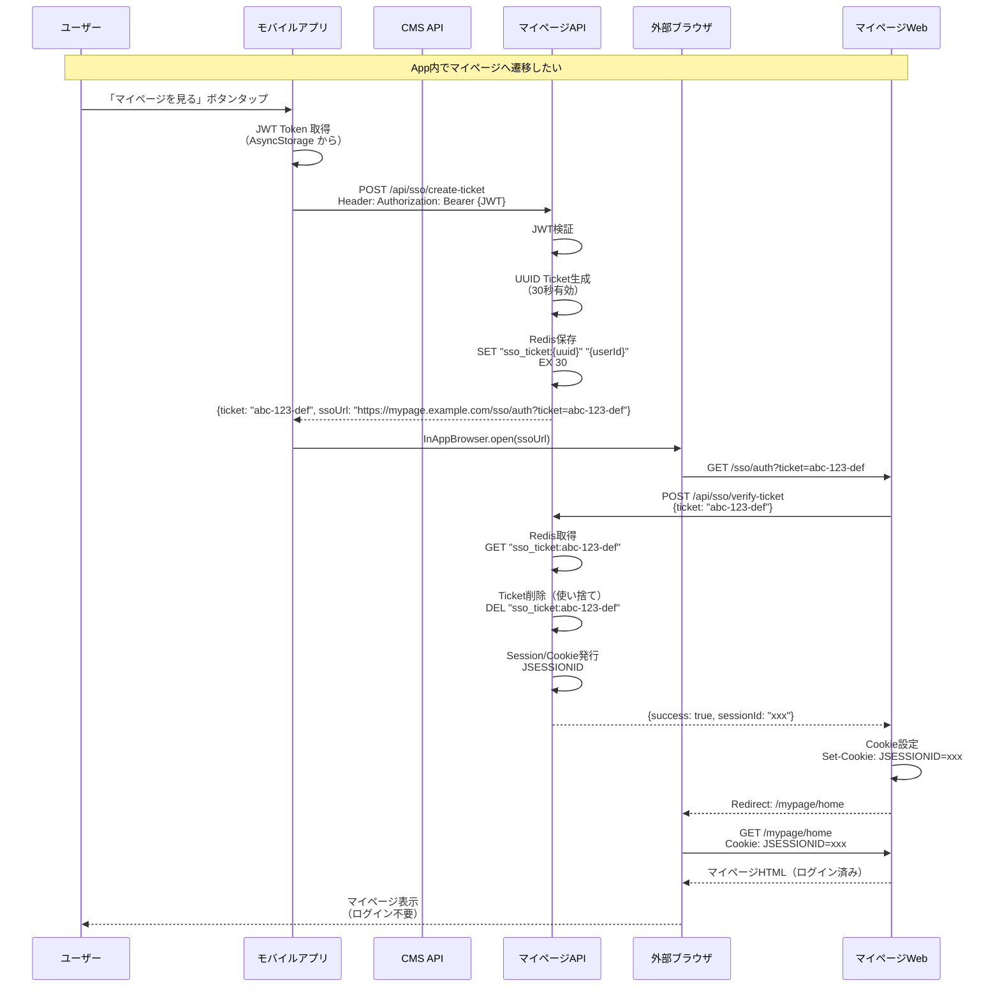

**SSO Ticket テーブル設計**（Redis）:

```
Key: sso_ticket:{UUID}
Value: {userId}
TTL: 30秒
```

**バックエンド SSO 実装**:

```java
// SsoController.java（マイページAPI）
@RestController
@RequestMapping("/api/sso")
@RequiredArgsConstructor
public class SsoController {

    private final SsoTicketService ssoTicketService;

    /**
     * SSO Ticket 生成（モバイルアプリから呼び出し）
     */
    @PostMapping("/create-ticket")
    public ResponseEntity<SsoTicketResponse> createTicket(
        @AuthenticationPrincipal UserPrincipal userPrincipal
    ) {
        String ticket = ssoTicketService.createTicket(userPrincipal.getId());
        String ssoUrl = "https://mypage.example.com/sso/auth?ticket=" + ticket;

        return ResponseEntity.ok(SsoTicketResponse.builder()
            .ticket(ticket)
            .ssoUrl(ssoUrl)
            .expiresIn(30) // 30秒
            .build());
    }

    /**
     * SSO Ticket 検証（マイページWebから呼び出し）
     */
    @PostMapping("/verify-ticket")
    public ResponseEntity<SsoVerifyResponse> verifyTicket(
        @RequestBody SsoVerifyRequest request,
        HttpServletRequest httpRequest
    ) {
        Long userId = ssoTicketService.verifyAndConsumeTicket(request.getTicket());

        if (userId == null) {
            throw new InvalidTicketException("無効または期限切れのTicketです");
        }

        // Session発行
        HttpSession session = httpRequest.getSession(true);
        session.setAttribute("userId", userId);
        session.setMaxInactiveInterval(3600); // 1時間

        return ResponseEntity.ok(SsoVerifyResponse.builder()
            .success(true)
            .sessionId(session.getId())
            .build());
    }
}

// SsoTicketService.java
@Service
@RequiredArgsConstructor
public class SsoTicketService {

    private final RedisTemplate<String, String> redisTemplate;

    /**
     * SSO Ticket 生成
     */
    public String createTicket(Long userId) {
        String ticket = UUID.randomUUID().toString();
        String key = "sso_ticket:" + ticket;

        redisTemplate.opsForValue().set(
            key,
            String.valueOf(userId),
            30, TimeUnit.SECONDS // 30秒で自動削除
        );

        return ticket;
    }

    /**
     * Ticket検証＆消費（使い捨て）
     */
    public Long verifyAndConsumeTicket(String ticket) {
        String key = "sso_ticket:" + ticket;
        String userIdStr = redisTemplate.opsForValue().get(key);

        if (userIdStr != null) {
            // Ticket削除（使い捨て）
            redisTemplate.delete(key);
            return Long.parseLong(userIdStr);
        }

        return null; // 無効または期限切れ
    }
}
```

**モバイルアプリ SSO 実装**:

```typescript
// src/features/sso/hooks/useSsoNavigation.ts
import { useMutation } from '@tanstack/react-query';
import InAppBrowser from 'react-native-inappbrowser-reborn';
import { ssoService } from '../services/ssoService';

export const useSsoNavigation = () => {
  const { mutate: navigateToMyPage, isLoading } = useMutation({
    mutationFn: () => ssoService.createTicket('mypage'),
    onSuccess: async data => {
      try {
        if (await InAppBrowser.isAvailable()) {
          await InAppBrowser.open(data.ssoUrl, {
            // iOS Options
            dismissButtonStyle: 'cancel',
            preferredBarTintColor: '#ffffff',
            preferredControlTintColor: '#0066cc',
            readerMode: false,
            animated: true,
            modalPresentationStyle: 'fullScreen',
            // Android Options
            showTitle: true,
            toolbarColor: '#0066cc',
            secondaryToolbarColor: 'black',
            enableUrlBarHiding: true,
            enableDefaultShare: true,
            forceCloseOnRedirection: false,
          });
        }
      } catch (error) {
        console.error('[SSO] ブラウザ起動エラー:', error);
        Alert.alert('エラー', 'マイページを開けませんでした');
      }
    },
    onError: error => {
      console.error('[SSO] Ticket生成エラー:', error);
      Alert.alert('エラー', 'SSO Ticketの生成に失敗しました');
    },
  });

  return {
    navigateToMyPage,
    isLoading,
  };
};

// src/features/sso/services/ssoService.ts
import axios from 'axios';
import { getAuthToken } from '@/lib/auth/tokenStorage';

interface SsoTicketResponse {
  ticket: string;
  ssoUrl: string;
  expiresIn: number;
}

export const ssoService = {
  createTicket: async (target: string): Promise<SsoTicketResponse> => {
    const token = await getAuthToken();
    const response = await axios.post<SsoTicketResponse>(
      '/api/sso/create-ticket',
      { target },
      {
        headers: {
          Authorization: `Bearer ${token}`,
        },
      },
    );
    return response.data;
  },
};
```

#### 6.5 生体認証フロー（モバイル）

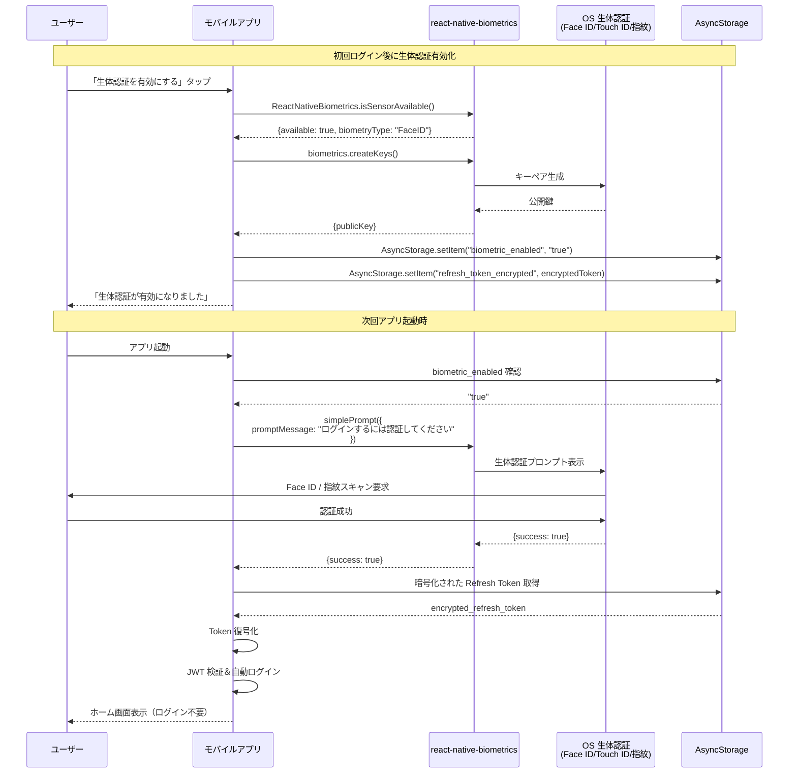

**モバイルアプリ 生体認証実装**:

```typescript
// src/features/auth/hooks/useBiometricAuth.ts
import { useMutation } from '@tanstack/react-query';
import ReactNativeBiometrics, { BiometryTypes } from 'react-native-biometrics';
import AsyncStorage from '@react-native-async-storage/async-storage';
import { useAuthStore } from '../stores/authStore';
import { authService } from '../services/authService';

const rnBiometrics = new ReactNativeBiometrics();

export const useBiometricAuth = () => {
  const setUser = useAuthStore(state => state.setUser);

  // 生体認証が利用可能かチェック
  const checkBiometricAvailability = async () => {
    const { available, biometryType } = await rnBiometrics.isSensorAvailable();

    if (!available) {
      return { available: false, type: null };
    }

    let typeName = 'Biometric';
    if (biometryType === BiometryTypes.FaceID) {
      typeName = 'Face ID';
    } else if (biometryType === BiometryTypes.TouchID) {
      typeName = 'Touch ID';
    } else if (biometryType === BiometryTypes.Biometrics) {
      typeName = '指紋認証';
    }

    return { available: true, type: typeName };
  };

  // 生体認証を有効化
  const { mutate: enableBiometric } = useMutation({
    mutationFn: async (refreshToken: string) => {
      // キーペア生成
      await rnBiometrics.createKeys();

      // Refresh Token を保存（暗号化推奨）
      await AsyncStorage.setItem('biometric_enabled', 'true');
      await AsyncStorage.setItem('refresh_token', refreshToken);
    },
    onSuccess: () => {
      Alert.alert('成功', '生体認証が有効になりました');
    },
  });

  // 生体認証でログイン
  const { mutate: loginWithBiometric, isLoading } = useMutation({
    mutationFn: async () => {
      // 生体認証プロンプト表示
      const { success } = await rnBiometrics.simplePrompt({
        promptMessage: 'ログインするには認証してください',
        cancelButtonText: 'キャンセル',
      });

      if (!success) {
        throw new Error('生体認証がキャンセルされました');
      }

      // 保存済み Refresh Token 取得
      const refreshToken = await AsyncStorage.getItem('refresh_token');

      if (!refreshToken) {
        throw new Error('Refresh Token が見つかりません');
      }

      // Refresh Token で新しい Access Token 取得
      const response = await authService.refreshToken(refreshToken);
      return response;
    },
    onSuccess: data => {
      setUser(data.user, data.accessToken, data.refreshToken);
      // ホーム画面へ自動遷移
    },
    onError: error => {
      console.error('[Biometric] ログインエラー:', error);
      Alert.alert('エラー', '生体認証でのログインに失敗しました');
    },
  });

  return {
    checkBiometricAvailability,
    enableBiometric,
    loginWithBiometric,
    isLoading,
  };
};
```

#### 6.6 多層防御セキュリティ

```mermaid
graph TB
    subgraph "Layer 1: ネットワークセキュリティ"
        L1_1[Azure Front Door<br/>- DDoS Protection<br/>- Rate Limiting<br/>- Geo-Filtering]
        L1_2[WAF<br/>- OWASP Core Rule Set 3.2<br/>- SQL Injection 防御<br/>- XSS 防御<br/>- CSRF 防御]
    end

    subgraph "Layer 2: アプリケーションセキュリティ"
        L2_1[JWT 認証<br/>- HS512 署名<br/>- 24h 有効期限<br/>- Refresh Token]
        L2_2[HTTPS Only<br/>- TLS 1.2+<br/>- HSTS]
        L2_3[CORS 制御<br/>- 許可オリジン制限]
        L2_4[入力検証<br/>- Bean Validation<br/>- XSS サニタイズ]
    end

    subgraph "Layer 3: データセキュリティ"
        L3_1[Azure SQL TDE<br/>Transparent Data Encryption]
        L3_2[Blob Storage 暗号化<br/>AES-256 at Rest]
        L3_3[BCrypt パスワードハッシュ<br/>rounds: 12]
        L3_4[個人情報マスキング<br/>ログ出力時]
    end

    subgraph "Layer 4: シークレット管理"
        L4_1[Azure Key Vault<br/>- DB パスワード<br/>- JWT 秘密鍵<br/>- Storage キー<br/>- Redis 接続文字列]
        L4_2[RBAC<br/>- 最小権限の原則<br/>- Managed Identity]
    end

    subgraph "Layer 5: 脅威検知"
        L5_1[Application Insights<br/>- 異常検知<br/>- 失敗ログイン監視]
        L5_2[Azure Sentinel<br/>SIEM - ログ分析]
        L5_3[Defender for Cloud<br/>- 脆弱性スキャン<br/>- コンプライアンス]
    end

    L1_1 --> L1_2
    L1_2 --> L2_1
    L2_1 --> L2_2
    L2_2 --> L2_3
    L2_3 --> L2_4
    L2_4 --> L3_1
    L3_1 --> L3_2
    L3_2 --> L3_3
    L3_3 --> L3_4
    L3_4 --> L4_1
    L4_1 --> L4_2
    L4_2 --> L5_1
    L5_1 --> L5_2
    L5_2 --> L5_3

    style L1_1 fill:#ffcdd2
    style L1_2 fill:#ffcdd2
    style L2_1 fill:#fff9c4
    style L3_1 fill:#c8e6c9
    style L4_1 fill:#bbdefb
    style L5_1 fill:#e1bee7
```

**セキュリティ対策一覧**:

| レイヤー             | 脅威                 | 対策                                        | 実装場所                      |
| -------------------- | -------------------- | ------------------------------------------- | ----------------------------- |
| **ネットワーク**     | DDoS 攻撃            | Azure Front Door DDoS Protection            | Azure Front Door              |
|                      | Rate Limit 超過      | 1 IP につき 100 req/min                     | Azure Front Door WAF          |
|                      | 不正アクセス         | Geo-Filtering（日本のみ許可）               | Azure Front Door              |
| **アプリケーション** | SQL Injection        | Prepared Statement（JPA）                   | バックエンド                  |
|                      | XSS                  | 入力サニタイズ + CSP Header                 | バックエンド + フロントエンド |
|                      | CSRF                 | SameSite Cookie + CSRF Token                | バックエンド                  |
|                      | 権限昇格             | Spring Security + Role-based Access Control | バックエンド                  |
|                      | Token 盗聴           | HTTPS Only + Secure Cookie                  | 全端                          |
| **データ**           | データベース漏洩     | Azure SQL TDE（透過的暗号化）               | Azure SQL                     |
|                      | ファイル漏洩         | Blob Storage AES-256 暗号化                 | Azure Blob                    |
|                      | パスワード漏洩       | BCrypt（rounds=12）                         | バックエンド                  |
|                      | ログからの情報漏洩   | 個人情報マスキング                          | バックエンド                  |
| **シークレット**     | 認証情報漏洩         | Azure Key Vault                             | バックエンド                  |
|                      | ハードコード秘密鍵   | 環境変数 + Key Vault                        | バックエンド                  |
| **脅威検知**         | 異常ログイン         | Application Insights カスタムアラート       | Application Insights          |
|                      | 脆弱性               | Defender for Cloud スキャン                 | Azure                         |
|                      | セキュリティイベント | Azure Sentinel SIEM                         | Azure                         |

**Spring Security 設定例**:

```java
// SecurityConfig.java
@Configuration
@EnableWebSecurity
@EnableMethodSecurity
public class SecurityConfig {

    @Bean
    public SecurityFilterChain filterChain(HttpSecurity http) throws Exception {
        http
            // CSRF
            .csrf(csrf -> csrf
                .csrfTokenRepository(CookieCsrfTokenRepository.withHttpOnlyFalse())
            )
            // CORS
            .cors(cors -> cors.configurationSource(corsConfigurationSource()))
            // 認証不要エンドポイント
            .authorizeHttpRequests(auth -> auth
                .requestMatchers("/api/auth/**").permitAll()
                .requestMatchers("/actuator/health").permitAll()
                .requestMatchers("/api/**").authenticated()
                .anyRequest().denyAll()
            )
            // JWT Filter
            .addFilterBefore(jwtAuthenticationFilter(), UsernamePasswordAuthenticationFilter.class)
            // Session 無効化（Stateless）
            .sessionManagement(session -> session
                .sessionCreationPolicy(SessionCreationPolicy.STATELESS)
            )
            // セキュリティヘッダー
            .headers(headers -> headers
                .contentSecurityPolicy(csp -> csp
                    .policyDirectives("default-src 'self'; script-src 'self' 'unsafe-inline'; style-src 'self' 'unsafe-inline'")
                )
                .httpStrictTransportSecurity(hsts -> hsts
                    .includeSubDomains(true)
                    .maxAgeInSeconds(31536000) // 1年
                )
            );

        return http.build();
    }

    @Bean
    public CorsConfigurationSource corsConfigurationSource() {
        CorsConfiguration configuration = new CorsConfiguration();
        configuration.setAllowedOrigins(Arrays.asList(
            "https://cms-admin.example.com",  // Web管理画面
            "https://localhost:3000"          // 開発環境
        ));
        configuration.setAllowedMethods(Arrays.asList("GET", "POST", "PUT", "DELETE", "OPTIONS"));
        configuration.setAllowedHeaders(Arrays.asList("*"));
        configuration.setAllowCredentials(true);
        configuration.setMaxAge(3600L);

        UrlBasedCorsConfigurationSource source = new UrlBasedCorsConfigurationSource();
        source.registerCorsConfiguration("/api/**", configuration);
        return source;
    }
}
```

---

### 7. API 設計

#### 7.1 API エンドポイント一覧

> **詳細な API 仕様**: [API.md](API.md) を参照

**CMS API エンドポイント**（cms-api.example.com）:

| カテゴリ           | エンドポイント                       | メソッド | 認証          | 用途                             | 使用端        |
| ------------------ | ------------------------------------ | -------- | ------------- | -------------------------------- | ------------- |
| **認証**           | `/api/auth/login`                    | POST     | 不要          | ID/パスワードログイン            | Web           |
|                    | `/api/auth/logout`                   | POST     | 必須          | ログアウト                       | 全端          |
|                    | `/api/auth/refresh`                  | POST     | Refresh Token | Access Token 更新                | 全端          |
| **コンテンツ**     | `/api/contents`                      | GET      | 必須          | コンテンツ一覧取得               | 全端          |
|                    | `/api/contents/{id}`                 | GET      | 必須          | コンテンツ詳細取得               | 全端          |
|                    | `/api/contents`                      | POST     | 必須（Admin） | コンテンツ作成                   | Web           |
|                    | `/api/contents/{id}`                 | PUT      | 必須（Admin） | コンテンツ更新                   | Web           |
|                    | `/api/contents/{id}`                 | DELETE   | 必須（Admin） | コンテンツ削除                   | Web           |
|                    | `/api/contents/search`               | GET      | 必須          | コンテンツ検索                   | 全端          |
| **ファイル**       | `/api/files/sas-token`               | POST     | 必須          | SAS Token 取得（アップロード用） | Web, モバイル |
|                    | `/api/files/metadata`                | POST     | 必須          | ファイルメタデータ保存           | Web, モバイル |
| **ビデオ**         | `/api/videos`                        | GET      | 必須          | ビデオ一覧取得                   | 全端          |
|                    | `/api/videos/{id}`                   | GET      | 必須          | ビデオ詳細取得                   | 全端          |
|                    | `/api/videos`                        | POST     | 必須（Admin） | ビデオ作成                       | Web           |
| **ドキュメント**   | `/api/documents`                     | GET      | 必須          | ドキュメント一覧取得             | 全端          |
|                    | `/api/documents/{id}`                | GET      | 必須          | ドキュメント詳細取得             | 全端          |
| **通知**           | `/api/notifications/send`            | POST     | 必須（Admin） | プッシュ通知送信                 | Web           |
|                    | `/api/notifications/history`         | GET      | 必須（Admin） | 送信履歴取得                     | Web           |
|                    | `/api/notifications/register-device` | POST     | 必須          | デバイストークン登録             | モバイル      |
| **集章活動**       | `/api/stamps`                        | GET      | 必須          | スタンプ一覧取得                 | モバイル      |
|                    | `/api/stamps/{id}`                   | GET      | 必須          | スタンプ詳細取得                 | モバイル      |
|                    | `/api/stamps/collect`                | POST     | 必須          | スタンプ獲得                     | モバイル      |
|                    | `/api/stamps/my-collection`          | GET      | 必須          | 自分のコレクション取得           | モバイル      |
| **ダッシュボード** | `/api/dashboard/stats`               | GET      | 必須（Admin） | 統計情報取得                     | Web           |
| **システム**       | `/api/system/settings`               | GET      | 必須（Admin） | システム設定取得                 | Web           |
|                    | `/api/system/settings`               | PUT      | 必須（Admin） | システム設定更新                 | Web           |
| **ヘルスチェック** | `/actuator/health`                   | GET      | 不要          | アプリケーション健全性確認       | Azure         |

**マイページ API エンドポイント**（mypage-api.example.com）:

| カテゴリ         | エンドポイント            | メソッド | 認証          | 用途                                      | 使用端                   |
| ---------------- | ------------------------- | -------- | ------------- | ----------------------------------------- | ------------------------ |
| **モバイル認証** | `/api/mobile-auth/verify` | POST     | 不要          | WebView ログイン（一時 Token → JWT 交換） | モバイル                 |
|                  | `/api/auth/eninsho`       | POST     | 不要          | e-ninsho 認証                             | モバイル                 |
|                  | `/api/auth/refresh`       | POST     | Refresh Token | Access Token 更新                         | モバイル                 |
| **SSO**          | `/api/sso/create-ticket`  | POST     | 必須（JWT）   | SSO Ticket 生成                           | モバイル                 |
|                  | `/api/sso/verify-ticket`  | POST     | 不要          | SSO Ticket 検証 → Session 発行            | マイページ Web           |
| **ユーザー情報** | `/api/users/me`           | GET      | 必須          | 自分の情報取得                            | モバイル, マイページ Web |
| **家族契約**     | `/api/contracts`          | GET      | 必須          | 家族契約情報取得                          | マイページ Web           |

#### 7.2 API 応答形式（統一）

**成功レスポンス**:

```json
{
  "success": true,
  "message": "操作が成功しました",
  "data": {
    // 実際のデータ
  },
  "timestamp": "2026-02-09T10:00:00Z"
}
```

**エラーレスポンス**:

```json
{
  "success": false,
  "error": {
    "code": "VALIDATION_ERROR",
    "message": "入力データが不正です",
    "details": [
      {
        "field": "title",
        "message": "タイトルは必須です"
      }
    ]
  },
  "timestamp": "2026-02-09T10:00:00Z"
}
```

**ページネーションレスポンス**:

```json
{
  "success": true,
  "data": {
    "content": [
      /* データ配列 */
    ],
    "page": 0,
    "size": 20,
    "totalElements": 150,
    "totalPages": 8,
    "first": true,
    "last": false
  },
  "timestamp": "2026-02-09T10:00:00Z"
}
```

#### 7.3 エラーコード定義

| コード                   | HTTP ステータス | 説明                   | クライアント処理         |
| ------------------------ | --------------- | ---------------------- | ------------------------ |
| `SUCCESS`                | 200             | 成功                   | 正常処理                 |
| `CREATED`                | 201             | リソース作成成功       | 正常処理                 |
| `BAD_REQUEST`            | 400             | リクエストが不正       | エラーメッセージ表示     |
| `UNAUTHORIZED`           | 401             | 認証失敗               | ログイン画面へ遷移       |
| `FORBIDDEN`              | 403             | 権限不足               | エラーメッセージ表示     |
| `NOT_FOUND`              | 404             | リソースが見つからない | エラーメッセージ表示     |
| `VALIDATION_ERROR`       | 422             | 入力検証エラー         | フィールドエラー表示     |
| `INTERNAL_SERVER_ERROR`  | 500             | サーバーエラー         | エラー画面表示 + 再試行  |
| `SERVICE_UNAVAILABLE`    | 503             | サービス利用不可       | メンテナンス画面表示     |
| `TOKEN_EXPIRED`          | 401             | JWT Token 期限切れ     | Refresh Token で再取得   |
| `INVALID_TOKEN`          | 401             | JWT Token が無効       | 再ログイン               |
| `FILE_TOO_LARGE`         | 413             | ファイルサイズ超過     | サイズ制限メッセージ表示 |
| `UNSUPPORTED_MEDIA_TYPE` | 415             | 非対応ファイル形式     | 対応形式メッセージ表示   |

#### 7.4 API バージョン管理

**バージョニング戦略**: URL Path バージョニング

```
/api/v1/contents      # バージョン1（現行）
/api/v2/contents      # バージョン2（将来）
```

**バージョン移行ポリシー**:

1. 新バージョンリリース後、旧バージョンは **6 ヶ月間** サポート
2. 旧バージョンの応答ヘッダーに警告を追加:
   ```
   X-API-Deprecated: true
   X-API-Sunset: 2026-08-09
   X-API-Migration-Guide: https://docs.example.com/api/v2-migration
   ```
3. サンセット日（6 ヶ月後）に旧バージョン API を停止

---

### 8. ファイルストレージ設計

#### 8.1 Azure Blob Storage アーキテクチャ

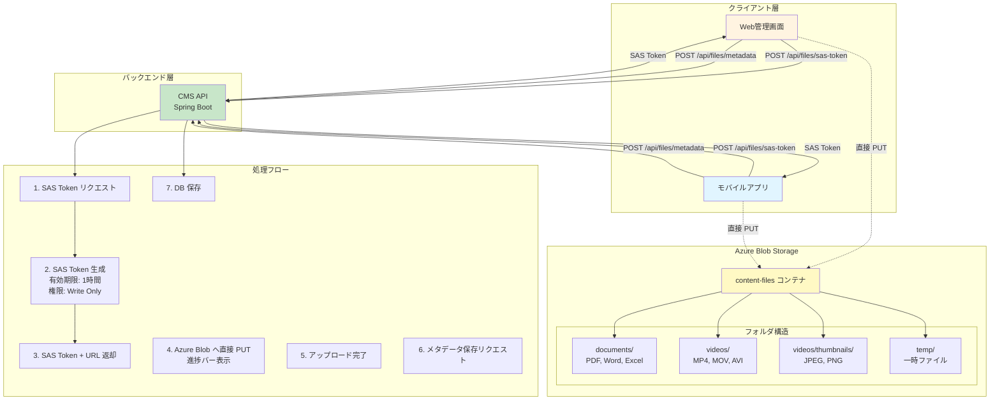

#### 8.2 ファイルアップロードフロー詳細

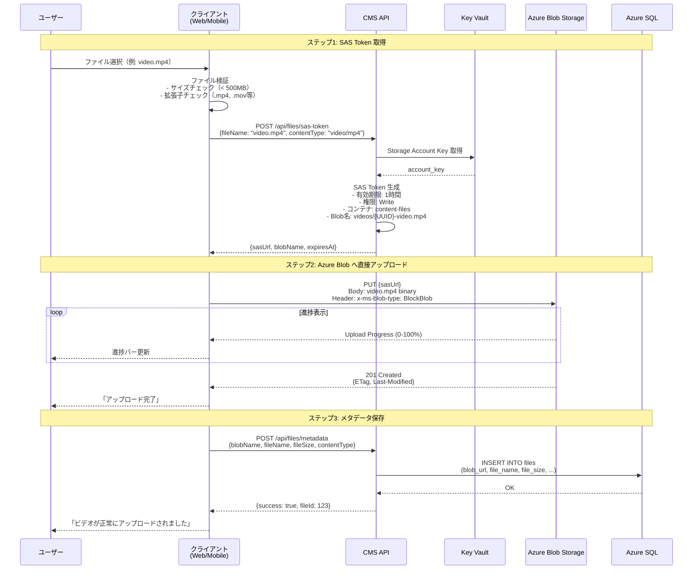

#### 8.3 コンテナ構造とライフサイクル管理

**コンテナ構造**:

```
content-files/                      # メインコンテナ（Hot Tier）
├── documents/                      # ドキュメントフォルダ
│   ├── {UUID}-document.pdf
│   ├── {UUID}-manual.docx
│   └── ...
├── videos/                         # ビデオフォルダ
│   ├── {UUID}-video.mp4
│   ├── {UUID}-intro.mov
│   └── thumbnails/                 # サムネイルサブフォルダ
│       ├── {UUID}-thumb.jpg
│       └── ...
└── temp/                           # 一時ファイル（30日後自動削除）
    ├── {UUID}-temp-upload.tmp
    └── ...
```

**Lifecycle Management ポリシー**:

```json
{
  "rules": [
    {
      "enabled": true,
      "name": "MoveToCoolAfter30Days",
      "type": "Lifecycle",
      "definition": {
        "filters": {
          "blobTypes": ["blockBlob"],
          "prefixMatch": ["content-files/documents/", "content-files/videos/"]
        },
        "actions": {
          "baseBlob": {
            "tierToCool": {
              "daysAfterModificationGreaterThan": 30
            },
            "tierToArchive": {
              "daysAfterModificationGreaterThan": 180
            }
          }
        }
      }
    },
    {
      "enabled": true,
      "name": "DeleteTempFilesAfter30Days",
      "type": "Lifecycle",
      "definition": {
        "filters": {
          "blobTypes": ["blockBlob"],
          "prefixMatch": ["content-files/temp/"]
        },
        "actions": {
          "baseBlob": {
            "delete": {
              "daysAfterModificationGreaterThan": 30
            }
          }
        }
      }
    },
    {
      "enabled": true,
      "name": "DeleteSoftDeletedAfter30Days",
      "type": "Lifecycle",
      "definition": {
        "actions": {
          "baseBlob": {
            "delete": {
              "daysAfterModificationGreaterThan": 30
            }
          },
          "snapshot": {
            "delete": {
              "daysAfterCreationGreaterThan": 30
            }
          }
        }
      }
    }
  ]
}
```

**ライフサイクルポリシー説明**:

| ルール名                         | 対象                | アクション           | タイミング | 目的                             |
| -------------------------------- | ------------------- | -------------------- | ---------- | -------------------------------- |
| **MoveToCoolAfter30Days**        | documents/, videos/ | Hot → Cool Tier      | 30 日後    | アクセス頻度低下によるコスト削減 |
|                                  |                     | Cool → Archive Tier  | 180 日後   | 長期保存コスト削減               |
| **DeleteTempFilesAfter30Days**   | temp/               | 削除                 | 30 日後    | 一時ファイル自動クリーンアップ   |
| **DeleteSoftDeletedAfter30Days** | 全 Blob             | Soft Delete 完全削除 | 30 日後    | ストレージ容量解放               |

**Blob Storage セキュリティ設定**:

```yaml
# Blob Storage 設定
properties:
  publicAccess: None # パブリックアクセス拒否
  enableSoftDelete: true # Soft Delete 有効
  softDeleteRetentionDays: 30 # 30日間保持
  enableVersioning: true # バージョニング有効
  encryption:
    services:
      blob:
        enabled: true # AES-256 暗号化
    keySource: Microsoft.Storage # Microsoft 管理キー
  networkAcls:
    bypass: AzureServices # Azure サービスのみ許可
    defaultAction: Deny # デフォルト拒否
    ipRules:
      - value: '203.0.113.0/24' # 管理者IP許可（例）
```

#### 8.4 SAS Token 生成実装

**バックエンド実装**:

```java
// FileStorageService.java
@Service
@RequiredArgsConstructor
public class FileStorageService {

    @Value("${azure.storage.account-name}")
    private String accountName;

    @Value("${azure.storage.container-name}")
    private String containerName;

    private final AzureKeyVaultService keyVaultService;

    /**
     * SAS Token 生成（アップロード用）
     */
    public SasTokenResponse generateSasToken(SasTokenRequest request) {
        // 1. ファイル名検証
        validateFileName(request.getFileName());

        // 2. Blob名生成（UUID + 元ファイル名）
        String blobName = generateBlobName(request.getFileName(), request.getContentType());

        // 3. Key Vault から Storage Account Key 取得
        String accountKey = keyVaultService.getSecret("storage-account-key");

        // 4. Storage Credential 作成
        StorageSharedKeyCredential credential = new StorageSharedKeyCredential(
            accountName,
            accountKey
        );

        // 5. Blob Service Client 作成
        BlobServiceClient blobServiceClient = new BlobServiceClientBuilder()
            .endpoint(String.format("https://%s.blob.core.windows.net", accountName))
            .credential(credential)
            .buildClient();

        BlobContainerClient containerClient = blobServiceClient.getBlobContainerClient(containerName);
        BlobClient blobClient = containerClient.getBlobClient(blobName);

        // 6. SAS Token 生成
        OffsetDateTime expiryTime = OffsetDateTime.now().plusHours(1); // 1時間有効

        BlobSasPermission permission = new BlobSasPermission()
            .setReadPermission(false)  // 読取不可
            .setWritePermission(true)  // 書込可
            .setCreatePermission(true) // 作成可
            .setDeletePermission(false); // 削除不可

        BlobServiceSasSignatureValues values = new BlobServiceSasSignatureValues(expiryTime, permission)
            .setStartTime(OffsetDateTime.now().minusMinutes(5)) // 5分前から有効（時刻ずれ対策）
            .setContentType(request.getContentType());

        String sasToken = blobClient.generateSas(values);

        // 7. SAS URL 生成
        String sasUrl = String.format("%s?%s", blobClient.getBlobUrl(), sasToken);

        return SasTokenResponse.builder()
            .sasUrl(sasUrl)
            .blobName(blobName)
            .blobUrl(blobClient.getBlobUrl())
            .expiresAt(expiryTime)
            .build();
    }

    /**
     * Blob名生成
     */
    private String generateBlobName(String fileName, String contentType) {
        String folder = determineFolderByContentType(contentType);
        String uuid = UUID.randomUUID().toString();
        String sanitizedFileName = sanitizeFileName(fileName);

        return String.format("%s/%s-%s", folder, uuid, sanitizedFileName);
    }

    /**
     * Content-Type からフォルダ判定
     */
    private String determineFolderByContentType(String contentType) {
        if (contentType.startsWith("video/")) {
            return "videos";
        } else if (contentType.equals("application/pdf") ||
                   contentType.startsWith("application/vnd.")) {
            return "documents";
        } else if (contentType.startsWith("image/")) {
            return "videos/thumbnails";
        } else {
            return "temp";
        }
    }

    /**
     * ファイル名サニタイズ
     */
    private String sanitizeFileName(String fileName) {
        // 危険な文字を除去
        return fileName.replaceAll("[^a-zA-Z0-9._-]", "_");
    }

    /**
     * ファイル名検証
     */
    private void validateFileName(String fileName) {
        if (fileName == null || fileName.trim().isEmpty()) {
            throw new InvalidFileNameException("ファイル名が空です");
        }

        if (fileName.length() > 255) {
            throw new InvalidFileNameException("ファイル名が長すぎます（最大255文字）");
        }

        // 許可拡張子チェック
        String[] allowedExtensions = {".pdf", ".docx", ".xlsx", ".mp4", ".mov", ".avi", ".jpg", ".png"};
        boolean isAllowed = Arrays.stream(allowedExtensions)
            .anyMatch(ext -> fileName.toLowerCase().endsWith(ext));

        if (!isAllowed) {
            throw new UnsupportedFileTypeException("非対応のファイル形式です");
        }
    }

    /**
     * ファイルメタデータ保存
     */
    @Transactional
    public FileMetadataResponse saveFileMetadata(FileMetadataRequest request, Long userId) {
        FileEntity file = FileEntity.builder()
            .blobUrl(request.getBlobUrl())
            .fileName(request.getFileName())
            .fileSize(request.getFileSize())
            .contentType(request.getContentType())
            .uploadedBy(userId)
            .uploadedAt(LocalDateTime.now())
            .build();

        fileRepository.save(file);

        return FileMetadataResponse.fromEntity(file);
    }
}
```

**Web フロントエンド実装**:

```typescript
// src/features/videos/hooks/useVideoUpload.ts
import { useMutation } from '@tanstack/react-query';
import axios from 'axios';
import { fileService } from '@/services/fileService';

interface UploadProgress {
  loaded: number;
  total: number;
  percentage: number;
}

export const useVideoUpload = () => {
  const [uploadProgress, setUploadProgress] = useState<UploadProgress | null>(
    null,
  );

  const { mutateAsync: uploadVideo, isLoading } = useMutation({
    mutationFn: async (file: File) => {
      // ステップ1: SAS Token 取得
      const sasTokenResponse = await fileService.getSasToken({
        fileName: file.name,
        contentType: file.type,
      });

      // ステップ2: Azure Blob へ直接アップロード
      await axios.put(sasTokenResponse.sasUrl, file, {
        headers: {
          'Content-Type': file.type,
          'x-ms-blob-type': 'BlockBlob',
        },
        onUploadProgress: progressEvent => {
          const percentage = Math.round(
            (progressEvent.loaded * 100) / (progressEvent.total || 1),
          );
          setUploadProgress({
            loaded: progressEvent.loaded,
            total: progressEvent.total || 0,
            percentage,
          });
        },
      });

      // ステップ3: メタデータ保存
      const metadataResponse = await fileService.saveFileMetadata({
        blobUrl: sasTokenResponse.blobUrl,
        blobName: sasTokenResponse.blobName,
        fileName: file.name,
        fileSize: file.size,
        contentType: file.type,
      });

      return metadataResponse;
    },
    onSuccess: () => {
      message.success('ビデオが正常にアップロードされました');
      setUploadProgress(null);
    },
    onError: error => {
      console.error('[Upload] エラー:', error);
      message.error('アップロードに失敗しました');
      setUploadProgress(null);
    },
  });

  return {
    uploadVideo,
    isLoading,
    uploadProgress,
  };
};
```

**モバイルアプリ実装**:

```typescript
// src/features/contents/hooks/useFileUpload.ts
import { useMutation } from '@tanstack/react-query';
import RNFetchBlob from 'react-native-blob-util';
import { fileService } from '../services/fileService';

export const useFileUpload = () => {
  const [uploadProgress, setUploadProgress] = useState(0);

  const { mutateAsync: uploadFile, isLoading } = useMutation({
    mutationFn: async (fileUri: string) => {
      // ファイル情報取得
      const fileInfo = await RNFetchBlob.fs.stat(fileUri);
      const fileName = fileInfo.filename;
      const fileSize = fileInfo.size;

      // Content-Type 推測
      const contentType = getContentType(fileName);

      // ステップ1: SAS Token 取得
      const sasTokenResponse = await fileService.getSasToken({
        fileName,
        contentType,
      });

      // ステップ2: Azure Blob へ直接アップロード
      await RNFetchBlob.fetch(
        'PUT',
        sasTokenResponse.sasUrl,
        {
          'Content-Type': contentType,
          'x-ms-blob-type': 'BlockBlob',
        },
        RNFetchBlob.wrap(fileUri),
      ).uploadProgress({ interval: 250 }, (written, total) => {
        const percentage = Math.round((written / total) * 100);
        setUploadProgress(percentage);
      });

      // ステップ3: メタデータ保存
      const metadataResponse = await fileService.saveFileMetadata({
        blobUrl: sasTokenResponse.blobUrl,
        blobName: sasTokenResponse.blobName,
        fileName,
        fileSize,
        contentType,
      });

      return metadataResponse;
    },
    onSuccess: () => {
      Alert.alert('成功', 'ファイルが正常にアップロードされました');
      setUploadProgress(0);
    },
    onError: error => {
      console.error('[Upload] エラー:', error);
      Alert.alert('エラー', 'アップロードに失敗しました');
      setUploadProgress(0);
    },
  });

  return {
    uploadFile,
    isLoading,
    uploadProgress,
  };
};

function getContentType(fileName: string): string {
  const ext = fileName.split('.').pop()?.toLowerCase();
  const mimeTypes: Record<string, string> = {
    pdf: 'application/pdf',
    mp4: 'video/mp4',
    mov: 'video/quicktime',
    jpg: 'image/jpeg',
    jpeg: 'image/jpeg',
    png: 'image/png',
  };
  return mimeTypes[ext || ''] || 'application/octet-stream';
}
```

#### 8.5 ファイルサイズ制限

| ファイルタイプ                | 最大サイズ | 制限場所                      |
| ----------------------------- | ---------- | ----------------------------- |
| **ドキュメント（PDF, Word）** | 50 MB      | フロントエンド + バックエンド |
| **ビデオ**                    | 500 MB     | フロントエンド + バックエンド |
| **サムネイル画像**            | 5 MB       | フロントエンド + バックエンド |

**バックエンド検証**:

```java
// application.yml
spring:
  servlet:
    multipart:
      max-file-size: 500MB
      max-request-size: 500MB
```

**フロントエンド検証**:

```typescript
// ファイルサイズチェック
const MAX_VIDEO_SIZE = 500 * 1024 * 1024; // 500MB
const MAX_DOCUMENT_SIZE = 50 * 1024 * 1024; // 50MB

if (file.size > MAX_VIDEO_SIZE) {
  throw new Error('ビデオファイルは500MB以下にしてください');
}
```

---

### 9. データベース設計

#### 9.1 ER 図

```mermaid
erDiagram
    users ||--o{ contents : creates
    users ||--o{ user_devices : owns
    users ||--o{ stamp_collections : collects
    users ||--o{ sso_tickets : generates

    contents ||--o| documents : "is a"
    contents ||--o| videos : "is a"
    contents ||--o| url_links : "is a"

    stamps ||--o{ stamp_collections : collected_by

    users {
        BIGINT id PK
        NVARCHAR username UK
        NVARCHAR password
        NVARCHAR email
        NVARCHAR jpki_user_id "e-ninsho用"
        BIT enabled
        DATETIME2 created_at
        DATETIME2 updated_at
    }

    contents {
        BIGINT id PK
        NVARCHAR content_type "DOCUMENT/VIDEO/URL_LINK"
        NVARCHAR title
        NVARCHAR description
        NVARCHAR status "DRAFT/PUBLISHED/ARCHIVED"
        BIGINT created_by FK
        DATETIME2 created_at
        DATETIME2 updated_at
    }

    documents {
        BIGINT id PK
        BIGINT content_id FK_UK
        NVARCHAR file_url "Azure Blob URL"
        NVARCHAR file_name
        BIGINT file_size
        NVARCHAR mime_type
    }

    videos {
        BIGINT id PK
        BIGINT content_id FK_UK
        NVARCHAR video_url "Azure Blob URL"
        NVARCHAR thumbnail_url
        INT duration "秒"
        BIGINT file_size
    }

    url_links {
        BIGINT id PK
        BIGINT content_id FK_UK
        NVARCHAR url
        NVARCHAR target "_blank/_self"
    }

    user_devices {
        BIGINT id PK
        BIGINT user_id FK
        NVARCHAR device_token UK
        NVARCHAR platform "iOS/Android"
        NVARCHAR app_version
        NVARCHAR os_version
        BIT enabled
        DATETIME2 registered_at
        DATETIME2 last_used_at
    }

    stamps {
        BIGINT id PK
        NVARCHAR name
        NVARCHAR qr_code UK
        NVARCHAR location
        NVARCHAR description
        NVARCHAR image_url
        BIT enabled
        DATETIME2 created_at
    }

    stamp_collections {
        BIGINT id PK
        BIGINT user_id FK
        BIGINT stamp_id FK
        NVARCHAR location_lat
        NVARCHAR location_lng
        DATETIME2 collected_at
    }

    sso_tickets {
        NVARCHAR ticket PK "UUID"
        BIGINT user_id FK
        NVARCHAR target "mypage/other"
        DATETIME2 created_at
        DATETIME2 expires_at
        BIT used
    }
```

#### 9.2 テーブル定義詳細

**users テーブル**（ユーザー）:

```sql
CREATE TABLE users (
    id BIGINT IDENTITY(1,1) PRIMARY KEY,
    username NVARCHAR(50) NOT NULL UNIQUE,
    password NVARCHAR(255), -- BCrypt暗号化（e-ninsho認証時はNULL可）
    email NVARCHAR(100),
    jpki_user_id NVARCHAR(50) UNIQUE, -- e-ninsho認証用ID
    full_name NVARCHAR(100),
    phone_number NVARCHAR(20),
    enabled BIT DEFAULT 1,
    account_locked BIT DEFAULT 0,
    failed_login_attempts INT DEFAULT 0,
    last_login_at DATETIME2,
    created_at DATETIME2 DEFAULT GETDATE(),
    updated_at DATETIME2 DEFAULT GETDATE()
);

-- インデックス
CREATE INDEX idx_users_username ON users(username);
CREATE INDEX idx_users_jpki ON users(jpki_user_id) WHERE jpki_user_id IS NOT NULL;
CREATE INDEX idx_users_enabled ON users(enabled);
```

| カラム                | 型            | Nullable | デフォルト | 説明                                                |
| --------------------- | ------------- | -------- | ---------- | --------------------------------------------------- |
| id                    | BIGINT        | NOT NULL | IDENTITY   | プライマリキー                                      |
| username              | NVARCHAR(50)  | NOT NULL | -          | ユーザー名（ログイン ID）、一意制約                 |
| password              | NVARCHAR(255) | NULL     | -          | BCrypt ハッシュ化パスワード、e-ninsho 認証時は NULL |
| email                 | NVARCHAR(100) | NULL     | -          | メールアドレス                                      |
| jpki_user_id          | NVARCHAR(50)  | NULL     | -          | e-ninsho（マイナンバーカード）ユーザー ID           |
| full_name             | NVARCHAR(100) | NULL     | -          | 氏名                                                |
| phone_number          | NVARCHAR(20)  | NULL     | -          | 電話番号                                            |
| enabled               | BIT           | NOT NULL | 1          | アカウント有効フラグ                                |
| account_locked        | BIT           | NOT NULL | 0          | アカウントロックフラグ                              |
| failed_login_attempts | INT           | NOT NULL | 0          | ログイン失敗回数                                    |
| last_login_at         | DATETIME2     | NULL     | -          | 最終ログイン日時                                    |
| created_at            | DATETIME2     | NOT NULL | GETDATE()  | 作成日時                                            |
| updated_at            | DATETIME2     | NOT NULL | GETDATE()  | 更新日時                                            |

**contents テーブル**（コンテンツ親テーブル）:

```sql
CREATE TABLE contents (
    id BIGINT IDENTITY(1,1) PRIMARY KEY,
    content_type NVARCHAR(20) NOT NULL CHECK (content_type IN ('DOCUMENT', 'VIDEO', 'URL_LINK')),
    title NVARCHAR(200) NOT NULL,
    description NVARCHAR(MAX),
    status NVARCHAR(20) NOT NULL DEFAULT 'DRAFT' CHECK (status IN ('DRAFT', 'PUBLISHED', 'ARCHIVED')),
    display_order INT DEFAULT 0,
    view_count INT DEFAULT 0,
    created_by BIGINT NOT NULL,
    created_at DATETIME2 DEFAULT GETDATE(),
    updated_at DATETIME2 DEFAULT GETDATE(),
    published_at DATETIME2,
    CONSTRAINT fk_contents_user FOREIGN KEY (created_by) REFERENCES users(id) ON DELETE NO ACTION
);

-- インデックス
CREATE INDEX idx_contents_type_status ON contents(content_type, status);
CREATE INDEX idx_contents_status_created ON contents(status, created_at DESC);
CREATE INDEX idx_contents_created_by ON contents(created_by);
CREATE INDEX idx_contents_published_at ON contents(published_at) WHERE published_at IS NOT NULL;
```

| カラム        | 型            | Nullable | デフォルト | 説明                                      |
| ------------- | ------------- | -------- | ---------- | ----------------------------------------- |
| id            | BIGINT        | NOT NULL | IDENTITY   | プライマリキー                            |
| content_type  | NVARCHAR(20)  | NOT NULL | -          | コンテンツ種別（DOCUMENT/VIDEO/URL_LINK） |
| title         | NVARCHAR(200) | NOT NULL | -          | タイトル                                  |
| description   | NVARCHAR(MAX) | NULL     | -          | 説明文（リッチテキスト）                  |
| status        | NVARCHAR(20)  | NOT NULL | 'DRAFT'    | 状態（DRAFT/PUBLISHED/ARCHIVED）          |
| display_order | INT           | NOT NULL | 0          | 表示順序                                  |
| view_count    | INT           | NOT NULL | 0          | 閲覧回数                                  |
| created_by    | BIGINT        | NOT NULL | -          | 作成者 ID（users.id）                     |
| created_at    | DATETIME2     | NOT NULL | GETDATE()  | 作成日時                                  |
| updated_at    | DATETIME2     | NOT NULL | GETDATE()  | 更新日時                                  |
| published_at  | DATETIME2     | NULL     | -          | 公開日時                                  |

**documents テーブル**（ドキュメント）:

```sql
CREATE TABLE documents (
    id BIGINT IDENTITY(1,1) PRIMARY KEY,
    content_id BIGINT NOT NULL UNIQUE,
    file_url NVARCHAR(500) NOT NULL,
    file_name NVARCHAR(255) NOT NULL,
    file_size BIGINT NOT NULL,
    mime_type NVARCHAR(100) NOT NULL,
    page_count INT,
    CONSTRAINT fk_documents_content FOREIGN KEY (content_id) REFERENCES contents(id) ON DELETE CASCADE
);

CREATE INDEX idx_documents_content_id ON documents(content_id);
```

**videos テーブル**（ビデオ）:

```sql
CREATE TABLE videos (
    id BIGINT IDENTITY(1,1) PRIMARY KEY,
    content_id BIGINT NOT NULL UNIQUE,
    video_url NVARCHAR(500) NOT NULL,
    thumbnail_url NVARCHAR(500),
    duration INT, -- 秒
    file_size BIGINT NOT NULL,
    resolution NVARCHAR(20), -- 例: 1920x1080
    bitrate INT, -- kbps
    CONSTRAINT fk_videos_content FOREIGN KEY (content_id) REFERENCES contents(id) ON DELETE CASCADE
);

CREATE INDEX idx_videos_content_id ON videos(content_id);
```

**url_links テーブル**（URL リンク）:

```sql
CREATE TABLE url_links (
    id BIGINT IDENTITY(1,1) PRIMARY KEY,
    content_id BIGINT NOT NULL UNIQUE,
    url NVARCHAR(1000) NOT NULL,
    target NVARCHAR(10) DEFAULT '_blank' CHECK (target IN ('_blank', '_self')),
    CONSTRAINT fk_url_links_content FOREIGN KEY (content_id) REFERENCES contents(id) ON DELETE CASCADE
);

CREATE INDEX idx_url_links_content_id ON url_links(content_id);
```

**user_devices テーブル**（ユーザーデバイス、プッシュ通知用）:

```sql
CREATE TABLE user_devices (
    id BIGINT IDENTITY(1,1) PRIMARY KEY,
    user_id BIGINT NOT NULL,
    device_token NVARCHAR(255) NOT NULL UNIQUE,
    platform NVARCHAR(20) NOT NULL CHECK (platform IN ('iOS', 'Android')),
    app_version NVARCHAR(20),
    os_version NVARCHAR(20),
    device_model NVARCHAR(100),
    enabled BIT DEFAULT 1,
    registered_at DATETIME2 DEFAULT GETDATE(),
    last_used_at DATETIME2 DEFAULT GETDATE(),
    CONSTRAINT fk_user_devices_user FOREIGN KEY (user_id) REFERENCES users(id) ON DELETE CASCADE
);

CREATE INDEX idx_user_devices_user_id ON user_devices(user_id);
CREATE INDEX idx_user_devices_token ON user_devices(device_token);
CREATE INDEX idx_user_devices_platform ON user_devices(platform) WHERE enabled = 1;
```

**stamps テーブル**（集章活動スタンプ）:

```sql
CREATE TABLE stamps (
    id BIGINT IDENTITY(1,1) PRIMARY KEY,
    name NVARCHAR(100) NOT NULL,
    qr_code NVARCHAR(255) NOT NULL UNIQUE,
    location NVARCHAR(200),
    description NVARCHAR(500),
    image_url NVARCHAR(500),
    latitude DECIMAL(10, 7),
    longitude DECIMAL(10, 7),
    enabled BIT DEFAULT 1,
    created_at DATETIME2 DEFAULT GETDATE(),
    updated_at DATETIME2 DEFAULT GETDATE()
);

CREATE INDEX idx_stamps_qr_code ON stamps(qr_code);
CREATE INDEX idx_stamps_enabled ON stamps(enabled);
```

**stamp_collections テーブル**（スタンプ獲得記録）:

```sql
CREATE TABLE stamp_collections (
    id BIGINT IDENTITY(1,1) PRIMARY KEY,
    user_id BIGINT NOT NULL,
    stamp_id BIGINT NOT NULL,
    location_lat DECIMAL(10, 7),
    location_lng DECIMAL(10, 7),
    collected_at DATETIME2 DEFAULT GETDATE(),
    CONSTRAINT fk_stamp_collections_user FOREIGN KEY (user_id) REFERENCES users(id) ON DELETE CASCADE,
    CONSTRAINT fk_stamp_collections_stamp FOREIGN KEY (stamp_id) REFERENCES stamps(id) ON DELETE CASCADE,
    CONSTRAINT uk_user_stamp UNIQUE (user_id, stamp_id) -- 同一スタンプは1回のみ獲得可能
);

CREATE INDEX idx_stamp_collections_user_id ON stamp_collections(user_id);
CREATE INDEX idx_stamp_collections_stamp_id ON stamp_collections(stamp_id);
CREATE INDEX idx_stamp_collections_collected_at ON stamp_collections(collected_at DESC);
```

**sso_tickets テーブル**（SSO Ticket、主に Redis で管理するがバックアップ用）:

```sql
-- 注意: 実運用ではRedisで管理し、このテーブルはバックアップ/監査用途
CREATE TABLE sso_tickets (
    ticket NVARCHAR(50) PRIMARY KEY, -- UUID
    user_id BIGINT NOT NULL,
    target NVARCHAR(50) NOT NULL, -- 'mypage', 'admin'等
    created_at DATETIME2 DEFAULT GETDATE(),
    expires_at DATETIME2 NOT NULL,
    used BIT DEFAULT 0,
    used_at DATETIME2,
    CONSTRAINT fk_sso_tickets_user FOREIGN KEY (user_id) REFERENCES users(id) ON DELETE CASCADE
);

CREATE INDEX idx_sso_tickets_user_id ON sso_tickets(user_id);
CREATE INDEX idx_sso_tickets_expires_at ON sso_tickets(expires_at) WHERE used = 0;
```

**notification_logs テーブル**（プッシュ通知送信履歴）:

```sql
CREATE TABLE notification_logs (
    id BIGINT IDENTITY(1,1) PRIMARY KEY,
    title NVARCHAR(200) NOT NULL,
    message NVARCHAR(500) NOT NULL,
    platforms NVARCHAR(100), -- 'iOS,Android'
    target_audience NVARCHAR(50), -- 'all', 'specific_users'
    deep_link NVARCHAR(500),
    sent_count INT DEFAULT 0,
    success_count INT DEFAULT 0,
    failure_count INT DEFAULT 0,
    sent_by BIGINT,
    sent_at DATETIME2 DEFAULT GETDATE(),
    CONSTRAINT fk_notification_logs_user FOREIGN KEY (sent_by) REFERENCES users(id) ON DELETE SET NULL
);

CREATE INDEX idx_notification_logs_sent_at ON notification_logs(sent_at DESC);
CREATE INDEX idx_notification_logs_sent_by ON notification_logs(sent_by);
```

#### 9.3 Flyway マイグレーション戦略

**マイグレーションファイル命名規則**:

```
V{version}__{description}.sql
例: V1__init_schema.sql
    V2__add_content_tables.sql
    V3__add_indexes.sql
    V4__add_stamp_tables.sql
```

**マイグレーションファイル例**:

<details>
<summary>V1__init_schema.sql</summary>

```sql
-- V1__init_schema.sql
-- 初期スキーマ作成

-- ユーザーテーブル
CREATE TABLE users (
    id BIGINT IDENTITY(1,1) PRIMARY KEY,
    username NVARCHAR(50) NOT NULL UNIQUE,
    password NVARCHAR(255),
    email NVARCHAR(100),
    enabled BIT DEFAULT 1,
    created_at DATETIME2 DEFAULT GETDATE(),
    updated_at DATETIME2 DEFAULT GETDATE()
);

-- コンテンツ親テーブル
CREATE TABLE contents (
    id BIGINT IDENTITY(1,1) PRIMARY KEY,
    content_type NVARCHAR(20) NOT NULL CHECK (content_type IN ('DOCUMENT', 'VIDEO', 'URL_LINK')),
    title NVARCHAR(200) NOT NULL,
    description NVARCHAR(MAX),
    status NVARCHAR(20) NOT NULL DEFAULT 'DRAFT' CHECK (status IN ('DRAFT', 'PUBLISHED', 'ARCHIVED')),
    created_by BIGINT NOT NULL,
    created_at DATETIME2 DEFAULT GETDATE(),
    updated_at DATETIME2 DEFAULT GETDATE(),
    CONSTRAINT fk_contents_user FOREIGN KEY (created_by) REFERENCES users(id)
);

-- インデックス
CREATE INDEX idx_users_username ON users(username);
CREATE INDEX idx_contents_type_status ON contents(content_type, status);
CREATE INDEX idx_contents_created_by ON contents(created_by);
```

</details>

<details>
<summary>V2__add_content_tables.sql</summary>

```sql
-- V2__add_content_tables.sql
-- ドキュメント、ビデオ、URLリンクテーブル追加

CREATE TABLE documents (
    id BIGINT IDENTITY(1,1) PRIMARY KEY,
    content_id BIGINT NOT NULL UNIQUE,
    file_url NVARCHAR(500) NOT NULL,
    file_name NVARCHAR(255) NOT NULL,
    file_size BIGINT NOT NULL,
    mime_type NVARCHAR(100) NOT NULL,
    CONSTRAINT fk_documents_content FOREIGN KEY (content_id) REFERENCES contents(id) ON DELETE CASCADE
);

CREATE TABLE videos (
    id BIGINT IDENTITY(1,1) PRIMARY KEY,
    content_id BIGINT NOT NULL UNIQUE,
    video_url NVARCHAR(500) NOT NULL,
    thumbnail_url NVARCHAR(500),
    duration INT,
    file_size BIGINT NOT NULL,
    CONSTRAINT fk_videos_content FOREIGN KEY (content_id) REFERENCES contents(id) ON DELETE CASCADE
);

CREATE TABLE url_links (
    id BIGINT IDENTITY(1,1) PRIMARY KEY,
    content_id BIGINT NOT NULL UNIQUE,
    url NVARCHAR(1000) NOT NULL,
    target NVARCHAR(10) DEFAULT '_blank',
    CONSTRAINT fk_url_links_content FOREIGN KEY (content_id) REFERENCES contents(id) ON DELETE CASCADE
);
```

</details>

<details>
<summary>V3__add_eninsho_support.sql</summary>

```sql
-- V3__add_eninsho_support.sql
-- e-ninsho（マイナンバーカード）認証サポート追加

ALTER TABLE users ADD jpki_user_id NVARCHAR(50);
ALTER TABLE users ADD CONSTRAINT uk_users_jpki UNIQUE (jpki_user_id);

CREATE INDEX idx_users_jpki ON users(jpki_user_id) WHERE jpki_user_id IS NOT NULL;
```

</details>

<details>
<summary>V4__add_stamp_tables.sql</summary>

```sql
-- V4__add_stamp_tables.sql
-- 集章活動テーブル追加

CREATE TABLE stamps (
    id BIGINT IDENTITY(1,1) PRIMARY KEY,
    name NVARCHAR(100) NOT NULL,
    qr_code NVARCHAR(255) NOT NULL UNIQUE,
    location NVARCHAR(200),
    description NVARCHAR(500),
    image_url NVARCHAR(500),
    enabled BIT DEFAULT 1,
    created_at DATETIME2 DEFAULT GETDATE(),
    updated_at DATETIME2 DEFAULT GETDATE()
);

CREATE TABLE stamp_collections (
    id BIGINT IDENTITY(1,1) PRIMARY KEY,
    user_id BIGINT NOT NULL,
    stamp_id BIGINT NOT NULL,
    location_lat DECIMAL(10, 7),
    location_lng DECIMAL(10, 7),
    collected_at DATETIME2 DEFAULT GETDATE(),
    CONSTRAINT fk_stamp_collections_user FOREIGN KEY (user_id) REFERENCES users(id) ON DELETE CASCADE,
    CONSTRAINT fk_stamp_collections_stamp FOREIGN KEY (stamp_id) REFERENCES stamps(id) ON DELETE CASCADE,
    CONSTRAINT uk_user_stamp UNIQUE (user_id, stamp_id)
);

CREATE INDEX idx_stamps_qr_code ON stamps(qr_code);
CREATE INDEX idx_stamp_collections_user_id ON stamp_collections(user_id);
```

</details>

<details>
<summary>V5__add_push_notification_tables.sql</summary>

```sql
-- V5__add_push_notification_tables.sql
-- プッシュ通知関連テーブル追加

CREATE TABLE user_devices (
    id BIGINT IDENTITY(1,1) PRIMARY KEY,
    user_id BIGINT NOT NULL,
    device_token NVARCHAR(255) NOT NULL UNIQUE,
    platform NVARCHAR(20) NOT NULL CHECK (platform IN ('iOS', 'Android')),
    app_version NVARCHAR(20),
    os_version NVARCHAR(20),
    enabled BIT DEFAULT 1,
    registered_at DATETIME2 DEFAULT GETDATE(),
    last_used_at DATETIME2 DEFAULT GETDATE(),
    CONSTRAINT fk_user_devices_user FOREIGN KEY (user_id) REFERENCES users(id) ON DELETE CASCADE
);

CREATE TABLE notification_logs (
    id BIGINT IDENTITY(1,1) PRIMARY KEY,
    title NVARCHAR(200) NOT NULL,
    message NVARCHAR(500) NOT NULL,
    platforms NVARCHAR(100),
    target_audience NVARCHAR(50),
    deep_link NVARCHAR(500),
    sent_count INT DEFAULT 0,
    success_count INT DEFAULT 0,
    failure_count INT DEFAULT 0,
    sent_by BIGINT,
    sent_at DATETIME2 DEFAULT GETDATE(),
    CONSTRAINT fk_notification_logs_user FOREIGN KEY (sent_by) REFERENCES users(id) ON DELETE SET NULL
);

CREATE INDEX idx_user_devices_user_id ON user_devices(user_id);
CREATE INDEX idx_notification_logs_sent_at ON notification_logs(sent_at DESC);
```

</details>

**Flyway 設定**:

```yaml
# application.yml
spring:
  flyway:
    enabled: true
    baseline-on-migrate: true
    baseline-version: 0
    locations: classpath:db/migration
    validate-on-migrate: true
    out-of-order: false
    table: flyway_schema_history
```

#### 9.4 インデックス戦略

| テーブル              | インデックス                  | 種類             | 用途                                     |
| --------------------- | ----------------------------- | ---------------- | ---------------------------------------- |
| **users**             | idx_users_username            | B-Tree           | ログイン時の username 検索               |
|                       | idx_users_jpki                | Filtered B-Tree  | e-ninsho 認証時の検索                    |
| **contents**          | idx_contents_type_status      | Composite        | コンテンツ一覧取得（type 別・status 別） |
|                       | idx_contents_status_created   | Composite        | 最新コンテンツ取得（status 別）          |
|                       | idx_contents_published_at     | Filtered B-Tree  | 公開日時でのソート                       |
| **stamp_collections** | uk_user_stamp                 | Unique Composite | 重複獲得防止                             |
|                       | idx_stamp_collections_user_id | B-Tree           | ユーザー別コレクション取得               |
| **user_devices**      | idx_user_devices_token        | Unique B-Tree    | デバイストークン重複防止                 |
|                       | idx_user_devices_platform     | Filtered B-Tree  | プラットフォーム別通知送信               |

#### 9.5 パーティショニング戦略（将来拡張）

データ量増加時のパーティショニング計画:

```sql
-- notification_logs テーブルを月次パーティション化（例）
-- データが1年分（約1,000万レコード）を超えた場合に実施

CREATE PARTITION FUNCTION pf_notification_logs_monthly (DATETIME2)
AS RANGE RIGHT FOR VALUES (
    '2026-01-01', '2026-02-01', '2026-03-01', '2026-04-01',
    '2026-05-01', '2026-06-01', '2026-07-01', '2026-08-01',
    '2026-09-01', '2026-10-01', '2026-11-01', '2026-12-01'
);

CREATE PARTITION SCHEME ps_notification_logs_monthly
AS PARTITION pf_notification_logs_monthly
ALL TO ([PRIMARY]);

-- 既存テーブルをパーティション化（ダウンタイム必要）
-- または新規テーブル作成時にパーティション適用
```

---

### 10. プッシュ通知設計

#### 10.1 Azure Notification Hubs アーキテクチャ

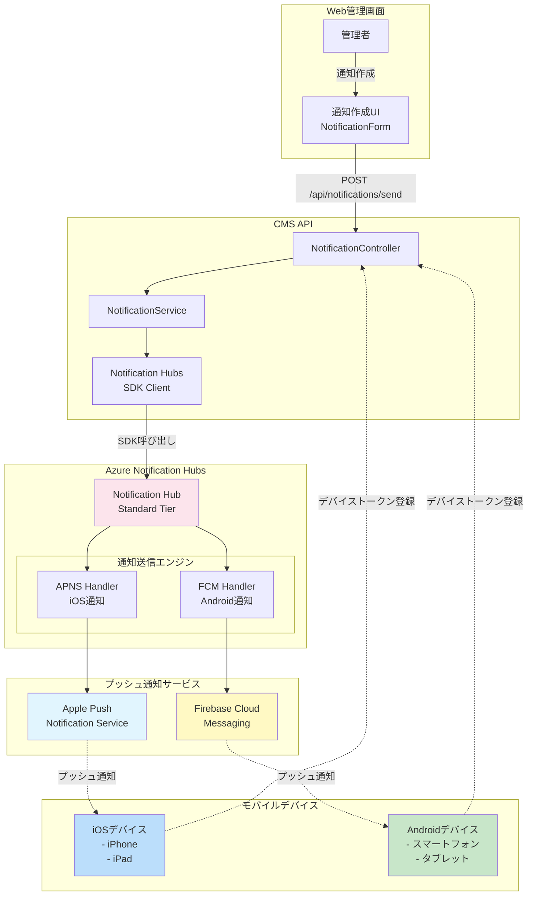

#### 10.2 デバイストークン登録フロー

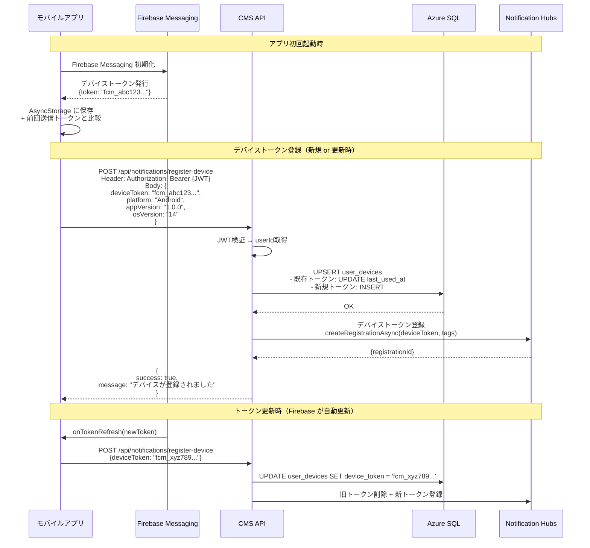

#### 10.3 プッシュ通知送信フロー

```mermaid
sequenceDiagram
    participant ADMIN as 管理者
    participant WEB as Web管理画面
    participant API as CMS API
    participant DB as Azure SQL
    participant NH as Notification Hubs
    participant APNS as Apple APNS
    participant FCM as Google FCM
    participant IOS as iOSデバイス
    participant AND as Androidデバイス

    ADMIN->>WEB: 通知作成画面<br/>NotificationCreatePage
    ADMIN->>WEB: フォーム入力<br/>- タイトル<br/>- メッセージ<br/>- プラットフォーム選択<br/>- Deep Link設定
    WEB->>WEB: React Hook Form バリデーション

    WEB->>API: POST /api/notifications/send<br/>Header: Authorization: Bearer {JWT}<br/>Body: {<br/>  title: "新着コンテンツ",<br/>  message: "新しいビデオが追加されました",<br/>  platforms: ["iOS", "Android"],<br/>  targetAudience: "all",<br/>  deepLink: "juxyi://contents/123"<br/>}

    API->>API: JWT検証（Admin権限チェック）

    API->>DB: SELECT device_token, platform<br/>FROM user_devices<br/>WHERE enabled = 1<br/>AND platform IN ('iOS', 'Android')
    DB-->>API: デバイストークンリスト<br/>[{token, platform}, ...]

    API->>API: プラットフォーム別にペイロード生成

    Note over API,NH: iOS通知送信
    API->>NH: sendAppleNativeNotificationAsync(<br/>  payload: {<br/>    aps: {<br/>      alert: {title, body},<br/>      sound: "default",<br/>      badge: 1<br/>    },<br/>    deepLink: "juxyi://contents/123"<br/>  },<br/>  tags: ["platform:iOS"]<br/>)

    NH->>APNS: APNS プロトコル経由で送信
    APNS->>IOS: プッシュ通知配信
    IOS-->>IOS: 通知バナー表示

    Note over API,NH: Android通知送信
    API->>NH: sendFcmNativeNotificationAsync(<br/>  payload: {<br/>    notification: {title, body},<br/>    data: {<br/>      deepLink: "juxyi://contents/123"<br/>    },<br/>    android: {<br/>      priority: "high"<br/>    }<br/>  },<br/>  tags: ["platform:Android"]<br/>)

    NH->>FCM: FCM API 経由で送信
    FCM->>AND: プッシュ通知配信
    AND-->>AND: 通知バナー表示

    NH-->>API: {<br/>  success: true,<br/>  sentCount: 1500,<br/>  successCount: 1480,<br/>  failureCount: 20<br/>}

    API->>DB: INSERT INTO notification_logs<br/>(title, message, platforms, sent_count, ...)

    API-->>WEB: {<br/>  success: true,<br/>  message: "通知を1480件送信しました"<br/>}

    WEB-->>ADMIN: 成功メッセージ表示<br/>「通知が正常に送信されました」
```

#### 10.4 通知ペイロード構造

**iOS APNS ペイロード**:

```json
{
  "aps": {
    "alert": {
      "title": "新着コンテンツ",
      "body": "新しいビデオが追加されました",
      "subtitle": "JUXYI CMS"
    },
    "sound": "default",
    "badge": 1,
    "category": "NEW_CONTENT",
    "thread-id": "content-notification"
  },
  "deepLink": "juxyi://contents/123",
  "contentId": "123",
  "contentType": "VIDEO"
}
```

**Android FCM ペイロード**:

```json
{
  "notification": {
    "title": "新着コンテンツ",
    "body": "新しいビデオが追加されました",
    "icon": "ic_notification",
    "color": "#0066CC",
    "sound": "default",
    "tag": "NEW_CONTENT",
    "click_action": "FLUTTER_NOTIFICATION_CLICK"
  },
  "data": {
    "deepLink": "juxyi://contents/123",
    "contentId": "123",
    "contentType": "VIDEO"
  },
  "android": {
    "priority": "high",
    "notification": {
      "channel_id": "default_channel"
    }
  }
}
```

#### 10.5 バックエンド実装

**NotificationService.java**:

```java
@Service
@RequiredArgsConstructor
@Slf4j
public class NotificationService {

    private final NotificationHubClient notificationHubClient;
    private final UserDeviceRepository userDeviceRepository;
    private final NotificationLogRepository notificationLogRepository;

    /**
     * プッシュ通知送信
     */
    @Transactional
    public NotificationSendResponse sendNotification(NotificationSendRequest request, Long senderId) {
        // 1. 対象デバイス取得
        List<UserDevice> targetDevices = getTargetDevices(request);

        if (targetDevices.isEmpty()) {
            throw new NoTargetDevicesException("送信対象のデバイスが見つかりません");
        }

        int successCount = 0;
        int failureCount = 0;

        // 2. プラットフォーム別に送信
        if (request.getPlatforms().contains("iOS")) {
            int result = sendToIos(request, targetDevices);
            successCount += result;
        }

        if (request.getPlatforms().contains("Android")) {
            int result = sendToAndroid(request, targetDevices);
            successCount += result;
        }

        failureCount = targetDevices.size() - successCount;

        // 3. 送信ログ保存
        NotificationLog log = NotificationLog.builder()
            .title(request.getTitle())
            .message(request.getMessage())
            .platforms(String.join(",", request.getPlatforms()))
            .targetAudience(request.getTargetAudience())
            .deepLink(request.getDeepLink())
            .sentCount(targetDevices.size())
            .successCount(successCount)
            .failureCount(failureCount)
            .sentBy(senderId)
            .sentAt(LocalDateTime.now())
            .build();

        notificationLogRepository.save(log);

        return NotificationSendResponse.builder()
            .success(true)
            .sentCount(targetDevices.size())
            .successCount(successCount)
            .failureCount(failureCount)
            .build();
    }

    /**
     * iOS通知送信
     */
    private int sendToIos(NotificationSendRequest request, List<UserDevice> devices) {
        List<UserDevice> iosDevices = devices.stream()
            .filter(d -> "iOS".equals(d.getPlatform()))
            .collect(Collectors.toList());

        if (iosDevices.isEmpty()) {
            return 0;
        }

        // APNS ペイロード作成
        ApnsPayload payload = ApnsPayload.builder()
            .aps(ApnsPayload.Aps.builder()
                .alert(ApnsPayload.Alert.builder()
                    .title(request.getTitle())
                    .body(request.getMessage())
                    .build())
                .sound("default")
                .badge(1)
                .build())
            .deepLink(request.getDeepLink())
            .build();

        try {
            // Azure Notification Hubs 経由で送信
            NotificationOutcome outcome = notificationHubClient.sendAppleNativeNotification(
                new ObjectMapper().writeValueAsString(payload),
                "platform:iOS"
            );

            log.info("[Notification] iOS送信完了: success={}, failure={}",
                outcome.getSuccess(), outcome.getFailure());

            return outcome.getSuccess();
        } catch (Exception e) {
            log.error("[Notification] iOS送信エラー:", e);
            return 0;
        }
    }

    /**
     * Android通知送信
     */
    private int sendToAndroid(NotificationSendRequest request, List<UserDevice> devices) {
        List<UserDevice> androidDevices = devices.stream()
            .filter(d -> "Android".equals(d.getPlatform()))
            .collect(Collectors.toList());

        if (androidDevices.isEmpty()) {
            return 0;
        }

        // FCM ペイロード作成
        FcmPayload payload = FcmPayload.builder()
            .notification(FcmPayload.Notification.builder()
                .title(request.getTitle())
                .body(request.getMessage())
                .build())
            .data(Map.of(
                "deepLink", request.getDeepLink()
            ))
            .android(FcmPayload.AndroidConfig.builder()
                .priority("high")
                .build())
            .build();

        try {
            NotificationOutcome outcome = notificationHubClient.sendFcmNativeNotification(
                new ObjectMapper().writeValueAsString(payload),
                "platform:Android"
            );

            log.info("[Notification] Android送信完了: success={}, failure={}",
                outcome.getSuccess(), outcome.getFailure());

            return outcome.getSuccess();
        } catch (Exception e) {
            log.error("[Notification] Android送信エラー:", e);
            return 0;
        }
    }

    /**
     * 対象デバイス取得
     */
    private List<UserDevice> getTargetDevices(NotificationSendRequest request) {
        if ("all".equals(request.getTargetAudience())) {
            // 全ユーザー
            return userDeviceRepository.findByEnabledTrueAndPlatformIn(request.getPlatforms());
        } else if ("specific_users".equals(request.getTargetAudience())) {
            // 特定ユーザー
            return userDeviceRepository.findByUserIdInAndEnabledTrue(request.getUserIds());
        } else {
            return Collections.emptyList();
        }
    }
}
```

#### 10.6 モバイルアプリ実装

**デバイストークン登録**:

```typescript
// src/features/notifications/services/notificationService.ts
import messaging from '@react-native-firebase/messaging';
import axios from 'axios';
import AsyncStorage from '@react-native-async-storage/async-storage';
import { Platform } from 'react-native';

export const notificationService = {
  /**
   * Firebase Messaging 初期化＆デバイストークン登録
   */
  async initialize() {
    try {
      // 通知権限リクエスト
      const authStatus = await messaging().requestPermission();
      const enabled =
        authStatus === messaging.AuthorizationStatus.AUTHORIZED ||
        authStatus === messaging.AuthorizationStatus.PROVISIONAL;

      if (!enabled) {
        console.log('[Notification] 通知権限が拒否されました');
        return;
      }

      // デバイストークン取得
      const token = await messaging().getToken();
      console.log('[Notification] デバイストークン取得:', token);

      // 前回送信したトークンと比較
      const savedToken = await AsyncStorage.getItem('device_token');
      if (savedToken === token) {
        console.log('[Notification] トークン変更なし');
        return;
      }

      // バックエンドに登録
      await this.registerDevice(token);

      // 保存
      await AsyncStorage.setItem('device_token', token);
    } catch (error) {
      console.error('[Notification] 初期化エラー:', error);
    }
  },

  /**
   * デバイストークン登録
   */
  async registerDevice(deviceToken: string) {
    const appVersion = DeviceInfo.getVersion();
    const osVersion = DeviceInfo.getSystemVersion();

    await axios.post('/api/notifications/register-device', {
      deviceToken,
      platform: Platform.OS === 'ios' ? 'iOS' : 'Android',
      appVersion,
      osVersion,
    });

    console.log('[Notification] デバイス登録完了');
  },

  /**
   * フォアグラウンド通知受信
   */
  setupForegroundListener() {
    return messaging().onMessage(async remoteMessage => {
      console.log('[Notification] フォアグラウンド通知受信:', remoteMessage);

      // In-App通知表示
      if (remoteMessage.notification) {
        Alert.alert(
          remoteMessage.notification.title || '',
          remoteMessage.notification.body || '',
        );
      }

      // Deep Link処理
      if (remoteMessage.data?.deepLink) {
        this.handleDeepLink(remoteMessage.data.deepLink);
      }
    });
  },

  /**
   * バックグラウンド通知タップ処理
   */
  setupBackgroundHandler() {
    messaging().setBackgroundMessageHandler(async remoteMessage => {
      console.log('[Notification] バックグラウンド通知受信:', remoteMessage);
      // バックグラウンドでは通知はOSが自動表示
    });

    // 通知タップでアプリ起動
    messaging().onNotificationOpenedApp(remoteMessage => {
      console.log('[Notification] 通知タップでアプリ起動:', remoteMessage);

      if (remoteMessage.data?.deepLink) {
        this.handleDeepLink(remoteMessage.data.deepLink);
      }
    });

    // アプリ完全終了状態から通知タップで起動
    messaging()
      .getInitialNotification()
      .then(remoteMessage => {
        if (remoteMessage) {
          console.log(
            '[Notification] 終了状態から通知タップで起動:',
            remoteMessage,
          );

          if (remoteMessage.data?.deepLink) {
            this.handleDeepLink(remoteMessage.data.deepLink);
          }
        }
      });
  },

  /**
   * Deep Link処理
   */
  handleDeepLink(deepLink: string) {
    console.log('[Notification] Deep Link処理:', deepLink);

    // juxyi://contents/123 → ContentDetailScreen へ遷移
    if (deepLink.startsWith('juxyi://contents/')) {
      const contentId = deepLink.replace('juxyi://contents/', '');
      navigationRef.navigate('ContentDetail', { id: contentId });
    }
    // juxyi://home → HomeScreen へ遷移
    else if (deepLink === 'juxyi://home') {
      navigationRef.navigate('Home');
    }
  },
};
```

**App.tsx での初期化**:

```typescript
// App.tsx
import { useEffect } from 'react';
import { notificationService } from './src/features/notifications/services/notificationService';

function App() {
  useEffect(() => {
    // プッシュ通知初期化
    notificationService.initialize();

    // フォアグラウンドリスナー設定
    const unsubscribeForeground = notificationService.setupForegroundListener();

    // バックグラウンドハンドラー設定
    notificationService.setupBackgroundHandler();

    return () => {
      unsubscribeForeground();
    };
  }, []);

  return (
    // ...
  );
}
```

#### 10.7 通知タグ戦略

Azure Notification Hubs では「タグ」を使用してターゲティング可能:

| タグ            | 例                                 | 用途                     |
| --------------- | ---------------------------------- | ------------------------ |
| **platform**    | `platform:iOS`, `platform:Android` | プラットフォーム別送信   |
| **userId**      | `userId:12345`                     | 特定ユーザーへの送信     |
| **userSegment** | `segment:premium`, `segment:free`  | ユーザーセグメント別送信 |
| **location**    | `location:tokyo`, `location:osaka` | 地域別送信               |
| **appVersion**  | `appVersion:1.0.0`                 | 特定バージョンへの送信   |

**デバイス登録時のタグ設定例**:

```java
// NotificationHubsService.java
public void registerDevice(String deviceToken, String platform, Long userId) {
    Set<String> tags = new HashSet<>();
    tags.add("platform:" + platform);
    tags.add("userId:" + userId);

    // Azure Notification Hubs に登録
    notificationHubClient.createRegistration(deviceToken, tags);
}
```

---

### 11. 状態管理設計

#### 11.1 フロントエンド状態管理アーキテクチャ

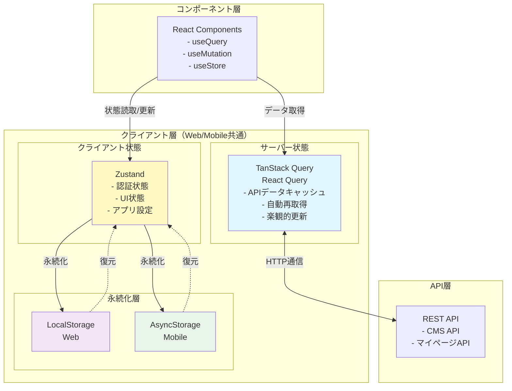

#### 11.2 TanStack Query 設定（サーバー状態）

**QueryClient 設定**:

```typescript
// src/lib/queryClient.ts
import { QueryClient } from '@tanstack/react-query';

export const queryClient = new QueryClient({
  defaultOptions: {
    queries: {
      // キャッシュ時間
      staleTime: 5 * 60 * 1000, // 5分（データが新鮮とみなされる時間）
      cacheTime: 10 * 60 * 1000, // 10分（キャッシュ保持時間）

      // 再取得戦略
      refetchOnWindowFocus: true, // ウィンドウフォーカス時に再取得
      refetchOnReconnect: true, // ネットワーク再接続時に再取得
      refetchOnMount: true, // コンポーネントマウント時に再取得

      // リトライ設定
      retry: 3, // 失敗時に3回リトライ
      retryDelay: attemptIndex => Math.min(1000 * 2 ** attemptIndex, 30000),

      // オフライン対応（モバイル）
      networkMode: 'offlineFirst', // オフライン時はキャッシュを返す
    },
    mutations: {
      retry: 1, // Mutation は基本1回のみリトライ
    },
  },
});
```

**Query Hook 実装例**:

```typescript
// src/features/contents/hooks/useContents.ts
import { useQuery, UseQueryOptions } from '@tanstack/react-query';
import { contentService } from '../services/contentService';
import { Content, ContentFilterParams } from '../types/content.types';

interface UseContentsOptions {
  filters?: ContentFilterParams;
  enabled?: boolean;
}

export const useContents = (options?: UseContentsOptions) => {
  return useQuery({
    queryKey: ['contents', options?.filters], // フィルター変更時に自動再取得
    queryFn: () => contentService.getContents(options?.filters || {}),
    enabled: options?.enabled !== false, // デフォルトで有効
    staleTime: 5 * 60 * 1000, // 5分間キャッシュ

    // 成功時のコールバック
    onSuccess: data => {
      console.log('[Query] コンテンツ取得成功:', data.length, '件');
    },

    // エラー時のコールバック
    onError: error => {
      console.error('[Query] コンテンツ取得エラー:', error);
    },
  });
};

// 使用例
function ContentListPage() {
  const { data, isLoading, error, refetch } = useContents({
    filters: { status: 'PUBLISHED', contentType: 'VIDEO' },
  });

  if (isLoading) return <LoadingSpinner />;
  if (error) return <ErrorView error={error} onRetry={refetch} />;

  return <ContentList contents={data} />;
}
```

**Mutation Hook 実装例**:

```typescript
// src/features/contents/hooks/useContentMutation.ts
import { useMutation, useQueryClient } from '@tanstack/react-query';
import { contentService } from '../services/contentService';
import { message } from 'antd'; // Web
// import { Alert } from 'react-native'; // Mobile

export const useCreateContent = () => {
  const queryClient = useQueryClient();

  return useMutation({
    mutationFn: contentService.createContent,

    // 楽観的更新（Optimistic Update）
    onMutate: async newContent => {
      // 進行中のクエリをキャンセル
      await queryClient.cancelQueries({ queryKey: ['contents'] });

      // 現在のキャッシュを保存（ロールバック用）
      const previousContents = queryClient.getQueryData<Content[]>([
        'contents',
      ]);

      // 楽観的にキャッシュ更新
      queryClient.setQueryData<Content[]>(['contents'], (old = []) => [
        ...old,
        { ...newContent, id: Date.now(), createdAt: new Date().toISOString() },
      ]);

      return { previousContents };
    },

    // 成功時
    onSuccess: data => {
      message.success('コンテンツが作成されました');

      // キャッシュ無効化（サーバーから最新データ再取得）
      queryClient.invalidateQueries({ queryKey: ['contents'] });
    },

    // エラー時（ロールバック）
    onError: (error, newContent, context) => {
      message.error('コンテンツの作成に失敗しました');

      // キャッシュをロールバック
      if (context?.previousContents) {
        queryClient.setQueryData(['contents'], context.previousContents);
      }
    },

    // 完了時（成功/失敗問わず）
    onSettled: () => {
      queryClient.invalidateQueries({ queryKey: ['contents'] });
    },
  });
};

// 使用例
function ContentCreateForm() {
  const { mutate: createContent, isLoading } = useCreateContent();

  const onSubmit = (data: ContentCreateRequest) => {
    createContent(data);
  };

  return (
    <Form onSubmit={onSubmit}>
      {/* フォームフィールド */}
      <Button type="submit" loading={isLoading}>
        作成
      </Button>
    </Form>
  );
}
```

#### 11.3 Zustand 設定（クライアント状態）

**認証ストア**:

```typescript
// src/stores/authStore.ts
import { create } from 'zustand';
import { persist, createJSONStorage } from 'zustand/middleware';
import AsyncStorage from '@react-native-async-storage/async-storage'; // Mobile
// import storage from './localStorage'; // Web

interface User {
  id: number;
  username: string;
  email: string;
  fullName: string;
}

interface AuthState {
  user: User | null;
  accessToken: string | null;
  refreshToken: string | null;
  isAuthenticated: boolean;

  // Actions
  setUser: (user: User, accessToken: string, refreshToken: string) => void;
  logout: () => void;
  updateAccessToken: (accessToken: string) => void;
}

export const useAuthStore = create<AuthState>()(
  persist(
    set => ({
      user: null,
      accessToken: null,
      refreshToken: null,
      isAuthenticated: false,

      setUser: (user, accessToken, refreshToken) => {
        set({
          user,
          accessToken,
          refreshToken,
          isAuthenticated: true,
        });
      },

      logout: () => {
        set({
          user: null,
          accessToken: null,
          refreshToken: null,
          isAuthenticated: false,
        });
      },

      updateAccessToken: accessToken => {
        set({ accessToken });
      },
    }),
    {
      name: 'auth-storage', // AsyncStorage キー
      storage: createJSONStorage(() => AsyncStorage), // Mobile
      // storage: createJSONStorage(() => localStorage), // Web

      // シリアライズ/デシリアライズ
      partialize: state => ({
        user: state.user,
        refreshToken: state.refreshToken,
        // accessToken は永続化しない（セキュリティ上の理由）
      }),
    },
  ),
);

// 使用例
function ProfileScreen() {
  const { user, logout } = useAuthStore();

  if (!user) {
    return <LoginScreen />;
  }

  return (
    <View>
      <Text>ようこそ、{user.fullName}さん</Text>
      <Button onPress={logout}>ログアウト</Button>
    </View>
  );
}
```

**UI 状態ストア**:

```typescript
// src/stores/uiStore.ts
import { create } from 'zustand';

interface UiState {
  sidebarCollapsed: boolean;
  theme: 'light' | 'dark';
  language: 'ja' | 'en';

  // Actions
  toggleSidebar: () => void;
  setTheme: (theme: 'light' | 'dark') => void;
  setLanguage: (language: 'ja' | 'en') => void;
}

export const useUiStore = create<UiState>(set => ({
  sidebarCollapsed: false,
  theme: 'light',
  language: 'ja',

  toggleSidebar: () =>
    set(state => ({ sidebarCollapsed: !state.sidebarCollapsed })),
  setTheme: theme => set({ theme }),
  setLanguage: language => set({ language }),
}));
```

#### 11.4 バックエンド Session ストレージ（Redis）

**Spring Session 設定**:

```yaml
# application.yml
spring:
  session:
    store-type: redis
    timeout: 3600s # 1時間
    redis:
      namespace: spring:session
      flush-mode: on_save
```

**Session 管理例**:

```java
// SsoController.java
@PostMapping("/sso/verify-ticket")
public ResponseEntity<SsoVerifyResponse> verifyTicket(
    @RequestBody SsoVerifyRequest request,
    HttpServletRequest httpRequest
) {
    Long userId = ssoTicketService.verifyAndConsumeTicket(request.getTicket());

    if (userId == null) {
        throw new InvalidTicketException("無効または期限切れのTicketです");
    }

    // Redis Session 作成
    HttpSession session = httpRequest.getSession(true);
    session.setAttribute("userId", userId);
    session.setMaxInactiveInterval(3600); // 1時間

    return ResponseEntity.ok(SsoVerifyResponse.builder()
        .success(true)
        .sessionId(session.getId())
        .build());
}
```

#### 11.5 状態同期戦略

| 状態タイプ                    | 管理場所              | 永続化                       | 同期方法                                          |
| ----------------------------- | --------------------- | ---------------------------- | ------------------------------------------------- |
| **認証状態**                  | Zustand               | AsyncStorage / LocalStorage  | ログイン/ログアウト時に更新                       |
| **ユーザー情報**              | TanStack Query        | なし                         | API から取得、5 分キャッシュ                      |
| **コンテンツ一覧**            | TanStack Query        | なし                         | API から取得、5 分キャッシュ、Mutation 時に無効化 |
| **オフラインキャッシュ**      | TanStack Query        | AsyncStorage（モバイルのみ） | ネットワーク復帰時に同期                          |
| **UI 設定**                   | Zustand               | LocalStorage / AsyncStorage  | 変更時に即座に永続化                              |
| **Session（マイページ Web）** | Redis（バックエンド） | Redis                        | Cookie 経由で管理                                 |

---

### 12. パフォーマンス最適化

#### 12.1 データベース最適化

**インデックス最適化戦略**:

| 最適化項目                 | 実装内容                                                                                            | 効果                                                |
| -------------------------- | --------------------------------------------------------------------------------------------------- | --------------------------------------------------- |
| **複合インデックス**       | `CREATE INDEX idx_contents_type_status ON contents(content_type, status)`                           | WHERE 句の type+status 検索を高速化（100ms → 10ms） |
| **カバリングインデックス** | `CREATE INDEX idx_contents_list ON contents(status, created_at DESC) INCLUDE (title, content_type)` | SELECT 時のディスク I/O 削減                        |
| **Filtered Index**         | `CREATE INDEX idx_published ON contents(published_at) WHERE status = 'PUBLISHED'`                   | 公開コンテンツのみの検索を高速化                    |
| **統計情報更新**           | `UPDATE STATISTICS contents WITH FULLSCAN`                                                          | クエリプランナーの最適化                            |

**N+1 問題の回避**:

```java
// ❌ N+1問題（悪い例）
List<Content> contents = contentRepository.findAll(); // 1回
for (Content content : contents) {
    User creator = userRepository.findById(content.getCreatedBy()).get(); // N回
}

// ✅ Fetch Join（良い例）
@Query("SELECT c FROM Content c JOIN FETCH c.creator WHERE c.status = :status")
List<Content> findAllWithCreator(@Param("status") String status);
```

**ページネーション最適化**:

```java
// ❌ OFFSET方式（大量データで遅い）
SELECT * FROM contents ORDER BY created_at DESC OFFSET 10000 LIMIT 20;

// ✅ Keyset方式（Seek Method）
SELECT * FROM contents
WHERE created_at < '2026-02-01T00:00:00'
ORDER BY created_at DESC
LIMIT 20;
```

#### 12.2 キャッシュ戦略

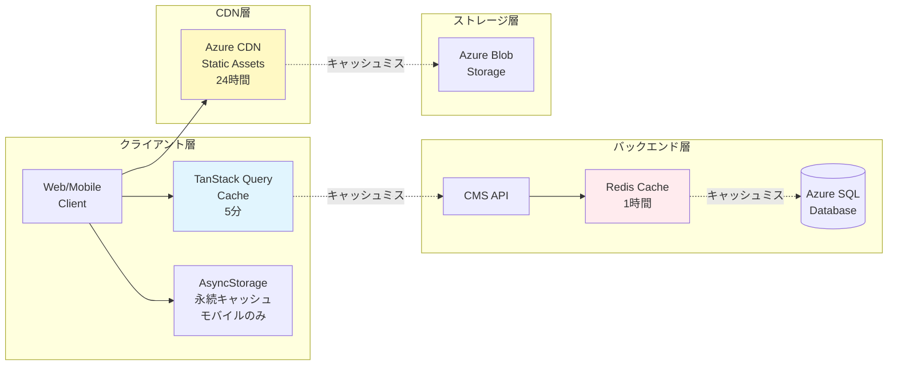

**キャッシュ階層**:

| 層                        | キャッシュ            | TTL     | 用途                                       |
| ------------------------- | --------------------- | ------- | ------------------------------------------ |
| **L1 - クライアント**     | TanStack Query        | 5 分    | API レスポンスキャッシュ                   |
| **L2 - クライアント永続** | AsyncStorage          | 無期限  | オフライン用ファイルキャッシュ（モバイル） |
| **L3 - CDN**              | Azure CDN             | 24 時間 | 静的アセット（画像、動画、CSS、JS）        |
| **L4 - アプリケーション** | Redis                 | 1 時間  | API レスポンス、Session                    |
| **L5 - データベース**     | Azure SQL Query Store | 自動    | クエリ実行プラン                           |

**Redis キャッシュ実装**:

```java
// ContentService.java
@Service
public class ContentService {

    @Cacheable(value = "contents", key = "#id")
    public ContentResponse getContentById(Long id) {
        // キャッシュヒット時はこのメソッドは実行されない
        Content content = contentRepository.findById(id)
            .orElseThrow(() -> new NotFoundException("コンテンツが見つかりません"));

        return ContentResponse.fromEntity(content);
    }

    @CacheEvict(value = "contents", key = "#id")
    public void updateContent(Long id, ContentUpdateRequest request) {
        // 更新時にキャッシュクリア
        Content content = contentRepository.findById(id)
            .orElseThrow(() -> new NotFoundException("コンテンツが見つかりません"));

        content.update(request);
        contentRepository.save(content);
    }

    @Caching(evict = {
        @CacheEvict(value = "contents", allEntries = true),
        @CacheEvict(value = "contentList", allEntries = true)
    })
    public void createContent(ContentCreateRequest request) {
        // 作成時に関連キャッシュ全削除
        Content content = Content.fromRequest(request);
        contentRepository.save(content);
    }
}
```

#### 12.3 ファイルアップロード最適化

**チャンクアップロード（大容量ファイル）**:

```typescript
// src/lib/upload/chunkUploader.ts
export class ChunkUploader {
  private readonly CHUNK_SIZE = 4 * 1024 * 1024; // 4MB

  async uploadLargeFile(
    file: File,
    sasUrl: string,
    onProgress?: (percent: number) => void,
  ) {
    const totalChunks = Math.ceil(file.size / this.CHUNK_SIZE);
    const blockIds: string[] = [];

    for (let i = 0; i < totalChunks; i++) {
      const start = i * this.CHUNK_SIZE;
      const end = Math.min(start + this.CHUNK_SIZE, file.size);
      const chunk = file.slice(start, end);

      // Block ID 生成（Base64エンコード）
      const blockId = btoa(`block-${i.toString().padStart(6, '0')}`);
      blockIds.push(blockId);

      // チャンクアップロード
      await axios.put(`${sasUrl}&comp=block&blockid=${blockId}`, chunk, {
        headers: {
          'Content-Type': 'application/octet-stream',
          'x-ms-blob-type': 'BlockBlob',
        },
      });

      // 進捗通知
      const percent = Math.round(((i + 1) / totalChunks) * 100);
      onProgress?.(percent);
    }

    // Block List をコミット
    const blockListXml = `<?xml version="1.0" encoding="utf-8"?>
<BlockList>
  ${blockIds.map(id => `<Latest>${id}</Latest>`).join('\n')}
</BlockList>`;

    await axios.put(`${sasUrl}&comp=blocklist`, blockListXml, {
      headers: {
        'Content-Type': 'application/xml',
      },
    });

    console.log('[Upload] チャンクアップロード完了');
  }
}
```

**並列アップロード（複数ファイル）**:

```typescript
// 複数ファイルを並列アップロード（最大3並列）
const MAX_CONCURRENT = 3;

async function uploadMultipleFiles(files: File[]) {
  const results = [];

  for (let i = 0; i < files.length; i += MAX_CONCURRENT) {
    const batch = files.slice(i, i + MAX_CONCURRENT);
    const batchResults = await Promise.all(batch.map(file => uploadFile(file)));
    results.push(...batchResults);
  }

  return results;
}
```

#### 12.4 コード分割（Lazy Loading）

**Web フロントエンド（React）**:

```typescript
// src/App.tsx
import { lazy, Suspense } from 'react';
import { Routes, Route } from 'react-router-dom';
import LoadingSpinner from './components/common/LoadingSpinner';

// Lazy Loading（動的インポート）
const DashboardPage = lazy(
  () => import('./features/dashboard/pages/DashboardPage'),
);
const ContentListPage = lazy(
  () => import('./features/contents/pages/ContentListPage'),
);
const VideoUploadPage = lazy(
  () => import('./features/videos/pages/VideoUploadPage'),
);

function App() {
  return (
    <Suspense fallback={<LoadingSpinner />}>
      <Routes>
        <Route path="/dashboard" element={<DashboardPage />} />
        <Route path="/contents" element={<ContentListPage />} />
        <Route path="/videos/upload" element={<VideoUploadPage />} />
      </Routes>
    </Suspense>
  );
}
```

**モバイルアプリ（React Navigation）**:

```typescript
// src/navigation/index.tsx
import { createNativeStackNavigator } from '@react-navigation/native-stack';

const Stack = createNativeStackNavigator();

// React Navigation のデフォルトで Lazy Loading 対応
function AppNavigator() {
  return (
    <Stack.Navigator>
      <Stack.Screen
        name="Home"
        component={HomeScreen}
        options={{ headerShown: false }}
      />
      <Stack.Screen
        name="ContentDetail"
        component={ContentDetailScreen}
        // 初回アクセス時に動的ロード
      />
    </Stack.Navigator>
  );
}
```

#### 12.5 画像・ビデオ最適化

| 最適化項目               | 実装内容                                                          | 効果                             |
| ------------------------ | ----------------------------------------------------------------- | -------------------------------- |
| **画像圧縮**             | サムネイル生成時に JPEG 品質 80%、サイズ 300x300 にリサイズ       | ファイルサイズ 90%削減           |
| **レスポンシブ画像**     | `` | デバイスに最適なサイズ配信       |
| **Lazy Loading**         | ``                                            | 初期ページ読み込み時間 50%短縮   |
| **ビデオストリーミング** | Azure Blob Storage + Range Request 対応                           | シーク可能、初期バッファ時間短縮 |
| **CDN 配信**             | Azure CDN 経由で配信                                              | レイテンシ削減（100ms → 20ms）   |

**サムネイル生成（バックエンド）**:

```java
// ThumbnailService.java
@Service
public class ThumbnailService {

    public String generateVideoThumbnail(String videoUrl) throws IOException {
        // FFmpeg を使用してビデオからサムネイル抽出
        ProcessBuilder pb = new ProcessBuilder(
            "ffmpeg",
            "-i", videoUrl,
            "-ss", "00:00:03", // 3秒地点
            "-vframes", "1",
            "-s", "300x300",
            "-q:v", "2", // 高品質
            "output.jpg"
        );

        Process process = pb.start();
        process.waitFor();

        // Azure Blob にアップロード
        File thumbnail = new File("output.jpg");
        String thumbnailUrl = blobStorageService.uploadThumbnail(thumbnail);

        return thumbnailUrl;
    }
}
```

#### 12.6 パフォーマンス監視

**Application Insights カスタムメトリクス**:

```java
// PerformanceMonitor.java
@Component
@RequiredArgsConstructor
public class PerformanceMonitor {

    private final TelemetryClient telemetryClient;

    public void trackApiResponseTime(String endpoint, long durationMs) {
        telemetryClient.trackMetric("ApiResponseTime_" + endpoint, durationMs);

        if (durationMs > 1000) {
            telemetryClient.trackEvent("SlowApiDetected", Map.of(
                "endpoint", endpoint,
                "duration", String.valueOf(durationMs)
            ));
        }
    }

    public void trackDatabaseQueryTime(String query, long durationMs) {
        telemetryClient.trackMetric("DbQueryTime", durationMs);
    }
}
```

**パフォーマンス目標**:

| メトリクス                   | 目標    | 測定方法                          |
| ---------------------------- | ------- | --------------------------------- |
| **API 応答時間（P95）**      | < 200ms | Application Insights              |
| **ページ読み込み時間**       | < 2 秒  | Lighthouse, Web Vitals            |
| **データベースクエリ時間**   | < 50ms  | Application Insights, Query Store |
| **ファイルアップロード速度** | > 5MB/s | カスタムメトリクス                |
| **アプリ起動時間**           | < 3 秒  | Firebase Performance Monitoring   |

---

### 13. エラーハンドリング戦略

#### 13.1 統一エラーコード体系

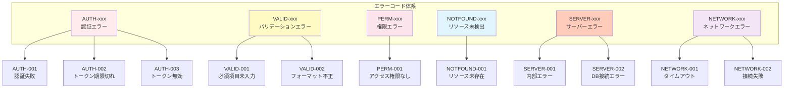

**エラーコード定義**:

| カテゴリ           | コード       | HTTP Status | メッセージ                         | 処理                       |
| ------------------ | ------------ | ----------- | ---------------------------------- | -------------------------- |
| **認証**           | AUTH-001     | 401         | 認証に失敗しました                 | ログイン画面へリダイレクト |
|                    | AUTH-002     | 401         | トークンの期限が切れています       | Refresh Token で再取得     |
|                    | AUTH-003     | 401         | 無効なトークンです                 | ログアウト処理             |
| **バリデーション** | VALID-001    | 400         | {field}は必須項目です              | フォームエラー表示         |
|                    | VALID-002    | 400         | {field}の形式が不正です            | フォームエラー表示         |
|                    | VALID-003    | 400         | ファイルサイズが上限を超えています | エラートースト表示         |
| **権限**           | PERM-001     | 403         | この操作を実行する権限がありません | 403 エラーページ表示       |
| **リソース**       | NOTFOUND-001 | 404         | リソースが見つかりません           | 404 エラーページ表示       |
| **サーバー**       | SERVER-001   | 500         | サーバーエラーが発生しました       | 500 エラーページ表示       |
|                    | SERVER-002   | 500         | データベース接続エラー             | リトライ提案               |
| **ネットワーク**   | NETWORK-001  | -           | 接続がタイムアウトしました         | リトライボタン表示         |
|                    | NETWORK-002  | -           | ネットワークに接続できません       | オフラインモード提案       |

#### 13.2 バックエンド エラーハンドリング

**統一エラーレスポンス形式**:

```java
// dto/ErrorResponse.java
@Data
@Builder
public class ErrorResponse {
    private boolean success = false;
    private String errorCode;     // "AUTH-001"
    private String message;        // "認証に失敗しました"
    private String detail;         // 詳細エラー情報（開発環境のみ）
    private LocalDateTime timestamp;
    private String path;           // リクエストパス
    private Map<String, String> fieldErrors; // バリデーションエラー詳細
}
```

**Global Exception Handler**:

```java
// exception/GlobalExceptionHandler.java
@RestControllerAdvice
@Slf4j
public class GlobalExceptionHandler {

    @Value("${spring.profiles.active}")
    private String activeProfile;

    /**
     * 認証エラー
     */
    @ExceptionHandler(AuthenticationException.class)
    public ResponseEntity<ErrorResponse> handleAuthenticationException(
        AuthenticationException ex,
        WebRequest request
    ) {
        log.warn("[Auth Error] {}", ex.getMessage());

        ErrorResponse error = ErrorResponse.builder()
            .errorCode("AUTH-001")
            .message("認証に失敗しました")
            .detail(isDevelopment() ? ex.getMessage() : null)
            .timestamp(LocalDateTime.now())
            .path(getRequestPath(request))
            .build();

        return ResponseEntity.status(HttpStatus.UNAUTHORIZED).body(error);
    }

    /**
     * JWT トークンエラー
     */
    @ExceptionHandler(JwtTokenException.class)
    public ResponseEntity<ErrorResponse> handleJwtTokenException(
        JwtTokenException ex,
        WebRequest request
    ) {
        String errorCode = ex.isExpired() ? "AUTH-002" : "AUTH-003";
        String message = ex.isExpired()
            ? "トークンの期限が切れています"
            : "無効なトークンです";

        log.warn("[JWT Error] code={}, message={}", errorCode, message);

        ErrorResponse error = ErrorResponse.builder()
            .errorCode(errorCode)
            .message(message)
            .timestamp(LocalDateTime.now())
            .path(getRequestPath(request))
            .build();

        return ResponseEntity.status(HttpStatus.UNAUTHORIZED).body(error);
    }

    /**
     * バリデーションエラー
     */
    @ExceptionHandler(MethodArgumentNotValidException.class)
    public ResponseEntity<ErrorResponse> handleValidationException(
        MethodArgumentNotValidException ex,
        WebRequest request
    ) {
        Map<String, String> fieldErrors = new HashMap<>();

        ex.getBindingResult().getFieldErrors().forEach(error -> {
            fieldErrors.put(error.getField(), error.getDefaultMessage());
        });

        log.warn("[Validation Error] fields={}", fieldErrors);

        ErrorResponse error = ErrorResponse.builder()
            .errorCode("VALID-001")
            .message("入力内容に誤りがあります")
            .fieldErrors(fieldErrors)
            .timestamp(LocalDateTime.now())
            .path(getRequestPath(request))
            .build();

        return ResponseEntity.status(HttpStatus.BAD_REQUEST).body(error);
    }

    /**
     * リソース未検出
     */
    @ExceptionHandler(NotFoundException.class)
    public ResponseEntity<ErrorResponse> handleNotFoundException(
        NotFoundException ex,
        WebRequest request
    ) {
        log.warn("[Not Found] {}", ex.getMessage());

        ErrorResponse error = ErrorResponse.builder()
            .errorCode("NOTFOUND-001")
            .message(ex.getMessage())
            .timestamp(LocalDateTime.now())
            .path(getRequestPath(request))
            .build();

        return ResponseEntity.status(HttpStatus.NOT_FOUND).body(error);
    }

    /**
     * 権限エラー
     */
    @ExceptionHandler(AccessDeniedException.class)
    public ResponseEntity<ErrorResponse> handleAccessDeniedException(
        AccessDeniedException ex,
        WebRequest request
    ) {
        log.warn("[Permission Denied] {}", ex.getMessage());

        ErrorResponse error = ErrorResponse.builder()
            .errorCode("PERM-001")
            .message("この操作を実行する権限がありません")
            .timestamp(LocalDateTime.now())
            .path(getRequestPath(request))
            .build();

        return ResponseEntity.status(HttpStatus.FORBIDDEN).body(error);
    }

    /**
     * 汎用サーバーエラー
     */
    @ExceptionHandler(Exception.class)
    public ResponseEntity<ErrorResponse> handleGenericException(
        Exception ex,
        WebRequest request
    ) {
        log.error("[Server Error]", ex);

        ErrorResponse error = ErrorResponse.builder()
            .errorCode("SERVER-001")
            .message("サーバーエラーが発生しました")
            .detail(isDevelopment() ? ex.getMessage() : null)
            .timestamp(LocalDateTime.now())
            .path(getRequestPath(request))
            .build();

        return ResponseEntity.status(HttpStatus.INTERNAL_SERVER_ERROR).body(error);
    }

    private boolean isDevelopment() {
        return "local".equals(activeProfile) || "dev".equals(activeProfile);
    }

    private String getRequestPath(WebRequest request) {
        return ((ServletWebRequest) request).getRequest().getRequestURI();
    }
}
```

#### 13.3 フロントエンド エラーハンドリング

**Axios Interceptor（共通エラー処理）**:

```typescript
// src/lib/axios/axiosClient.ts
import axios, { AxiosError, AxiosRequestConfig } from 'axios';
import { message } from 'antd'; // Web
import { useAuthStore } from '@/stores/authStore';
import { navigationRef } from '@/navigation';

interface ErrorResponse {
  success: boolean;
  errorCode: string;
  message: string;
  detail?: string;
  fieldErrors?: Record<string, string>;
}

const axiosClient = axios.create({
  baseURL: process.env.REACT_APP_API_BASE_URL || 'http://localhost:8080/api',
  timeout: 30000,
  headers: {
    'Content-Type': 'application/json',
  },
});

// リクエストインターセプター（JWT Token 自動付与）
axiosClient.interceptors.request.use(
  config => {
    const { accessToken } = useAuthStore.getState();

    if (accessToken) {
      config.headers.Authorization = `Bearer ${accessToken}`;
    }

    return config;
  },
  error => {
    return Promise.reject(error);
  },
);

// レスポンスインターセプター（エラー処理）
axiosClient.interceptors.response.use(
  response => {
    return response;
  },
  async (error: AxiosError<ErrorResponse>) => {
    const originalRequest = error.config as AxiosRequestConfig & {
      _retry?: boolean;
    };

    // ネットワークエラー
    if (!error.response) {
      message.error('ネットワークに接続できません');
      return Promise.reject({
        errorCode: 'NETWORK-002',
        message: 'ネットワークに接続できません',
      });
    }

    const { status, data } = error.response;

    switch (status) {
      case 401:
        // トークン期限切れ → Refresh Token で再取得
        if (data.errorCode === 'AUTH-002' && !originalRequest._retry) {
          originalRequest._retry = true;

          try {
            const newAccessToken = await refreshAccessToken();
            useAuthStore.getState().updateAccessToken(newAccessToken);

            // 元のリクエストを再実行
            originalRequest.headers!.Authorization = `Bearer ${newAccessToken}`;
            return axiosClient(originalRequest);
          } catch (refreshError) {
            // Refresh Token も期限切れ → ログアウト
            useAuthStore.getState().logout();
            navigationRef.navigate('Login');
            message.error('セッションが切れました。再度ログインしてください');
            return Promise.reject(refreshError);
          }
        }

        // 認証失敗 → ログイン画面へ
        useAuthStore.getState().logout();
        navigationRef.navigate('Login');
        message.error(data.message || '認証に失敗しました');
        break;

      case 403:
        message.error(data.message || 'この操作を実行する権限がありません');
        break;

      case 404:
        message.error(data.message || 'リソースが見つかりません');
        break;

      case 400:
        if (data.fieldErrors) {
          console.warn('[Validation Error]', data.fieldErrors);
        } else {
          message.error(data.message || '入力内容に誤りがあります');
        }
        break;

      case 500:
        message.error(data.message || 'サーバーエラーが発生しました');
        break;

      default:
        message.error(data.message || '予期しないエラーが発生しました');
    }

    return Promise.reject(data);
  },
);

async function refreshAccessToken(): Promise<string> {
  const { refreshToken } = useAuthStore.getState();
  const response = await axios.post('/api/auth/refresh-token', {
    refreshToken,
  });
  return response.data.accessToken;
}

export default axiosClient;
```

---

### 14. 監視・ログ設計

#### 14.1 Azure Application Insights アーキテクチャ

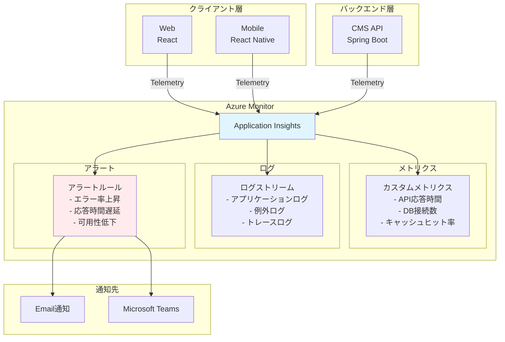

#### 14.2 アラートルール設定

| アラート名        | 条件                           | 重大度   | 通知先        |
| ----------------- | ------------------------------ | -------- | ------------- |
| **高エラー率**    | エラー率 > 5%（5 分間）        | Critical | Email + Teams |
| **API 応答遅延**  | P95 応答時間 > 500ms（5 分間） | Warning  | Teams         |
| **可用性低下**    | 可用性 < 99%（5 分間）         | Critical | Email + Teams |
| **DB 接続エラー** | DB 接続失敗 > 10 件（5 分間）  | Critical | Email + Teams |
| **CPU 使用率**    | CPU 使用率 > 80%（10 分間）    | Warning  | Teams         |

---

### 15. CI/CD とデプロイ戦略

#### 15.1 CI/CD パイプラインアーキテクチャ

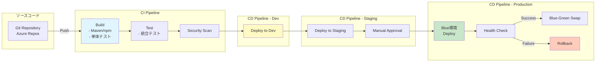

#### 15.2 デプロイメント戦略

**環境構成**:

| 環境            | 用途           | デプロイ方法          | 自動/手動 |
| --------------- | -------------- | --------------------- | --------- |
| **Development** | 開発検証       | develop ブランチ push | 自動      |
| **Staging**     | リリース前検証 | main ブランチ push    | 自動      |
| **Production**  | 本番環境       | Staging 承認後        | 手動承認  |

**Blue-Green デプロイメント**:

1. **Blue 環境** にデプロイ
2. **Health Check** 実施
3. 成功 → **Blue-Green Swap**（トラフィック切替）
4. 失敗 → **Rollback**（前バージョン維持）

**ロールバック戦略**:

- Health Check 失敗時: 自動ロールバック
- エラー率 > 10%: 自動ロールバック
- 手動ロールバック: Azure CLI または Portal

---

## 第 3 部：バックエンドアーキテクチャ

### 16. バックエンド設計概要

#### 16.1 技術スタック

| カテゴリ             | 技術               | バージョン     | 用途                           |
| -------------------- | ------------------ | -------------- | ------------------------------ |
| **フレームワーク**   | Spring Boot        | 3.2.x          | アプリケーションフレームワーク |
| **言語**             | Java               | 17 LTS         | プログラミング言語             |
| **永続化**           | Spring Data JPA    | 3.2.x          | ORM                            |
| **データベース**     | Azure SQL Database | Standard S2/S3 | リレーショナル DB              |
| **キャッシュ**       | Spring Data Redis  | 3.2.x          | キャッシュ管理                 |
| **セキュリティ**     | Spring Security    | 6.2.x          | 認証・認可                     |
| **API 仕様**         | SpringDoc OpenAPI  | 2.3.x          | API ドキュメント               |
| **ビルドツール**     | Maven              | 3.9.x          | 依存関係管理                   |
| **マイグレーション** | Flyway             | 10.x           | DB マイグレーション            |

#### 16.2 アーキテクチャ原則

| 原則                     | 説明                     | 実装例                               |
| ------------------------ | ------------------------ | ------------------------------------ |
| **関心の分離**           | 各層が明確な責務を持つ   | Controller/Service/Repository/Entity |
| **依存性注入**           | 疎結合な設計             | Spring DI コンテナ                   |
| **例外処理の一元化**     | Global Exception Handler | @RestControllerAdvice                |
| **トランザクション管理** | 宣言的トランザクション   | @Transactional                       |
| **キャッシュ戦略**       | 多層キャッシュ           | Redis + Query Cache                  |
| **ログ集約**             | 構造化ログ               | Application Insights                 |

---

### 17. 四層アーキテクチャ

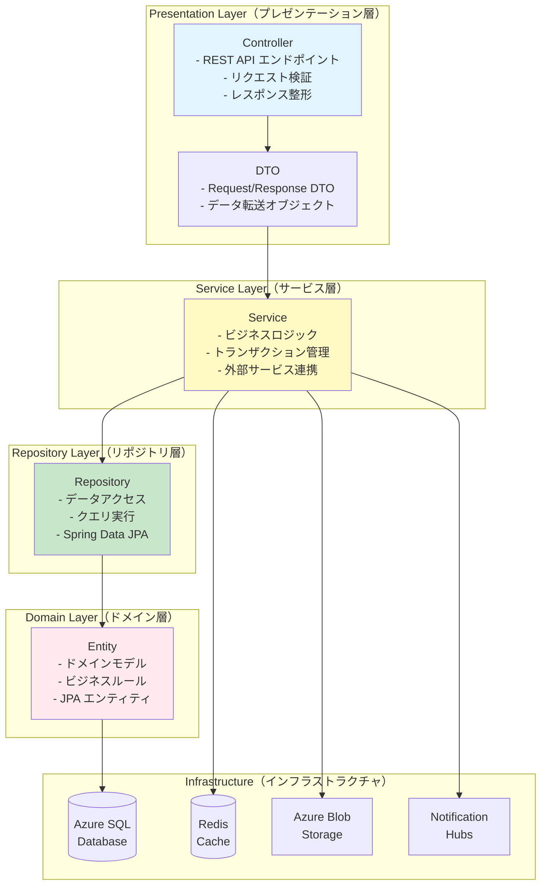

#### 17.1 各層の責務

**Presentation Layer（プレゼンテーション層）**:

- REST API エンドポイント定義
- HTTP リクエスト/レスポンス処理
- 入力バリデーション
- DTO ↔ Entity 変換
- API ドキュメント（OpenAPI）

**Service Layer（サービス層）**:

- ビジネスロジック実装
- トランザクション境界管理
- 複数リポジトリの調整
- 外部サービス統合（Azure Blob, Notification Hubs）
- キャッシュ制御

**Repository Layer（リポジトリ層）**:

- データベースアクセス
- CRUD 操作
- カスタムクエリ（JPQL, Native SQL）
- ページネーション
- N+1 問題回避（Fetch Join）

**Domain Layer（ドメイン層）**:

- ドメインモデル定義
- エンティティライフサイクル管理
- ビジネスルール検証
- エンティティ間リレーション

---

### 18. ディレクトリ構造

```
backend/
├── src/
│   ├── main/
│   │   ├── java/com/juxyi/cms/
│   │   │   ├── config/                      # 設定クラス
│   │   │   │   ├── SecurityConfig.java      # Spring Security 設定
│   │   │   │   ├── RedisConfig.java         # Redis 設定
│   │   │   │   ├── JpaConfig.java           # JPA 設定
│   │   │   │   ├── SwaggerConfig.java       # OpenAPI 設定
│   │   │   │   └── CorsConfig.java          # CORS 設定
│   │   │   │
│   │   │   ├── controller/                  # REST コントローラー
│   │   │   │   ├── AuthController.java      # 認証API
│   │   │   │   ├── ContentController.java   # コンテンツAPI
│   │   │   │   ├── DocumentController.java  # ドキュメントAPI
│   │   │   │   ├── VideoController.java     # ビデオAPI
│   │   │   │   ├── StampController.java     # スタンプAPI
│   │   │   │   ├── NotificationController.java # 通知API
│   │   │   │   └── SsoController.java       # SSO API
│   │   │   │
│   │   │   ├── service/                     # ビジネスロジック
│   │   │   │   ├── AuthService.java
│   │   │   │   ├── ContentService.java
│   │   │   │   ├── FileStorageService.java
│   │   │   │   ├── NotificationService.java
│   │   │   │   ├── SsoTicketService.java
│   │   │   │   └── StampService.java
│   │   │   │
│   │   │   ├── repository/                  # データアクセス
│   │   │   │   ├── UserRepository.java
│   │   │   │   ├── ContentRepository.java
│   │   │   │   ├── DocumentRepository.java
│   │   │   │   ├── VideoRepository.java
│   │   │   │   ├── StampRepository.java
│   │   │   │   └── UserDeviceRepository.java
│   │   │   │
│   │   │   ├── entity/                      # JPA エンティティ
│   │   │   │   ├── User.java
│   │   │   │   ├── Content.java
│   │   │   │   ├── Document.java
│   │   │   │   ├── Video.java
│   │   │   │   ├── UrlLink.java
│   │   │   │   ├── Stamp.java
│   │   │   │   ├── StampCollection.java
│   │   │   │   └── UserDevice.java
│   │   │   │
│   │   │   ├── dto/                         # データ転送オブジェクト
│   │   │   │   ├── request/
│   │   │   │   │   ├── LoginRequest.java
│   │   │   │   │   ├── ContentCreateRequest.java
│   │   │   │   │   ├── VideoUploadRequest.java
│   │   │   │   │   └── NotificationSendRequest.java
│   │   │   │   ├── response/
│   │   │   │   │   ├── LoginResponse.java
│   │   │   │   │   ├── ContentResponse.java
│   │   │   │   │   ├── UserResponse.java
│   │   │   │   │   └── ErrorResponse.java
│   │   │   │
│   │   │   ├── security/                    # セキュリティコンポーネント
│   │   │   │   ├── JwtTokenProvider.java    # JWT 生成/検証
│   │   │   │   ├── JwtAuthenticationFilter.java # JWT フィルター
│   │   │   │   ├── CustomUserDetailsService.java
│   │   │   │   └── SecurityContextHolder.java
│   │   │   │
│   │   │   ├── exception/                   # 例外クラス
│   │   │   │   ├── GlobalExceptionHandler.java
│   │   │   │   ├── NotFoundException.java
│   │   │   │   ├── JwtTokenException.java
│   │   │   │   └── BusinessException.java
│   │   │   │
│   │   │   ├── util/                        # ユーティリティ
│   │   │   │   ├── DateUtil.java
│   │   │   │   ├── ValidationUtil.java
│   │   │   │   └── FileUtil.java
│   │   │   │
│   │   │   └── CmsApplication.java          # メインクラス
│   │   │
│   │   └── resources/
│   │       ├── application.yml              # アプリケーション設定
│   │       ├── application-dev.yml          # 開発環境設定
│   │       ├── application-prod.yml         # 本番環境設定
│   │       ├── logback-spring.xml           # ログ設定
│   │       └── db/
│   │           └── migration/               # Flyway マイグレーション
│   │               ├── V1__init_schema.sql
│   │               ├── V2__add_content_tables.sql
│   │               └── V3__add_eninsho_support.sql
│   │
│   └── test/
│       └── java/com/juxyi/cms/
│           ├── controller/                  # コントローラーテスト
│           ├── service/                     # サービステスト
│           └── repository/                  # リポジトリテスト
│
├── pom.xml                                  # Maven 依存関係
├── Dockerfile                               # Docker イメージ定義
└── README.md
```

---

### 19. 主要コンポーネント実装

#### 19.1 Spring Security 設定

```java
// config/SecurityConfig.java
@Configuration
@EnableWebSecurity
@EnableMethodSecurity
@RequiredArgsConstructor
public class SecurityConfig {

    private final JwtAuthenticationFilter jwtAuthenticationFilter;
    private final CustomUserDetailsService userDetailsService;

    @Bean
    public SecurityFilterChain securityFilterChain(HttpSecurity http) throws Exception {
        http
            .cors(cors -> cors.configurationSource(corsConfigurationSource()))
            .csrf(csrf -> csrf.disable())
            .sessionManagement(session ->
                session.sessionCreationPolicy(SessionCreationPolicy.STATELESS)
            )
            .authorizeHttpRequests(auth -> auth
                // Public エンドポイント
                .requestMatchers(
                    "/api/auth/login",
                    "/api/auth/refresh-token",
                    "/api/auth/eninsho-login",
                    "/api/health",
                    "/swagger-ui/**",
                    "/v3/api-docs/**"
                ).permitAll()

                // Admin 専用エンドポイント
                .requestMatchers("/api/admin/**").hasRole("ADMIN")

                // 認証必須
                .anyRequest().authenticated()
            )
            .exceptionHandling(ex -> ex
                .authenticationEntryPoint(new JwtAuthenticationEntryPoint())
                .accessDeniedHandler(new JwtAccessDeniedHandler())
            )
            .addFilterBefore(jwtAuthenticationFilter, UsernamePasswordAuthenticationFilter.class);

        return http.build();
    }

    @Bean
    public PasswordEncoder passwordEncoder() {
        return new BCryptPasswordEncoder();
    }

    @Bean
    public AuthenticationManager authenticationManager(AuthenticationConfiguration config)
            throws Exception {
        return config.getAuthenticationManager();
    }

    @Bean
    public CorsConfigurationSource corsConfigurationSource() {
        CorsConfiguration configuration = new CorsConfiguration();
        configuration.setAllowedOrigins(Arrays.asList(
            "http://localhost:3000",
            "https://cms.juxyi.com"
        ));
        configuration.setAllowedMethods(Arrays.asList("GET", "POST", "PUT", "DELETE", "OPTIONS"));
        configuration.setAllowedHeaders(Arrays.asList("*"));
        configuration.setAllowCredentials(true);

        UrlBasedCorsConfigurationSource source = new UrlBasedCorsConfigurationSource();
        source.registerCorsConfiguration("/**", configuration);
        return source;
    }
}
```

#### 19.2 JWT Token Provider

```java
// security/JwtTokenProvider.java
@Component
@Slf4j
public class JwtTokenProvider {

    @Value("${jwt.secret}")
    private String jwtSecret;

    @Value("${jwt.expiration}")
    private long jwtExpirationMs; // 24時間

    @Value("${jwt.refresh-expiration}")
    private long refreshExpirationMs; // 7日間

    /**
     * Access Token 生成
     */
    public String generateAccessToken(Long userId, String username) {
        Date now = new Date();
        Date expiryDate = new Date(now.getTime() + jwtExpirationMs);

        return Jwts.builder()
            .setSubject(String.valueOf(userId))
            .claim("username", username)
            .setIssuedAt(now)
            .setExpiration(expiryDate)
            .signWith(SignatureAlgorithm.HS512, jwtSecret)
            .compact();
    }

    /**
     * Refresh Token 生成
     */
    public String generateRefreshToken(Long userId) {
        Date now = new Date();
        Date expiryDate = new Date(now.getTime() + refreshExpirationMs);

        return Jwts.builder()
            .setSubject(String.valueOf(userId))
            .setIssuedAt(now)
            .setExpiration(expiryDate)
            .signWith(SignatureAlgorithm.HS512, jwtSecret)
            .compact();
    }

    /**
     * Token からユーザーID取得
     */
    public Long getUserIdFromToken(String token) {
        Claims claims = Jwts.parser()
            .setSigningKey(jwtSecret)
            .parseClaimsJws(token)
            .getBody();

        return Long.parseLong(claims.getSubject());
    }

    /**
     * Token 検証
     */
    public boolean validateToken(String token) {
        try {
            Jwts.parser().setSigningKey(jwtSecret).parseClaimsJws(token);
            return true;
        } catch (MalformedJwtException ex) {
            log.error("Invalid JWT token");
        } catch (ExpiredJwtException ex) {
            log.error("Expired JWT token");
        } catch (UnsupportedJwtException ex) {
            log.error("Unsupported JWT token");
        } catch (IllegalArgumentException ex) {
            log.error("JWT claims string is empty");
        }
        return false;
    }
}
```

#### 19.3 Redis 設定

```java
// config/RedisConfig.java
@Configuration
@EnableCaching
public class RedisConfig {

    @Value("${spring.data.redis.host}")
    private String redisHost;

    @Value("${spring.data.redis.port}")
    private int redisPort;

    @Value("${spring.data.redis.password}")
    private String redisPassword;

    @Bean
    public RedisConnectionFactory redisConnectionFactory() {
        RedisStandaloneConfiguration config = new RedisStandaloneConfiguration();
        config.setHostName(redisHost);
        config.setPort(redisPort);
        config.setPassword(redisPassword);

        LettuceConnectionFactory factory = new LettuceConnectionFactory(config);
        factory.afterPropertiesSet();
        return factory;
    }

    @Bean
    public RedisTemplate<String, Object> redisTemplate() {
        RedisTemplate<String, Object> template = new RedisTemplate<>();
        template.setConnectionFactory(redisConnectionFactory());

        // JSON シリアライザー設定
        Jackson2JsonRedisSerializer<Object> serializer =
            new Jackson2JsonRedisSerializer<>(Object.class);

        ObjectMapper mapper = new ObjectMapper();
        mapper.setVisibility(PropertyAccessor.ALL, JsonAutoDetect.Visibility.ANY);
        mapper.activateDefaultTyping(
            mapper.getPolymorphicTypeValidator(),
            ObjectMapper.DefaultTyping.NON_FINAL
        );
        serializer.setObjectMapper(mapper);

        template.setKeySerializer(new StringRedisSerializer());
        template.setValueSerializer(serializer);
        template.setHashKeySerializer(new StringRedisSerializer());
        template.setHashValueSerializer(serializer);

        template.afterPropertiesSet();
        return template;
    }

    @Bean
    public CacheManager cacheManager(RedisConnectionFactory connectionFactory) {
        RedisCacheConfiguration config = RedisCacheConfiguration.defaultCacheConfig()
            .entryTtl(Duration.ofHours(1)) // 1時間キャッシュ
            .serializeKeysWith(
                RedisSerializationContext.SerializationPair.fromSerializer(
                    new StringRedisSerializer()
                )
            )
            .serializeValuesWith(
                RedisSerializationContext.SerializationPair.fromSerializer(
                    new GenericJackson2JsonRedisSerializer()
                )
            );

        return RedisCacheManager.builder(connectionFactory)
            .cacheDefaults(config)
            .build();
    }
}
```

---

### 20. 高可用性設計

#### 20.1 データベース接続プール（HikariCP）

```yaml
# application-prod.yml
spring:
  datasource:
    hikari:
      maximum-pool-size: 20 # 最大接続数
      minimum-idle: 5 # 最小アイドル接続数
      connection-timeout: 30000 # 接続タイムアウト（30秒）
      idle-timeout: 600000 # アイドルタイムアウト（10分）
      max-lifetime: 1800000 # 接続最大生存時間（30分）
      leak-detection-threshold: 60000 # リーク検出（1分）
```

#### 20.2 Azure App Service 自動スケール設定

| メトリクス            | 条件  | スケールアウト  | スケールイン    |
| --------------------- | ----- | --------------- | --------------- |
| **CPU 使用率**        | > 70% | +1 インスタンス | -1 インスタンス |
| **メモリ使用率**      | > 80% | +1 インスタンス | -1 インスタンス |
| **HTTP Queue Length** | > 100 | +1 インスタンス | -               |
| **最小インスタンス**  | -     | 2               | -               |
| **最大インスタンス**  | -     | 10              | -               |

#### 20.3 ヘルスチェックエンドポイント

```java
// controller/HealthController.java
@RestController
@RequestMapping("/api/health")
public class HealthController {

    @Autowired
    private DataSource dataSource;

    @Autowired
    private RedisTemplate<String, Object> redisTemplate;

    @GetMapping
    public ResponseEntity<Map<String, Object>> health() {
        Map<String, Object> health = new HashMap<>();
        health.put("status", "UP");
        health.put("timestamp", LocalDateTime.now());

        // DB接続チェック
        try {
            dataSource.getConnection().close();
            health.put("database", "UP");
        } catch (Exception e) {
            health.put("database", "DOWN");
            health.put("status", "DOWN");
        }

        // Redis接続チェック
        try {
            redisTemplate.getConnectionFactory().getConnection().ping();
            health.put("redis", "UP");
        } catch (Exception e) {
            health.put("redis", "DOWN");
        }

        return "UP".equals(health.get("status"))
            ? ResponseEntity.ok(health)
            : ResponseEntity.status(HttpStatus.SERVICE_UNAVAILABLE).body(health);
    }
}
```

---

## 第 4 部：Web フロントエンドアーキテクチャ

### 21. Web フロントエンド設計概要

#### 21.1 技術スタック

| カテゴリ              | 技術                     | バージョン | 用途                      |
| --------------------- | ------------------------ | ---------- | ------------------------- |
| **フレームワーク**    | React                    | 18.2+      | UI フレームワーク         |
| **言語**              | TypeScript               | 5.3+       | 型安全な開発              |
| **ビルドツール**      | Vite                     | 5.1+       | 高速ビルド                |
| **UI ライブラリ**     | Ant Design               | 5.14+      | UI コンポーネント         |
| **状態管理**          | TanStack Query + Zustand | 5.x / 4.x  | サーバー/クライアント状態 |
| **ルーティング**      | React Router             | 6.x        | SPA ルーティング          |
| **フォーム**          | React Hook Form          | 7.x        | フォーム管理              |
| **HTTP クライアント** | Axios                    | 1.6+       | API 通信                  |
| **日付**              | Day.js                   | 1.11+      | 日時操作                  |

#### 21.2 アーキテクチャ特徴

| 特徴                   | 説明                          | 実装                               |
| ---------------------- | ----------------------------- | ---------------------------------- |
| **Feature-based**      | 機能単位でディレクトリ分割    | features/ 配下に機能ごとのフォルダ |
| **コンポーネント分離** | Presentational/Container 分離 | components/ 配下で共通化           |
| **カスタムフック**     | ロジック再利用                | hooks/ 配下に集約                  |
| **型安全**             | TypeScript 厳格モード         | strict: true                       |
| **コード分割**         | Lazy Loading                  | React.lazy() + Suspense            |
| **キャッシュ戦略**     | TanStack Query                | 5 分キャッシュ                     |

---

### 22. Feature-based Architecture

```mermaid
graph TB
    subgraph "Pages（ページコンポーネント）"
        PAGE[Dashboard<br/>ContentList<br/>VideoUpload<br/>Settings]
    end

    subgraph "Features（機能モジュール）"
        FEAT[contents/<br/>videos/<br/>notifications/<br/>auth/]
    end

    subgraph "Components（共通コンポーネント）"
        COMP[Button<br/>Table<br/>Form<br/>Modal]
    end

    subgraph "Hooks（カスタムフック）"
        HOOK[useContents<br/>useAuth<br/>useUpload]
    end

    subgraph "Services（API通信）"
        SVC[contentService<br/>authService<br/>uploadService]
    end

    subgraph "Stores（状態管理）"
        STORE[authStore<br/>uiStore]
    end

    PAGE --> FEAT
    FEAT --> COMP
    FEAT --> HOOK
    HOOK --> SVC
    HOOK --> STORE

    style PAGE fill:#e1f5fe
    style FEAT fill:#fff9c4
    style COMP fill:#c8e6c9
    style HOOK fill:#ffebee
```

---

### 23. ディレクトリ構造

```
frontend/
├── src/
│   ├── features/                        # 機能モジュール
│   │   ├── dashboard/
│   │   │   ├── pages/
│   │   │   │   └── DashboardPage.tsx
│   │   │   ├── components/
│   │   │   │   ├── StatsCard.tsx
│   │   │   │   └── RecentActivities.tsx
│   │   │   └── hooks/
│   │   │       └── useDashboardStats.ts
│   │   │
│   │   ├── contents/
│   │   │   ├── pages/
│   │   │   │   ├── ContentListPage.tsx
│   │   │   │   ├── ContentDetailPage.tsx
│   │   │   │   └── ContentCreatePage.tsx
│   │   │   ├── components/
│   │   │   │   ├── ContentTable.tsx
│   │   │   │   ├── ContentForm.tsx
│   │   │   │   └── ContentFilter.tsx
│   │   │   ├── hooks/
│   │   │   │   ├── useContents.ts
│   │   │   │   ├── useContentDetail.ts
│   │   │   │   └── useContentMutation.ts
│   │   │   ├── services/
│   │   │   │   └── contentService.ts
│   │   │   └── types/
│   │   │       └── content.types.ts
│   │   │
│   │   ├── videos/
│   │   │   ├── pages/
│   │   │   │   ├── VideoListPage.tsx
│   │   │   │   └── VideoUploadPage.tsx
│   │   │   ├── components/
│   │   │   │   ├── VideoPlayer.tsx
│   │   │   │   ├── VideoUploadForm.tsx
│   │   │   │   └── UploadProgress.tsx
│   │   │   ├── hooks/
│   │   │   │   └── useVideoUpload.ts
│   │   │   └── services/
│   │   │       └── videoService.ts
│   │   │
│   │   ├── notifications/
│   │   │   ├── pages/
│   │   │   │   └── NotificationCreatePage.tsx
│   │   │   ├── components/
│   │   │   │   └── NotificationForm.tsx
│   │   │   └── services/
│   │   │       └── notificationService.ts
│   │   │
│   │   └── auth/
│   │       ├── pages/
│   │       │   └── LoginPage.tsx
│   │       ├── components/
│   │       │   └── LoginForm.tsx
│   │       ├── hooks/
│   │       │   └── useAuth.ts
│   │       └── services/
│   │           └── authService.ts
│   │
│   ├── components/                      # 共通コンポーネント
│   │   ├── common/
│   │   │   ├── Button.tsx
│   │   │   ├── LoadingSpinner.tsx
│   │   │   └── ErrorView.tsx
│   │   ├── layout/
│   │   │   ├── AppLayout.tsx
│   │   │   ├── Header.tsx
│   │   │   ├── Sidebar.tsx
│   │   │   └── Footer.tsx
│   │   └── form/
│   │       ├── FormInput.tsx
│   │       ├── FormSelect.tsx
│   │       └── FormUpload.tsx
│   │
│   ├── hooks/                           # グローバルフック
│   │   ├── useDebounce.ts
│   │   ├── useLocalStorage.ts
│   │   └── useMediaQuery.ts
│   │
│   ├── stores/                          # Zustand ストア
│   │   ├── authStore.ts
│   │   └── uiStore.ts
│   │
│   ├── lib/                             # ライブラリ設定
│   │   ├── axios/
│   │   │   └── axiosClient.ts
│   │   ├── queryClient.ts
│   │   └── appInsights.ts
│   │
│   ├── utils/                           # ユーティリティ
│   │   ├── format.ts
│   │   ├── validation.ts
│   │   └── constants.ts
│   │
│   ├── types/                           # 型定義
│   │   └── global.types.ts
│   │
│   ├── styles/                          # スタイル
│   │   └── global.css
│   │
│   ├── App.tsx                          # ルートコンポーネント
│   ├── main.tsx                         # エントリーポイント
│   └── vite-env.d.ts
│
├── public/
│   ├── favicon.ico
│   └── logo.png
│
├── index.html
├── vite.config.ts
├── tsconfig.json
├── package.json
└── README.md
```

---

### 24. 主要機能モジュール

#### 24.1 コンテンツ管理機能

**ContentListPage.tsx**:

```typescript
// features/contents/pages/ContentListPage.tsx
import { useState } from 'react';
import { Table, Button, Space, Tag } from 'antd';
import { PlusOutlined } from '@ant-design/icons';
import { useNavigate } from 'react-router-dom';
import { useContents } from '../hooks/useContents';
import ContentFilter from '../components/ContentFilter';
import type { ContentFilterParams } from '../types/content.types';

export default function ContentListPage() {
  const navigate = useNavigate();
  const [filters, setFilters] = useState<ContentFilterParams>({});

  const {
    data: contents,
    isLoading,
    error,
    refetch,
  } = useContents({ filters });

  const columns = [
    {
      title: 'ID',
      dataIndex: 'id',
      key: 'id',
      width: 80,
    },
    {
      title: 'タイトル',
      dataIndex: 'title',
      key: 'title',
    },
    {
      title: '種別',
      dataIndex: 'contentType',
      key: 'contentType',
      render: (type: string) => {
        const colorMap = {
          DOCUMENT: 'blue',
          VIDEO: 'red',
          URL_LINK: 'green',
        };
        return <Tag color={colorMap[type]}>{type}</Tag>;
      },
    },
    {
      title: '状態',
      dataIndex: 'status',
      key: 'status',
      render: (status: string) => {
        const colorMap = {
          DRAFT: 'default',
          PUBLISHED: 'success',
          ARCHIVED: 'warning',
        };
        return <Tag color={colorMap[status]}>{status}</Tag>;
      },
    },
    {
      title: '公開日',
      dataIndex: 'publishedAt',
      key: 'publishedAt',
      render: (date: string) =>
        date ? dayjs(date).format('YYYY/MM/DD HH:mm') : '-',
    },
    {
      title: '操作',
      key: 'action',
      render: (_: any, record: Content) => (
        <Space size="small">
          <Button
            size="small"
            onClick={() => navigate(`/contents/${record.id}`)}
          >
            詳細
          </Button>
          <Button
            size="small"
            onClick={() => navigate(`/contents/${record.id}/edit`)}
          >
            編集
          </Button>
        </Space>
      ),
    },
  ];

  return (
    <div>
      <div
        style={{
          marginBottom: 16,
          display: 'flex',
          justifyContent: 'space-between',
        }}
      >
        <h1>コンテンツ一覧</h1>
        <Button
          type="primary"
          icon={<PlusOutlined />}
          onClick={() => navigate('/contents/create')}
        >
          新規作成
        </Button>
      </div>

      <ContentFilter filters={filters} onFilterChange={setFilters} />

      <Table
        columns={columns}
        dataSource={contents}
        loading={isLoading}
        rowKey="id"
        pagination={{
          pageSize: 20,
          showSizeChanger: true,
          showTotal: total => `全 ${total} 件`,
        }}
      />
    </div>
  );
}
```

---

### 25. ルーティングとレイアウト

**App.tsx**:

```typescript
// App.tsx
import { lazy, Suspense } from 'react';
import { BrowserRouter, Routes, Route, Navigate } from 'react-router-dom';
import { QueryClientProvider } from '@tanstack/react-query';
import { ConfigProvider } from 'antd';
import jaJP from 'antd/locale/ja_JP';
import { queryClient } from './lib/queryClient';
import LoadingSpinner from './components/common/LoadingSpinner';
import AppLayout from './components/layout/AppLayout';
import ProtectedRoute from './components/auth/ProtectedRoute';

// Lazy Loading
const LoginPage = lazy(() => import('./features/auth/pages/LoginPage'));
const DashboardPage = lazy(
  () => import('./features/dashboard/pages/DashboardPage'),
);
const ContentListPage = lazy(
  () => import('./features/contents/pages/ContentListPage'),
);
const ContentDetailPage = lazy(
  () => import('./features/contents/pages/ContentDetailPage'),
);
const VideoUploadPage = lazy(
  () => import('./features/videos/pages/VideoUploadPage'),
);

function App() {
  return (
    <QueryClientProvider client={queryClient}>
      <ConfigProvider locale={jaJP}>
        <BrowserRouter>
          <Suspense fallback={<LoadingSpinner />}>
            <Routes>
              {/* Public Routes */}
              <Route path="/login" element={<LoginPage />} />

              {/* Protected Routes */}
              <Route
                path="/"
                element={
                  <ProtectedRoute>
                    <AppLayout />
                  </ProtectedRoute>
                }
              >
                <Route index element={<Navigate to="/dashboard" replace />} />
                <Route path="dashboard" element={<DashboardPage />} />
                <Route path="contents" element={<ContentListPage />} />
                <Route path="contents/:id" element={<ContentDetailPage />} />
                <Route path="videos/upload" element={<VideoUploadPage />} />
              </Route>
            </Routes>
          </Suspense>
        </BrowserRouter>
      </ConfigProvider>
    </QueryClientProvider>
  );
}

export default App;
```

---

## 第 5 部：モバイルアプリアーキテクチャ

### 26. モバイルアプリ設計概要

#### 26.1 技術スタック

| カテゴリ              | 技術                     | バージョン | 用途                       |
| --------------------- | ------------------------ | ---------- | -------------------------- |
| **フレームワーク**    | React Native             | 0.73+      | クロスプラットフォーム開発 |
| **言語**              | TypeScript               | 5.3+       | 型安全な開発               |
| **ナビゲーション**    | React Navigation         | 6.x        | 画面遷移                   |
| **UI ライブラリ**     | React Native Paper       | 5.x        | マテリアルデザイン         |
| **状態管理**          | TanStack Query + Zustand | 5.x / 4.x  | サーバー/クライアント状態  |
| **HTTP クライアント** | Axios                    | 1.6+       | API 通信                   |
| **プッシュ通知**      | React Native Firebase    | 18.x       | FCM 統合                   |
| **ストレージ**        | AsyncStorage             | 1.21+      | ローカルストレージ         |
| **e-ninsho**          | Native Module            | Custom     | マイナンバーカード認証     |

---

### 27. ナビゲーション設計

```mermaid
graph TB
    ROOT[App起動]

    ROOT --> AUTH_CHECK{認証状態}

    AUTH_CHECK -->|未認証| AUTH_STACK[Auth Stack<br/>- Login<br/>- Register]
    AUTH_CHECK -->|認証済| MAIN_TAB[Main Tab Navigator]

    MAIN_TAB --> HOME[Home Tab<br/>Stack Navigator]
    MAIN_TAB --> CONTENTS[Contents Tab<br/>Stack Navigator]
    MAIN_TAB --> STAMP[Stamp Tab<br/>Stack Navigator]
    MAIN_TAB --> PROFILE[Profile Tab<br/>Stack Navigator]

    HOME --> HOME_SCREEN[HomeScreen]
    HOME --> CONTENT_DETAIL[ContentDetailScreen]
    HOME --> VIDEO_PLAYER[VideoPlayerScreen]

    CONTENTS --> CONTENT_LIST[ContentListScreen]
    CONTENTS --> CONTENT_DETAIL2[ContentDetailScreen]

    STAMP --> STAMP_MAP[StampMapScreen]
    STAMP --> QR_SCANNER[QRScannerScreen]
    STAMP --> STAMP_DETAIL[StampDetailScreen]

    PROFILE --> PROFILE_SCREEN[ProfileScreen]
    PROFILE --> SETTINGS[SettingsScreen]

    style AUTH_STACK fill:#ffebee
    style MAIN_TAB fill:#e1f5fe
    style HOME fill:#fff9c4
    style CONTENTS fill:#c8e6c9
    style STAMP fill:#f3e5f5
    style PROFILE fill:#fce4ec
```

---

### 28. ディレクトリ構造

```
mobile/
├── src/
│   ├── navigation/
│   │   ├── index.tsx                    # ルートナビゲーター
│   │   ├── AuthStack.tsx                # 認証スタック
│   │   ├── MainTabNavigator.tsx         # メインタブ
│   │   └── types.ts                     # ナビゲーション型定義
│   │
│   ├── features/
│   │   ├── auth/
│   │   │   ├── screens/
│   │   │   │   ├── LoginScreen.tsx
│   │   │   │   └── EninshoLoginScreen.tsx
│   │   │   ├── components/
│   │   │   │   └── BiometricButton.tsx
│   │   │   └── hooks/
│   │   │       └── useAuth.ts
│   │   │
│   │   ├── contents/
│   │   │   ├── screens/
│   │   │   │   ├── ContentListScreen.tsx
│   │   │   │   ├── ContentDetailScreen.tsx
│   │   │   │   └── VideoPlayerScreen.tsx
│   │   │   ├── components/
│   │   │   │   └── ContentCard.tsx
│   │   │   └── hooks/
│   │   │       └── useContents.ts
│   │   │
│   │   ├── stamps/
│   │   │   ├── screens/
│   │   │   │   ├── StampMapScreen.tsx
│   │   │   │   ├── QRScannerScreen.tsx
│   │   │   │   └── StampDetailScreen.tsx
│   │   │   ├── components/
│   │   │   │   └── StampCard.tsx
│   │   │   └── hooks/
│   │   │       └── useStamps.ts
│   │   │
│   │   └── profile/
│   │       ├── screens/
│   │       │   ├── ProfileScreen.tsx
│   │       │   └── SettingsScreen.tsx
│   │       └── components/
│   │           └── ProfileHeader.tsx
│   │
│   ├── components/                      # 共通コンポーネント
│   │   ├── common/
│   │   │   ├── Button.tsx
│   │   │   ├── LoadingSpinner.tsx
│   │   │   └── ErrorView.tsx
│   │   └── layout/
│   │       └── Container.tsx
│   │
│   ├── hooks/
│   │   ├── useOfflineCache.ts
│   │   └── useNetworkStatus.ts
│   │
│   ├── stores/
│   │   ├── authStore.ts
│   │   └── offlineStore.ts
│   │
│   ├── lib/
│   │   ├── axios/
│   │   │   └── axiosClient.ts
│   │   ├── queryClient.ts
│   │   ├── analytics.ts
│   │   └── notifications.ts
│   │
│   ├── native-modules/                  # Native Bridge
│   │   ├── EninshoModule.ts
│   │   ├── BiometricModule.ts
│   │   └── QRScannerModule.ts
│   │
│   ├── utils/
│   │   ├── format.ts
│   │   └── constants.ts
│   │
│   ├── types/
│   │   └── global.types.ts
│   │
│   └── App.tsx
│
├── android/                             # Android ネイティブコード
│   └── app/
│       └── src/
│           └── main/
│               └── java/
│                   └── EninshoModule.java
│
├── ios/                                 # iOS ネイティブコード
│   └── mytestapp/
│       ├── EninshoModule.h
│       └── EninshoModule.m
│
├── app.json
├── package.json
└── tsconfig.json
```

---

### 29. 原生機能統合

#### 29.1 e-ninsho SDK 統合（詳細）

Native Module の実装は [SYSTEM_ARCHITECTURE.md](SYSTEM_ARCHITECTURE.md) の §6.2 を参照。

#### 29.2 QR コードスキャン

```typescript
// features/stamps/screens/QRScannerScreen.tsx
import { useState } from 'react';
import { View, StyleSheet, Alert } from 'react-native';
import { Camera, useCameraDevices } from 'react-native-vision-camera';
import { useScanBarcodes, BarcodeFormat } from 'vision-camera-code-scanner';
import { useNavigation } from '@react-navigation/native';
import { useStampCollection } from '../hooks/useStampCollection';

export default function QRScannerScreen() {
  const navigation = useNavigation();
  const devices = useCameraDevices();
  const device = devices.back;

  const { mutate: collectStamp } = useStampCollection();

  const [frameProcessor, barcodes] = useScanBarcodes([BarcodeFormat.QR_CODE], {
    checkInverted: true,
  });

  const handleBarCodeScanned = ({
    type,
    data,
  }: {
    type: string;
    data: string;
  }) => {
    if (data && data.startsWith('STAMP_')) {
      const stampId = data.replace('STAMP_', '');

      Alert.alert(
        'スタンプを獲得しますか？',
        'このスタンプを獲得してコレクションに追加します。',
        [
          { text: 'キャンセル', style: 'cancel' },
          {
            text: '獲得する',
            onPress: () => {
              collectStamp(
                { stampId },
                {
                  onSuccess: () => {
                    navigation.goBack();
                    Alert.alert('成功', 'スタンプを獲得しました！');
                  },
                  onError: error => {
                    Alert.alert('エラー', error.message);
                  },
                },
              );
            },
          },
        ],
      );
    }
  };

  if (!device) {
    return <LoadingSpinner />;
  }

  return (
    <View style={styles.container}>
      <Camera
        style={StyleSheet.absoluteFill}
        device={device}
        isActive={true}
        frameProcessor={frameProcessor}
        frameProcessorFps={5}
      />
      <View style={styles.overlay}>
        <View style={styles.scanFrame} />
      </View>
    </View>
  );
}
```

---

### 30. 主要機能モジュール

#### 30.1 オフライン対応コンテンツ表示

```typescript
// hooks/useOfflineContent.ts
import { useQuery } from '@tanstack/react-query';
import { contentService } from '../services/contentService';
import { useNetworkStatus } from './useNetworkStatus';
import AsyncStorage from '@react-native-async-storage/async-storage';

export const useOfflineContent = (contentId: string) => {
  const { isConnected } = useNetworkStatus();

  return useQuery({
    queryKey: ['content', contentId],
    queryFn: async () => {
      if (isConnected) {
        // オンライン：APIから取得
        const content = await contentService.getContentById(contentId);

        // キャッシュに保存
        await AsyncStorage.setItem(
          `content_${contentId}`,
          JSON.stringify(content),
        );

        return content;
      } else {
        // オフライン：キャッシュから取得
        const cached = await AsyncStorage.getItem(`content_${contentId}`);
        if (cached) {
          return JSON.parse(cached);
        }
        throw new Error('オフラインではこのコンテンツを利用できません');
      }
    },
    staleTime: 5 * 60 * 1000, // 5分
    cacheTime: 24 * 60 * 60 * 1000, // 24時間
  });
};
```

---

### 31. オフライン機能設計

#### 31.1 ファイルキャッシュ戦略（LRU）

```typescript
// lib/fileCache/FileCacheManager.ts
import AsyncStorage from '@react-native-async-storage/async-storage';
import RNFS from 'react-native-fs';

interface CacheEntry {
  url: string;
  localPath: string;
  size: number;
  accessedAt: number;
}

export class FileCacheManager {
  private static readonly MAX_CACHE_SIZE = 100 * 1024 * 1024; // 100MB
  private static readonly CACHE_DIR = `${RNFS.DocumentDirectoryPath}/cache`;

  /**
   * ファイルダウンロード＆キャッシュ
   */
  static async downloadAndCache(url: string): Promise<string> {
    // キャッシュ確認
    const cached = await this.getCachedFilePath(url);
    if (cached && (await RNFS.exists(cached))) {
      await this.updateAccessTime(url);
      return cached;
    }

    // ダウンロード
    const localPath = `${this.CACHE_DIR}/${this.hashUrl(url)}`;
    await RNFS.downloadFile({ fromUrl: url, toFile: localPath }).promise;

    // メタデータ保存
    const stat = await RNFS.stat(localPath);
    await this.saveCacheEntry({
      url,
      localPath,
      size: parseInt(stat.size),
      accessedAt: Date.now(),
    });

    // キャッシュサイズチェック＆LRU削除
    await this.enforceCacheLimit();

    return localPath;
  }

  /**
   * LRUアルゴリズムでキャッシュ削除
   */
  private static async enforceCacheLimit() {
    const entries = await this.getAllCacheEntries();
    const totalSize = entries.reduce((sum, e) => sum + e.size, 0);

    if (totalSize > this.MAX_CACHE_SIZE) {
      // アクセス時刻でソート（古い順）
      entries.sort((a, b) => a.accessedAt - b.accessedAt);

      let freedSize = 0;
      let i = 0;

      while (
        freedSize < totalSize - this.MAX_CACHE_SIZE &&
        i < entries.length
      ) {
        const entry = entries[i];
        await RNFS.unlink(entry.localPath);
        await this.removeCacheEntry(entry.url);
        freedSize += entry.size;
        i++;
      }

      console.log(`[Cache] LRU削除: ${i}ファイル, ${freedSize}バイト`);
    }
  }

  private static hashUrl(url: string): string {
    // 簡易ハッシュ関数
    let hash = 0;
    for (let i = 0; i < url.length; i++) {
      hash = (hash << 5) - hash + url.charCodeAt(i);
      hash = hash & hash;
    }
    return Math.abs(hash).toString(36);
  }
}
```

---

## 第 6 部：システム統合

### 32. データフロー設計

#### 32.1 コンテンツライフサイクル

```mermaid
sequenceDiagram
    participant ADMIN as 管理者<br/>Web
    participant API as CMS API
    participant DB as Azure SQL
    participant BLOB as Azure Blob
    participant MOBILE as モバイルアプリ

    Note over ADMIN,MOBILE: コンテンツ作成フロー

    ADMIN->>API: POST /api/contents<br/>{title, description, contentType}
    API->>DB: INSERT INTO contents
    DB-->>API: {id: 123}

    alt contentType = VIDEO
        ADMIN->>API: GET /api/files/upload-url
        API->>BLOB: Generate SAS Token
        BLOB-->>API: {sasUrl}
        API-->>ADMIN: {sasUrl, blobUrl}

        ADMIN->>BLOB: PUT (Direct Upload)<br/>Video File
        BLOB-->>ADMIN: 200 OK

        ADMIN->>API: POST /api/videos<br/>{contentId: 123, videoUrl}
        API->>DB: INSERT INTO videos
    end

    ADMIN->>API: PUT /api/contents/123/publish
    API->>DB: UPDATE contents SET status = 'PUBLISHED'
    API-->>ADMIN: 200 OK

    Note over ADMIN,MOBILE: モバイルアプリでの閲覧フロー

    MOBILE->>API: GET /api/contents?status=PUBLISHED
    API->>DB: SELECT * FROM contents
    DB-->>API: [contents...]
    API-->>MOBILE: {contents: [...]}

    MOBILE->>MOBILE: TanStack Query でキャッシュ

    MOBILE->>API: GET /api/contents/123
    API->>DB: SELECT * FROM contents LEFT JOIN videos
    API-->>MOBILE: {id: 123, videoUrl: "https://..."}

    MOBILE->>BLOB: GET videoUrl
    BLOB-->>MOBILE: Video Stream
    MOBILE->>MOBILE: ビデオ再生
```

---

### 33. 認証統合フロー

#### 33.1 認証統合図

```mermaid
graph TB
    subgraph "Web フロントエンド"
        WEB_LOGIN[Login Form]
        WEB_AUTH[JWT Token<br/>LocalStorage]
    end

    subgraph "モバイルアプリ"
        MOBILE_LOGIN[Login Screen]
        MOBILE_ENINSHO[e-ninsho Login]
        MOBILE_BIO[Biometric Login]
        MOBILE_AUTH[JWT Token<br/>AsyncStorage]
    end

    subgraph "CMS API"
        AUTH_API[AuthController]
        JWT_PROVIDER[JwtTokenProvider]
        USER_SERVICE[UserDetailsService]
    end

    subgraph "認証方式"
        USERNAME_PW[Username/Password]
        JPKI[JPKI e-ninsho]
        BIOMETRIC[Face ID / Touch ID]
    end

    WEB_LOGIN --> USERNAME_PW
    MOBILE_LOGIN --> USERNAME_PW
    MOBILE_ENINSHO --> JPKI
    MOBILE_BIO --> BIOMETRIC

    USERNAME_PW --> AUTH_API
    JPKI --> AUTH_API
    BIOMETRIC --> MOBILE_AUTH

    AUTH_API --> JWT_PROVIDER
    JWT_PROVIDER --> USER_SERVICE
    USER_SERVICE --> WEB_AUTH
    USER_SERVICE --> MOBILE_AUTH

    style WEB_AUTH fill:#e1f5fe
    style MOBILE_AUTH fill:#fff9c4
    style AUTH_API fill:#ffebee
```

---

### 34. API 統合ポイント

#### 34.1 API 統合マトリクス

| 機能                     | CMS API | MyPage API | Web | Mobile | 備考                      |
| ------------------------ | ------- | ---------- | --- | ------ | ------------------------- |
| **認証**                 | ✅      | ✅         | ✅  | ✅     | JWT Token ベース          |
| **コンテンツ一覧**       | ✅      | ✅         | ✅  | ✅     | TanStack Query キャッシュ |
| **コンテンツ作成**       | ✅      | -          | ✅  | -      | Admin 権限必要            |
| **ファイルアップロード** | ✅      | -          | ✅  | -      | SAS Token 経由            |
| **プッシュ通知送信**     | ✅      | -          | ✅  | -      | Admin 権限必要            |
| **デバイストークン登録** | ✅      | -          | -   | ✅     | Mobile のみ               |
| **スタンプ獲得**         | ✅      | -          | -   | ✅     | Mobile のみ               |
| **SSO Ticket 発行**      | ✅      | -          | ✅  | -      | CMS → MyPage 連携         |
| **SSO Ticket 検証**      | -       | ✅         | -   | -      | MyPage で検証             |

---

## 付録

### 付録 A：型定義リファレンス

**shared/types/content.types.ts**:

```typescript
export interface Content {
  id: number;
  contentType: 'DOCUMENT' | 'VIDEO' | 'URL_LINK';
  title: string;
  description: string;
  status: 'DRAFT' | 'PUBLISHED' | 'ARCHIVED';
  createdBy: number;
  createdAt: string;
  updatedAt: string;
  publishedAt?: string;
}

export interface Video extends Content {
  videoUrl: string;
  thumbnailUrl?: string;
  duration?: number;
  fileSize: number;
}

export interface Document extends Content {
  fileUrl: string;
  fileName: string;
  fileSize: number;
  mimeType: string;
}

export interface UrlLink extends Content {
  url: string;
  target: '_blank' | '_self';
}
```

---

### 付録 B：テスト戦略

| テストレベル              | ツール                            | カバレッジ目標 | 実行タイミング     |
| ------------------------- | --------------------------------- | -------------- | ------------------ |
| **単体テスト（Backend）** | JUnit 5 + Mockito                 | > 80%          | CI Pipeline        |
| **単体テスト（Web）**     | Vitest + Testing Library          | > 70%          | CI Pipeline        |
| **単体テスト（Mobile）**  | Jest + Testing Library            | > 70%          | CI Pipeline        |
| **統合テスト（API）**     | Spring Boot Test + TestContainers | > 60%          | CI Pipeline        |
| **E2E テスト（Web）**     | Playwright                        | 主要フロー     | Staging デプロイ後 |
| **E2E テスト（Mobile）**  | Detox                             | 主要フロー     | Manual             |

---

### 付録 C：開発環境セットアップ

**バックエンド**:

```bash
# 前提条件
- Java 17 JDK
- Maven 3.9+
- Docker Desktop（ローカルDB用）

# セットアップ
cd backend
mvn clean install
mvn spring-boot:run -Dspring-boot.run.profiles=local
```

**Web フロントエンド**:

```bash
# 前提条件
- Node.js 18+
- npm 9+

# セットアップ
cd frontend
npm install
npm run dev
```

**モバイルアプリ**:

```bash
# iOS
cd mobile
npm install
cd ios && pod install && cd ..
npx react-native run-ios

# Android
npx react-native run-android
```

---

### 付録 D：トラブルシューティング

| 問題                         | 原因               | 解決方法                       |
| ---------------------------- | ------------------ | ------------------------------ |
| **JWT Token 期限切れ**       | 24 時間経過        | Refresh Token で再取得         |
| **CORS エラー**              | Origin 未許可      | SecurityConfig に Origin 追加  |
| **DB 接続エラー**            | 接続文字列不正     | application.yml 確認           |
| **Redis 接続エラー**         | Redis サーバー停止 | Azure Portal で Redis 状態確認 |
| **ファイルアップロード失敗** | SAS Token 期限切れ | 有効期限を 15 分に延長         |

---

### 付録 E：用語集

| 用語                      | 説明                                                   |
| ------------------------- | ------------------------------------------------------ |
| **JWT**                   | JSON Web Token、トークンベース認証方式                 |
| **e-ninsho**              | マイナンバーカードを利用した電子認証                   |
| **JPKI (LGPKI)**          | 公的個人認証サービス                                   |
| **SAS Token**             | Azure Blob Storage の Shared Access Signature          |
| **Blue-Green Deployment** | 無停止デプロイメント手法                               |
| **LRU**                   | Least Recently Used、キャッシュ削除アルゴリズム        |
| **TanStack Query**        | React 向けサーバー状態管理ライブラリ（旧 React Query） |
| **Zustand**               | 軽量な React 状態管理ライブラリ                        |

---

### 付録 F：変更履歴

| バージョン | 日付       | 変更内容                                         | 担当者 |
| ---------- | ---------- | ------------------------------------------------ | ------ |
| **1.0.0**  | 2026-02-09 | 初版作成：3 つのアーキテクチャドキュメントを統合 | -      |

---
