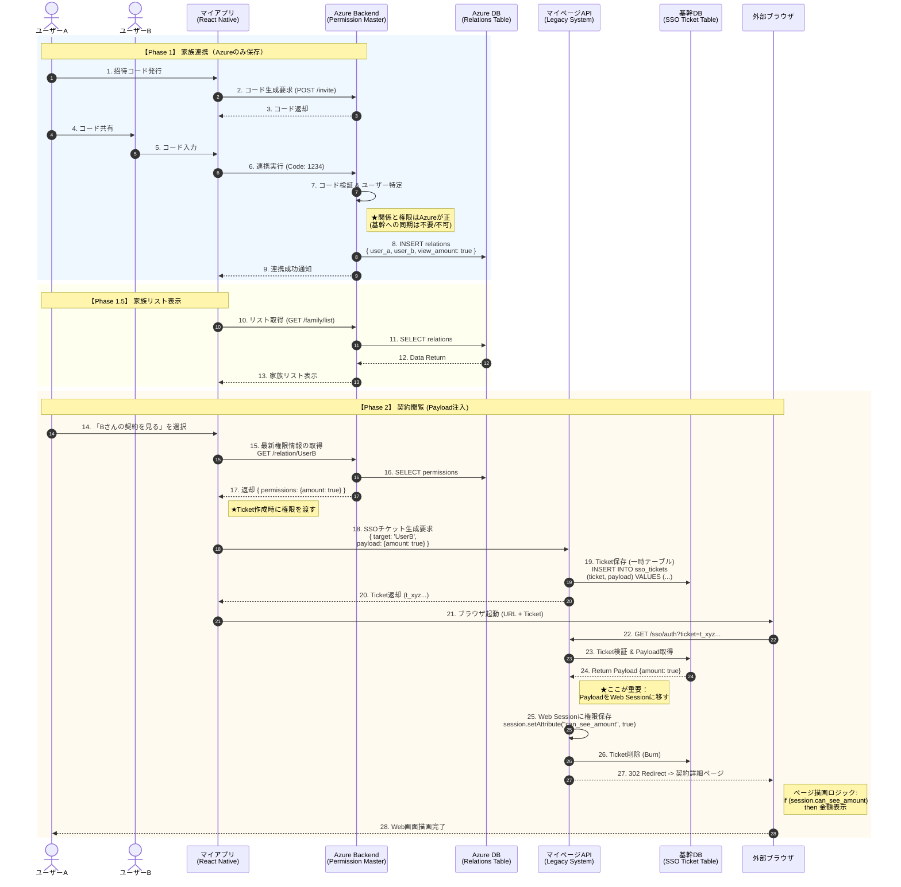

这是基于**“Legacy 端无权限数据库”**这一前提，重新设计的**方案一（Web 跳转模式）最终版时序图**。

**核心逻辑变化：**

1. **Phase 1 (绑定):** **只在 Azure 存数据**，完全不再同步给 Legacy（因为 Legacy 没地方存）。
2. **Phase 2 (查阅):** 采用 **Payload 注入模式**。

- 在跳转前，App 从 Azure 获取最新的权限配置。
- App 向 Legacy 请求 Ticket 时，将权限信息作为参数（Payload）带过去。
- Legacy 将权限暂时保存在 `sso_tickets` 表中。
- 跳转验证时，Legacy 从 Ticket 表读出权限，**写入 Web Session**，以此控制页面显示。

---

### 方案一：Web 跳转模式 (Legacy 无库版 / Payload 注入)

### 🔍 关键细节确认 (Checklist)

1. **数据源 (Source of Truth):**

- 图中 Step 8 明确显示关系只存在 `Azure DB`。
- Legacy 端完全不需要新建“家庭关系表”，解决了老系统难以改造的问题。

2. **权限传递 (The Handover):**

- **Step 18:** App 将 Azure 告知的权限打包发给 Legacy。
- **Step 19:** Legacy 将这个包暂存在 `sso_tickets` 表的 `payload` 字段里。这张表是临时的，没有任何业务负担。

3. **状态保持 (Session):**

- **Step 25:** 这是最关键的一步。Legacy 从临时表读出权限后，塞进了浏览器的 Session。这样后续用户在网页里点击刷新、或者看不同合同，只要 Session 还在，权限就在。

4. **SSO 安全:**

- 保留了 Ticket 的 **生成 -> 验证 -> 销毁 (Burn)** 闭环，安全性没有因为 payload 的加入而降低。

这张图就是**“Legacy 零业务改造”**的最优解，您可以直接用于提案。

基于**“MyPage (Legacy) 端无法新建家庭关系表”**这一前提，采用 **Payload 注入模式**（即：权限信息由 App 携带，经由 Ticket 暂存，最后注入 Web Session），各系统的具体修改点（Action Items）梳理如下。

这份清单可以直接用来与开发团队确认工作边界。

---

### 修改点清单：方案一 (Payload 注入模式)

**核心差异：** MyPage 不再存储“谁是谁的家人”，它只负责在 SSO 跳转的那一刻，接收并执行 App 传过来的权限指令。

#### 1. MyApp (新系统：Azure + React Native)

**职责：** 家庭关系与权限的**唯一管理者 (Master)**。

| 模块         | 具体修改点 (Action Items)            | 备注 |
| ------------ | ------------------------------------ | ---- |
| **Azure DB** | **1. 新建 `FamilyRelations` 表**  |

 字段：`requester_id`, `target_id`, `permissions` (JSON 存储权限配置)。 | **这是数据的唯一源头** |
| **Azure API** | **1. 绑定接口 (POST /invite)** 

 只写入 Azure DB，**删除**原定的“调用 MyPage 同步”逻辑。 

 **2. 权限查询接口 (GET /relation/{id})** 

 新增接口，供 App 在跳转前获取最新的权限配置（如 `{show_amount: true}`）。 | 不再需要同步给老系统 |
| **App 前端** | **1. 跳转逻辑增强 (核心)** 

 点击“查看”时，不再是直接请求 Ticket，而是： 

 ① 先调 Azure 拿权限 JSON。 

 ② 再调 Legacy 的 `create-ticket`，把权限 JSON 作为参数传过去。 | 逻辑比原版稍微复杂一点 |

---

#### 2. MyPage (老系统：Legacy API + Web)

**职责：** **无状态执行者**。接收 Payload -> 暂存 Ticket -> 写入 Session。

| 模块          | 具体修改点 (Action Items)        | 备注 |
| ------------- | -------------------------------- | ---- |
| **Legacy DB** | **1. 修改 `sso_tickets` 表**  |

 新增字段 `payload` (类型：TEXT 或 JSON)。 

 _注意：这是临时表，数据有效期极短，不涉及核心业务表结构变更。_ | 用于暂存权限信息 |
| **后端 API** | **1. 修改 Ticket 生成接口 (POST /create-ticket)** 

 入参新增 `payload` 字段。 

 逻辑：生成 Ticket 时，将接收到的 payload 原封不动地 `INSERT` 到 `sso_tickets` 表中。 | |
| **Web 鉴权** | **1. 修改 SSO 验证逻辑 (Controller)** 

 在验证 Ticket 有效后： 

 ① 从 DB 读取 `payload`。 

 ② **将 payload 内容写入当前 Web Session**。 

 _(例如: `session.setAttribute("can_see_amount", true)`) _ | **最关键的一步** |
| **Web 页面** | **1. 修改页面渲染逻辑 (View/JSP/PHP)** 

 在展示敏感字段（如保额、受益人）时，增加 Session 判断： 

 `if (session.can_see_amount) { 显示金额 } else { 显示 *** }` | 涉及前端页面修改 |

---

### 总结：对 MyPage 团队的具体要求

您需要向 MyPage 团队传达的**最小化需求**如下：

1. **数据库改动：** 只需要在用于 SSO 的临时表 (`sso_tickets`) 里加一列 `payload`。**不需要**动核心的用户表或合同表。
2. **接口改动：** `create-ticket` 接口多收一个参数，存进去。
3. **Session 改动：** 登录成功时，把存进去的参数取出来，塞到 Session 里。
4. **页面改动：** 页面上加几个 `if (session...)` 的判断，控制显示。

这样既规避了老系统“无法新建业务表”的风险，又实现了精确的权限控制。
