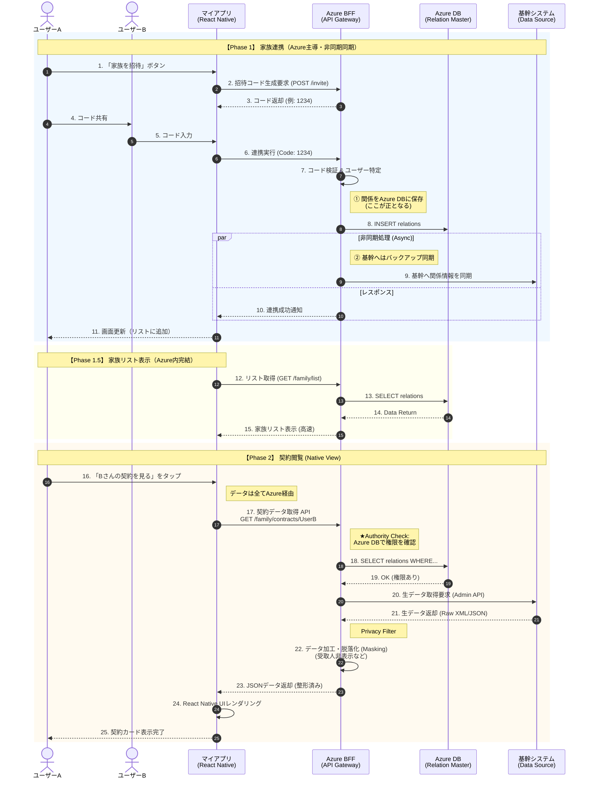

是的，方案二的修改点确实有一些**关键的细化**。

随着我们明确了 **“Azure DB 作为权限主库”** 以及 **“Azure 负责脱敏（Masking）”** 的架构，方案二的开发重心和接口定义比最初的想法更清晰了。

最大的变化在于：**MyPage (Legacy) 的责任变轻了，Azure 的责任变重了。**

以下是基于最新架构（Azure DB 鉴权 + 异步同步）的**方案二最终修改点清单**：

---

### 方案二：App 原生查阅模式 (最终修订版)

**核心架构变更点：**

1. **权限转移：** “谁能看谁”的逻辑完全由 Azure 判断，MyPage 不再进行业务鉴权。
2. **特权接口：** MyPage 提供的查询接口不再是面向用户的，而是面向 Azure 服务账号的“特权接口”。

#### 1. MyApp (新系统：Azure + React Native)

**职责：** 核心业务逻辑承载者（UI、权限、数据清洗）。

| 模块         | 具体修改点 (Action Items)            | 变化/备注 |
| ------------ | ------------------------------------ | --------- |
| **Azure DB** | **1. 新建 `FamilyRelations` 表**  |

 字段：`requester`, `target`, `permissions` (JSON)。 

 这是权限判断的唯一依据。 | **(明确新增)** 

 之前可能含糊，现在确认必须建。 |
| **Azure API** | **1. 绑定接口 (POST /invite)** 

 写入 Azure DB，并触发后台**异步同步**任务。 

 **2. BFF 查阅接口 (GET /contracts)** 

 逻辑变更为： 

 ① 查 Azure DB 确认有权限。 

 ② 用**服务账号**调 Legacy 拿原始数据。 

 ③ 执行**脱敏 (Masking)**。 

 ④ 返回 JSON。 | **(逻辑加重)** 

 Azure 必须写代码处理“看不看得到金额”的逻辑。 |
| **App 前端** | **1. 原生合同详情页 (React Native)** 

 需要开发完整的 UI 组件（列表、卡片、详情）。 

 需处理从 Azure 拿到的数据（如 `amount: null` 时的展示逻辑）。 | **(工作量大)** 

 这是本方案最大的前端成本。 |

#### 2. MyPage (老系统：Legacy API)

**职责：** 纯粹的数据提供者 (Data Provider)。

| 模块         | 具体修改点 (Action Items)                              | 变化/备注 |
| ------------ | ------------------------------------------------------ | --------- |
| **后端 API** | **1. 原始数据查询接口 (GET /api/admin/contracts)**  |

 **入参：** `target_user_id` 

 **鉴权：** 仅验证 **Azure Service Token** (API Key/Secret)，**不验证**家庭关系。 

 **出参：** 返回该用户的全部合同数据（含敏感字段）。 | **(变简单了)** 

 老系统不需要写 `if (isFamily)` 这种逻辑，只要是 Azure 来问，就全给。 |
| | **2. 关系同步接口 (POST /api/sync-relation)** 

 用于接收 Azure 的异步备份数据。 | **(用于兜底)** 

 为了保证 PC 端和客服能看到关系。 |
| **Web 前端** | **无修改** | |

---

### 🔍 总结变化点 (What changed?)

如果您拿这个去跟开发团队沟通，请重点强调以下两点：

1. **MyPage 团队的工作量减少了：**

- 他们不需要在查询接口里写复杂的“家庭权限判断代码”。
- 他们只需要开一个“把某人数据全查出来”的内部接口给 Azure 用就行。

2. **Azure 团队需要写“业务逻辑”：**

- 之前可能认为 Azure 只是“转发”数据。
- 现在明确了：**Azure 是“过滤器”。** 如果 User A 只能看基本信息，Azure 必须负责把“保额”字段擦除，不能把原始数据透传给 App。

这张表反映了我们最终确定的**“Azure 主导，Legacy 配合”**的架构思路。

