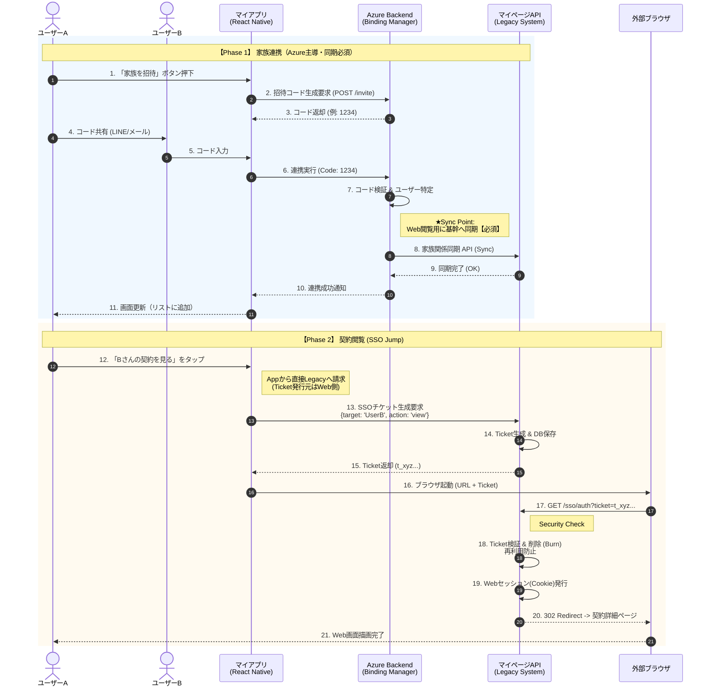
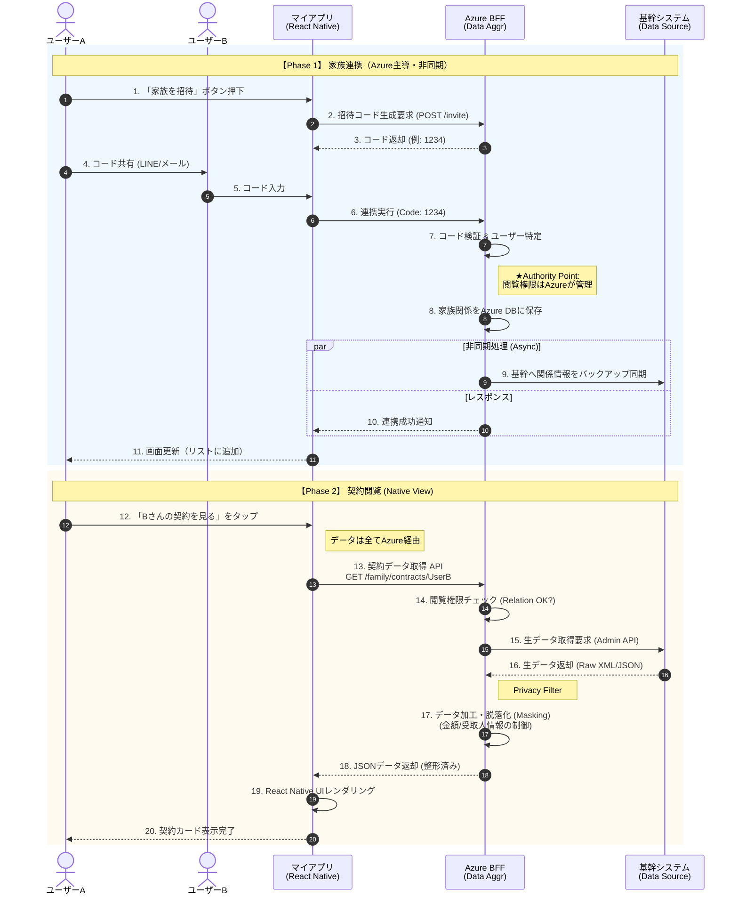
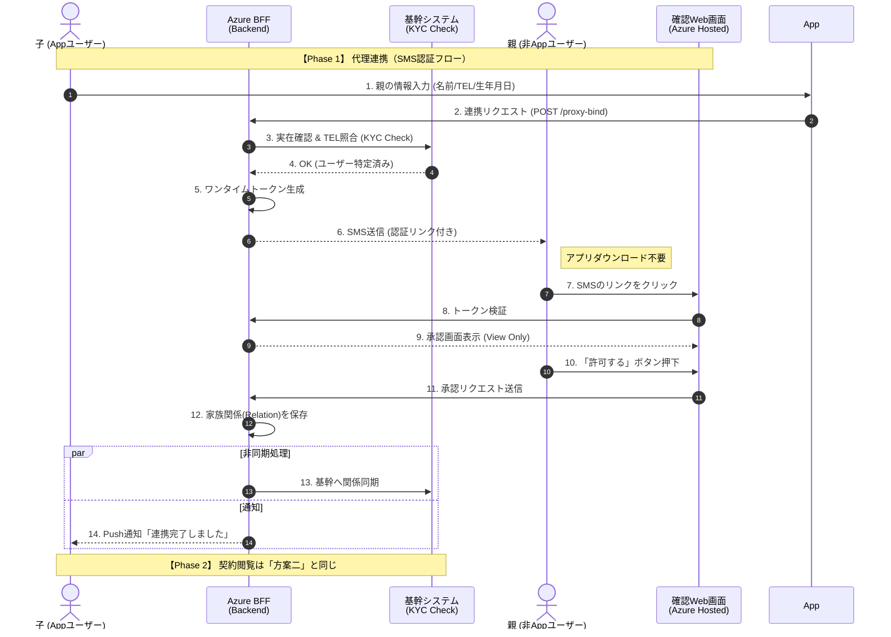

# 提案书：新版保险 App 家庭连携与合同管理架构方案

**版本：** 1.0
**日期：** 2023/10/XX
**作成：** 产品经理 (PM)

---

## 1. 背景与目标 (Background & Objectives)

**项目背景：**
现有的 App (Yappli 版) 功能受限，且用户体验严重依赖 WebView。本次重构旨在利用 **React Native + TypeScript** 打造原生 App，并通过 **Azure Spring Boot** 构建现代化的后端服务（BFF），实现业务逻辑的解耦。

**核心目标：**

1. **实现家庭连携 (Family Binding)：** 打破数据孤岛，允许用户管理家人保单。
2. **提升查阅体验 (Experience Upgrade)：** 从“网页跳转”向“原生查阅”转型。
3. **确保数据安全 (Security & Compliance)：** 符合日本金融保险行业对 PII（个人敏感信息）的保护标准。

---

## 2. 方案概览 (Solution Overview)

针对“家庭连携”与“合同查阅”的实现路径，我们提出三种方案。

- **方案一 (Web Linkage)：** **低成本稳健型**。App 负责绑定，查阅时通过 SSO 跳转至现有的 MyPage 网页。
- **方案二 (Native Integration)：** **体验驱动型（推荐）**。App 负责绑定与查阅，Azure BFF 负责数据聚合与脱敏，提供无缝的原生体验。
- **方案三 (Proxy Auth)：** **增长驱动型（进阶）**。在方案二的基础上，增加“短信+H5”代理授权模式，解决高龄父母不下载 App 的痛点。

---

## 3. 详细方案设计 (Detailed Design)

### 方案一：Web 跳转查阅模式 (Web Linkage Model)

**核心逻辑：**
利用 Azure 处理绑定流程并同步给老系统，查阅时通过 MyPage 后端发行的票据实现安全跳转。

- **优点：** 最大程度复用现有 Web 业务逻辑，开发成本最低。
- **缺点：** App 跳转浏览器体验有割裂感。
- **关键技术点：** **同步写入 (Synchronous Sync)**。Azure 在绑定成功后，必须立即调用 Legacy API 同步关系，否则 Web 端无法鉴权。

#### 业务时序图 (Sequence Diagram)

---

### 方案二：App 原生查阅模式 (Native Integration Model)

**核心逻辑：**
Azure (BFF) 作为数据中枢，负责权限管理和数据清洗。App 端完全闭环，提供流畅的原生体验。

- **优点：** 最佳的用户体验 (UX)，数据结构化便于未来扩展（如家庭保障分析）。
- **缺点：** 需在 Azure 端重写数据聚合与脱敏逻辑。
- **关键技术点：** **数据脱敏 (Masking)**。Azure 必须根据 `FamilyRelation` 权限表，过滤掉不该显示的字段（如受益人信息）后再返回给 App。

#### 业务时序图 (Sequence Diagram)

---

### 方案三：代理授权模式 (Proxy Auth Model)

**核心逻辑：**
痛点： 日本保险的主要受众（拥有高额保单的人群）往往是中老年人。让 60 岁以上的父母下载 App、注册账号、输入连携码，门槛非常高，转化率会极低。
参考 Nissay (日本生命) 或 Sumitomo Life (住友生命) 的做法，引入 “方案三：代理绑定与非对称认证流程”。

针对高龄用户（父母），提供“免下载 App”的授权方式。查阅阶段与方案二相同。

- **优点：** 极大降低使用门槛，提升家庭连携率，符合日本高龄化社会现状。
- **关键技术点：** **外部授权服务**。Azure 需集成短信网关，并托管一个轻量级的 H5 确认页面。

#### 业务时序图 (Sequence Diagram - 绑定部分)

---

## 4. 方案对比与建议 (Comparison & Recommendation)

| 比较维度          | **方案一 (Web Linkage)**    | **方案二 (Native Integration)** | **方案三 (Proxy Auth)**          |
| ----------------- | --------------------------- | ------------------------------- | -------------------------------- |
| **用户体验 (UX)** | ⭐⭐ (跳转浏览器，体验割裂) | ⭐⭐⭐⭐⭐ (原生流畅，无缝切换) | ⭐⭐⭐⭐⭐ (原生体验 + 极低门槛) |
| **家庭覆盖率**    | 低 (需全员下载 App)         | 低 (需全员下载 App)             | **高 (父母无需 App)**            |
| **开发复杂度**    | 低 (复用 Web 逻辑)          | 中 (需开发 BFF 聚合层)          | 高 (需开发短信与 H5 模块)        |
| **数据安全性**    | 中 (依赖 Ticket 机制)       | **高 (Azure 统一鉴权脱敏)**     | **高 (Azure 统一鉴权脱敏)**      |

### 👨‍💼 实施路线图建议 (Roadmap)

鉴于本次项目是 React Native 重构，为了确保 App 的竞争力并兼顾项目周期，建议采取 **分阶段实施策略**：

1. **Phase 1 (MVP 上线): 实施方案二。**

- **理由：** 既然重构 App，就必须摒弃 Web 跳转的陈旧体验。利用 Azure BFF 打通 Legacy 数据，确保核心用户（Tech-savvy）及其配偶能获得最佳的原生体验。

2. **Phase 2 (功能增强): 实施方案三。**

- **理由：** 在 App 稳定后，为了拉动“家庭连接数”KPI，引入代理授权功能，专门攻克 50-70 岁的高龄用户群体。

3. **基础保障:**

- **方案一的 SSO 机制** 应作为底层通用能力开发，用于支持未来可能出现的其他 Web 专属业务（如：在线理赔、健康问卷等需要复杂 Web 表单的场景）。
