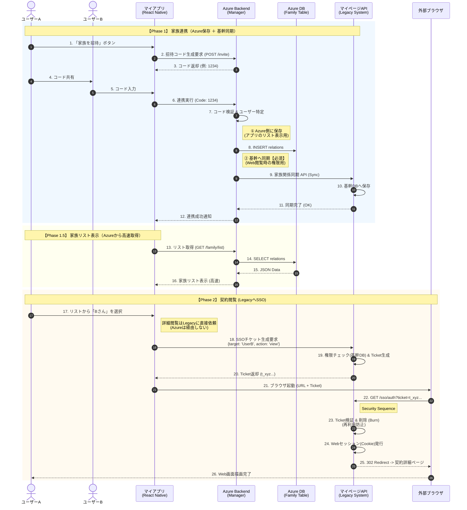
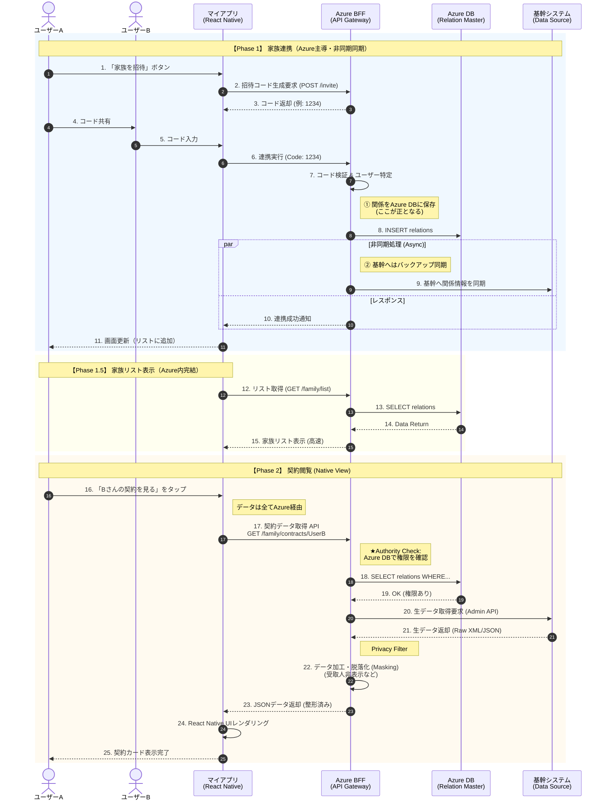

明白，这是一个非常重要的前提条件。

如果 **SSO（单点登录）逻辑是既定开发事项（Baseline）**，不计入本次“家庭连携”项目的改动成本，那么**方案一的实施成本将进一步大幅降低**。

基于这个新前提，我为您重新梳理了各方案的**“增量开发点 (Delta Scope)”**。这张表仅列出为了实现“家庭连携”而必须**新增**的功能点。

---

### 家庭连携功能增量开发清单 (Delta Scope List)

**前提：**

1. MyApp 到 MyPage 的 SSO 跳转能力已具备（Ticket 生成与验证已存在）。
2. MyApp (Azure) 的基础架构已就绪。

#### 方案一：Web 跳转浏览模式 (Web Linkage)

**核心变动：** 既然 SSO 只有通用的，那么本方案的核心工作就是**“告诉老系统 A 和 B 绑定了”**，这样 A 跳转过去时才有权限看 B。

| 系统 | 模块 | 增量修改点 (New Features) |
| ---- | ---- | ------------------------- |

| **MyApp**<br>

<br>(新系统) | **App 前端** | 1. **绑定 UI：** 扫码/输入邀请码界面。<br>

<br>2. **跳转入口：** 在家庭列表点击家人头像时，触发 SSO 跳转（携带 `target_user_id`）。 |
| | **Azure 后端** | 1. **邀请服务：** 邀请码生成与校验。<br>

<br>2. **同步逻辑 (关键)：** 绑定成功后，调用 MyPage 接口同步关系。 |
| **MyPage**<br>

<br>(老系统) | **后端 API** | 1. **同步接口：** `POST /api/sync-relation`。<br>

<br> _(接收 Azure 发来的 A-B 绑定关系并写入 DB)_ |
| | **Web 前端** | **无修改**。<br>

<br>_(利用现有的合同详情页，SSO 登录后直接访问即可)_ |

---

#### 方案二：App 原生查阅模式 (Native Integration)

**核心变动：** 重点在于 **App 端的原生页面开发** 和 **Azure 端的数据清洗**。

| 系统 | 模块 | 增量修改点 (New Features) |
| ---- | ---- | ------------------------- |

| **MyApp**<br>

<br>(新系统) | **App 前端** | 1. **绑定 UI：** 扫码/输入邀请码界面。<br>

<br>2. **原生详情页 (重工作量)：** 开发合同列表、详情卡片组件 (React Native)。 |
| | **Azure 后端** | 1. **邀请服务：** 邀请码生成与校验。<br>

<br>2. **BFF 聚合服务 (核心)：** <br>

<br> - 调用 MyPage 获取原始数据。<br>

<br> - 实现**数据脱敏 (Masking)** 规则（如：隐藏受益人）。<br>

<br> - 格式化为 App 专用 JSON。 |
| **MyPage**<br>

<br>(老系统) | **后端 API** | 1. **数据接口：** `GET /api/raw-data/contracts`。<br>

<br> _(供 Azure 服务账号批量获取指定人的合同数据)_ |
| | **Web 前端** | **无修改**。 |

---

#### 方案三：代理授权模式 (Proxy Auth)

**核心变动：** 在方案二的基础上，增加**外部授权服务**。

| 系统 | 模块 | 增量修改点 (New Features) |
| ---- | ---- | ------------------------- |

| **MyApp**<br>

<br>(新系统) | **App 前端** | 1. **代理绑定 UI：** 输入父母姓名/电话的表单。<br>

<br>2. **原生详情页：** 同方案二。 |
| | **Azure 后端** | 1. **外部授权流程：** <br>

<br> - 集成短信网关 (SMS)。<br>

<br> - 开发 H5 授权落地页 (无需登录)。<br>

<br> - 处理 H5 回调并更新绑定关系。 |
| **MyPage**<br>

<br>(老系统) | **后端 API** | 1. **数据接口：** 同方案二。<br>

<br>2. **用户校验接口：** `POST /api/check-user`。<br>

<br> _(验证姓名+电话是否匹配核心库，用于发短信前的校验)_ |
| | **Web 前端** | **无修改**。 |

---

### 重新评估后的决策建议

去除 SSO 的开发成本后，对比变得更加清晰：

1. **关于方案一：**

- **成本极低：** MyPage 只需要开**一个接口** (`sync-relation`)。App 端不需要写复杂的合同展示代码。
- **适用性：** 如果预算非常紧，或者 MyPage 的合同展示逻辑极其复杂（几百种特约条款）难以在短期内用 Native 重写，方案一是最优解。

2. **关于方案二：**

- **体验升级：** 虽然 MyPage 也要开一个接口 (`raw-data`)，但主要的成本在于 **App 前端重写合同页面** 和 **Azure 后端的数据翻译**。
- **价值：** 这个成本是为了换取“用户不跳出 App”的流畅体验。

**给客户的最终话术：**

> “考虑到 SSO 功能是基础设施，不计入本项目成本。
>
> - 如果您希望**最小化 MyPage 团队的配合工作量**，且能接受跳转体验，**方案一**几乎是零风险的，老系统只需增加一个‘接收绑定关系’的接口。
> - 如果您希望**彻底提升 App 体验**，且愿意在 Azure 和 App 前端投入资源重构展示逻辑，请选择**方案二**。老系统只需提供‘原始数据查询’接口即可。”

这样界定后，开发边界非常清晰。

明白了，这是一个非常合理且必要的架构补充。

如果在 **Azure 端新建家庭关系表**，那么 **方案一 (Option 1)** 的架构将变得更加稳健。Azure 不再仅仅是一个“消息通道”，而是成为了 **App 端家庭关系数据的“主库 (Master)”**。

这意味着：

1. **App 列表页渲染快：** App 展示“我的家人们”列表时，直接读 Azure 数据库，速度快且不依赖老系统。
2. **双向记录：** 绑定关系同时存在于 Azure（用于 App 展示）和 MyPage（用于 Web 鉴权）。

基于这个补充，我为您更新了方案一的 **系统修改点清单** 和 **数据流转逻辑**。

---

### 修正后的方案一：Web 跳转浏览模式 (Azure 存储版)

**核心逻辑变更：**

- **绑定时：** Azure 先将关系写入自己的数据库，**然后再**同步给 MyPage 老系统。
- **查看列表时：** App 请求 Azure 获取家人列表（不查老系统）。
- **查看详情时：** 依然是 SSO 跳转到 MyPage Web（老系统查自己的库鉴权）。

#### 1. 系统修改点清单 (Action Items)

| 系统 | 模块 | 具体修改点 (Specific Changes) |
| ---- | ---- | ----------------------------- |

| **MyApp**<br>

<br>(新系统) | **Azure 数据库**<br>

<br>(**新增**) | **新建表 `FamilyRelations**`：<br>

<br>存储 `user_id` (主账户), `target_user_id` (家人), `relation_type` (关系), `status` (状态)。 |
| | **Azure 后端 API** | 1. **绑定接口**：验证邀请码 -> **写入 Azure DB** -> **调用 MyPage 同步接口**。<br>

<br>2. **列表接口**：`GET /api/family/list`，读取 Azure DB 返回家人列表给 App。<br>

<br>3. **解绑接口**：同时删除 Azure 记录并通知 MyPage 删除。 |
| | **App 前端** | 1. **家人列表页**：调用 Azure 接口渲染列表。<br>

<br>2. **跳转逻辑**：点击列表项 -> 调用 MyPage SSO 接口 -> 跳转。 |
| **MyPage**<br>

<br>(老系统) | **后端 API** | 1. **同步接口**：`POST /api/sync-relation` (接收 Azure 的数据并写入 Legacy DB)。<br>

<br>2. **SSO 接口**：`POST /api/create-ticket` (现存/或调整)。 |
| | **Legacy 数据库** | 确保有对应的关系表来支持 Web 端的权限验证。 |

---

#### 2. Azure 数据库设计建议 (SQL 示例)

在 Azure SQL Database (或 PostgreSQL) 中，建议创建如下结构的表：

```sql
CREATE TABLE family_relations (
    id BIGINT IDENTITY(1,1) PRIMARY KEY,
    requester_id VARCHAR(50) NOT NULL,    -- 发起绑定的人 (App登录用户)
    target_user_id VARCHAR(50) NOT NULL,  -- 被绑定的人 (家人)
    relation_type VARCHAR(20),            -- 关系 (PARENT, CHILD, SPOUSE)
    linked_at DATETIME DEFAULT GETDATE(), -- 绑定时间
    sync_status VARCHAR(20) DEFAULT 'PENDING', -- 同步给MyPage的状态 (SYNCED, FAILED)

    -- 复合索引，加速列表查询
    INDEX idx_requester (requester_id, status)
);

```

- **产品经理提示：** 建议增加一个 `sync_status` 字段。如果 Azure 写成功了，但同步给 MyPage 失败了（比如老系统维护中），我们可以通过定时任务（Batch Job）重新同步，确保数据一致性。

---

#### 3. 修正后的业务流程描述

**【流程 A】家庭绑定流程 (双写模式)**

1. **用户操作：** 用户 B 输入用户 A 的邀请码。
2. **Azure 处理：**

- 校验邀请码有效。
- **Action 1:** 在 **Azure `family_relations` 表** 中插入一条记录（App 列表页立刻能查到了）。
- **Action 2 (Sync):** Azure 立即调用 MyPage 的 `/sync-relation` 接口。

3. **MyPage 处理：** 老系统接收请求，将关系写入自己的数据库（确保后续 SSO 跳转时能鉴权）。
4. **完成：** App 提示绑定成功。

**【流程 B】家人列表展示 (读 Azure)**

1. **用户操作：** 用户 A 打开“家庭保险”页面。
2. **App 请求：** `GET /api/family/list` (请求 Azure)。
3. **Azure 响应：** 查询 Azure 数据库，返回 `[{name: "父亲", id: "user_b"}, ...]`。
4. **App 渲染：** 快速展示列表。

**【流程 C】合同详情查看 (读 Legacy)**

1. **用户操作：** 点击列表中的“父亲”。
2. **App 请求：** 向 MyPage 请求 SSO Ticket。
3. **跳转：** 浏览器打开 MyPage。
4. **鉴权：** MyPage 查 **MyPage 自己的数据库**，确认 A 有权看 B，展示页面。

---

### 总结

加上**“Azure 建表”**这一条后，方案一变得更加完善：

- **前端体验更好：** 列表加载不依赖老系统，速度快。
- **架构更清晰：** Azure 管理“UI 展示层关系”，MyPage 管理“业务鉴权层关系”。

这个补充非常关键，我已经将其更新到最终的方案逻辑中。您看这样是否符合预期？




