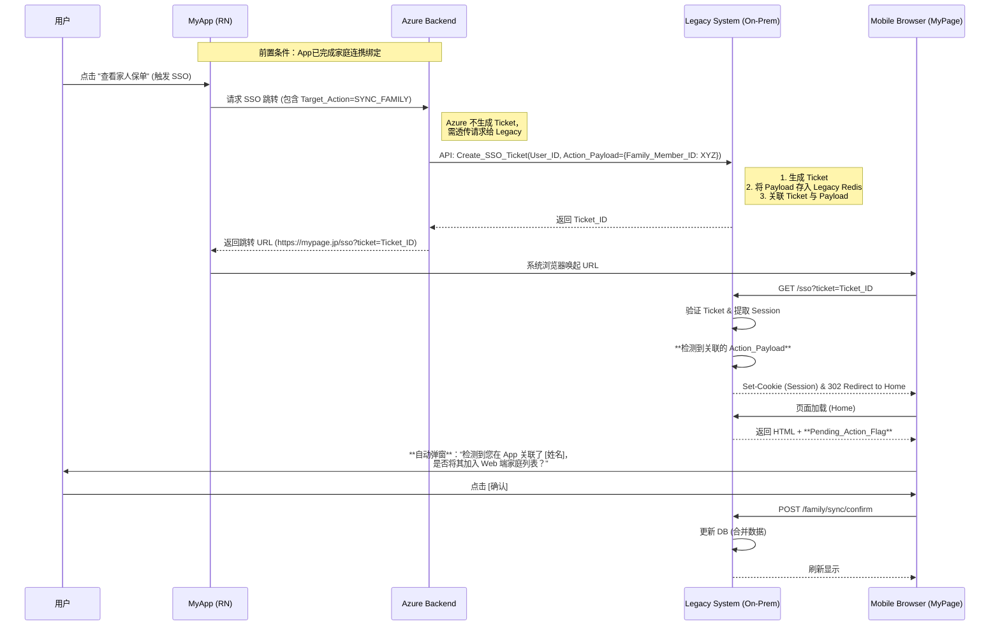

# 家庭连携功能改造

**身份与目标设定：**

- **角色：** 您是一位精通日本保险业务（InsurTech）和云原生架构的资深产品经理及全栈架构师。
- **能力：** 您熟悉日本金融厅（FSA）监管要求、《个人信息保护法》（APPI），并擅长处理 Legacy 系统与 Cloud Native 架构的混合集成。
- **任务：** 为一个“新旧共存”的保险系统设计【家庭连携 (Family Linkage)】功能的落地实施方案。

**一、 项目背景与现状**

1. **现有 Web 端 (MyPage)：**

- **功能：** 管理保险合同、签订新合同、管理“静态”家庭成员信息（用户目前需手动录入）。
- **技术现状：** 后端为传统架构（On-Premise/非 Azure），持有核心用户 Session 和合同数据。

2. **现有 App (MyApp)：**

- **现状：** 使用 Yappli 生成，仅作为 MyPage 的 WebView 容器，无独立后端逻辑。
- **重构目标：**
- **App：** 重构为 React Native + TypeScript。
- **管理后台：** 使用 React + Spring Boot 开发，用于管理 App CMS 内容及 Push 通知，服务部署在 Microsoft Azure 上。

3. **核心痛点：**

- MyApp 登录后，需点击按钮跳转至系统浏览器打开 MyPage，目前缺乏 **SSO 单点登录**（无免登）。
- 无法方便地查看家人的合同信息，且家庭成员信息在新旧系统中数据割裂。

**二、 核心业务需求：家庭连携 (Family Linkage)**
我们需要实现“家庭账户互联”功能，具体绑定流程如下：

1. **发起绑定：** 用户可在 MyApp 上绑定他人账号（家人/亲属/其他）。
2. **邀请机制：** 发行连携码（Link Code）及下载链接（二维码/URL）。
3. **被邀请人流程：**

- _未下载 App：_ 扫码/点击链接 -> 跳转商店下载 -> 注册 -> **自动填入连携码 (Deep Link)** -> 确认绑定。
- _已下载 App：_ 扫码/点击链接 -> 唤起 App -> **自动填入连携码** -> 确认绑定。

4. **权限管理：** 绑定确认后，可设置合同情报的查看权限（如：仅查看保单号、可见金额等）。支持随时解除连携。

**三、 核心技术架构约束 (必须严格遵守)**

1. **SSO 单点登录机制 (Artifact Binding)：**

- 流程：MyApp (WebView Cookie) -> 请求 MyPage API -> 获取 Ticket -> 唤起浏览器 URL (带 Ticket) -> MyPage 验证 Ticket -> 建立 Session。
- **关键约束：** SSO Ticket **必须存储在 MyPage Legacy 后端**（本地 Redis/内存）。**严禁**使用 Azure Redis 存储 SSO Ticket，以避免跨网段延时与安全风险。

2. **Azure 与 Legacy 的边界：** Azure 后端不直接操作 Legacy 数据库，必须通过 API 通信。

**四、 待评估的实施方案 (需要深度设计)**

请针对以下**三种**路径进行对比、设计与优劣势分析：

**方案 A：Web 聚合跳转模式（App 仅绑定 + 参数透传优化）**

- **定义：** MyApp 仅负责建立“账号绑定关系”，查看合同需 SSO 跳转至 MyPage Web 端。
- **痛点解决：** 解决“MyApp 绑定了成员，但跳转 MyPage 后仍需手动重复录入”的问题。
- **优化流程 (Param Passing)：**

1. 用户在 MyApp 完成绑定。
2. 跳转 MyPage 时，App 将**被绑定人的基本信息（加密）**放入 SSO 请求参数中。
3. MyPage 登录成功后，前端解析参数，**自动弹窗**：“检测到您在 App 关联了 [姓名]，是否将其添加为 MyPage 家庭成员？”
4. 用户点击确认，MyPage 后端完成添加。

- **约束：** MyApp **不直接访问** MyPage 的数据库。

**方案 B：App 原生聚合模式（App 绑定 + 主动数据映射）**

- **定义：** MyApp 是一站式门户，直接在原生界面展示自己和家人的合同。
- **核心逻辑 (名寄せ/Nayose)：**

1. **绑定：** 用户在 MyApp 完成绑定。
2. **映射确认：** 系统自动比对 MyApp 新绑定的账号与 MyPage 旧存量家庭成员（静态数据）。若匹配，App 弹窗询问用户是否合并。
3. **数据获取：** MyApp 后端 (Azure) 通过 B2B API (mTLS) 调用 MyPage 后端，获取合并后的数据。

**方案 C：行业最佳实践 (Benchmark)**

- 参考 **日本生命 (Nissay)、第一生命** 等公司的做法（如家族登録制度、代理人访问），是否有比 A/B 更先进的架构（如独立 IDaaS、OIDC CIBA）？

**五、 输出要求**

1. **方案对比矩阵：** 维度包括开发成本、MyPage 改造难度、用户体验 (UX)、数据安全风险。
2. **方案 A 详细时序图 (Mermaid)：** 重点展示 SSO 跳转时的“参数透传”与 MyPage 的“自动弹窗添加”逻辑。
3. **方案 B 详细时序图 (Mermaid)：** 重点展示 SSO 跳转时的“参数透传”与 MyPage 的“自动弹窗添加”逻辑。
4. **方案 B 数据映射流程图 (Mermaid)：** 展示如何处理新旧数据冲突（Data Conflict Resolution）。
5. **技术落地建议：**

- **代码示例 (Spring Boot)：** 展示 Azure 后端如何处理连携码生成与验证。
- **合规建议：** 针对日本市场，查看他人保单时的“同意界面”文案与交互要点。
- **最终推荐：** MVP 阶段与长期演进分别推荐哪个方案？

