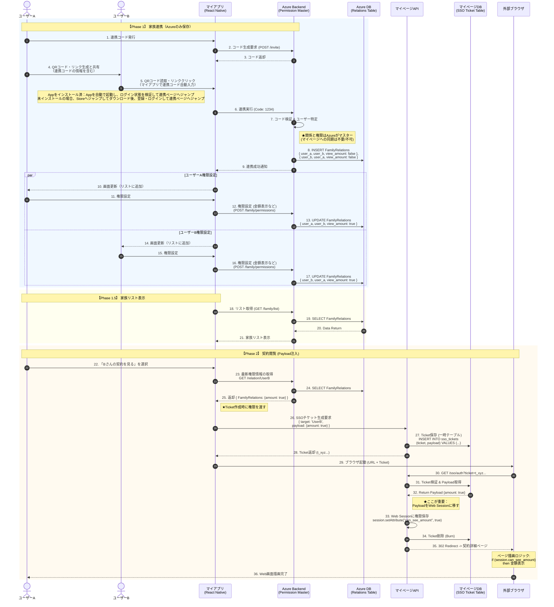
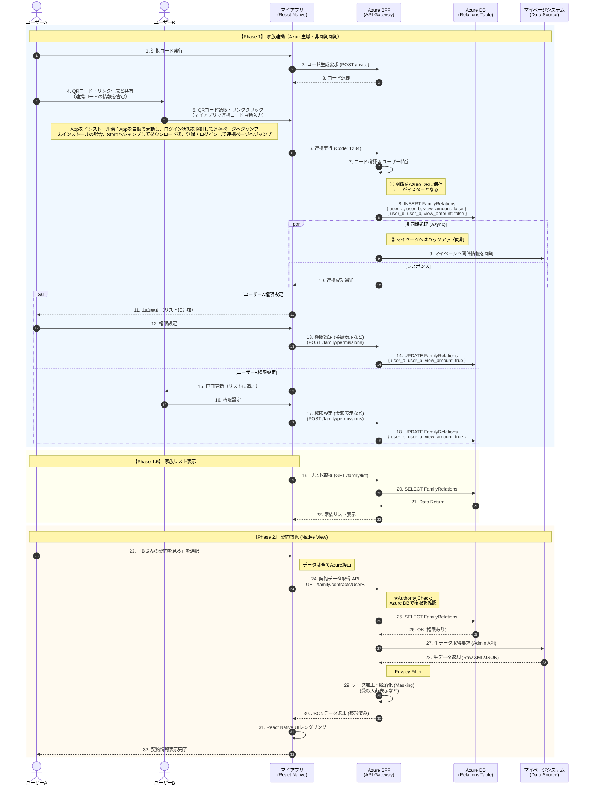
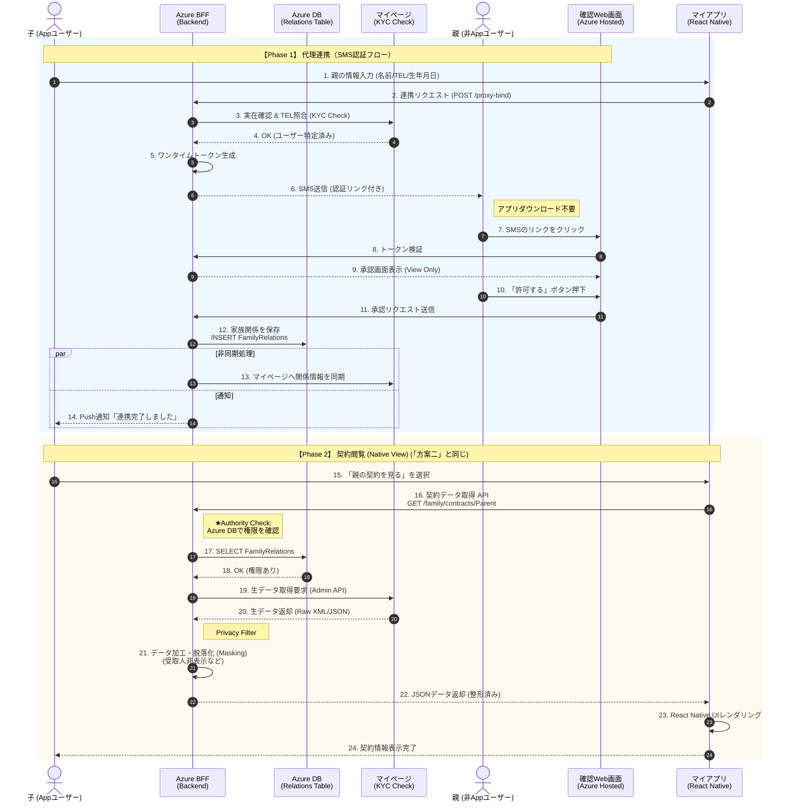

# 提案書：新保険アプリにおける「家族連携・契約管理」機能 アーキテクチャ提案

**作成日：** 202X 年 X 月 X 日
**作成者：** プロダクトマネージャー (PM)
**対象：** プロジェクトオーナー、システム企画部、開発チーム

---

## 1. はじめに (Introduction)

### 背景と目的

現在、Yappli 版アプリからのリプレイスに伴い、**React Native + Azure** を活用したモダンなアーキテクチャへの刷新を計画しています。
特に、顧客ロイヤリティ向上と契約継続率の改善に直結する**「家族連携（Family Binding）」**および**「家族の契約照会」**機能について、最適な実装方式をご提案します。

### 本提案のゴール

1. **UX の刷新：** 既存の WebView 依存を脱却し、ネイティブアプリならではの快適な操作性を実現する。
2. **開発効率と品質のバランス：** 既存資産（マイページ 基幹）への影響を最小限に抑えつつ、Azure 側で柔軟な機能拡張を可能にする。
3. **セキュリティとコンプライアンス：** 個人情報保護（PII）の観点から、家族間の閲覧権限を厳格に管理する。

---

## 2. 提案スキーム概要 (Solution Overview)

実現難易度とユーザー体験（UX）のバランスが異なる 3 つの案を検討しました。

- **案 ①：Web 遷移モデル (Web Linkage)**
- マイアプリは「入り口」に徹し、詳細は既存の マイページへ SSO 遷移して表示する**堅実なプラン**。

- **案 ②：ネイティブ統合モデル (Native Integration) ★ 推奨**
- Azure をデータハブとし、アプリ内で情報の閲覧を統合させる**UX 重視のプラン**。

- **案 ③：代理登録モデル (Proxy Auth)**
- 案 ② に加え、日本生命（ニッセイ）または住友生命の取り組みを参考し、アプリを操作できない高齢者向けに「SMS ＋ Web」での承認フローを追加した**利用者拡大プラン**。

---

## 3. 各スキームの詳細仕様 (Detailed Specs)

### 【案 ①】Web 遷移モデル (Web Linkage Model)

**前提条件：** シングルサインオン（SSO）機能が必要。

**コンセプト：** 既存 マイページ 資産の最大活用と、Azure によるリスト表示の高速化。

- **業務フロー：**
- **連携時：** Azure 上の DB に家族関係を保存。マイページシステムへの連携は行わず、Azure をマスターとする。
- **閲覧時：** マイアプリから SSO チケット発行を要求する際、**「閲覧権限情報（Payload）」をパラメータとして渡す**。

- **技術的ポイント：ペイロード注入 (Payload Injection)**
- マイページ側に「家族権限テーブル」を新設できない制約を回避するため、SSO チケット発行時に権限情報（例：`{view_amount: true}`）を同梱します。
- マイページ側は、Web セッション生成時にこの情報を読み込み、画面の出し分け（金額マスク等）を行います。

**▼ システム変更点 (Impact Analysis)**
| システム | 変更箇所 | 内容 |
| :--------------------- | :--------- | :------------------------------------------------------------------- |
| マイアプリ (Azure/RN) | **DB 新設** | `FamilyRelations` テーブル作成（関係・権限のマスターデータ）。|
| 同上 | **API** | 閲覧前に Azure から最新権限を取得し、マイページ SSO API へ渡すロジック実装。 |
| マイページ | **SSO API** | チケット生成時に任意の Payload（JSON 等）を受け取り、一時保存する改修。 |
| 同上 | **Web 画面** | セッション内の Payload 情報を参照し、項目の表示/非表示を制御する。|

**▼ フローチャート (Sequence Diagram)**

---

### 【案 ②】ネイティブ統合モデル (Native Integration Model)

**コンセプト：** Azure BFF によるデータ集約とセキュリティ制御。

- **業務フロー：**
- **連携時：** Azure DB に家族関係を保存。イページシステムへは、コールセンター対応等のために**非同期（バックグラウンド）で同期**を行う。
- **閲覧時：** マイアプリは Azure にデータを要求。**Azure が権限チェックとデータ加工（マスキング）**を行った上で、マイアプリに JSON を返す。

- **技術的ポイント：Azure による中央集権管理**
- 「誰が誰を見られるか」のロジックは全て Azure が持ちます。
- マイシステムは、Azure からの特権アクセスに対し、全量データを返すだけの「データプロバイダ」に徹します。

**▼ システム変更点 (Impact Analysis)**

# システム変更点 (Impact Analysis)

| システム                 | 変更箇所     | 内容                                                                                                                   |
| :----------------------- | :----------- | :--------------------------------------------------------------------------------------------------------------------- |
| マイアプリ (Azure/RN) | **BFF 実装** | マイページから生データを取得し、権限に基づいて項目を削除・マスクするロジックの実装（**個人データの取り扱いがある**）。 |
| 同上                     | **UI 開発**  | 契約一覧・詳細画面のネイティブ UI コンポーネント開発（工数大）。                                                       |
| マイページ               | **API**      | 特権 API の提供：`GET /admin/raw-data`。Azure からの要求に対し、指定ユーザーの全データを返す（ビジネスロジック不要）。 |

**▼ フローチャート (Sequence Diagram)**

---

### 【案 ③】代理登録モデル (Proxy Auth Model)

**コンセプト：** デジタルデバイド（高齢者のスマホ利用の壁）の解消。

- **業務フロー：**
- **連携時：** 子（アプリ利用者）が親の情報を入力。Azure が SMS を送信。
- **承認時：** 親は SMS のリンクから**ログイン不要の Web 画面**を開き、「許可」ボタンを押すだけで連携完了。

- **技術的ポイント：外部認証基盤**
- Azure 上で SMS ゲートウェイ連携と、軽量な承認用 Web ページをホスティングします。

**▼ システム変更点 (Impact Analysis)**
| システム | 変更箇所 | 内容 |
| :-------------- | :------- | :---------------------------------------------------------------------------------------- |
| マイアプリ (Azure) | **機能追加** | SMS 送信機能、および承認用 Web ページ（H5）の開発。 |
| マイページ | **API** | 実在確認 API：入力された「氏名＋電話番号」が顧客 DB に存在するかチェックする API の提供。 |

**▼ フローチャート (Sequence Diagram)**

---

## 4. 比較と意思決定 (Comparison & Recommendation)

# 案別比較表

| 比較項目                 | 案 ① Web 遷移                                      | 案 ② ネイティブ統合                             | 案 ③ 代理登録                                    |
| :----------------------- | :------------------------------------------------- | :---------------------------------------------- | :----------------------------------------------- |
| **ユーザー体験 (UX)**    | △ Web 遷移 画面遷移が発生し、操作感が分断される | ◎ シームレス アプリ内で統合し、高速・快適    | ◎ シームレス アプリ内統合 ＋ 登録のハードル低 |
| **家族連携率**           | △ 低い 家族全員のアプリ DL が必須               | △ 低い 家族全員のアプリ DL が必須            | ★ 高い 親世代は**アプリ不要**で連携可能       |
| **開発コスト**           | ◎ 低い 既存 Web 画面を流用                      | △ 中～高 UI とデータ変換ロジックの開発が必要 | ▲ 高い SMS 連携等の追加開発が必要             |
| **マイページへの影響**   | ▲ あり SSO が必要/Session ロジックの改修が必要  | ◎ 極小 単純なデータ提供 API のみで OK        | ◎ 極小 案 ② と同様                            |
| **データ活用**           | × 困難 画面表示のみでデータを持たない           | ◎ 可能 構造化データとして蓄積、分析可能      | ◎ 可能 案 ② と同様                            |
| **データセキュリティ**   | 中（Ticket に依存）                                | 高（Azure 統合認証によるデータ仮名化）          | 高（Azure 統合認証によるデータ仮名化）           |
| **個人データの取り扱い** | なし                                               | **あり**                                        | **あり**                                         |

---

## 5. 推奨ロードマップ (Implementation Roadmap)

プロジェクトのリスク低減と早期の価値提供のため、**段階的なリリース**を提案します。

### Phase 1：MVP リリース（案 ② ネイティブ統合モデル）

- **ターゲット：** スマホリテラシーのある現役世代（夫婦、子）。
- **採用理由：**
- アプリのリニューアルにおいて、WebView への遷移は UX 観点で許容し難い。
- マイページシステム側の改修ロジック（特権データ提供のみ）がシンプルであり、プロジェクト遅延リスクを Azure 側でコントロールしやすいため。

### Phase 2：グロースハック（案 ③ 代理登録モデル）

- **ターゲット：** アプリ操作が苦手な高齢の親世代。
- **採用理由：**
- アプリの安定稼働後、KPI（家族接続数）を最大化するための切り札として投入。
- 「親の保険管理」は日本市場において極めてニーズの高いユースケースであるため。

---

## 6. 次のアクション (Next Steps)

本提案のご承認後、以下のステップへ進めさせていただきます。

1. **インターフェース定義（API 仕様策定）**

- マイページチーム様へ：`GET /admin/raw-data`（生データ取得）および `POST /check-user`（実在確認）の仕様調整。

2. **Azure DB 設計**

- `FamilyRelations` テーブルの詳細設計（権限 JSON のスキーマ定義など）。

3. **法務確認（案 ③ 向け）**

- SMS による代理承認フローの利用規約および免責事項の確認。

---

以上、ご提案申し上げます。
貴社の DX 推進と顧客エンゲージメント向上に、本アーキテクチャが貢献できると確信しております。
